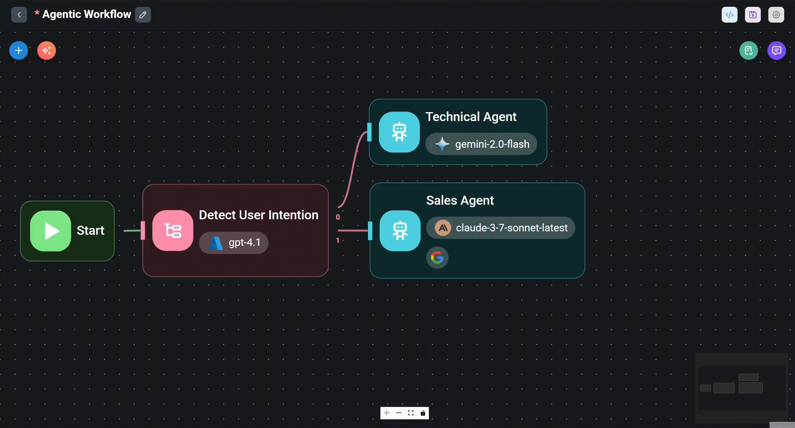
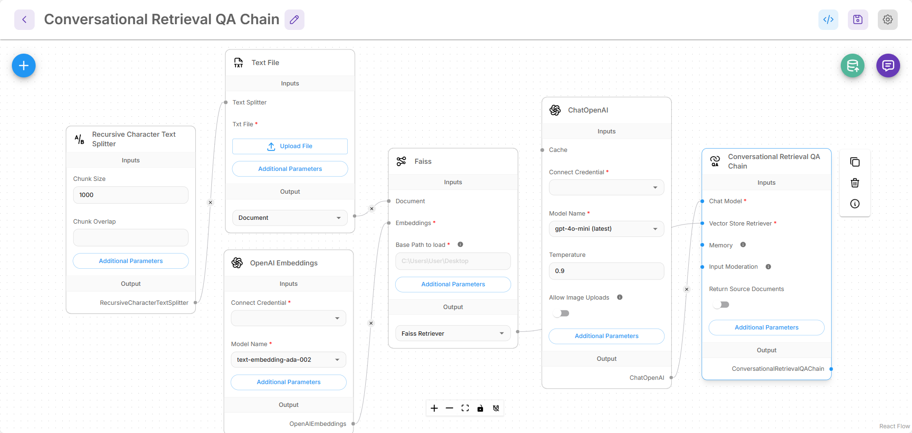
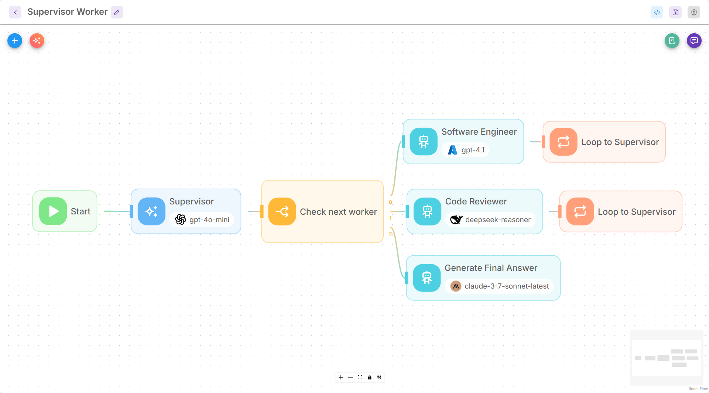

# 简介

<figure><figcaption></figcaption></figure>

Flowise 是一个开源生成式 AI 开发平台，用于构建 AI 智能体和 LLM 工作流程。

它提供了完整的解决方案，包括：

* [x] 可视化生成器
* [x] 追踪与分析
* [x] 评价
* [x] 人工介入
* [x] API、CLI、SDK、嵌入式聊天机器人
* [x] 团队与工作区

有 3 个主要的可视化构建器，即：

* 助理
* 聊天流
* 智能体流程

## 助理

助手 是创建 AI 智能体最适合初学者的方式。用户可以创建能够遵循说明、在必要时使用工具以及从上传的文件 ([RAG](https://en.wikipedia.org/wiki/Retrieval-augmented_generation)) 中检索知识库以响应用户查询的聊天助手。

<figure><picture><source srcset=".gitbook/assets/Screenshot 2025-06-10 232758.png" media="(prefers-color-scheme: dark)"></picture><figcaption></figcaption></figure>

## 聊天流

聊天流 旨在构建单智能体系统、聊天机器人和简单的 LLM 流程。它比助手更灵活。用户可以使用先进的技术，如 Graph RAG、Reranker、检索器 等。

<figure><picture><source srcset=".gitbook/assets/screely-1749594035877.png" media="(prefers-color-scheme: dark)"></picture><figcaption></figcaption></figure>

## 智能体流程

智能体流程 是 聊天流 和 助手 的超集。它可用于创建聊天助手、单智能体系统、多智能体系统以及复杂的工作流程编排。了解详情 [智能体流程 V2](using-flowise/agentflowv2.md)

<figure><picture><source srcset=".gitbook/assets/screely-1749594631028.png" media="(prefers-color-scheme: dark)"></picture><figcaption></figcaption></figure>

## Flowise 能力

|特色专区 | Flowise 能力 |
| ---------------------------- | ------------------------------------------------------------------------------------------------------------------- |
|编排|可视化编辑器，支持开源和专有模型、表达式、自定义代码、分支/循环/路由逻辑 |
|数据摄取和集成|连接到 100 多个来源、工具、矢量数据库、存储器 |
|监控|执行日志、可视化调试、外部日志流 |
|部署|自托管选项，气隙部署 |
|数据处理|数据转换、过滤器、聚合、自定义代码、RAG 索引管道 |
|记忆与规划|各种内存优化技术和集成|
| MCP 集成 | MCP 客户端/服务器节点、工具列表、SSE、身份验证支持 |
|安全与控制|输入调节和输出后处理 |
| API、SDK、CLI | API 访问，JS/Python SDK，命令行接口 |
|嵌入式和共享聊天机器人 |可定制的嵌入式聊天小部件和组件 |
|模板和组件|模板市场，可重用组件|
|安全控制| RBAC、SSO、加密信用、秘密管理器、速率限制、受限域 |
|可扩展性|垂直/水平规模，高吞吐量/工作流程负载 |
|评价|数据集、评估者和评估 |
|社区支持 |活跃的社区论坛 |
|供应商支持 | SLA 支持、咨询、固定/确定性定价 |

## 贡献

如果您想帮助该项目，请考虑查看[贡献指南](https://github.com/FlowiseAI/Flowise/blob/main/CONTRIBUTING.md)。

## 需要帮助吗？

如需支持和进一步讨论，请访问我们的[Discord](https://discord.gg/jbaHfsRVBW)服务器。
