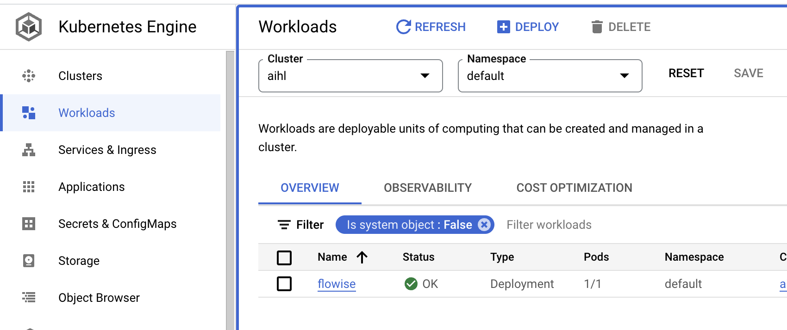
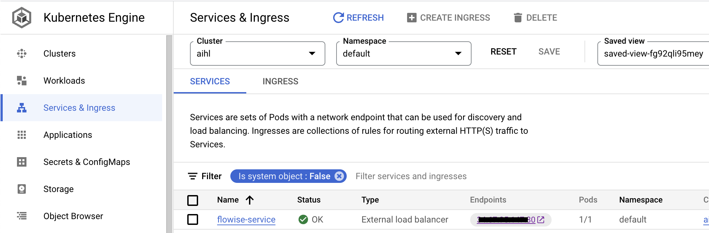

# GCP

***

## 先决条件

1. 记下您的 Google Cloud \[ProjectId]
2. 安装 [Git](https://git-scm.com/book/en/v2/Getting-Started-Installing-Git)
3. 安装 [Google Cloud CLI](https://cloud.google.com/sdk/docs/install-sdk)
4. 安装[Docker 桌面](https://docs.docker.com/desktop/)

## 设置 Kubernetes 集群

1. 如果没有 Kubernetes 集群，请创建一个。

<figure><figcaption><p>单击 `Clusters` 创建一个。</p></figcaption></figure>

2. 命名集群，选择正确的资源位置，使用 `Autopilot` 模式并保留所有其他默认配置。
3. 创建集群后，单击操作菜单中的“连接”菜单

<figure><figcaption></figcaption></figure>

4. 复制命令并粘贴到终端中，然后按 Enter 键连接集群。
5. 运行以下命令并选择正确的上下文名称，例如 `gke_[ProjectId]_[DataCenter]_[ClusterName]`

```
kubectl config get-contexts
```

6. 设置当前上下文

```
kubectl config use-context gke_[ProjectId]_[DataCenter]_[ClusterName]
```

## 构建并推送 Docker 镜像

运行以下命令来构建 Docker 映像并将其推送到 GCP 容器注册表。

1. 克隆 Flowise

```
git clone https://github.com/FlowiseAI/Flowise.git
```

2. 构建 Flowise

```
cd Flowise
pnpm install
pnpm build
```

3. 稍微更新 `Dockerfile` 文件。

> 指定nodejs的平台
>
> ```
> FROM --platform=linux/amd64 节点:18-alpine
> ```
>
> 添加python3、make和g++安装
>
> ```
> RUN apk add --no-cache python3 make g++
> ```

3. 构建为 Docker 镜像，确保 Docker 桌面应用程序正在运行

```
docker build -t gcr.io/[ProjectId]/flowise:dev .
```

4. 将 Docker 映像推送到 GCP 容器注册表。

```
docker push gcr.io/[ProjectId]/flowise:dev
```

## 部署到 GCP

1. 在项目中创建`yamls`根文件夹。
2. 将 `deployment.yaml` 文件添加到该文件夹​​中。

```
# deployment.yaml
apiVersion: apps/v1
kind: Deployment
metadata:
  name: flowise
  labels:
    app: flowise
spec:
  selector:
    matchLabels:
      app: flowise
  replicas: 1
  template:
    metadata:
      labels:
        app: flowise
    spec:
      containers:
      - name: flowise
        image: gcr.io/[ProjectID]/flowise:dev
        imagePullPolicy: Always
        resources: 
          requests:
            cpu: "1"
            memory: "1Gi"
```

3. 将 `service.yaml` 文件添加到该文件夹​​中。

```
# service.yaml
apiVersion: "v1"
kind: "Service"
metadata:
  name: "flowise-service"
  namespace: "default"
  labels:
    app: "flowise"
spec:
  ports:
  - protocol: "TCP"
    port: 80
    targetPort: 3000
  selector:
    app: "flowise"
  type: "LoadBalancer"

```

它将如下所示。

<figure><figcaption></figcaption></figure>

4. 通过运行以下命令部署 yaml 文件。

```
kubectl apply -f yamls/deployment.yaml
kubectl apply -f yamls/service.yaml
```

5. 进入GCP中的`Workloads`，可以看到你的pod正在运行。

<figure><figcaption></figcaption></figure>

6. 转到`Services & Ingress`，您可以单击Flowise 所在的`Endpoint`。

<figure><figcaption></figcaption></figure>

## 恭喜！

您已成功在 GCP [🥳](https://emojipedia.org/partying-face/) 上托管 Flowise 应用

## 超时

默认情况下，GCP 为代理分配了 30 秒的超时。当响应返回时间超过 30 秒阈值时，这会导致问题。为了解决此问题，请对 YAML 文件进行以下更改：

注意：要将超时设置为 10 分钟（例如）——我们在下面指定 600 秒。

1. 创建一个 `backendconfig.yaml` 文件，内容如下：

```yaml
apiVersion: cloud.google.com/v1
kind: BackendConfig
metadata:
  name: flowise-backendconfig
  namespace: your-namespace
spec:
  timeoutSec: 600
```

2.问题：`kubectl apply -f backendconfig.yaml`
3. 使用以下对 `BackendConfig` 的引用更新您的 `service.yaml` 文件：

```yaml
apiVersion: v1
kind: Service
metadata:
  annotations:
    cloud.google.com/backend-config: '{"default": "flowise-backendconfig"}'
  name: flowise-service
  namespace: your-namespace
...
```

4.问题：`kubectl apply -f service.yaml`
