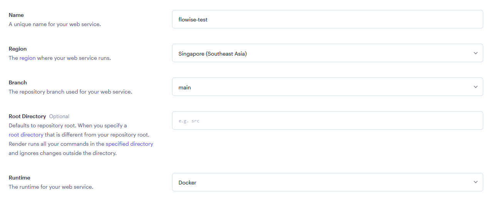
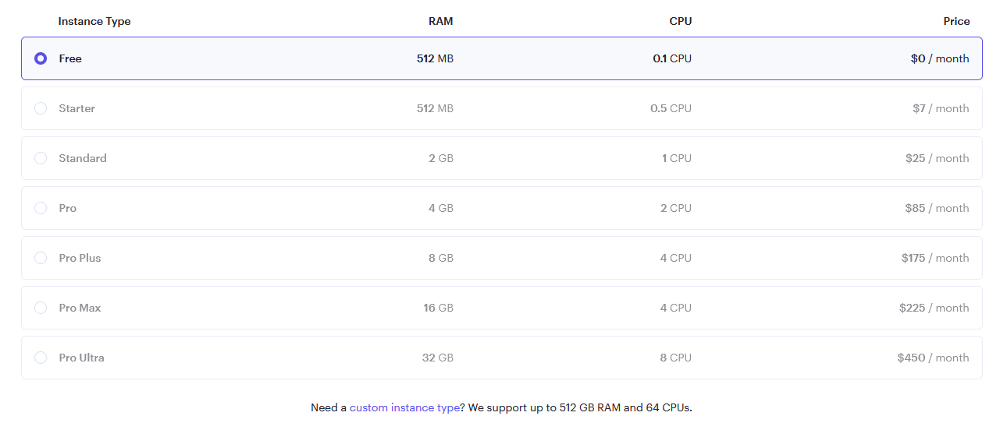
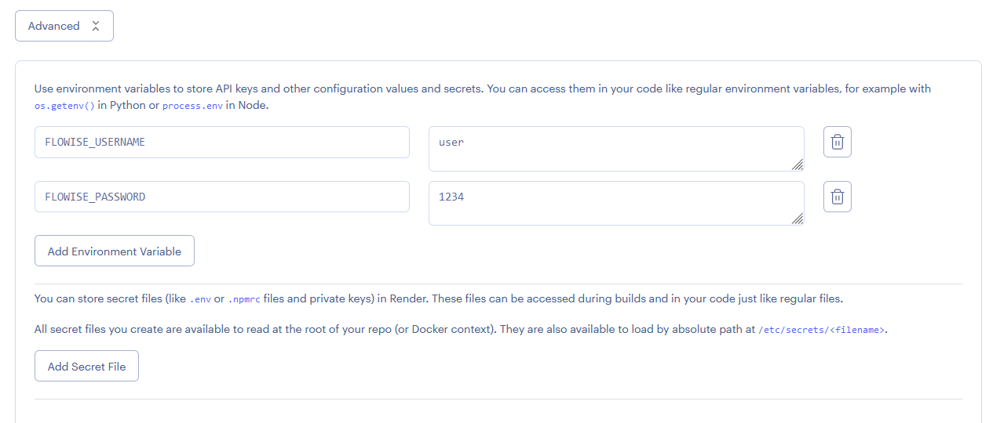
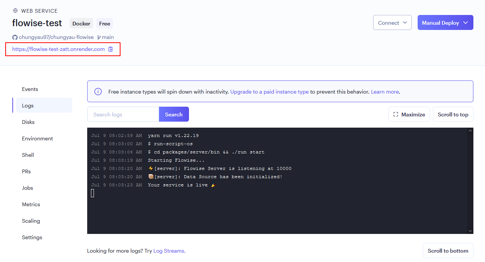
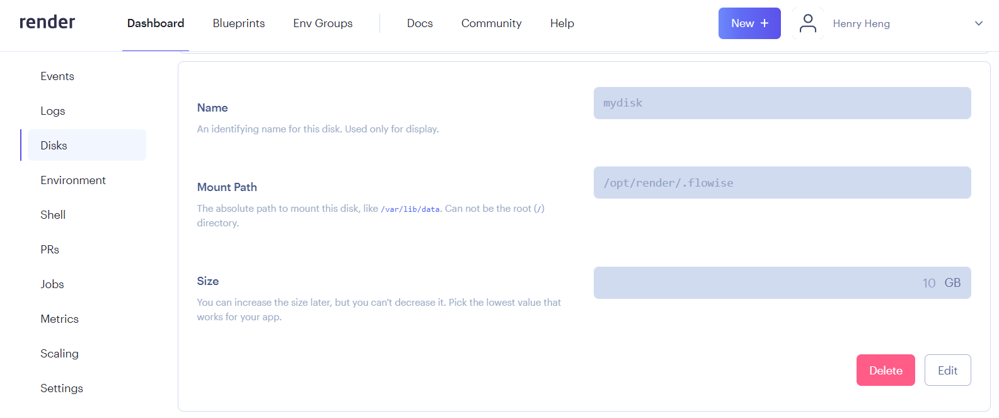
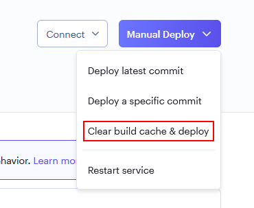

# 渲染

***

1. 分叉 [Flowise 官方存储库](https://github.com/FlowiseAI/Flowise)
2.访问您的github个人资料以确保您已成功创建分叉
3. 登录[渲染](https://dashboard.render.com)
4. 单击“**新建+**”

<figure><figcaption></figcaption></figure>

5. 选择**网络服务**

<figure><figcaption></figcaption></figure>

6. 连接您的 GitHub 帐户
7. 选择您分叉的 Flowise 存储库并单击 **连接**

<figure><figcaption></figcaption></figure>

8. 填写您首选的**名称**和**区域。**
9. 选择 `Docker` 作为您的 **运行时**

<figure><figcaption></figcaption></figure>

9. 选择一个**实例**

<figure><figcaption></figcaption></figure>

10._（可选）_添加应用程序级别授权，单击**高级**并添加`Environment Variable`

* FLOWISE\_用户名
* FLOWISE\_PASSWORD

<figure><figcaption></figcaption></figure>

添加值为 `18.18.1` 的 `NODE_VERSION` 作为运行实例的节点版本。

您可以配置环境变量列表。请参阅[environment-variables.md](../environment-variables.md "mention")

11. 单击“**创建 Web 服务**”

<figure><figcaption></figcaption></figure>

12. 导航到已部署的 URL，就是这样 [🚀](https://emojipedia.org/rocket/)[🚀](https://emojipedia.org/rocket/)

<figure><figcaption></figcaption></figure>

## 永久磁盘

在 Render 上运行的服务的默认文件系统是短暂的。 Flowise 数据不会在部署和重新启动时保留。为了解决这个问题，我们可以使用[渲染磁盘](https://render.com/docs/disks)。

1. 在左侧栏上，单击“**磁盘**”
2. 命名您的磁盘，并将 **安装路径** 指定为 `/opt/render/.flowise`

<figure><figcaption></figcaption></figure>

3. 单击 **Environment** 部分，然后添加以下新环境变量：

* HOST - `0.0.0.0`
* DATABASE\_PATH - `/opt/render/.flowise`
* APIKEY\_PATH - `/opt/render/.flowise`
* LOG\_PATH - `/opt/render/.flowise/logs`
* SECRETKEY\_PATH - `/opt/render/.flowise`
* BLOB\_STORAGE\_PATH - `/opt/render/.flowise/storage`

<figure><figcaption></figcaption></figure>

4. 单击 **手动部署**，然后选择 **清除构建缓存并部署**

<figure><figcaption></figcaption></figure>

5. 现在尝试创建一个流程并将其保存在 Flowise 中。然后尝试重新启动服务或重新部署，您应该仍然能够看到之前保存的流程。

观看如何部署到渲染




