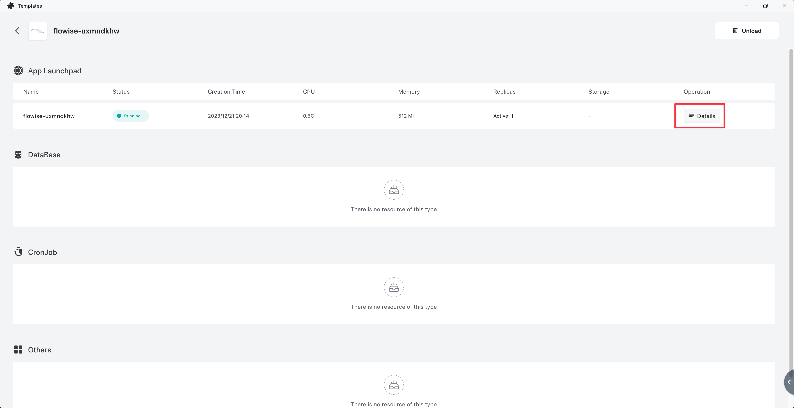
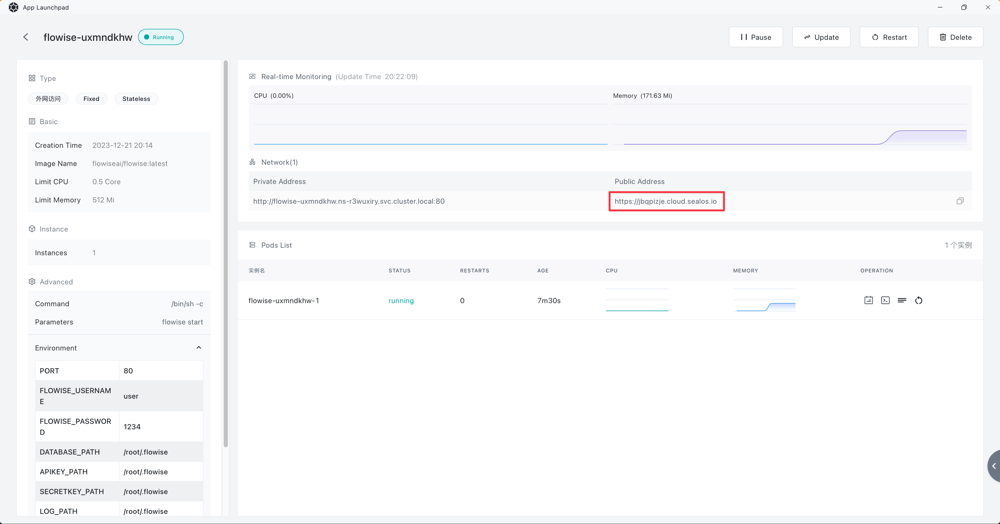
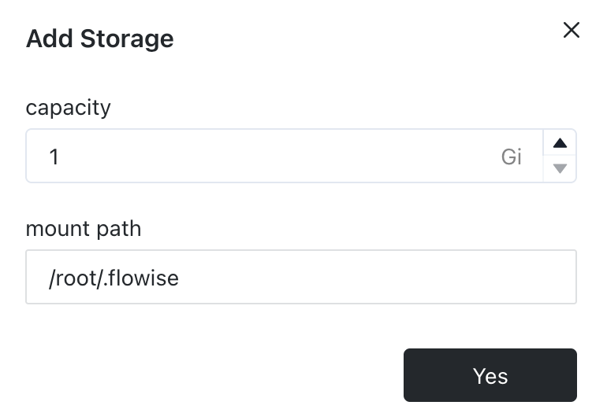

# 西洛斯

***

1. 单击以下预建的[模板](https://template.sealos.io/deploy?templateName=flowise)或下面的按钮。

2.添加授权
   * FLOWISE\_用户名
   * FLOWISE\_PASSWORD

<figure><figcaption></figcaption></figure>

3. 在模板页面点击“部署应用”开始部署。
4. 部署结束后，单击“详细信息”导航至应用程序的详细信息。

<figure><figcaption></figcaption></figure>

5. 等待应用程序的状态切换为正在运行。随后，单击外部链接可直接通过外部域打开应用程序的 Web 界面。

<figure><figcaption></figcaption></figure>

## 持久卷

点击应用详情页面右上角的“更新”，然后点击“高级”->“添加卷”，填写“挂载路径”的值：`/root/.flowise`。

<figure><figcaption></figcaption></figure>

最后，单击“部署”按钮。

现在尝试创建一个流程并将其保存在 Flowise 中。然后尝试重新启动服务或重新部署，您应该仍然能够看到之前保存的流程。
