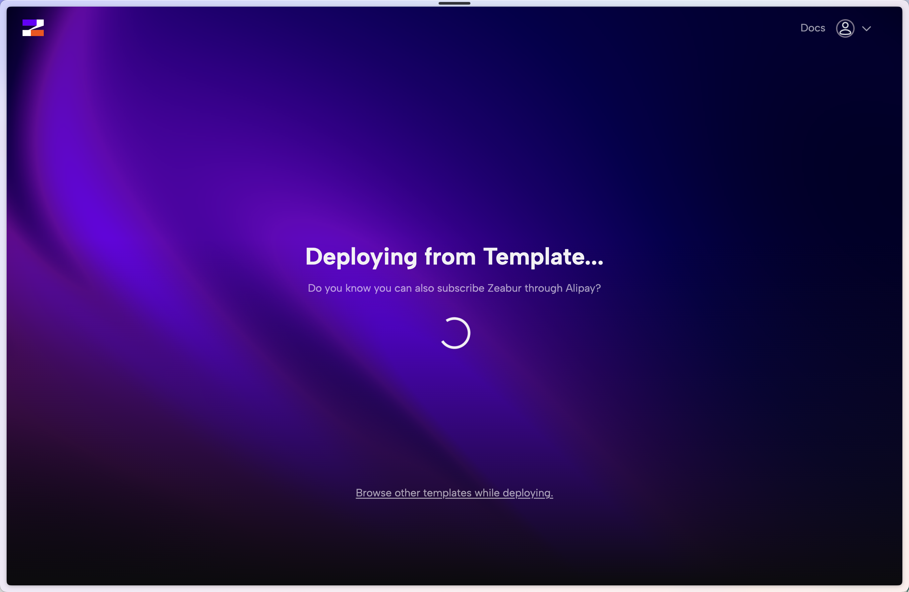
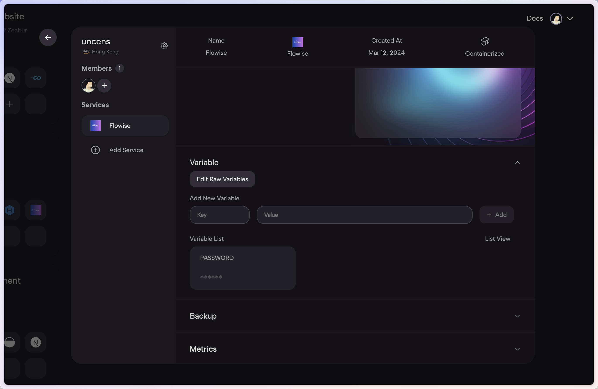

# 玉米

***


请注意，Zeabur 制作的以下模板已过时（自 2024 年 1 月 24 日起）。


1. 单击以下预建的[模板](https://zeabur.com/templates/2JYZTR)或下面的按钮。

2. 单击“部署”

<figure><figcaption></figcaption></figure>

3. 选择您喜欢的地区并继续

<figure><figcaption></figcaption></figure>

4.您将被重定向到Zeabur的仪表板，您将看到部署过程

<figure><figcaption></figcaption></figure>

5. 要添加授权，请导航到“变量”选项卡并添加：

* FLOWISE\_用户名
* FLOWISE\_PASSWORD

<figure><figcaption></figcaption></figure>

6. 您可以配置环境变量列表。请参阅[environment-variables.md](../environment-variables.md "mention")

就是这样！您现在已在 Zeabur 上部署了 Flowise [🎉](https://emojipedia.org/party-popper/)[🎉](https://emojipedia.org/party-popper/)

## 持久卷

Zeabur 会自动为您创建持久卷，因此您无需担心。
