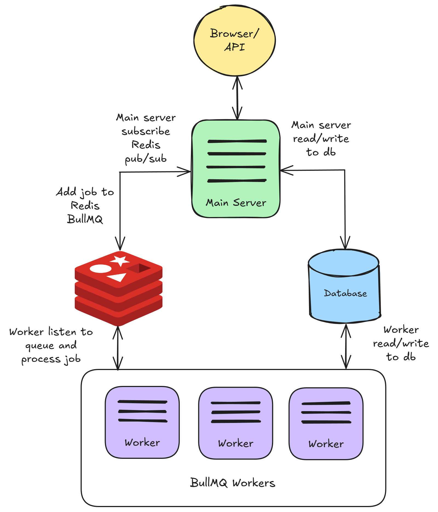
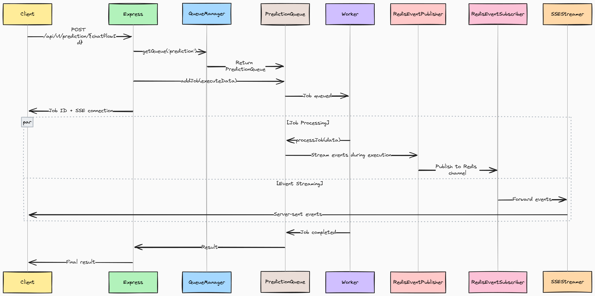

# 使用队列运行 Flowise

默认情况下，Flowise 在 NodeJS 主线程中运行。然而，对于大量的预测，这不能很好地扩展。因此，您可以配置 2 种模式：`main`（默认）和 `queue`。

## 队列模式

使用以下环境变量，您可以在 `queue` 模式下运行 Flowise。

<table><thead><tr><th width="263">变量</th><th>描述</th><th>类型</th><th>默认</th></tr></thead><tbody><tr><td>MODE</td><td>运行 Flowise 的模式</td><td>枚举字符串： <code>main</code>, <code>queue</code></td><td><code>main</code></td></tr><tr><td>WORKER_CONCURRENCY</td><td>一个worker允许并行处理多少个作业。如果你有 1 个工作线程，这意味着它可以处理多少个并发预测任务。更多 <a href="https://docs.bullmq.io/guide/workers/concurrency">信息</a></td><td>数量</td><td>10000</td></tr><tr><td>QUEUE_NAME</td><td>消息队列的名称</td><td>字符串</td><td>流动队列</td></tr><tr><td>QUEUE_REDIS_EVENT_STREAM_MAX_LEN</td><td>事件流会自动修剪，使其大小不会增长太多。更多 <a href="https://docs.bullmq.io/guide/events">信息</a></td><td>数量</td><td>10000</td></tr><tr><td>REDIS_URL</td><td>Redis URL</td><td>字符串</td><td></td></tr><tr><td>REDIS_HOST</td><td>Redis主机</td><td>字符串</td><td>本地主机</td></tr><tr><td>REDIS_PORT</td><td>Redis端口</td><td>数量</td><td>6379</td></tr><tr><td>REDIS_USERNAME</td><td>Redis 用户名（可选）</td><td>字符串</td><td></td></tr><tr><td>REDIS_PASSWORD</td><td>Redis密码（可选）</td><td>字符串</td><td></td></tr><tr><td>REDIS_TLS</td><td>Redis TLS 连接（可选）更多 <a href="https://redis.io/docs/latest/operate/oss_and_stack/management/security/encryption/">信息</a></td><td>布尔值</td><td>假的</td></tr><tr><td>REDIS_CERT</td><td>Redis自签名证书</td><td>字符串</td><td></td></tr><tr><td>REDIS_KEY</td><td>Redis自签名证书密钥文件</td><td>字符串</td><td></td></tr><tr><td>REDIS_CA</td><td>Redis自签名证书CA文件</td><td>字符串</td><td></td></tr></tbody></table>

在 `queue` 模式下，主服务器将负责处理请求，将作业发送到消息队列。主服务器不会执行该作业。一名或多名工作人员从队列中接收作业，执行它们并将结果发回。

这允许动态扩展：您可以添加工作人员来处理增加的工作负载或在较轻的时期删除它们。

它的工作原理如下：

1. 主服务器接收来自网络的预测或其他请求，将它们作为作业添加到队列中。
2. 这些作业队列是等待处理的任务的基本列表。工作人员本质上是独立的进程或线程，负责接收并执行这些作业。
3. 工作完成后，工人：
   * 将结果写入数据库。
   * 发送一个事件来指示作业完成。
4. 主服务器接收事件，并将结果发送回UI。
5. Redis pub/sub 还用于将数据流式传输回 UI。

<figure><figcaption></figcaption></figure>

## 流程图

<figure><figcaption></figcaption></figure>

#### 1.请求入口点

预测请求到达 Express 服务器并立即检查是否 `MODE=QUEUE`。如果为 true，则会从直接执行切换到异步队列处理。

#### 2. 创造就业机会和双渠道

系统创建两条并行路径：

* **作业通道**：请求数据通过BullMQ成为Redis作业，HTTP线程等待完成
* **流通道**：为通过 Redis pub/sub 进行实时更新而建立的 SSE 连接

#### 3. Worker 处理

独立的工作进程轮询 Redis 来查找作业。分配时：

* 重建完整的执行上下文（数据库、组件、中止控制器）
* 通过逐个节点处理执行工作流程
* 发布实时事件（代币、工具、进度）到Redis通道

#### 4. 实时通讯

执行期间：

* [**RedisEventPublisher**](https://github.com/FlowiseAI/Flowise/blob/main/packages/server/src/queue/RedisEventPublisher.ts) 将事件从工作线程广播到 Redis
* [**RedisEventSubscriber**](https://github.com/FlowiseAI/Flowise/blob/main/packages/server/src/queue/RedisEventSubscriber.ts) 将事件从 Redis 转发到 SSE 客户端
* [**SSEStreamer**](https://github.com/FlowiseAI/Flowise/blob/main/packages/server/src/utils/SSEStreamer.ts) 将事件实时传送到浏览器

#### 5. 完成和响应

作业完成，结果存储在Redis中：

* HTTP 线程解除阻塞，接收结果
* SSE 连接正常关闭
* 资源清理（中止控制器、连接）

## 本地设置

### 启动Redis

在启动主服务器和工作人员之前，需要先运行Redis。您可以在单独的计算机上运行 Redis，但请确保服务器和工作实例可以访问它。

例如，您可以按照此[指南](https://www.docker.com/blog/how-to-use-the-redis-docker-official-image/)在 Docker 上运行 Redis。

### 启动主服务器

这与默认运行 Flowise 相同，但配置上述环境变量除外。

```bash
pnpm start
```

### 启动工人

和主服务器一样，必须配置上面的环境变量。我们建议为主实例和工作实例使用相同的 `.env` 文件。唯一的区别是如何运行工人。打开另一个终端并运行：

```bash
pnpm run start-worker
```


主服务器和worker需要共享相同的密钥。请参阅[#for-credentials](environment-variables.md#for-credentials "mention")。对于生产，我们建议使用 Postgres 作为性能数据库。


## Docker 设置

### 方法 1：预构建镜像（推荐）

此方法使用 Docker Hub 中预先构建的 Docker 映像，使其成为最快、最可靠的部署选项。

**第1步：设置环境**

在 `docker` 目录中创建 `.env` 文件：

```bash
# Basic Configuration
PORT=3000
WORKER_PORT=5566

# Queue Configuration (Required)
MODE=queue
QUEUE_NAME=flowise-queue
REDIS_URL=redis://redis:6379

# Optional Queue Settings
WORKER_CONCURRENCY=5
REMOVE_ON_AGE=24
REMOVE_ON_COUNT=1000
QUEUE_REDIS_EVENT_STREAM_MAX_LEN=1000
ENABLE_BULLMQ_DASHBOARD=false

# Database (Optional - defaults to SQLite)
DATABASE_PATH=/root/.flowise

# Storage
BLOB_STORAGE_PATH=/root/.flowise/storage

# Secret Keys
SECRETKEY_PATH=/root/.flowise

# Logging
LOG_PATH=/root/.flowise/logs
```

**第 2 步：部署**

```bash
cd docker
docker compose -f docker-compose-queue-prebuilt.yml up -d
```

**步骤 3：验证部署**

```bash
# Check container status
docker compose -f docker-compose-queue-prebuilt.yml ps

# View logs
docker compose -f docker-compose-queue-prebuilt.yml logs -f flowise
docker compose -f docker-compose-queue-prebuilt.yml logs -f flowise-worker
```

### 方法 2：从源代码构建

此方法从源代码构建 Flowise，对于开发或自定义修改很有用。

**第1步：设置环境**

创建与 [方法 1](running-flowise-using-queue.md#method-1-pre-built-images-recommended) 中相同的 `.env` 文件。

**第 2 步：部署**

```bash
cd docker
docker compose -f docker-compose-queue-source.yml up -d
```

**步骤 3：构建过程**

源构建将：

* 从源代码构建主要 Flowise 应用程序
* 从源代码构建工人图像
* 设置Redis和网络

**第 4 步：监控构建**

```bash
# Watch build progress
docker compose -f docker-compose-queue-source.yml logs -f

# Check final status
docker compose -f docker-compose-queue-source.yml ps
```

### 健康检查

所有撰写文件都包含健康检查：

```bash
# Check main instance health
curl http://localhost:3000/api/v1/ping

# Check worker health
curl http://localhost:5566/healthz
```

## 队列仪表板

将 `ENABLE_BULLMQ_DASHBOARD` 设置为 true 将允许用户通过导航到“查看所有作业、状态、结果、数据”<your-flowise-url.com>/管理/队列`

<figure><figcaption></figcaption></figure>
