#扎皮尔扎普斯

***

## 先决条件

1. [登录](https://zapier.com/app/login)或[注册](https://zapier.com/sign-up)到 Zapier
2. 请参阅[deployment](../../configuration/deployment/) 创建 Flowise 的云托管版本。

## 设置

1. 前往[Zapier Zaps](https://zapier.com/app/zaps)
2. 单击“**创建**”

<figure>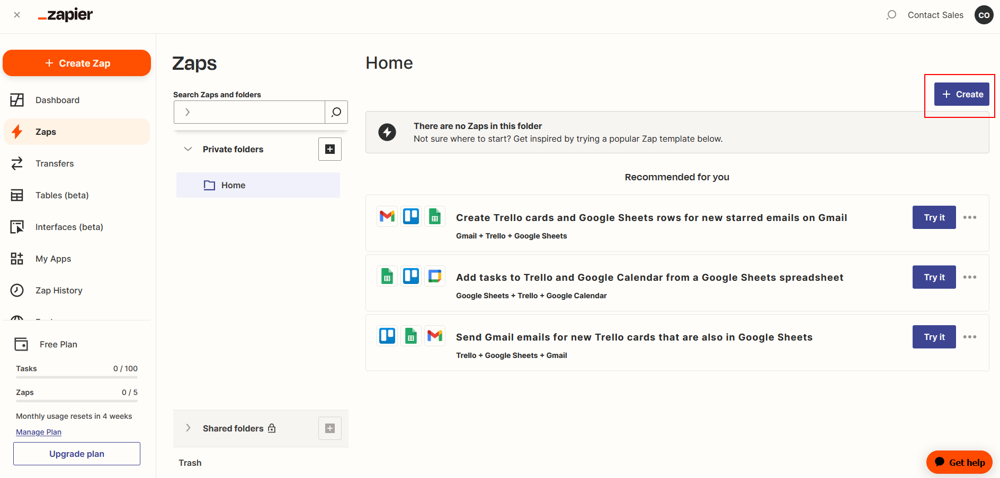<figcaption></figcaption></figure>

### 接收触发消息

1. 单击或搜索 **Discord**

    <figure><figcaption></figcaption></figure>
2. 选择“**新消息发布到频道**”作为“事件”，然后单击“**继续**”

    <figure><figcaption></figcaption></figure>
3. **登录**您的 Discord 帐户

    <figure>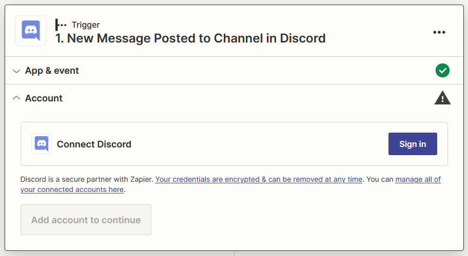<figcaption></figcaption></figure>
4. 将 **Zapier Bot** 添加到您的首选服务器

    <figure><figcaption></figcaption></figure>
5. 授予适当的权限并单击“**授权**”，然后单击“**继续**”

    <figure><figcaption></figcaption></figure>

    <figure><figcaption></figcaption></figure>
6. 选择您与 Zapier Bot 交互的**首选渠道**，然后单击 **继续**

    <figure>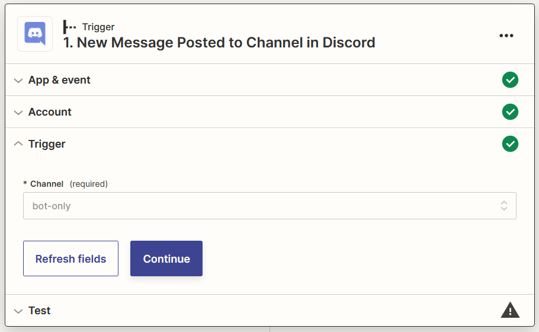<figcaption></figcaption></figure>
7. **发送消息**到您在步骤 8 中选择的频道

    <figure><figcaption></figcaption></figure>
8. 单击**测试触发器**

    <figure>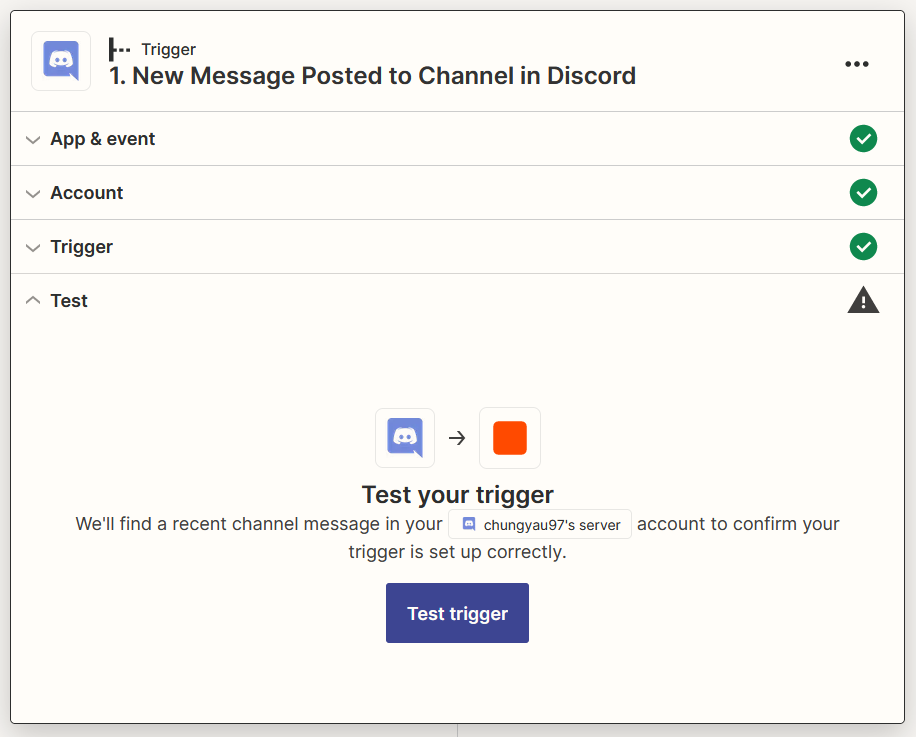<figcaption></figcaption></figure>
9. 选择您的消息，然后单击 **继续选择的记录**

    <figure>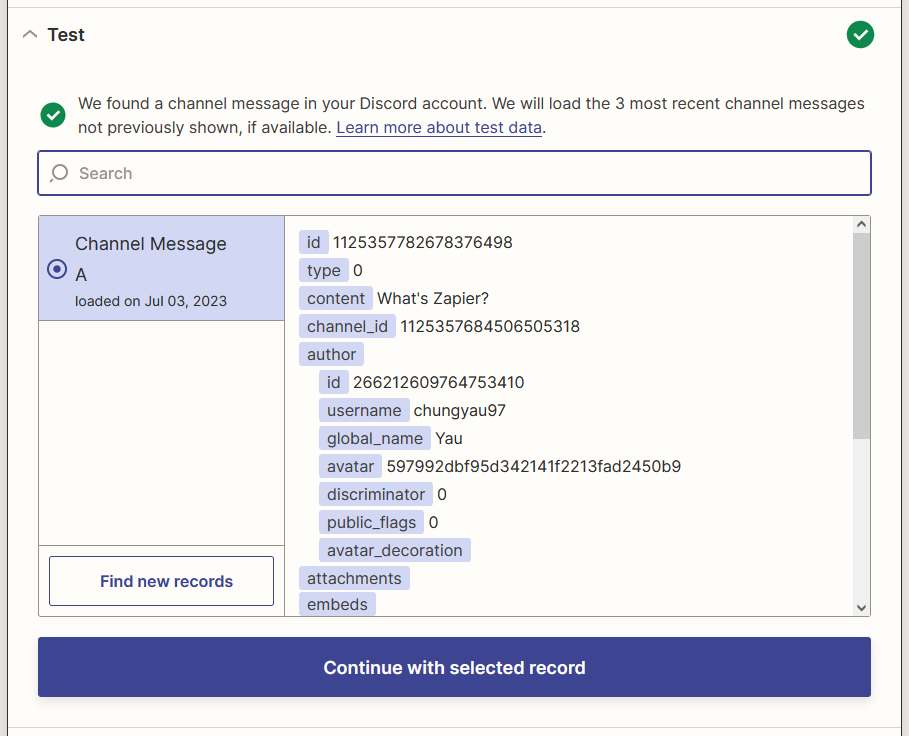<figcaption></figcaption></figure>

### 过滤掉 Zapier 机器人的消息

1. 点击或搜索**过滤器**

    <figure>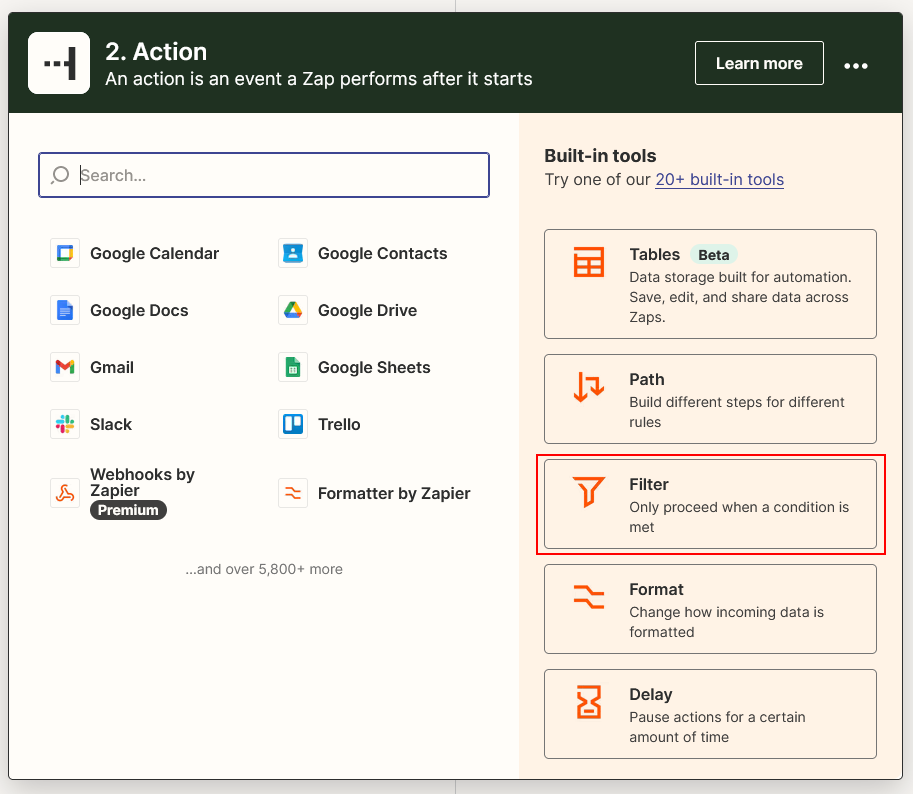<figcaption></figcaption></figure>
2. 将 **过滤器** 配置为如果收到来自 **Zapier Bot** 的消息则不继续，然后单击 **继续**

    <figure>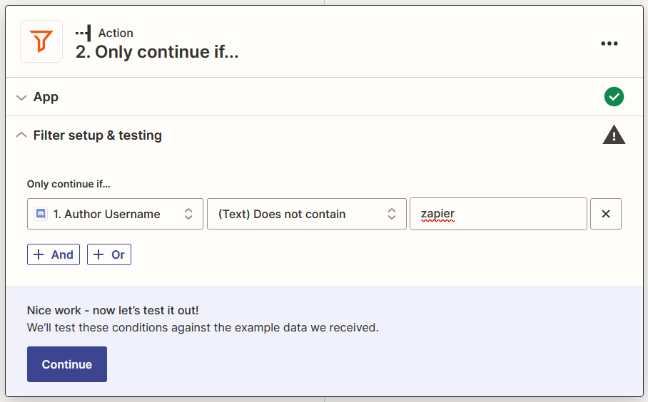<figcaption></figcaption></figure>

### FlowiseAI 生成结果消息

1.点击**+**，点击或搜索**FlowiseAI**

    <figure>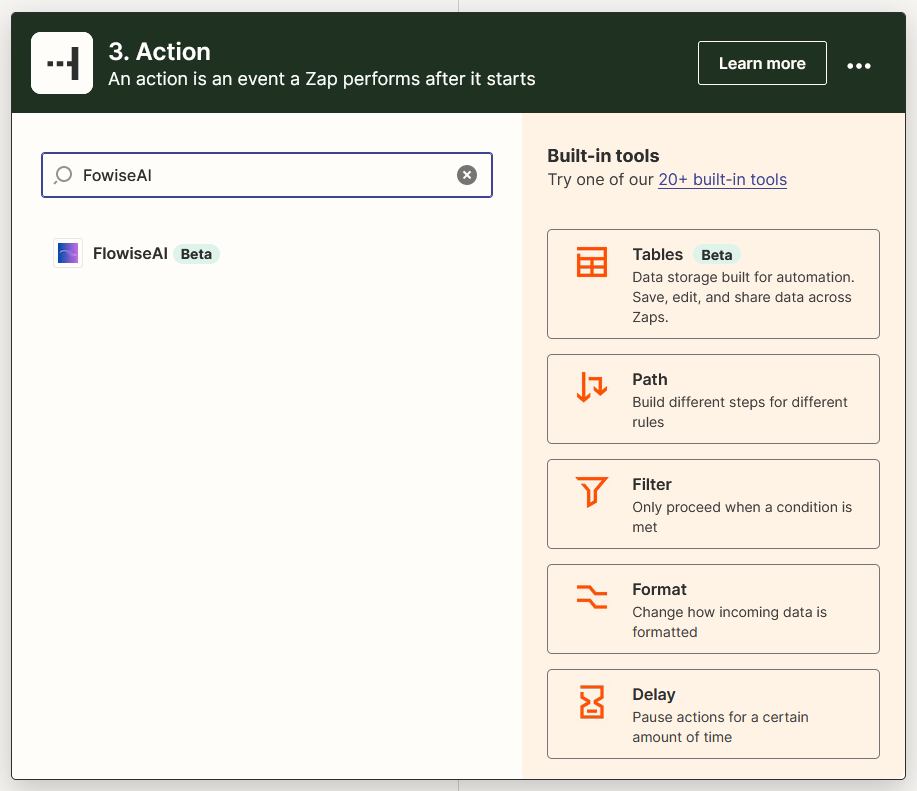<figcaption></figcaption></figure>
2. 选择 **进行预测** 作为事件，然后单击 **继续**

    <figure>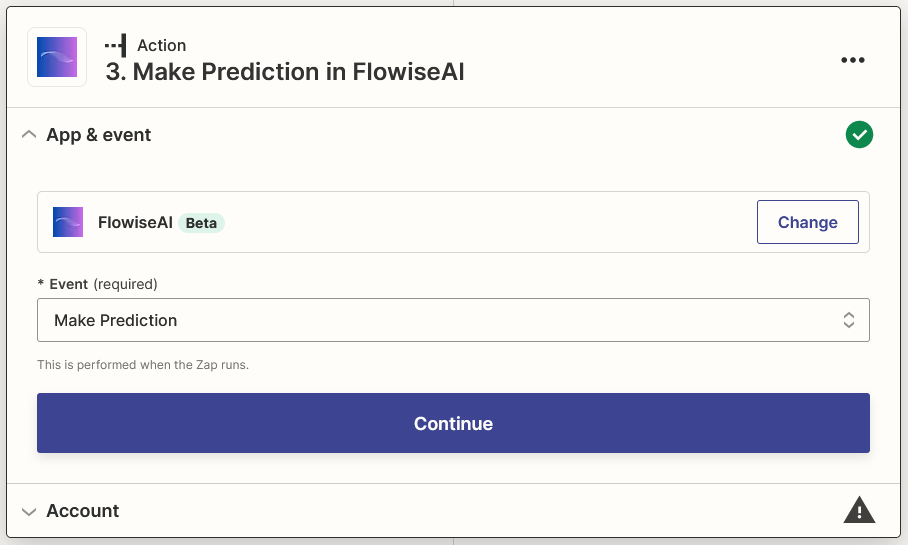<figcaption></figcaption></figure>
3. 单击 **登录** 并插入您的详细信息，然后单击 **是，继续使用 FlowiseAI**

    <figure>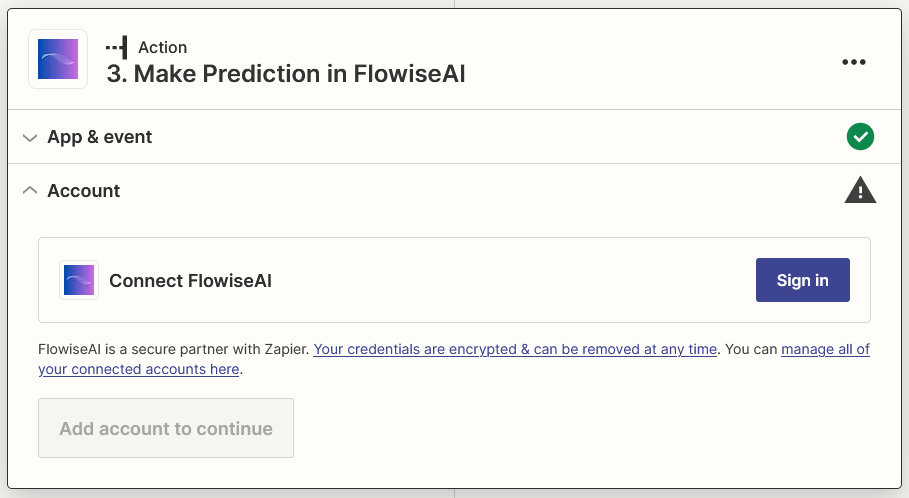<figcaption></figcaption></figure>

    <figure><figcaption></figcaption></figure>
4. 从 Discord 中选择 **内容** 和您的 Flow ID，然后单击 **继续**

    <figure>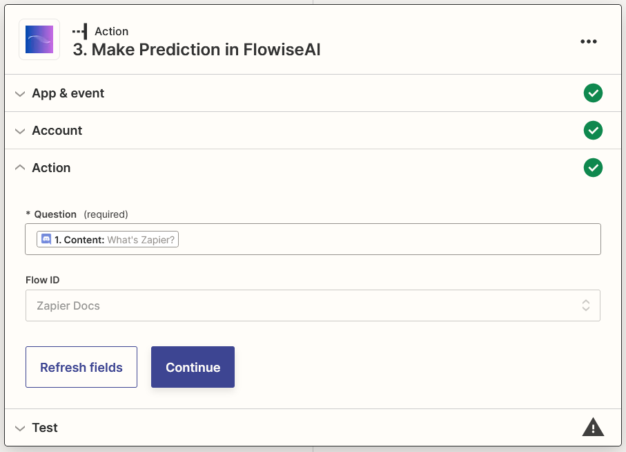<figcaption></figcaption></figure>
5. 单击“**测试操作**”并等待结果

    <figure><figcaption></figcaption></figure>

### 发送结果消息

1.点击**+**，点击或搜索**Discord**

    <figure>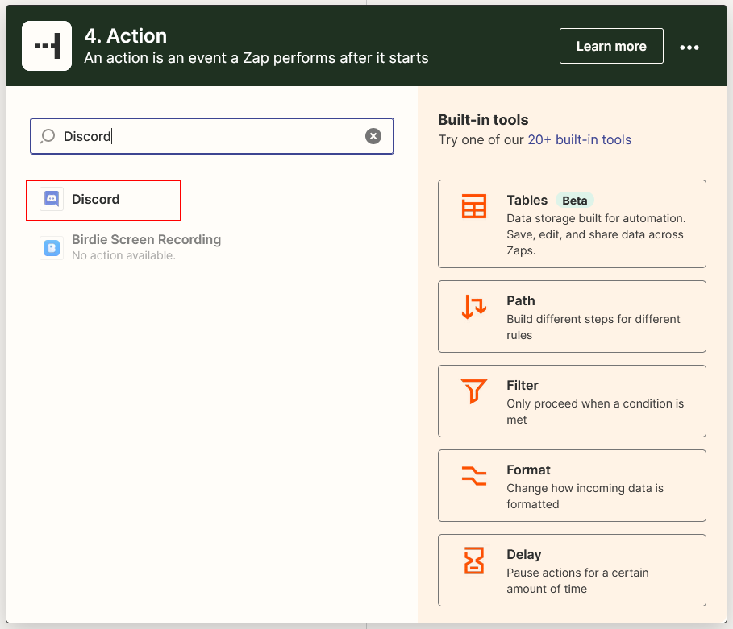<figcaption></figcaption></figure>
2. 选择 **发送频道消息** 作为事件，然后单击 **继续**

    <figure>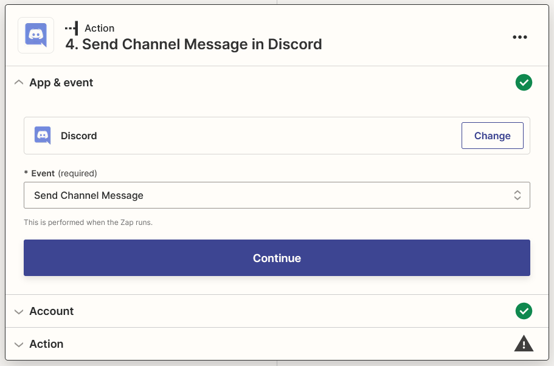<figcaption></figcaption></figure>
3. 选择您登录的 Discord 帐户，然后单击 **继续**

    <figure>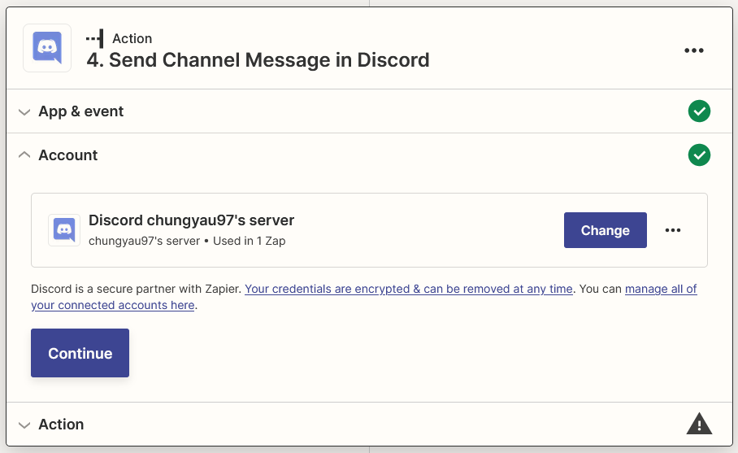<figcaption></figcaption></figure>
4. 为通道选择您喜欢的通道，并从 FlowiseAI 中为消息文本选择 **文本** 和 **字符串源**（如果有），然后单击 **继续**

    <figure>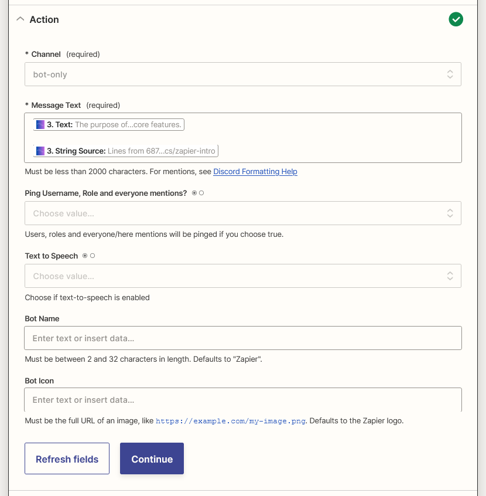<figcaption></figcaption></figure>
5. 单击**测试操作**

    <figure>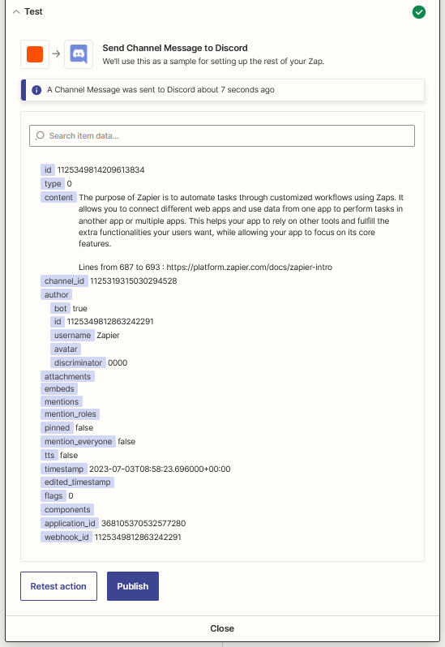<figcaption></figcaption></figure>
6. 瞧[🎉](https://emojipedia.org/party-popper/)，您应该会看到消息已到达您的 Discord 频道

    <figure>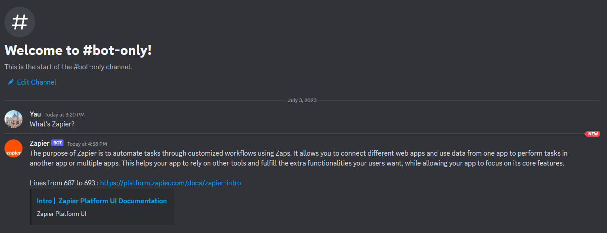<figcaption></figcaption></figure>
7. 最后，重命名您的 Zap 并发布它

    <figure>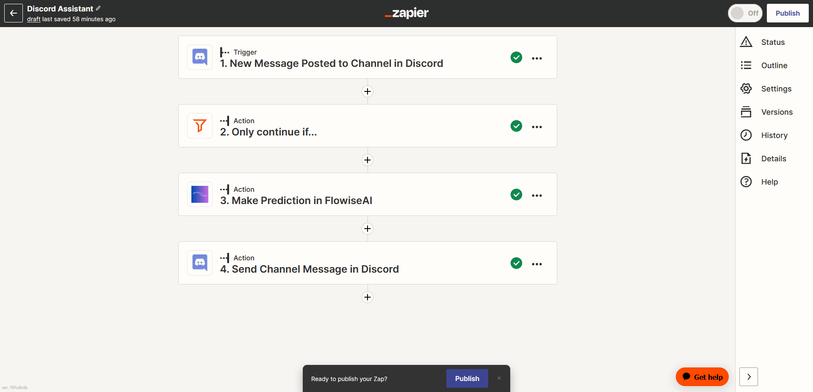<figcaption></figcaption></figure>
