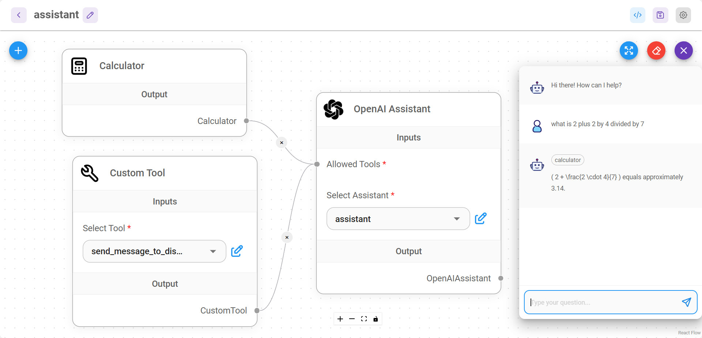

# 线程数

[Threads](https://platform.openai.com/docs/assistants/how-it-works/managing-threads-and-messages) 仅在使用 OpenAI 助手 时使用。这是助理和用户之间的对话会话。线程存储消息并自动处理截断以使内容适合模型的上下文。

<figure><figcaption></figcaption></figure>

## 多个用户的单独对话

### UI 和嵌入式聊天

默认情况下，UI 和嵌入式聊天将自动分隔多个用户对话的线程。这是通过为每个新交互生成唯一的 **`chatId`** 来完成的。该逻辑由 Flowise 在幕后处理。

### 预测 API

POST /`api/v1/prediction/{your-chatflowid}`，指定 **`chatId`** 。相同的chatId将使用相同的线程。

```json
{
    "question": "hello!",
    "chatId": "user1"
}
```

### 消息 API

* GET `/api/v1/chatmessage/{your-chatflowid}`
* DELETE `/api/v1/chatmessage/{your-chatflowid}`

您还可以通过 **`chatId` -** `/api/v1/chatmessage/{your-chatflowid}?chatId={your-chatid}` 进行过滤

所有对话也可以通过 UI 进行可视化和管理：

<figure><figcaption></figcaption></figure>
