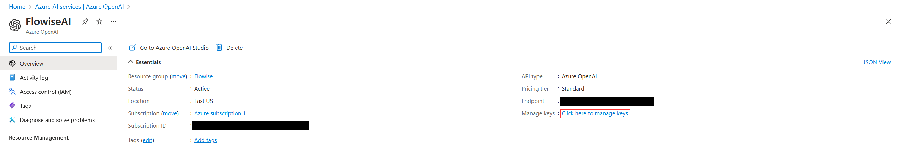
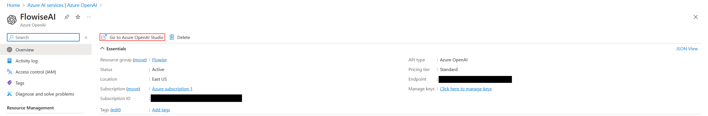
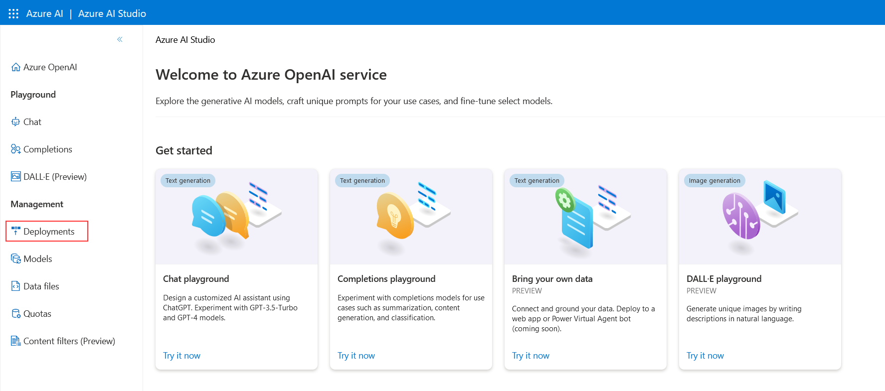
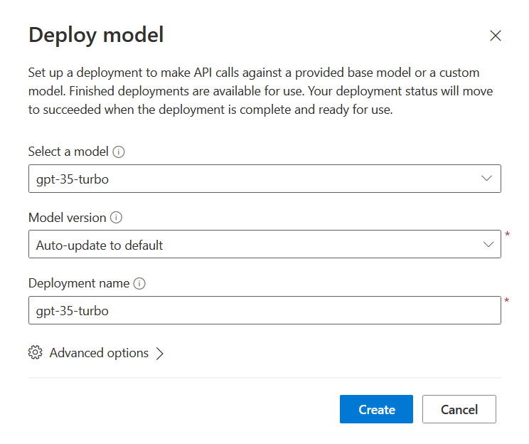
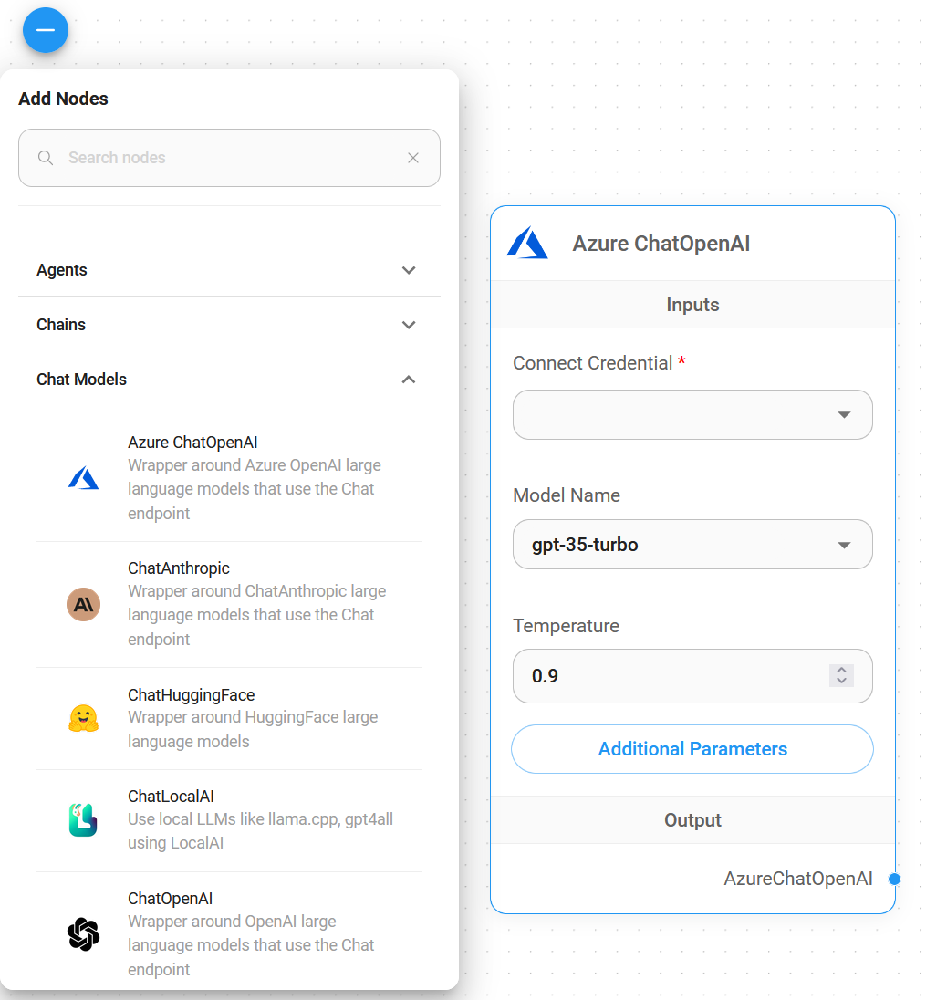
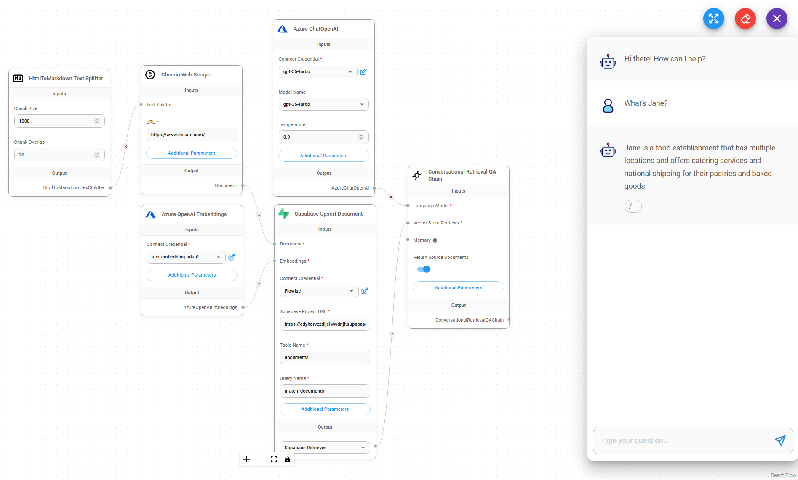

# Azure ChatOpenAI

## 先决条件

1. [登录](https://portal.azure.com/)或[注册](https://azure.microsoft.com/en-us/free/)到 Azure
2. [创建](https://portal.azure.com/#create/Microsoft.CognitiveServicesOpenAI)您的 Azure OpenAI 并等待大约 10 个工作日的批准
3. 您的 API 密钥将在 **Azure OpenAI** 中提供 > 单击 **名称\_azure\_openai** > 单击 **单击此处管理密钥**

<figure><figcaption></figcaption></figure>

## 设置

### Azure 聊天OpenAI

1. 单击“**转到 Azure OpenaAI Studio**”

<figure><figcaption></figcaption></figure>

2. 单击**部署**

<figure><figcaption></figcaption></figure>

3. 单击“**创建新部署**”

<figure><figcaption></figcaption></figure>

4.如下图选择，点击**创建**

<figure><figcaption></figcaption></figure>

5.成功创建**Azure ChatOpenAI**

* 部署名称：`gpt-35-turbo`
* 实例名称：`top right conner`

<figure><figcaption></figcaption></figure>

<figure><figcaption></figcaption></figure>

### 流动

1. **聊天模型** > 拖动 **Azure ChatOpenAI** 节点

<figure><figcaption></figcaption></figure>

2. **连接凭据** > 单击 **新建**

<figure><figcaption></figcaption></figure>

3. 将每个详细信息（API 密钥、实例和部署名称、[API 版本](https://learn.microsoft.com/en-us/azure/ai-services/openai/reference#chat-completions)）复制并粘贴到 **Azure ChatOpenAI** 凭据中

<figure><figcaption></figcaption></figure>

4.瞧[🎉](https://emojipedia.org/party-popper/)，您已在 Flowise 中创建了 **Azure ChatOpenAI 节点**

<figure><figcaption></figcaption></figure>

## 资源

* [LangChain JS Azure ChatOpenAI](https://js.langchain.com/docs/modules/model\_io/models/chat/integrations/azure)
* [Azure OpenAI 服务 REST API 参考](https://learn.microsoft.com/en-us/azure/ai-services/openai/reference)
