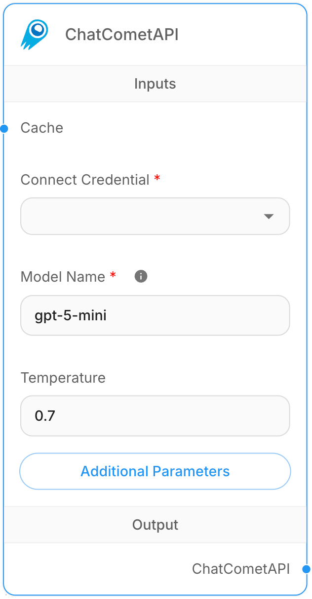

# 聊天彗星 API

## 说明
CometAPI 是一个统一的 API 平台，通过一次集成即可访问 500 多个 AI 模型，包括 GPT、Claude、Gemini、Qwen、DeepSeek、Midjourney 等。它通过不同模型提供商之间一致的 API 格式提供简化的访问。

## 先决条件
1. 请参阅 CometAPI 的官方[docs](https://api.cometapi.com/doc)。
2. 从 [CometAPI 控制台](https://api.cometapi.com/console/token) 获取您的 API 密钥。

## 分步指南
<figure><figcaption>
ChatCometAPI 节点
</figcaption></figure>

1. **聊天模型** > 拖动 **ChatCometAPI** 节点。
2. 使用 CometAPI API 密钥创建新凭据。
3. 单击 ChatCometAPI 节点上的“**其他参数**”。
4. 将基本路径更改为：`https://api.cometapi.com/v1/`。