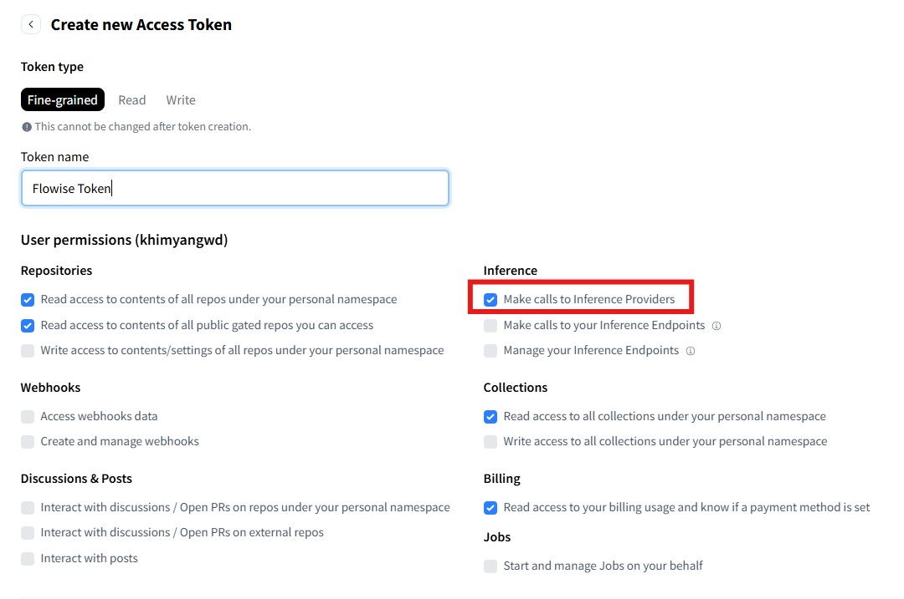
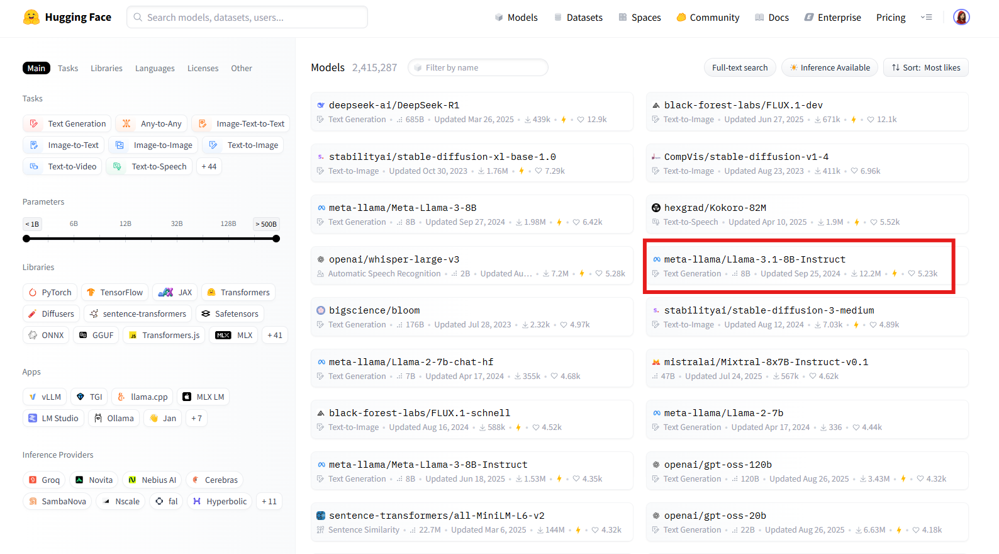
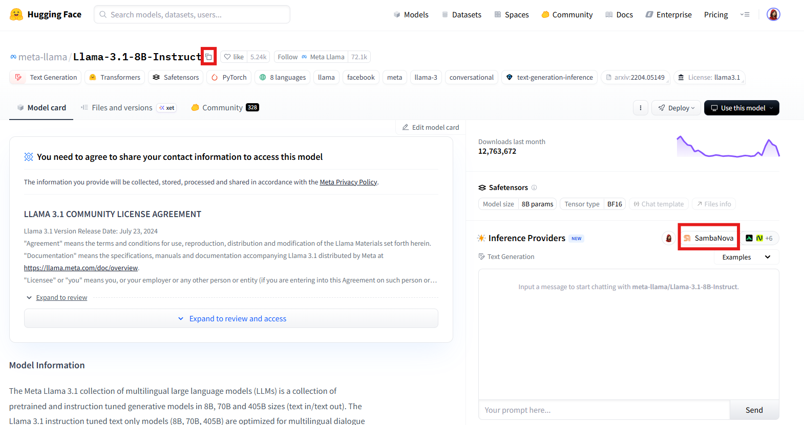
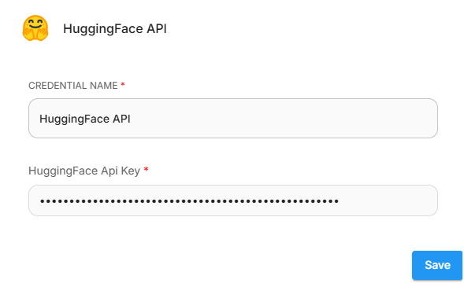
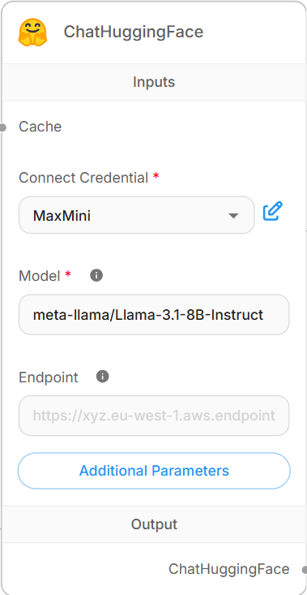
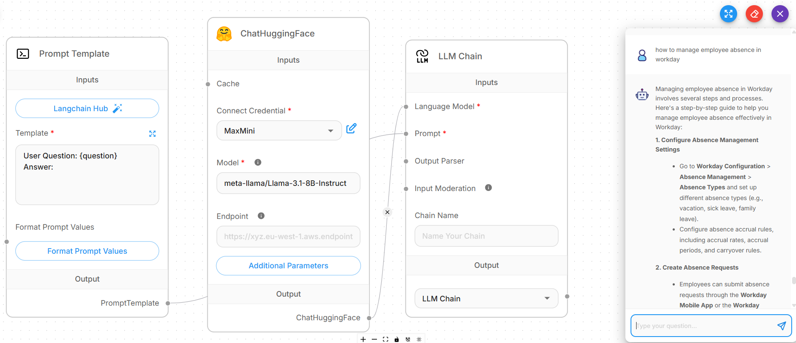

# 聊天拥抱脸

## 先决条件

1. [登录](https://huggingface.co/login)或[注册](https://huggingface.co/join)到[拥抱表情](https://huggingface.co)。
2. 创建 API 密钥（如果您尚未这样做）：
   1. 从您的 Hugging Face 个人资料中，选择 **访问令牌** > **创建新令牌**。
   2. 创建_细粒度_令牌。选择您需要的所有读写权限。确保您还选择：

       * _调用推理提供商_ - 通过 Hugging Face 与 Hugging Face 或其他第三方提供商（例如 Together AI、Sambanova 或 Replicate）的无服务器推理 API（以前称为“推理 API”）进行交互。
       * _调用您的推理端点_ - 与您部署在自己的服务器上的专用独立 Hugging Face 实例进行交互。

       <figure><figcaption>
拥抱脸部令牌创建
</figcaption></figure>
   3. 单击 **复制** 并将 API 令牌保存在其他位置以供以后检索。
3. 从 **模型** 选项卡中，选择您要使用的 LLM 模型。

    <figure><figcaption>
拥抱脸部模型
</figcaption></figure>
4. 在打开的 LLM 模型页面上：
   1. 单击模型名称旁边的图标，将模型名称复制到剪贴板或保存到其他位置以供以后检索。
   2. 注意模型的默认推理提供程序。

       <figure><figcaption>
拥抱脸 LLM 模型页面
</figcaption></figure>
   3. 如果您的提供商是需要自定义 API 密钥的第三方提供商，请首先在提供商网站上创建 API 密钥，然后在 Hugging Face 配置文件设置中复制并设置 API 密钥：
      1. 单击 Hugging Face 个人资料下的 **设置**。
      2. 选择左侧面板上的 **推理提供程序**。
      3. 选择**设置**选项卡。
      4. 选择 **为提供商设置自定义 API 密钥**，然后粘贴 API 密钥。

## 设置

### 流动

首先，您需要部署 Flowise。在本地或云端安装并运行 Flowise。您可以按照 Flowise 官方文档或教程进行部署。

要使用 ChatHuggingFace 聊天模型在 Flowise 中创建聊天流：

1. 在 **聊天流** 中，单击 **+ 添加新** 以创建新的聊天流。
2. 单击**+** 并拖动**链** > **LLM 链**。
3. 单击 **+** 并拖动 **聊天模型** > **ChatHuggingFace**：

    * **连接凭据**：单击 **新建** 创建新凭据，并在 **HuggingFace API 密钥** 字段中输入 Hugging Face 访问令牌。

        <figure><figcaption>
拥抱面部连接凭据
</figcaption></figure>
    * **模型**：粘贴剪贴板中的模型名称（从 Hugging Face 上的模型页面保存）。

    <figure><figcaption>
ChatHuggingFace 节点
</figcaption></figure>
4. 单击 **+** 并拖动 **提示词** > **提示词模板**：
   * 展开模板并输入说明。示例：“用户问题：{问题}”。
5. 将 **ChatHuggingFace** 输出连接到 LLM 链的 **语言模型** 输入。
6. 将 **PromptTemplate** 输出连接到 LLM 链的 **Prompt** 输入。
7. 在运行聊天流之前保存您的配置。
8. 瞧[🎉](https://emojipedia.org/party-popper/)，您已在 Flowise 中创建了带有 **ChatHuggingFace 节点** 的聊天流。

    <figure><figcaption>
拥抱脸聊天流
</figcaption></figure>

## 资源

* [HuggingFace 文档](https://huggingface.co/docs)
* [HuggingFace 论坛](https://discuss.huggingface.co/)
