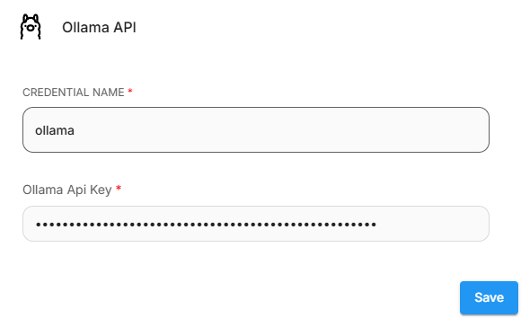

# 聊天奥拉马

## 先决条件

1. 下载 [Ollama](https://github.com/ollama/ollama) 或在 [Docker.](https://hub.docker.com/r/ollama/ollama) 上运行它
2. 例如，您可以使用以下命令使用 llama3 启动 Docker 实例

    ```bash
    docker run -d -v ollama:/root/.ollama -p 11434:11434 --name ollama ollama/ollama
    docker exec -it ollama ollama run llama3
    ```

## 设置

1. **聊天模型** > 拖动 **ChatOllama** 节点

<figure><figcaption></figcaption></figure>

2.填写Ollama上运行的模型。例如：`llama2`。您还可以使用附加参数：

<figure><figcaption></figcaption></figure>

3.瞧[🎉](https://emojipedia.org/party-popper/)，您现在可以在 Flowise 中使用 **ChatOllama 节点**

<figure><figcaption></figcaption></figure>

### 在 Docker 上运行

如果您在 docker 上同时运行 Flowise 和 Ollama。您必须更改 ChatOllama 的基础 URL。

对于 Windows 和 MacOS 操作系统，指定 [http://host.docker.internal:8000](http://host.docker.internal:8000/). 对于基于 Linux 的系统，应使用默认 docker 网关，因为 host.docker.internal 不可用： [http://172.17.0.1:8000](http://172.17.0.1:8000/)

<figure><figcaption></figcaption></figure>

## 奥拉玛云

1. 在 **ollama.com** 上创建 [API 密钥](https://ollama.com/settings/keys)。
2. 在 Flowise 中，单击 **创建凭据** 并选择 **Ollama API**，然后输入您的 API 密钥。

<figure><figcaption></figcaption></figure>

3. 然后，将 **基础 URL** 设置为 `https://ollama.com` 
4. 输入 Ollama Cloud 上可用的模型。

<figure><figcaption></figcaption></figure>

## 资源

* [LangchainJS ChatOllama](https://js.langchain.com/docs/integrations/chat/ollama)
* [Ollama](https://github.com/ollama/ollama)
