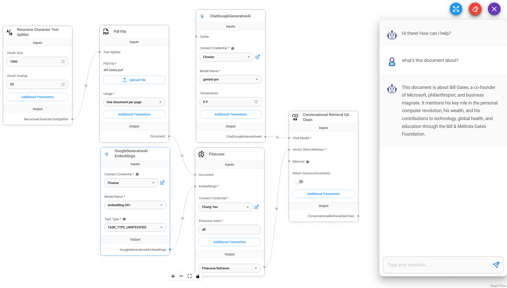

# 聊天谷歌生成人工智能

## 先决条件

1. 注册 [Google](https://accounts.google.com/InteractiveLogin) 帐户
2. 创建 [API 密钥](https://aistudio.google.com/app/apikey)

## 设置

1. **聊天模型** > 拖动 **ChatGoogleGenerativeAI** 节点

<figure><figcaption></figcaption></figure>

2. **连接凭据** > 单击 **新建**

<figure><figcaption></figcaption></figure>

3.填写**Google AI**凭据

<figure><figcaption></figcaption></figure>

4.瞧[🎉](https://emojipedia.org/party-popper/)，您现在可以在 Flowise 中使用 **ChatGoogleGenerativeAI 节点**

<figure><figcaption></figcaption></figure>

## 安全属性配置

1. 单击**附加参数**

<figure><figcaption></figcaption></figure>

* 配置**安全属性**时，**危害类别**和**危害块阈值**中的选择数量应相同。如果不是，它将抛出错误 `Harm Category & Harm Block Threshold are not the same length`

* 下面**安全属性**的组合将导致 `Dangerous` 设置为 `Low and Above` 且 `Harassment` 设置为 `Medium and Above`

<figure><figcaption></figcaption></figure>

## 资源

* [LangChain JS ChatGoogleGenerativeAI](https://js.langchain.com/docs/integrations/chat/google_generativeai)
* [Google AI for Developers](https://ai.google.dev/)
* [Gemini API 文档](https://ai.google.dev/docs)