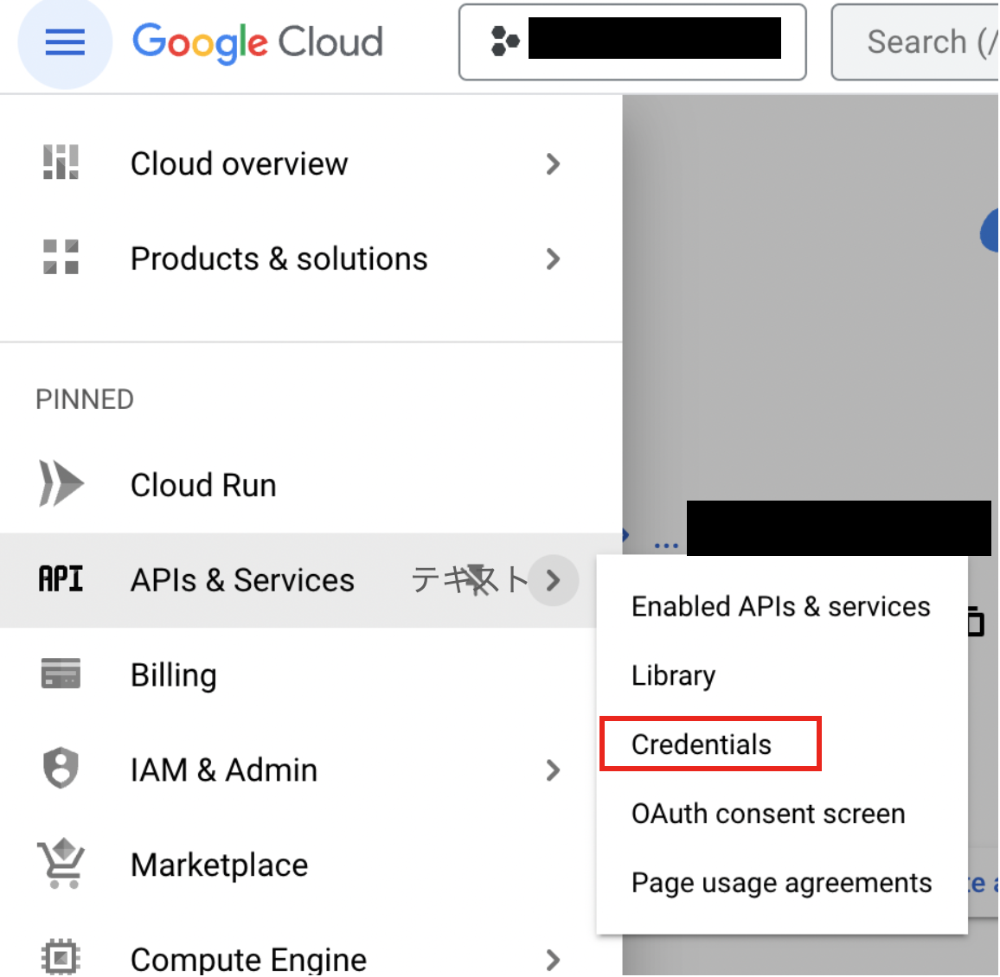
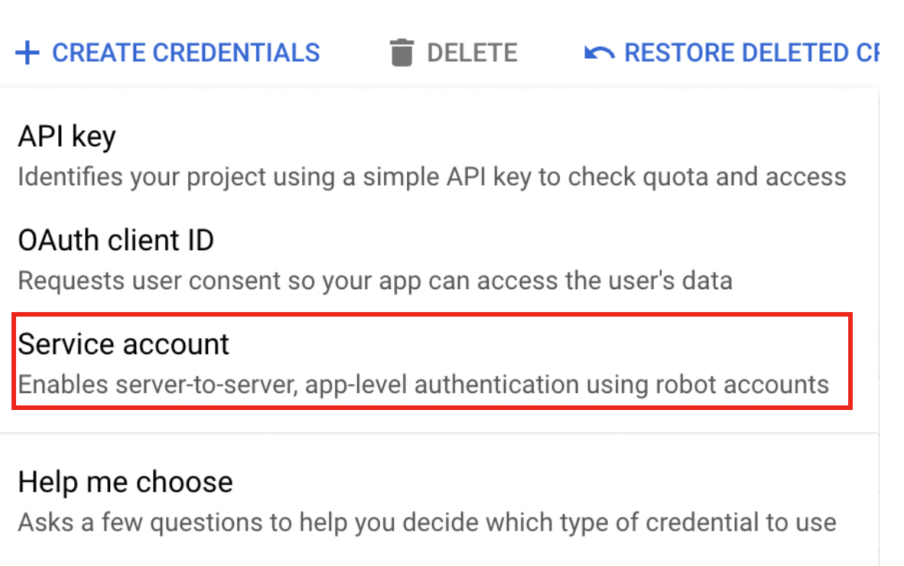
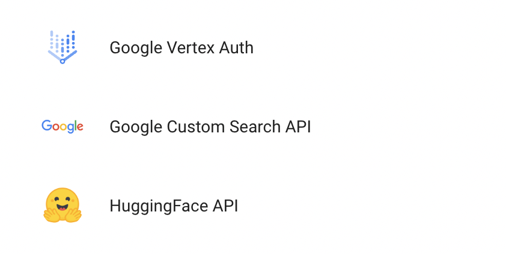

# 谷歌 VertexAI

## 先决条件

1. [启动您的 GCP](https://cloud.google.com/docs/get-started)
2. 安装 [Google Cloud CLI](https://cloud.google.com/sdk/docs/install-sdk)

## 设置

### 启用顶点AI API

1. 转到 GCP 上的 Vertex AI，然后单击 **"ENABLE ALL RECOMMENDED API"**

<figure><figcaption></figcaption></figure>

## 创建凭据文件_（可选）_

有两种方法创建凭据文件

### 第 1 条：使用 GCP CLI

1.打开终端并运行以下命令

```bash
gcloud auth application-default login
```

2. 登录您的 GCP 帐户
3. 检查您的凭据文件。您可以在 `~/.config/gcloud/application_default_credentials.json` 中找到您的凭据文件

### No. 2 : 使用 GCP 控制台

1. 进入GCP控制台并点击**“CREATE CREDENTIALS”**

<figure><figcaption></figcaption></figure>

2. 创建服务帐号

<figure><figcaption></figcaption></figure>

3. 填写服务帐户详细信息表格，然后单击 **"CREATE AND CONTINUE"**
4. 选择适当的角色（例如 Vertex AI User）并单击 **“DONE”**

<figure><figcaption></figcaption></figure>

5. 单击您创建的服务帐户，然后单击 **"ADD KEY" -> "创建新密钥"**

<figure><figcaption></figcaption></figure>

6. 选择 JSON 并点击 **"CREATE"** 然后您可以下载您的凭据文件

<figure><figcaption></figcaption></figure>

## 流畅

<figure><figcaption></figcaption></figure>

### 没有凭据文件

如果您使用的是 Cloud Run 等 GCP 服务，或者您已在本地计算机上安装了默认凭据，则无需设置此凭据。

### 使用凭据文件

1. 转到 Flowise 上的凭据页面，然后单击 **“添加凭据”**
2. 单击 Google Vertex 身份验证

<figure><figcaption></figcaption></figure>

3. 注册您的凭据文件。有两种方法可以注册您的凭据文件。

<figure><figcaption></figcaption></figure>

* **选项 1：输入凭据文件的路径**
  * 如果您的计算机上有凭据文件，您可以将凭据文件的路径输入到 `Google Application Credential File Path` 中
* **选项 2：粘贴凭据文件的文本**
  * 或者您可以复制凭据文件中的所有文本并将其粘贴到 `Google Credential JSON Object` 中

4. 最后，单击“添加”按钮。
5. **🎉**您现在可以通过 Flowise 中的凭据使用 ChatGoogleVertexAI！

### 资源

* [LangChain JS GoogleVertexAI](https://js.langchain.com/docs/api/llms_googlevertexai/classes/GoogleVertexAI)
* [Google 服务帐户概述](https://cloud.google.com/iam/docs/service-account-overview?)
* [尝试使用 Flowise 的 Google Vertex AI Palm 2：无需编码即可利用直觉](https://tech.beatrust.com/entry/2023/08/22/Try_Google_Vertex_AI_Palm_2_with_Flowise%3A_Without_Coding_to_Leverage_Intuition)
