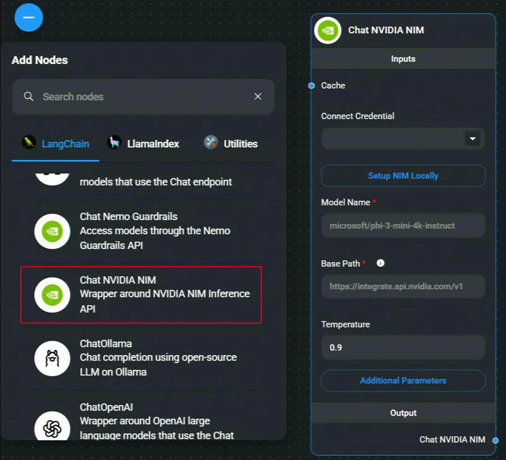
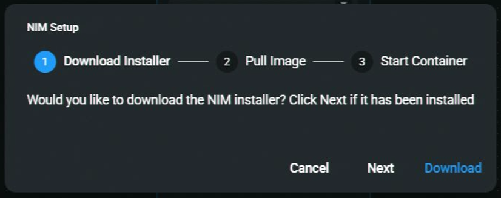
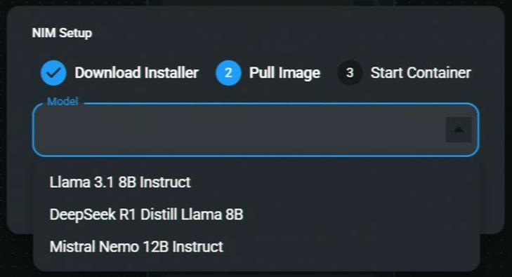
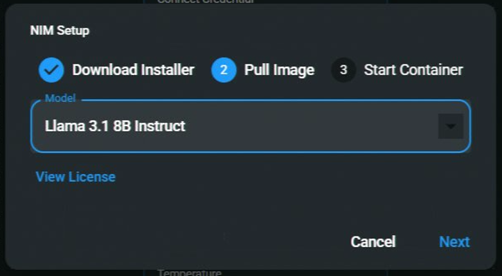
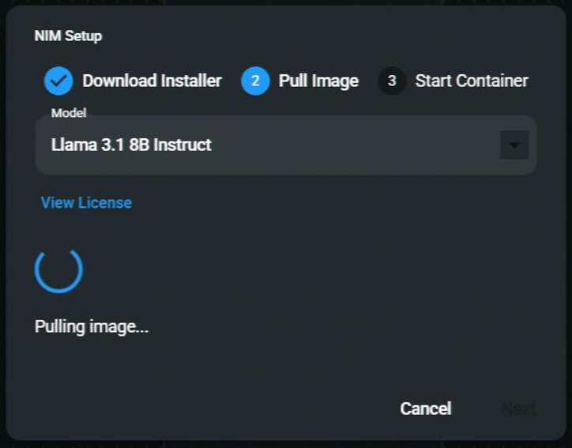
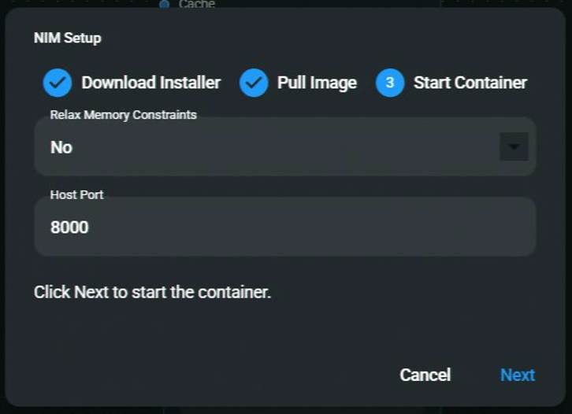
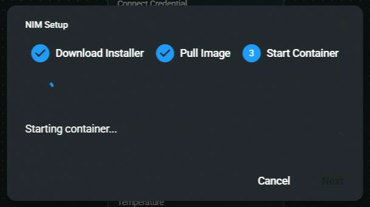
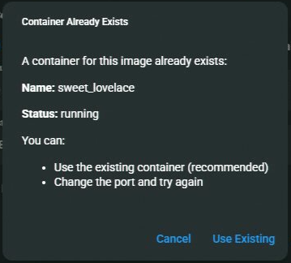
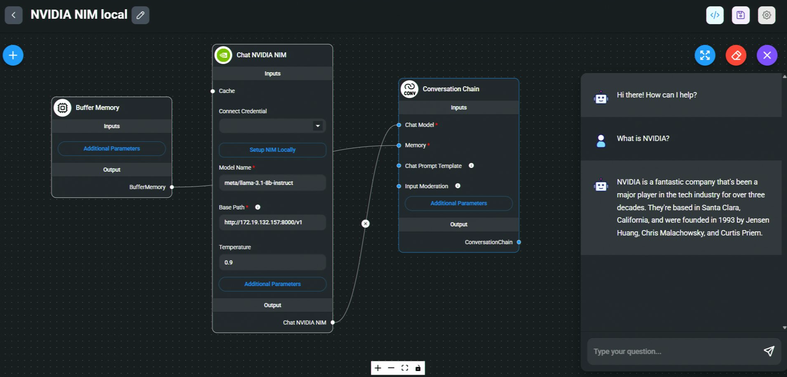

# NVIDIA NIM

## 本地

### 关于使用 Flowise 运行 NIM 的重要说明

如果现有的 NIM 实例已经在运行（例如，通过 NVIDIA 的 ChatRTX），通过 Flowise **不检查现有端点**启动另一个实例可能会导致冲突。当在同一个 NIM 上执行多个 `podman run` 命令时，会出现此问题，从而导致失败。

如需支持，请参阅：

- **[NVIDIA 开发者论坛](https://forums.developer.nvidia.com/)** – 有关技术问题和疑问。
- **[NVIDIA Developer Discord](https://discord.gg/nvidiadeveloper)** – 用于社区参与和[公告](https://discord.com/channels/1019361803752456192/1340013505834647572)。

### 先决条件

1. 使用 [通过 WSL2 在本地设置 NVIDIA NIM](https://docs.nvidia.com/nim/wsl2/1.0.0/getting-started.html)。

### 流动

1. **聊天模型** > 拖动 **聊天 NVIDIA NIM** 节点 > 单击 **本地设置 NIM**。

<figure><figcaption></figcaption></figure>

2. 如果已安装 NIM，请单击 **下一步**。否则，单击“**下载**”启动安装程序。

<figure><figcaption></figcaption></figure>

3. 选择要下载的模型图像。

<figure><figcaption></figcaption></figure>

4. 选择后，单击**下一步**继续下载。

<figure><figcaption></figcaption></figure>

5. **下载图像** – 持续时间取决于互联网速度。

<figure><figcaption></figcaption></figure>

6. 了解有关[放宽内存限制](https://docs.nvidia.com/nim/large-language-models/1.7.0/configuration.html#environment-variables)的详细信息。  
   **主机端口**是容器映射到本地计算机的端口。

<figure><figcaption></figcaption></figure>

7. **启动容器...**

<figure><figcaption></figcaption></figure>

_注意：如果您已经有一个使用所选模型运行的容器，Flowise 会询问您是否要重用正在运行的容器。您可以选择重用正在运行的容器或使用不同端口启动一个新容器。_

<figure><figcaption></figcaption></figure>

8. **保存聊天流**

9. [🎉](https://emojipedia.org/party-popper/) **瞧！** 您的 **聊天 NVIDIA NIM** 节点现在可以在 Flowise 中使用！

<figure><figcaption></figcaption></figure>

## 云

### 先决条件

1. 登录或注册 [NVIDIA](https://build.nvidia.com/)。
2. 从顶部导航栏中，单击 NIM：

<figure><figcaption></figcaption></figure>

3. 搜索您想要使用的型号。要在本地下载它，我们将使用 Docker：

<figure><figcaption></figcaption></figure>

4. 按照 Docker 设置中的说明进行操作。您必须首先获得 API 密钥才能拉取 Docker 映像：

<figure><figcaption></figcaption></figure>

### 流动

1. **聊天模型** > 拖动**聊天 NVIDIA NIM** 节点

<figure><figcaption></figcaption></figure>

2. 如果您使用 NVIDIA 托管端点，则必须拥有 API 密钥。 **连接凭据** > 单击 **新建。** 但是，如果您使用本地设置，则这是可选的。

<figure><figcaption></figcaption></figure> <figure><figcaption></figcaption></figure>

3. 输入型号名称，然后瞧[🎉](https://emojipedia.org/party-popper/)，您的 **聊天 NVIDIA NIM 节点**现在就可以在 Flowise 中使用了！

<figure><figcaption></figcaption></figure>

### 资源

- [NVIDIA LLM 使用入门](https://docs.nvidia.com/nim/large-language-models/latest/getting-started.html)
- [NVIDIA NIM](https://build.nvidia.com/microsoft/phi-3-mini-4k?snippet_tab=Docker)
