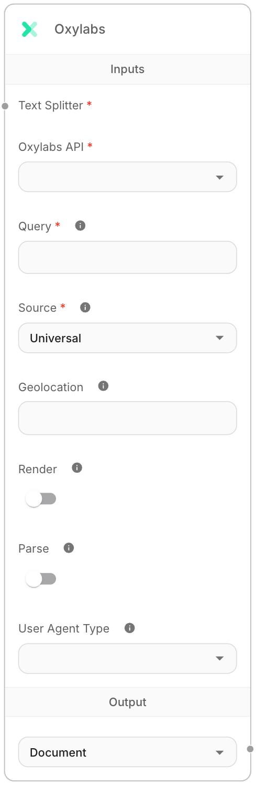

# Oxylabs 文档加载器

Oxylabs 是一项网络抓取服务，可大规模检索公共网络数据，并提供旨在克服区域限制的工具。

<figure><figcaption>
Oxylabs 文档加载器节点
</figcaption></figure>

### 特点
- 从 Google、Amazon 和任何其他网站检索数据
- 设置地理位置
- 利用浏览器渲染
- 解析数据
- 指定用户代理类型
- 使用文本分割器处理内容

### 必需参数
- **连接凭据**：Oxylabs API 凭据
- **查询**：搜索查询或 URL
- **来源**：可用来源之一：
  - 通用 - 抓取任何网站
  - Google 搜索 - 抓取 Google 搜索结果
  - 亚马逊产品 - 抓取亚马逊产品信息
  - 亚马逊搜索 - 抓取亚马逊搜索结果

### 可选参数
- **地理位置**：设置代理的地理位置以检索数据。有关更多详细信息，请参阅[文档](https://files.gitbook.com/v0/b/gitbook-x-prod.appspot.com/o/spaces%2FiwDdoZGfMbUe5cRL2417%2Fuploads%2FxoQb19qSyodB2D4no0DZ%2FList%20of%20supported%20geo_location%20values_sapi.json?alt=media&token=d2e2df7b-10ba-4399-a547-0c4a99e62293)。
- **渲染**：设置为 true 时启用 JavaScript 渲染。
- **解析**：设置为 true 时返回解析数据，只要提交的 URL 页面类型存在专用解析器。
- **用户代理类型**：设备类型和浏览器。

### 输出
- **Document**：包含元数据和页面内容的文档对象数组
- **文本**：来自文档页面内容的串联字符串

## 文档结构
每个文档包含：
- **pageContent**：提取的页面内容
