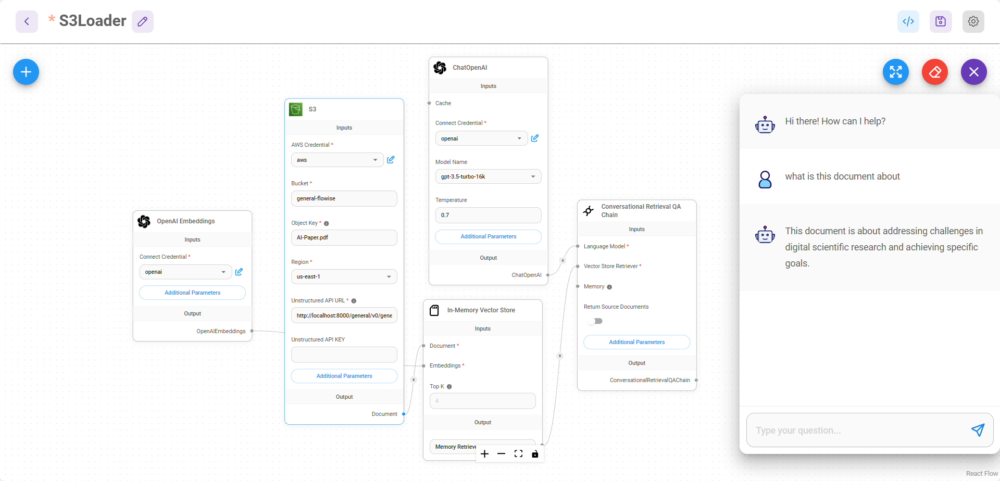

# S3 文件加载器

Amazon S3（简单存储服务）是一种对象存储服务，提供业界领先的可扩展性、数据可用性、安全性和性能。该模块提供了加载和处理存储在 S3 存储桶中的文件的全面功能。

该模块提供了一个复杂的 S3 文档加载器，可以：
- 使用 AWS 凭据从 S3 存储桶加载文件
- 支持多种文件格式（PDF、DOCX、CSV、Excel、PowerPoint、文本文件）
- 使用内置加载器或 Unstructed.io API 处理文件
- 处理文本和二进制文件
- 自定义元数据提取

## 输入

### 必需参数
- **Bucket**：S3 存储桶的名称
- **对象密钥**：S3存储桶中对象的唯一标识符
- **Region**：桶所在的AWS区域（默认：us-east-1）

### 处理选项
- **文件处理方法**：选择：
  - 内置加载器：使用本机文件格式处理器
  - 非结构化：使用 Unstructed.io API 进行高级处理
- **文本分割器**（可选）：用于内置处理的文本分割器
- **附加元数据**（可选）：带有附加元数据的 JSON 对象
- **省略元数据键**（可选）：要从元数据中省略的键

### 非结构化.io 选项
- **非结构化 API URL**：Unstructed.io API 的端点
- **非结构化 API KEY** （可选）：API 用于身份验证的密钥
- **策略**：处理策略（hi_res、fast、ocr_only、auto）
- **Encoding**：文本编码方式（默认：utf-8）
- **跳过推断表类型**：跳过表提取的文档类型

## 输出

- **Document**：包含元数据和页面内容的文档对象数组
- **文本**：来自文档页面内容的串联字符串

## 特点
- AWS S3 集成
- 多种文件格式支持
- 内置和非结构化.io 处理
- 可配置的 AWS 区域
- 灵活的元数据处理
- 二进制文件处理
- 临时文件管理
- MIME 类型检测

## 支持的文件类型
- PDF 文件
- Microsoft Word (DOCX)
- 微软Excel
- 微软PowerPoint
- CSV 文件
- 文本文件
- 以及更多来自 Unstructed.io 的信息

## 注释
- 需要 AWS 凭据（如果使用 IAM 角色，则可选）
- 某些文件类型可能需要特定的处理方法
- Unstructed.io API 需要单独的设置和凭据
- 自动创建和管理临时文件
- 对不支持的文件类型的错误处理

## 非结构化设置

您可以使用托管的 API 或通过 Docker 在本地运行。

* [托管 API](https://unstructured-io.github.io/unstructured/api.html)
* 码头工人：`docker run -p 8000:8000 -d --rm --name unstructured-api quay.io/unstructured-io/unstructured-api:latest --port 8000 --host 0.0.0.0`

## S3 文件加载器设置

1\.将 S3 文件加载器拖放到画布上：

<figure><figcaption></figcaption></figure>

2\. AWS 凭据：为您的 AWS 帐户创建新凭据。您将需要访问权限和密钥。请记住向关联帐户授予 s3 存储桶策略。您可以在[此处](https://docs.aws.amazon.com/AmazonRDS/latest/AuroraUserGuide/AuroraMySQL.Integrating.Authorizing.IAM.S3CreatePolicy.html)参阅政策指南。

<figure><figcaption></figcaption></figure>

3. Bucket：登录 AWS 控制台并导航到 S3。获取您的存储桶名称： 

<figure><figcaption></figcaption></figure>

4. Key：点击您想要使用的对象，并获取Key名称：

<figure><figcaption></figcaption></figure>

5. 非结构化 API URL：根据您使用非结构化的方式（无论是通过托管 API 还是通过 Docker），更改非结构化 API URL 参数。如果您使用托管 API，则还需要 API 密钥。
6. 然后，您可以开始与 S3 中的文件聊天。您不必指定文本分割器来对文档进行分块，因为这是由 Unstructed 自动处理的。

<figure><figcaption></figcaption></figure>

