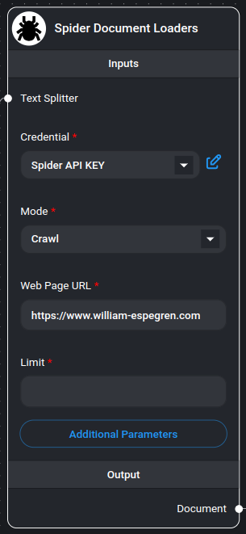
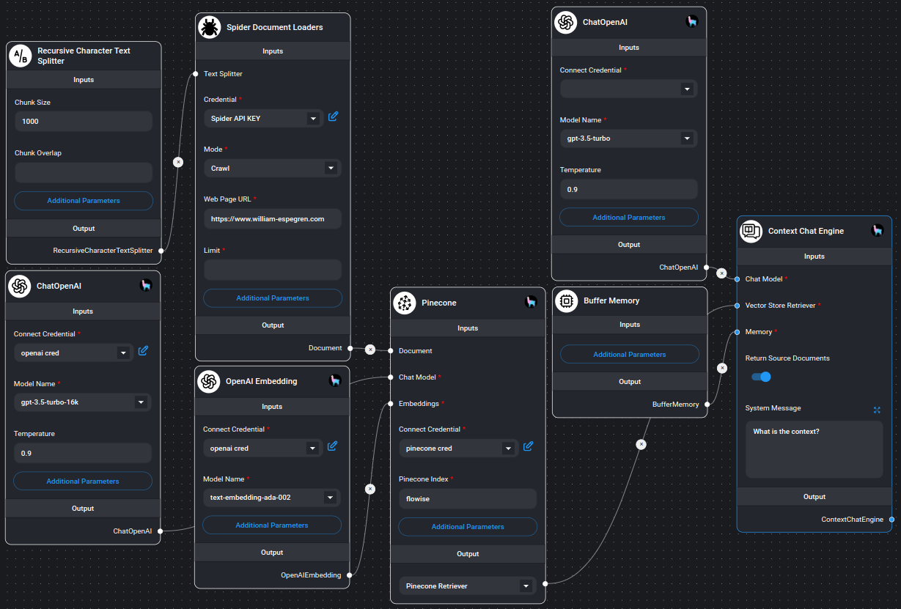

# 蜘蛛网抓取器/爬行器

<figure><figcaption><p>蜘蛛网爬虫/爬虫节点</p></figcaption></figure>

[Spider](https://spider.cloud/?ref=flowise) 是最快的开源网络抓取工具和爬行程序，可返回 LLM 就绪数据。要开始使用此节点，您需要来自 [Spider.cloud](https://spider.cloud/?ref=flowise) 的 API 密钥。

## 开始使用

1. 访问 [Spider.cloud](https://spider.cloud/?ref=flowise) 网站并注册免费帐户。
2. 然后转到 [API 密钥](https://spider.cloud/api-keys) 并创建新的 API 密钥。
3. 复制 API 密钥并将其粘贴到 Spider 节点的“Credential”字段中。

## 特点
- 两种操作模式：抓取和爬行
- 文本分割功能
- 可定制的元数据处理
- 灵活的参数配置
- 多种输出格式
- Markdown 格式的内容
- 速率限制处理

## 输入

### 必需参数
- **模式**：选择：
  - **Scrape**：从单个页面提取数据
  - **抓取**：从同一域内的多个页面提取数据
- **网页 URL**：要抓取或爬行的目标 URL（例如 https://spider.cloud）
- **凭据**：Spider API 密钥

### 可选参数
- **文本分割器**：处理提取内容的文本分割器
- **限制**：抓取的最大页面数（默认：25，仅适用于抓取模式）
- **附加元数据**：JSON 对象以及要添加到文档的附加元数据
- **其他参数**：JSON 对象，带有 [Spider API 参数](https://spider.cloud/docs/api)
  - 示例：`{ "anti_bot": true }`
  - 注意：`return_format` 始终设置为“markdown”
- **省略元数据键**：要排除的元数据键的逗号分隔列表
  - 格式：`key1, key2, key3.nestedKey1`
  - 使用 * 删除所有默认元数据

## 输出

- **文档**：文档对象数组，包含：
  - 元数据：页面元数据和自定义字段
  - pageContent：以markdown格式提取的内容
- **文本**：所有提取内容的串联字符串

## 文档结构
每个文档包含：
- **pageContent**：markdown格式的网页主要内容
- **元数据**：
  - 来源：页面的 URL
  - 其他自定义元数据（如果指定）
  - 过滤元数据（基于省略的键）

## 用法示例

### 基本抓取
```json
{
  "mode": "scrape",
  "url": "https://example.com",
  "limit": 1
}
```

### 高级爬行
```json
{
  "mode": "crawl",
  "url": "https://example.com",
  "limit": 25,
  "additional_metadata": {
    "category": "blog",
    "source_type": "web"
  },
  "params": {
    "anti_bot": true,
    "wait_for": ".content-loaded"
  }
}
```

## 示例

<figure><figcaption><p>使用Spider节点的示例</p></figcaption></figure>

## 注释
- 爬虫遵守爬行操作的指定限制
- 所有内容均以markdown格式返回
- 错误处理是针对抓取和爬行操作的内置错误处理
- 无效的 JSON 配置得到妥善处理
- 大型网站的内存高效处理
- 支持单页和多页提取
- 自动元数据处理和过滤
