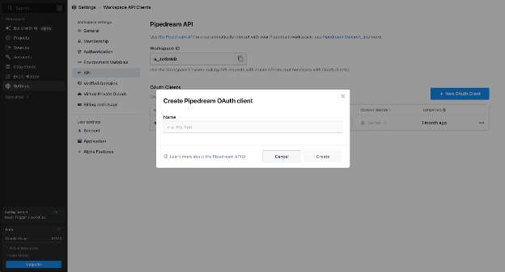
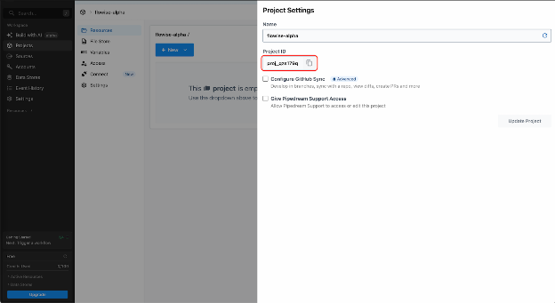
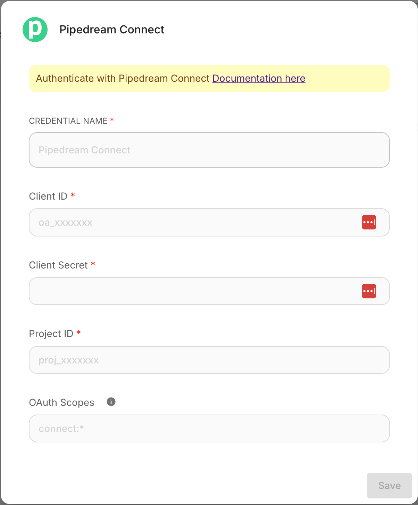
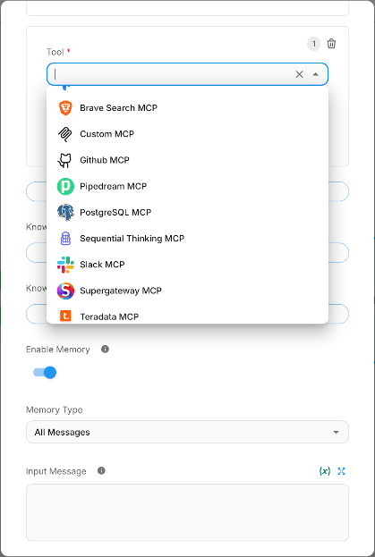
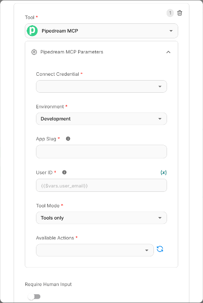
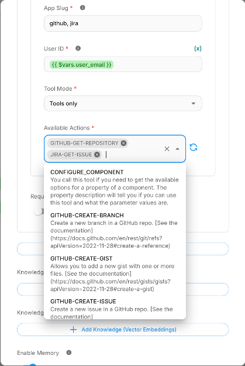
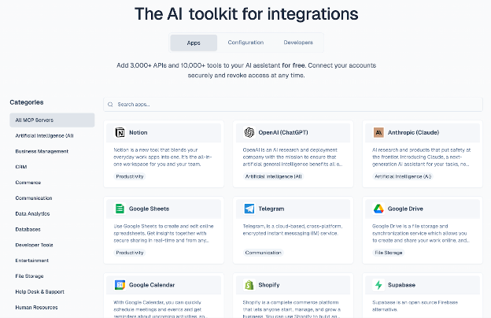
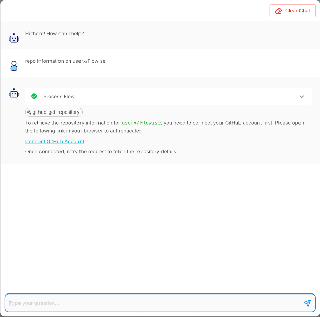
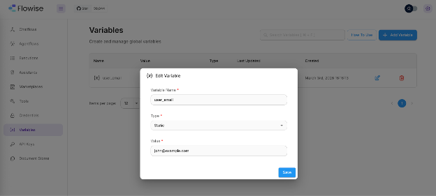

# 白日梦 MCP

**Pipedream MCP** 节点通过 [Pipedream Connect](https://pipedream.com/docs/connect/mcp/developers) 将您的 Flowise 代理连接到 3,000 多个 API 和 10,000 多个预构建工具。您的代理可以发送 Slack 消息、创建 GitHub 问题、更新 Google Sheets、管理 Notion 页面等等 - 所有这些都使用标准化的 MCP（模型上下文协议）接口和完全托管的 OAuth。

***

## 1.先决条件

在使用 Pipedream MCP 节点之前，您需要：

* **Pipedream 帐户**：在 [pipedream.com](https://pipedream.com) 上注册（免费套餐最多支持 1,000 个关联帐户）。
* **Pipedream Connect 项目**：通过 Pipedream 仪表板或 CLI (`pd init connect`) 创建一个项目。
* **OAuth 客户端**：在 Pipedream 工作区的 [API 设置](https://pipedream.com/settings/api) 内生成。这将为您提供 **客户端 ID** 和 **客户端密钥**。

***

## 2. 设置 Pipedream 凭据

### 2.1 在 Pipedream 中创建 OAuth 客户端

1. 转至 [pipedream.com/settings/api](https://pipedream.com/settings/api)。
2. 单击“**新建 OAuth 客户端**”。
3. 为您的客户端命名（例如 `Flowise Agent`），然后单击 **创建**。
4. **立即复制客户端密钥，**它不会再次显示。
5. 从列表中复制**客户端 ID**。

<figure><figcaption></figcaption></figure>

### 2.2 查找您的项目 ID

1. 从仪表板打开 Pipedream 项目。
2. 项目 ID 在项目设置中可见（格式：`proj_xxxxxxx`）。

<figure><figcaption></figcaption></figure>

### 2.3 在 Flowise 中添加凭据

1. 在 Flowise 中，从侧边栏导航至 **凭据**。
2. 单击“**添加凭据**”并搜索“**Pipedream Connect**”。
3. 填写以下字段：

|领域 |描述 |示例|
| ----------------- | --------------------------------------------------------------------------- | ------------- |
| **客户端ID** | Pipedream 中的 OAuth 客户端 ID | `wBSGhxxxx` |
| **客户秘密** | OAuth 客户端密钥（安全存储）| `••••••••` |
| **项目ID** |您的 Pipedream Connect 项目 ID | `proj_xyz789` |
| **OAuth 范围** | _（可选）_ 以空格分隔的范围。如果留空，则默认为 `connect:*`。 | `connect:*` |

4. 单击“**保存**”。

<figure><figcaption></figcaption></figure>

**提示词：** 对于生产环境，请使用您需要的最窄范围。请参阅[Pipedream 身份验证文档](https://pipedream.com/docs/connect/api-reference/authentication) 了解可用范围。

***

## 3. 添加 Pipedream MCP 节点

1. 在 Flowise 画布中打开智能体流程。
2. 添加**Agent**节点。
3. 从 **工具 (MCP)** 类别中，选择 **Pipedream MCP**。
4. 配置节点（参见下一节）。

<figure><figcaption></figcaption></figure>

***

## 4. 节点配置参考

|参数|类型 |必填|描述 |
| ---------------------- | ------------------------ | -------- | -------------------------------------------------------------------------------------------------------------------------------------------------------------------------------------------------------------------------------------------- |
| **连接凭据** |凭据选择器 |是的 |选择您在步骤 2 中创建的 Pipedream Connect 凭据。
| **环境** |下拉|是的 | `Development` 或 `Production`。控制您连接的帐户和工具调用运行的 Pipedream 环境。使用 `Development` 进行测试。                                                                                       |
| **应用程序段** |文字|是的 | Pipedream 应用程序的唯一标识符（例如 `slack`、`gmail`、`notion`、`linear`）。浏览 [mcp.pipedream.com](https://mcp.pipedream.com) 上的所有可用应用。通过逗号分隔支持**多个应用程序**（例如，`slack,notion`）。 |
| **用户ID** |文本（接受变量）|是的 |最终用户的唯一标识符。支持 Flowise 变量 `{{$vars.user_email}}` 和流变量 `{{$flow.sessionId}}`。请参阅[第 7 节](pipedream-mcp-user-guide.md#7-using-variables-for-user-id)。                               |
| **工具模式** |下拉|是的 |目前支持 `工具 only` 模式，该模式将应用程序的预构建操作作为单独的工具公开给代理。                                                                                                                            |
| **可用操作** |多选（异步）|是的 |填写应用程序 Slug 和用户 ID 后，单击 **刷新** 按钮加载指定应用程序的可用操作列表。选择您想要向代理公开的具体操作。                                            |

<figure><figcaption></figcaption></figure>

***

## 5. 选择操作

提供有效的 **App Slug** 和 **用户 ID** 后，单击 **可用操作** 旁边的刷新图标。该节点将连接到 Pipedream 的远程 MCP 服务器并检索指定应用程序的所有可用工具。

每个操作均列出：

* **名称：** 工具标识符（以大写形式显示），例如 `GITHUB-GET-REPOSITORY`
* **描述：** 该工具的作用，例如_“获取特定存储库的信息”_

仅选择您的代理需要的操作。更少的工具可以帮助 LLM 做出更好的决策并减少令牌使用。

<figure><figcaption></figcaption></figure>

### 查找应用程序 Slug

**app slug** 是 Pipedream 上 URL 中显示的小写名称。例如：

* `pipedream.com/apps/slack` → 段塞是 `slack`
* `pipedream.com/apps/google-sheets` → 段塞是 `google-sheets`
* `pipedream.com/apps/notion` → 段塞是 `notion`

请访问 [mcp.pipedream.com](https://mcp.pipedream.com) 或 [pipedream.com/explore](https://pipedream.com/explore) 浏览完整目录。

<figure><figcaption></figcaption></figure>

***

## 6. 账户连接流程

当代理为尚未连接该应用程序帐户的用户调用 Pipedream 工具时，Pipedream 会返回 **Connect URL**。 Pipedream MCP 节点会自动检测到这一点，并向用户提供连接 URL。连接 URL 打开 Pipedream 托管页面，用户在其中授权应用程序（例如，通过 OAuth 登录 Slack）。该链接仅限于特定用户，并在 4 小时后过期。

**要点：**

* 连接 URL 在聊天 UI 中呈现为可点击链接。
* 用户连接账户后，后续工具调用将正常执行。
* 用户凭据在 Pipedream 的服务器上静态加密，并且永远不会暴露给 LLM。

<figure><figcaption></figcaption></figure>

***

## 7. 使用变量作为用户 ID

**用户 ID** 字段标识 Pipedream Connect 中的最终用户。这对于每个用户连接自己帐户的多用户场景至关重要。

### 支持的变量类型

|变量语法 |来源 |解决于 |
| ---------------------- | --------------------------- | --------------------- |
| `{{$vars.user_email}}` | Flowise 工作区变量 |设计时 + 运行时 |
| `{{$flow.sessionId}}` |流程上下文（会话）|仅运行时 |

### 工作区变量

1. 在 Flowise 中，从侧边栏转到 **变量**。
2. 创建一个变量（例如，值为 `john@example.com` 的 `user_email`）。
3. 在 Pipedream MCP 节点中，将 **用户 ID** 设置为 `{{$vars.user_email}}`。

<figure><figcaption></figcaption></figure>

### 流变量

使用 `{{$flow.sessionId}}` 自动确定每个聊天会话的 Pipedream 帐户范围。当每个会话代表不同的用户时，这非常有用。

**重要提示词：** 像 `{{$flow.sessionId}}` 这样的流变量仅在运行时解析。在编辑器中单击“可用操作”上的“刷新”时，节点会使用后备预览用户 ID (`flowise_preview_user`)，以便操作列表仍然有效。

### 静态用户 ID

对于单用户或测试场景，您还可以输入纯字符串，例如 `test-user-1` 或 `admin@mycompany.com`。

**允许的字符：** 字母、数字、`.` `_` `@` `+` `-`（最多 250 个字符）。

***

## 8. 安全最佳实践

|实践|详情 |
| -------------------------------------- | --------------------------------------------------------------------------------------------------------------------- |
| **启用“需要人工输入”** |对于破坏性或写入操作（发送消息、删除数据），请在代理节点上启用人工批准。          |
| **使用狭窄的 OAuth 范围** |在您的 Pipedream 凭据中，仅指定您需要的范围。                                                       |
| **使用每用户 ID** |始终为每个最终用户使用唯一的用户 ID。这可确保 Pipedream 将凭据范围限定为单个用户。              |
| **在产品中使用生产环境** |部署时从 `Development` 切换到 `Production`。 Pipedream 为每个环境保留单独的凭据存储。 |
| **选择最少的操作** |仅公开您的代理需要的操作。更少的工具可以减少攻击面并提高 LLM 准确性。             |
| **保护您的客户秘密** |切勿在客户端代码或版本控制中暴露客户端密钥。 Flowise 将其加密存储。                   |

***

## 9. 外部参考

|资源 |链接 |
| ---------------------------------------- | -------------------------------------------------------------------------------------------------------------------------- |
| Pipedream MCP 开发人员文档 | [pipedream.com/docs/connect/mcp/developers](https://pipedream.com/docs/connect/mcp/developers) |
|浏览可用的 MCP 应用程序和工具 | [mcp.pipedream.com](https://mcp.pipedream.com) |
|探索 Pipedream Actions | [pipedream.com/explore](https://pipedream.com/explore) |
| Pipedream Connect 概述 | [pipedream.com/docs/connect/mcp](https://pipedream.com/docs/connect/mcp) |
| OAuth / 身份验证文档 | [pipedream.com/docs/connect/api-reference/authentication](https://pipedream.com/docs/connect/api-reference/authentication) |
|应用程序发现| [pipedream.com/docs/connect/app-discovery](https://pipedream.com/docs/connect/app-discovery) |
|连接快速入门 (CLI) | [pipedream.com/docs/connect/quickstart](https://pipedream.com/docs/connect/quickstart) |
| Pipedream 安全与隐私 | [pipedream.com/docs/privacy-and-security](https://pipedream.com/docs/privacy-and-security) |
| MCP 工具模式（子代理/完整配置）| [pipedream.com/docs/connect/mcp/tool-modes](https://pipedream.com/docs/connect/mcp/tool-modes) |
