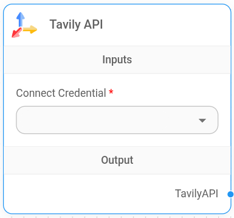
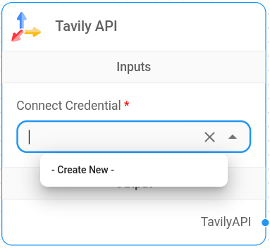
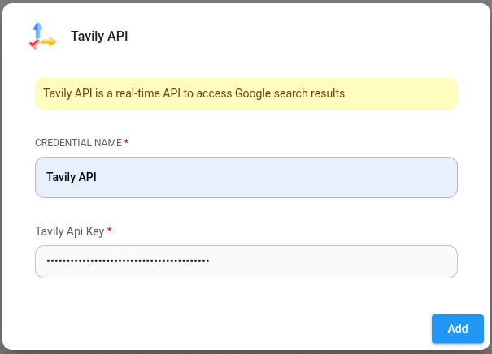

# 塔维利人工智能

<figure><figcaption>
塔维利节点
</figcaption></figure>

## 设置

1. 添加Tavily API 节点。单击添加节点按钮，**LangChain** > **工具** > **Tavily API**

2. 为 Tavily 创建凭据。请参阅[官方指南](https://docs.tavily.com/guides/quickstart)，了解如何获取 Tavily API 密钥。

<figure><figcaption></figcaption></figure>

<figure><figcaption></figcaption></figure>

3. 现在您可以将此节点连接到任何接受工具输入的节点以获取实时搜索结果。
