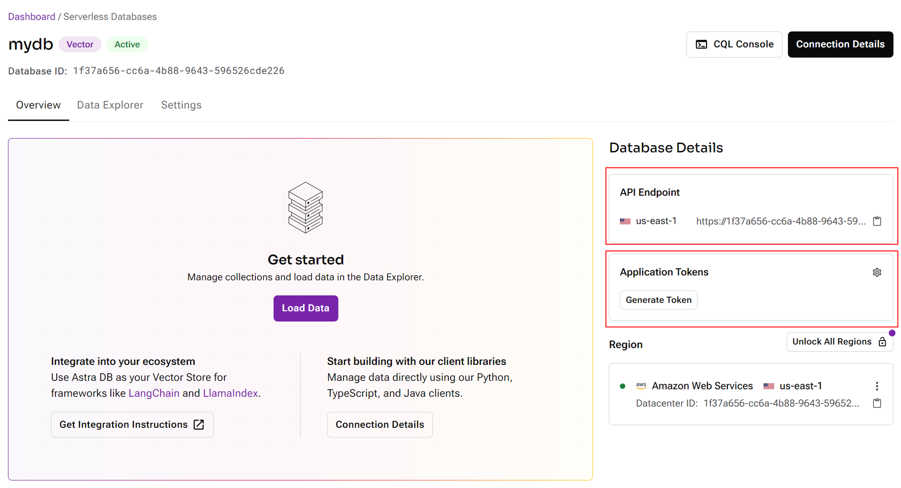

# 阿斯特拉数据库

## 设置

1. 在 [AstraDB](https://astra.datastax.com/) 上注册帐户
2. 登录门户。创建数据库

<figure><figcaption></figcaption></figure>

3.选择Serverless（Vector），填写Database name、Provider、Region

<figure><figcaption></figcaption></figure>

4. 数据库设置完毕后，获取 API 端点，并生成应用程序令牌

<figure><figcaption></figcaption></figure>

5. 创建一个新集合，选择所需的维度和相似度指标：

<figure><figcaption></figcaption></figure>

6. 返回 Flowise 画布，拖放 Astra 节点。从凭据下拉列表中单击 **新建**：

<figure><figcaption></figcaption></figure>

7. 指定 API 端点和应用程序令牌：

<figure><figcaption></figcaption></figure>

8.您现在可以将数据写入更新到 AstraDB

<figure><figcaption></figcaption></figure>

9. 导航回 Astra 门户，然后返回您的集合，您将能够看到已写入更新的所有数据：

<figure><figcaption></figcaption></figure>

10.开始查询！

<figure><figcaption></figcaption></figure>
