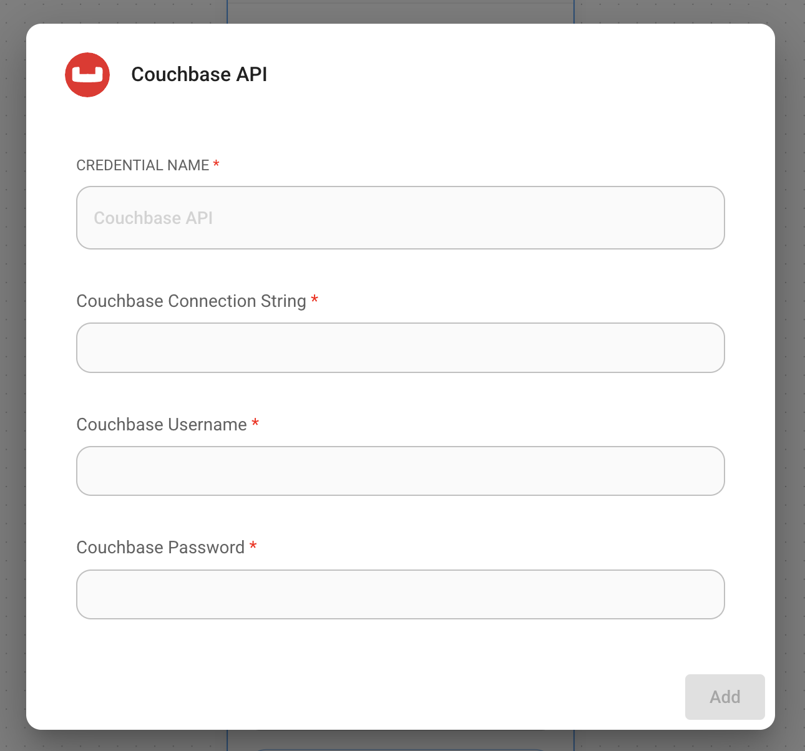

# 沙发底座

## 先决条件

### 要求

1. Couchbase 集群（自我管理或 Capella）版本 **7.6+**，带有 [搜索服务](https://docs.couchbase.com/server/current/search/search.html)。
2. Capella 设置：要了解有关连接到 Capella 集群的更多信息，请按照[说明](https://docs.couchbase.com/cloud/get-started/connect.html?_gl=1*1yhpmel*_gcl_au*MTMzNDE3NTQxLjE3MzY5MjA5MzQ.)操作。

    具体来说，您需要执行以下操作：

    * 创建[数据库凭据](https://docs.couchbase.com/cloud/clusters/manage-database-users.html?_gl=1*19zk7vq*_gcl_au*MTMzNDE3NTQxLjE3MzY5MjA5MzQ.)以访问集群。
    * [允许从运行应用程序的 IP 访问](https://docs.couchbase.com/cloud/clusters/allow-ip-address.html?_gl=1*19zk7vq*_gcl_au*MTMzNDE3NTQxLjE3MzY5MjA5MzQ.)集群。

    自我管理设置：

    * 按照[Couchbase 安装选项](https://developer.couchbase.com/tutorial-couchbase-installation-options) 安装最新的 Couchbase 数据库服务器实例。确保添加搜索服务。
3. 在 Couchbase 的全文服务上创建搜索索引。

### 导入搜索索引

#### [Couchbase 卡佩拉](\(https:/docs.couchbase.com/cloud/search/import-search-index.html)

请按照以下步骤在 Capella 中导入搜索索引：

* 将索引定义复制到名为 `index.json` 的新文件中。
* 按照文档中的说明将文件导入 Capella。
* 点击创建索引，完成索引创建。

#### [Couchbase 服务器](\(https:/docs.couchbase.com/server/current/search/import-search-index.html)

对于 Couchbase 服务器，请执行以下步骤：

* 导航至搜索 → 添加索引 → 导入。
* 将提供的索引定义复制到导入屏幕中。
* 点击创建索引，完成索引创建。

您还可以使用 [Couchbase Capella](https://docs.couchbase.com/cloud/vector-search/create-vector-search-index-ui.html?_gl=1*1rglcpj*_gcl_au*MTMzNDE3NTQxLjE3MzY5MjA5MzQ.) 和 [Couchbase 自管理服务器](https://docs.couchbase.com/server/current/vector-search/create-vector-search-index-ui.html?_gl=1*t7aeet*_gcl_au*MTMzNDE3NTQxLjE3MzY5MjA5MzQ.) 上的搜索 UI 创建矢量索引。

### 索引定义

在这里，我们在文档上创建索引 `vector-index`。矢量字段设置为 `embedding`，维度为 1536，文本字段设置为 `text`。我们还将文档中 `metadata` 下的所有字段作为动态映射进行索引和存储，以考虑不同的文档结构。相似性度量设置为 `dot_product`。如果这些参数发生变化，请相应调整索引。

```json
{
  "name": "vector-index",
  "type": "fulltext-index",
  "params": {
    "doc_config": {
      "docid_prefix_delim": "",
      "docid_regexp": "",
      "mode": "scope.collection.type_field",
      "type_field": "type"
    },
    "mapping": {
      "default_analyzer": "standard",
      "default_datetime_parser": "dateTimeOptional",
      "default_field": "_all",
      "default_mapping": {
        "dynamic": true,
        "enabled": false
      },
      "default_type": "_default",
      "docvalues_dynamic": false,
      "index_dynamic": true,
      "store_dynamic": false,
      "type_field": "_type",
      "types": {
        "_default._default": {
          "dynamic": true,
          "enabled": true,
          "properties": {
            "embedding": {
              "enabled": true,
              "dynamic": false,
              "fields": [
                {
                  "dims": 1536,
                  "index": true,
                  "name": "embedding",
                  "similarity": "dot_product",
                  "type": "vector",
                  "vector_index_optimized_for": "recall"
                }
              ]
            },
            "metadata": {
              "dynamic": true,
              "enabled": true
            },
            "text": {
              "enabled": true,
              "dynamic": false,
              "fields": [
                {
                  "index": true,
                  "name": "text",
                  "store": true,
                  "type": "text"
                }
              ]
            }
          }
        }
      }
    },
    "store": {
      "indexType": "scorch",
      "segmentVersion": 16
    }
  },
  "sourceType": "gocbcore",
  "sourceName": "pdf-chat",
  "sourceParams": {},
  "planParams": {
    "maxPartitionsPerPIndex": 64,
    "indexPartitions": 16,
    "numReplicas": 0
  }
}

```

## 设置

1. 在画布上添加一个新的 **Couchbase** 节点，并填写 Bucket Name、Scope Name、Collection Name 和 Index Name

<figure><figcaption></figcaption></figure>

2. 添加新凭据并填写参数：
   * Couchbase 连接字符串
   * 集群用户名
   * 集群密码

<figure><figcaption></figcaption></figure>

3. 将其他节点添加到画布并启动写入更新过程
   * **文档**可以与[**文档加载器**](../document-loaders/)类别下的任何节点连接
   * **嵌入**可以与 [**嵌入**](../embeddings/)category 下的任何节点连接

<figure><figcaption></figcaption></figure>

<figure><figcaption></figcaption></figure>

5. 从 Couchbase UI 验证数据是否已成功写入更新！

## 资源

* LangChain Couchbase 矢量存储集成
  * [Python](https://python.langchain.com/docs/integrations/vectorstores/couchbase/)
  * [NodeJS](https://js.langchain.com/docs/integrations/vectorstores/couchbase/)
* 请参阅[Couchbase 文档](https://docs.couchbase.com/home/index.html) 了解 Couchbase。
