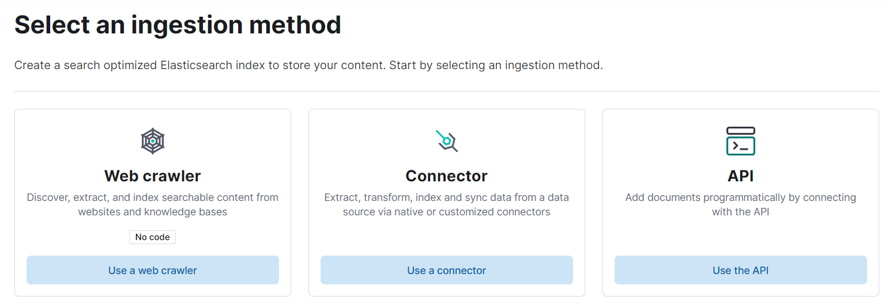
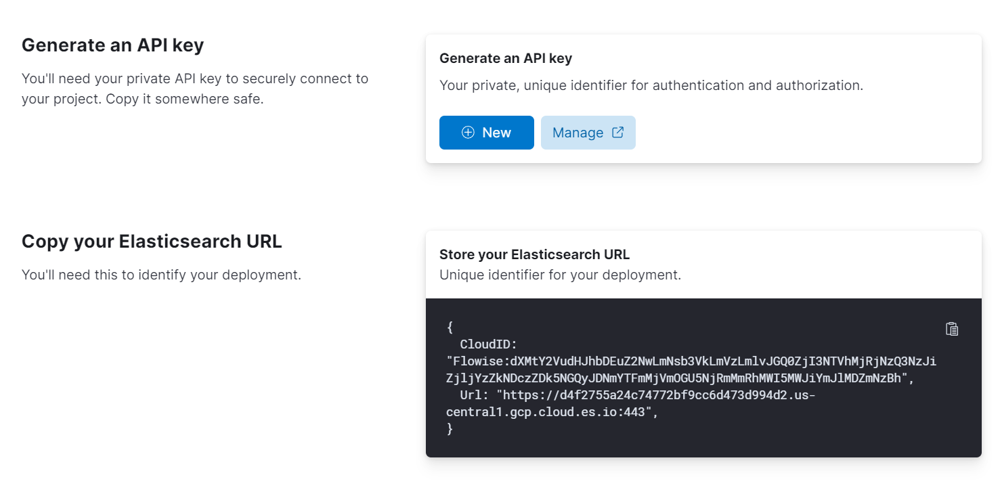
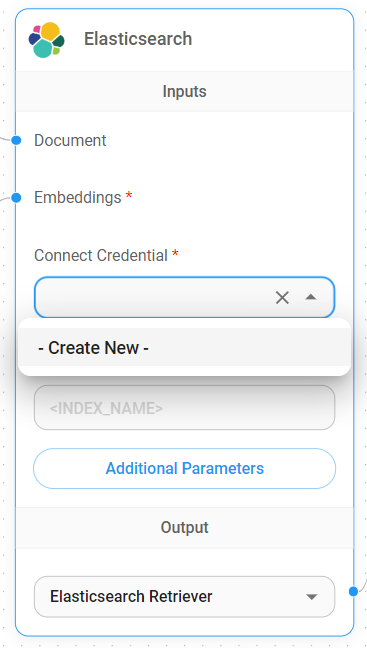
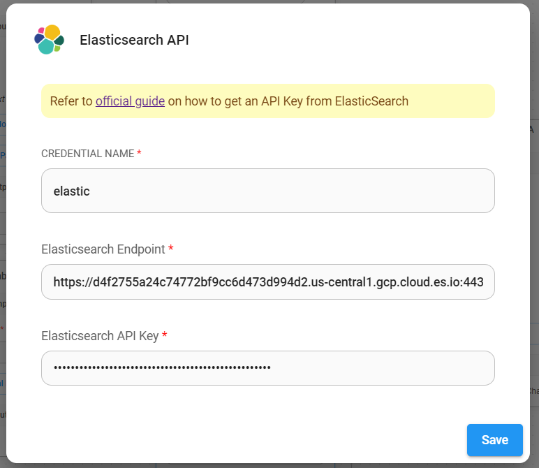
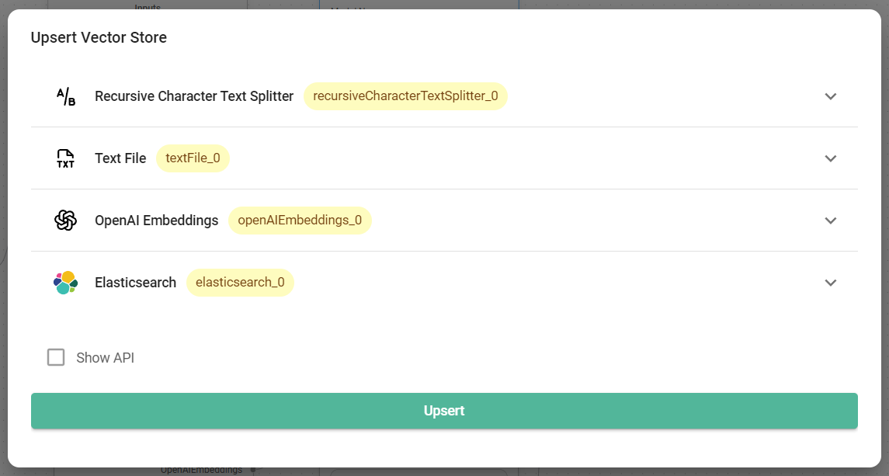

# 弹性

## 先决条件

1. 您可以使用[官方 Docker 映像](https://www.elastic.co/guide/en/elasticsearch/reference/current/docker.html)开始，也可以使用 [Elastic Cloud](https://www.elastic.co/cloud/)（Elastic 的官方云服务）。在本指南中，我们将使用云版本。
2. [注册](https://cloud.elastic.co/registration)一个帐户或使用 Elastic Cloud 上的现有帐户[登录](https://cloud.elastic.co/login)。

<figure><figcaption></figcaption></figure>

3. 单击**创建部署**。然后，为您的部署命名，并选择提供商。

<figure><figcaption></figcaption></figure>

4. 部署完成后，您应该能够看到如下所示的设置指南。单击“**设置矢量搜索**”选项。

<figure><figcaption></figcaption></figure>

5. 您现在应该看到 **矢量搜索** 的 **入门** 页面。

<figure><figcaption></figcaption></figure>

6. 在左侧栏上，单击“**索引**”。然后，**创建一个新索引**。

<figure><figcaption></figcaption></figure>

7. 选择 **API** 摄取方法

<figure><figcaption></figcaption></figure>

8. 命名您的搜索索引名称，然后**创建索引**

<figure><figcaption></figcaption></figure>

9. 创建索引后，生成新的 API 键，记下生成的 API 键和 URL

<figure><figcaption></figcaption></figure>

## 流畅设置

1.在画布上添加一个新的**Elasticsearch**节点并填写**索引名称**

<figure><figcaption></figcaption></figure>

2. 通过 **Elasticsearch API** 添加新凭据

<figure><figcaption></figcaption></figure>

3. 从 Elasticsearch 中获取 URL 和 API 键，填写字段

<figure><figcaption></figcaption></figure>

4.凭据创建成功后，就可以开始写入更新数据了

<figure><figcaption></figcaption></figure>

<figure><figcaption></figcaption></figure>

5. 数据成功插入后，您可以从 Elastic 仪表板进行验证：

<figure><figcaption></figcaption></figure>

6.瞧！您现在可以开始在聊天中提问

<figure><figcaption></figcaption></figure>

## 资源

* [LangChain JS Elastic](https://js.langchain.com/docs/integrations/vectorstores/elasticsearch)
* [矢量搜索 (kNN) 实施指南 - API 版本](https://www.elastic.co/search-labs/blog/articles/vector-search-implementation-guide-api-edition)
