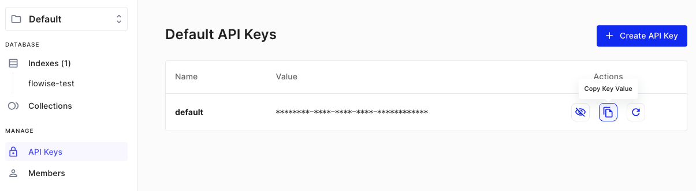
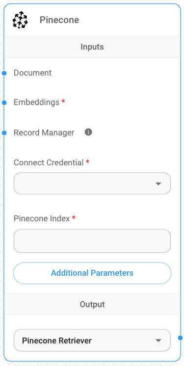
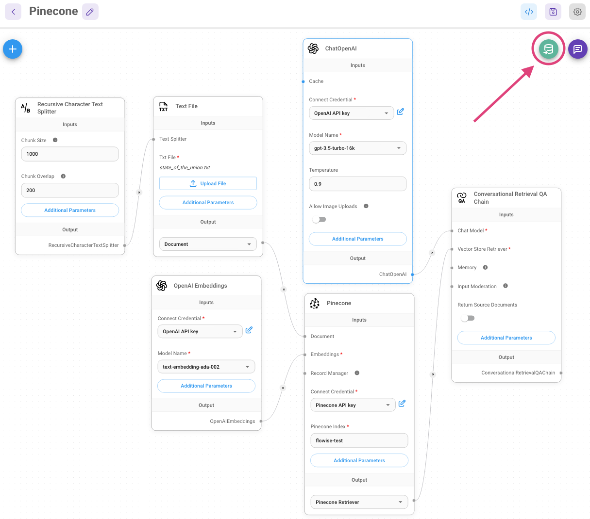
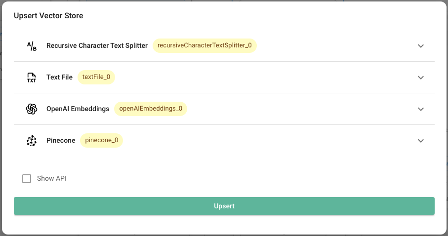
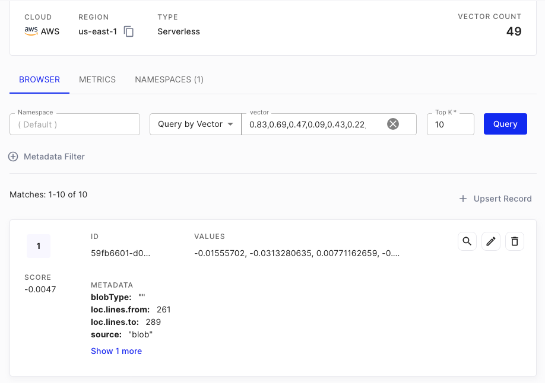

# 松果

## 先决条件

1. 注册 [Pinecone](https://app.pinecone.io/) 帐户
2. 点击**创建索引**

<figure><figcaption></figcaption></figure>

3. 填写必填字段：
   - **索引名称**，要创建的索引的名称。 （例如“流程测试”）
   - **维度**，要插入索引中的向量的大小。 （例如 1536）

<figure><figcaption></figcaption></figure>

4. 单击**创建索引**

## 设置

1. 获取/创建您的 **API 密钥**

<figure><figcaption></figcaption></figure>

2. 在画布上添加一个新的 **Pinecone** 节点并填写参数：
    - 松果指数
    - Pinecone 命名空间（可选）

<figure><figcaption></figcaption></figure>

3. 创建新的 Pinecone 凭据 -> 填写 **API 密钥**

<figure><figcaption></figcaption></figure>

4. 将其他节点添加到画布并启动写入更新过程
   - **文档**可以与[**文档加载器**](../document-loaders/)类别下的任何节点连接
   - **嵌入**可以与 [**嵌入**](../embeddings/)category 下的任何节点连接

<figure><figcaption></figcaption></figure>

<figure><figcaption></figcaption></figure>

5. 从[Pinecone 仪表板](https://app.pinecone.io) 进行验证，查看数据是否已成功写入更新：

<figure><figcaption></figcaption></figure>

6.

## 资源

- LangChain Pinecone矢量存储集成
  - [Python](https://python.langchain.com/v0.2/docs/integrations/providers/pinecone/)
  - [NodeJS](https://js.langchain.com/v0.2/docs/integrations/vectorstores/pinecone)
- [Pinecone LangChain 集成](https://docs.pinecone.io/integrations/langchain)
- [Pinecone Flowise 集成](https://docs.pinecone.io/integrations/flowise)
- [松果官方客户](https://docs.pinecone.io/reference/pinecone-clients)
