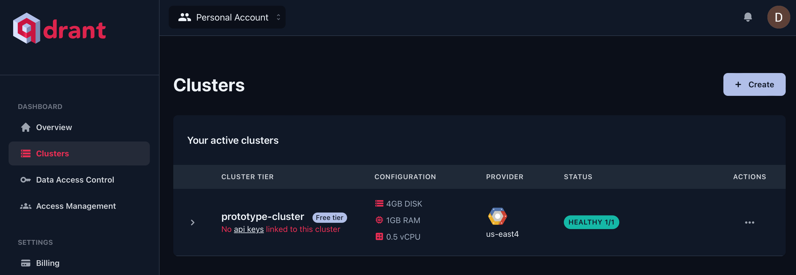
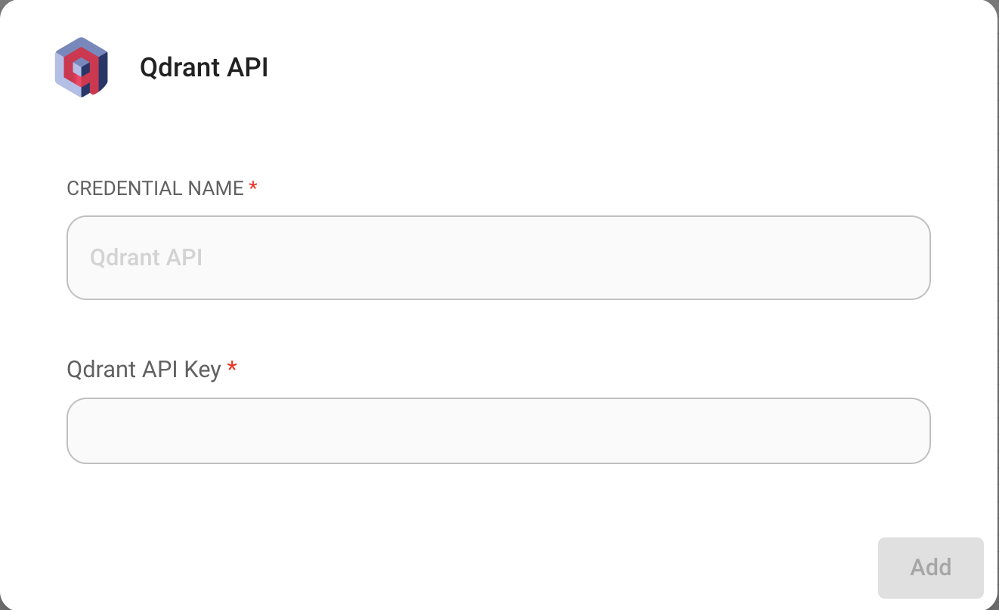

#Qdrant

## 先决条件

[本地运行的 Qdrant 实例](https://qdrant.tech/documentation/quick-start/) 或 Qdrant 云实例。

要获取 Qdrant 云实例：

1. 前往 [Cloud Dashboard](https://cloud.qdrant.io/overview) 的集群部分。
2. 选择**集群**，然后单击**+ 创建**。

<figure><figcaption></figcaption></figure>

3. 选择您的集群配置和区域。
4. 点击 **创建** 以配置您的集群。

## 设置

1. 从 [云控制面板](https://cloud.qdrant.io/overview) 的**数据访问控制**部分获取/创建您的 **API 密钥**。
2. 在画布上添加新的 **Qdrant** 节点。
3. 使用 API 密钥创建新的 Qdrant 凭据

<figure><figcaption></figcaption></figure>

4. 在 **Qdrant** 节点中输入所需信息：
   * Qdrant 服务器 URL
   * 收藏名称

<figure><figcaption></figcaption></figure>

5. **文档**输入可以与[**文档加载器**](../document-loaders/)类别下的任何节点连接。
6. **嵌入**输入可以与 [**嵌入**](../embeddings/) 类别下的任何节点连接。

## 过滤

假设您写入更新了不同的文档，每个文档都在元数据键 `{source}` 下指定了唯一值

<div align="left">

<figure><figcaption></figcaption></figure>

 

<figure><figcaption></figcaption></figure>

</div>

然后，您想通过它进行过滤。在过滤方面，Qdrant 支持以下[语法](https://qdrant.tech/documentation/concepts/filtering/#nested-key)：

**用户界面**

<figure><figcaption></figcaption></figure>

**API**

```json
"overrideConfig": {
    "qdrantFilter": {
        "should": [
            {
                "key": "metadata.source",
                "match": {
                    "value": "apple"
                }
            }
        ]
    }
}
```

## 资源

* [Qdrant 文档](https://qdrant.tech/documentation/)
* [LangChain JS Qdrant](https://js.langchain.com/docs/integrations/vectorstores/qdrant)
* [Qdrant 过滤器](https://qdrant.tech/documentation/concepts/filtering/#nested-key)
