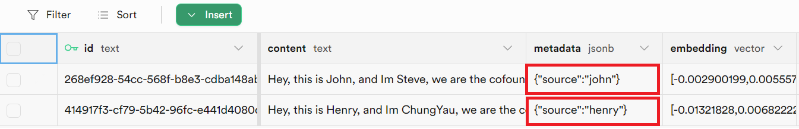

# 苏帕贝斯

## 先决条件

1. 注册 [Supabase](https://supabase.com/) 帐户
2. 单击**新建项目**

<figure><figcaption></figcaption></figure>

3. 输入必填字段

|字段名称 |描述 |
| ------------------------- | ------------------------------------------------- |
| **姓名** |要创建的项目的名称。 （例如 Flowise）|
| **数据库** **密码** | postgres 数据库的密码 |

<figure><figcaption></figcaption></figure>

4.点击**创建新项目**并等待项目完成设置
5. 单击 **SQL 编辑器**

<figure><figcaption></figcaption></figure>

6. 单击“**新查询**”

<figure><figcaption></figcaption></figure>

7. 复制并粘贴以下 SQL 查询并通过 `Ctrl + Enter` 运行它或单击 **RUN**。记下表名称和函数名称。

* **表名称**：`documents`
* **查询名称**：`match_documents`

```plsql
-- Enable the pgvector extension to work with embedding vectors
create extension vector;

-- Create a table to store your documents
create table documents (
  id bigserial primary key,
  content text, -- corresponds to Document.pageContent
  metadata jsonb, -- corresponds to Document.metadata
  embedding vector(1536) -- 1536 works for OpenAI embeddings, change if needed
);

-- Create a function to search for documents
create function match_documents (
  query_embedding vector(1536),
  match_count int DEFAULT null,
  filter jsonb DEFAULT '{}'
) returns table (
  id bigint,
  content text,
  metadata jsonb,
  similarity float
)
language plpgsql
as $$
#variable_conflict use_column
begin
  return query
  select
    id,
    content,
    metadata,
    1 - (documents.embedding <=> query_embedding) as similarity
  from documents
  where metadata @> filter
  order by documents.embedding <=> query_embedding
  limit match_count;
end;
$$;

```

在某些情况下，您可能会使用[记录管理器](../record-managers.md)来跟踪写入更新并防止重复。由于记录管理器为每个嵌入生成随机 UUID ，因此您必须将 id 列实体更改为文本：

```sql
-- Enable the pgvector extension to work with embedding vectors
create extension vector;

-- Create a table to store your documents
create table documents (
  id text primary key, -- CHANGE TO TEXT
  content text,
  metadata jsonb,
  embedding vector(1536)
);

-- Create a function to search for documents
create function match_documents (
  query_embedding vector(1536),
  match_count int DEFAULT null,
  filter jsonb DEFAULT '{}'
) returns table (
  id text, -- CHANGE TO TEXT
  content text,
  metadata jsonb,
  similarity float
)
language plpgsql
as $$
#variable_conflict use_column
begin
  return query
  select
    id,
    content,
    metadata,
    1 - (documents.embedding <=> query_embedding) as similarity
  from documents
  where metadata @> filter
  order by documents.embedding <=> query_embedding
  limit match_count;
end;
$$;

```

<figure><figcaption></figcaption></figure>

## 设置

1. 点击**项目设置**

<figure><figcaption></figcaption></figure>

2. 获取您的 **项目 URL 和 API 密钥**

<figure><figcaption></figcaption></figure>

3. 将每个详细信息（_API 密钥、URL、表名称、查询名称_）复制并粘贴到 **Supabase** 节点

<figure><figcaption></figcaption></figure>

4. **文档**可以与[**文档加载器**](../document-loaders/)类别下的任何节点连接
5. **嵌入**可以与[**嵌入**](../embeddings/)category下的任何节点连接

## 过滤

假设您写入更新了不同的文档，每个文档都在元数据键 `{source}` 下指定了唯一值

<figure><figcaption></figcaption></figure>

您可以使用元数据过滤来查询特定元数据：

**用户界面**

<figure><figcaption></figcaption></figure>

**API**

```json
"overrideConfig": {
    "supabaseMetadataFilter": {
        "source": "henry"
    }
}
```

## 资源

* [LangChain JS Supabase](https://js.langchain.com/docs/modules/indexes/vector_stores/integrations/supabase)
* [Supabase 博客文章](https://supabase.com/blog/openai-embeddings-postgres-vector)
* [元数据过滤](https://js.langchain.com/docs/integrations/vectorstores/supabase#metadata-filtering)
