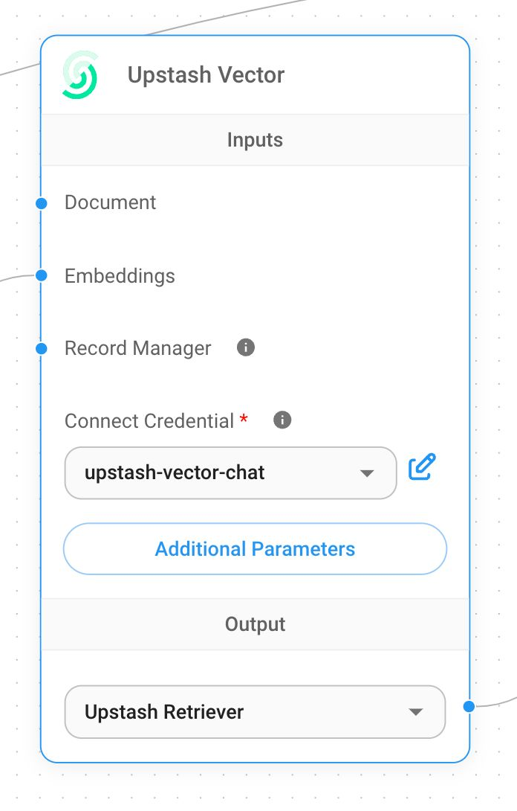

# Upstash 向量

## 先决条件

1. 注册或登录[Upstash Console](https://console.upstash.com)
2. 导航到向量页面并单击 **创建索引**

    <figure><figcaption></figcaption></figure>
3. 进行必要的配置并创建索引。

    1. **索引名称**，要创建的索引名称。 （例如“flowise-upstash-demo”）
    2. **维度**，要插入索引中的向量的大小。 （例如 1536）
    3. **嵌入模型**，要在 [Upstash Embeddings](https://upstash.com/docs/vector/features/embeddingmodels) 中使用的模型。这是可选的。如果启用它，则不需要提供嵌入模型。

    <figure><figcaption></figcaption></figure>

## 设置

1. 获取您的索引凭据

<figure><figcaption></figcaption></figure>

1.创建新的Upstash Vector凭据并填写
   1. 从控制台上的 UPSTASH\_VECTOR\_REST\_URL Upstash 矢量 REST URL
   2. 在控制台上从 UPSTASH\_VECTOR\_REST\_TOKEN Upstash Vector Rest 令牌

<figure><figcaption></figcaption></figure>

1. 添加一个新的 **Upstash Vector** 节点到画布

<figure><figcaption></figcaption></figure>

1. 将其他节点添加到画布并启动写入更新过程
   * **文档**可以与[**文档加载器**](../document-loaders/)类别下的任何节点连接
   * **嵌入**可以与 [**嵌入**](../embeddings/)category 下的任何节点连接

<figure><figcaption></figcaption></figure>

1. 从[Upstash 仪表板](https://console.upstash.com) 验证数据是否已成功更新：

<figure><figcaption></figcaption></figure>
