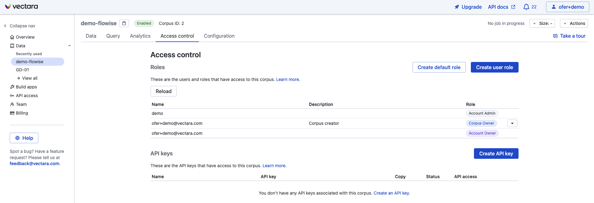
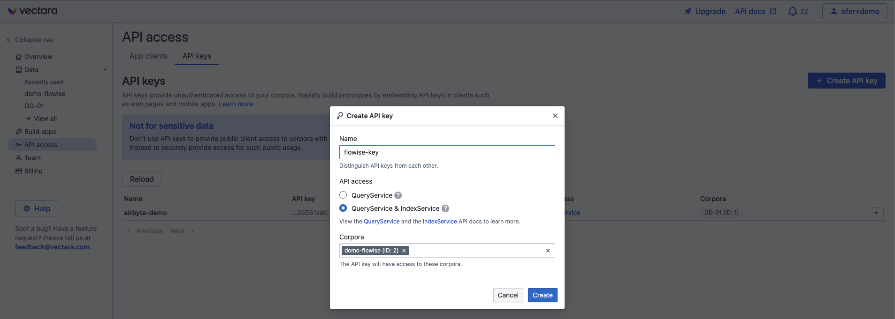
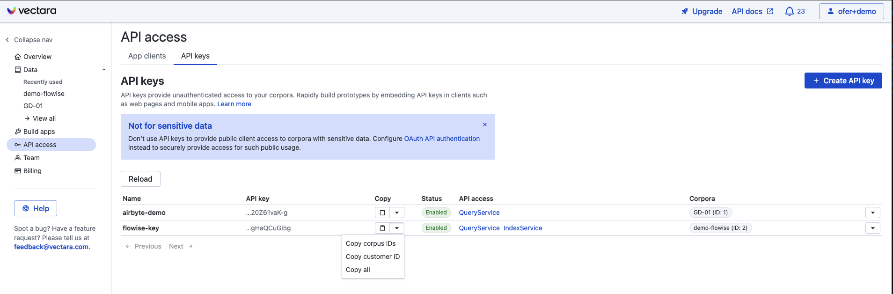
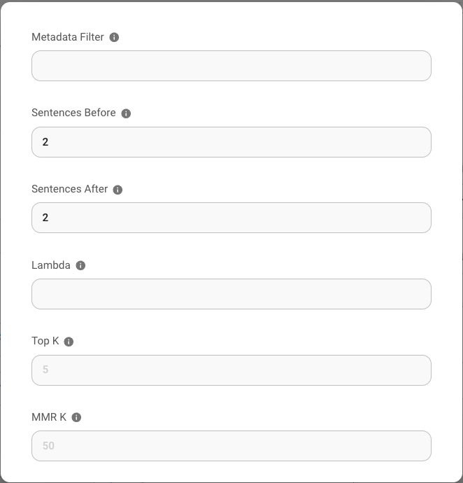

# 维克塔拉

## 快速入门教程



## 先决条件

1. 注册 [Vectara](https://vectara.com/integrations/flowise) 帐户
2.点击**创建语料库**

<figure><figcaption></figcaption></figure>

为要创建的语料库命名，点击**创建语料库**，然后等待语料库完成设置。

## 设置

1. 单击语料库视图中的**“访问控制”**选项卡

<figure><figcaption></figcaption></figure>

2. 单击 **“创建 API 密钥”** 按钮，为 API 密钥选择名称，然后选择 **QueryService 和 IndexService** 选项

<figure><figcaption></figcaption></figure>

3. 单击“**创建**”以创建 API 密钥
4. 通过单击新 API 密钥的“复制”下的向下箭头，获取您的 **Corpus ID、API 密钥和客户 ID**：

<figure><figcaption></figcaption></figure>

5. 返回 Flowise 画布，并创建您的聊天流。从凭据下拉列表中单击 **新建**，然后输入您的 Vectara 凭据。

<figure><figcaption></figcaption></figure>

6.享受吧！

## Vectara 查询参数

为了更好地控制 Vectara 查询参数，请单击“**其他参数**”，然后您可以更新以下参数的默认值：

* 元数据过滤器：Vectara 支持元数据过滤。要使用 [filtering](https://docs.vectara.com/docs/common-use-cases/filtering-by-metadata/filter-overview)，请确保您要作为筛选依据的元数据字段已在您的 Vectara 语料库中定义。
*“Sentences before”和“Sentences after”：这些控制匹配文本之前/之后有多少句子作为 Vectara 检索引擎的结果返回
* Lambda：定义 Vectara 中 [混合搜索](https://docs.vectara.com/docs/learn/hybrid-search) 的行为
* Top-K：Vectara查询返回多少条结果
* MMR-K：用于 [MMR](https://docs.vectara.com/docs/api-reference/search-apis/reranking#maximal-marginal-relevance-mmr-reranker) 的结果数（最大边际相关性）

<figure><figcaption></figcaption></figure>

## 资源

* [LangChain JS Vectara 博客文章](https://blog.langchain.dev/langchain-vectara-better-together/)
* [使用 Vectara 的 Langchain 集成博客文章的 5 个理由](https://vectara.com/5-reasons-to-use-vectaras-langchain-integration/)
* [Vectara 中的最大边际相关性](https://vectara.com/blog/get-diverse-results-and-comprehensive-summaries-with-vectaras-mmr-reranker/)
* [Vectara Boomerang 嵌入模型博客文章](https://vectara.com/introducing-boomerang-vectaras-new-and-improved-retrieval-model/)
* [使用 Vectara 的 HHEM](https://vectara.com/blog/cut-the-bull-detecting-hallucinations-in-large-language-models/) 检测幻觉
