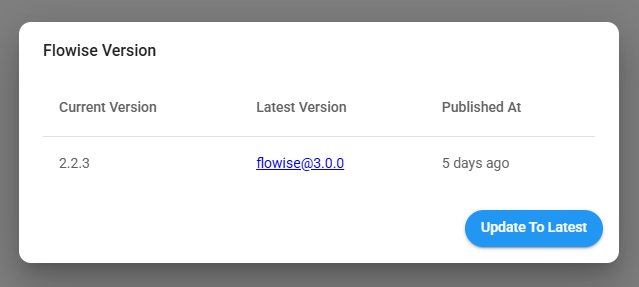

# 云迁移

本指南旨在帮助用户从Cloud V1迁移到V2。

在 Cloud V1 中，应用程序的 URL 看起来像 <mark style="color:blue;">**https://\<your-instance-name>.app.flowiseai.com**</mark>

在 Cloud V2 中，应用程序的 URL 是<mark style="color:blue;">**https://cloud.flowiseai.com**</mark>

为什么选择云V2？我们从头开始重写了云，速度提高了 5 倍，能够拥有多个工作区、组织成员，最重要的是，它通过 [生产就绪架构](../configuration/running-in-production.md) 实现高度可扩展。

1. 通过[https://flowiseai.com/auth/login](https://flowiseai.com/auth/login)登录Cloud V1
2. 在仪表板的右上角：

<figure><figcaption></figcaption></figure>

3. **选择版本，然后更新到最新版本。**

<figure><figcaption></figcaption></figure>

4. 选择导出，选择您要导出的数据：

<figure><figcaption></figcaption></figure>

5. 保存导出的 JSON 文件。
6. 导航到云 V2 [https://cloud.flowiseai.com](https://cloud.flowiseai.com/)
7. Cloud V2 帐户不会与您在 Cloud V1 中的现有帐户同步，您必须重新注册或使用 Google/Github 登录。

<figure><figcaption></figcaption></figure>

8. 登录后，从仪表板右上角单击“导入”并上传导出的 JSON 文件。

<figure><figcaption></figcaption></figure>

9. 默认情况下，新用户使用 **免费计划**，限制为 2 个流程和助理（每个流程）。如果导出的数据超过此数量，则导入导出的 JSON 文件将引发错误。这就是我们给予的原因 <mark style="color:orange;">**FIRST MONTH FREE**</mark> **入门计划**，拥有无限流量和助手！

<figure><figcaption></figcaption></figure>

10. 单击 **开始** 按钮，然后添加您的首选付款方式：

<figure><figcaption></figcaption></figure>

<figure><figcaption></figcaption></figure>

11. 添加付款方式后，导航回 Flowise，在所选计划上单击开始并确认更改：

<figure><figcaption></figcaption></figure>

12.如果一切顺利，你应该是Starter Plan，无限流量和无限助手！万岁：tada：如果之前由于免费计划限制而失败，请尝试再次导入 JSON 文件。


导出数据中的所有 ID 保持不变，因此您不必担心更新 API 的 ID，您只需更新 URL 例如 [https://cloud.flowiseai.com/api/v1/prediction/69fb1055-ghj324-ghj-0a4ytrerf](https://cloud.flowiseai.com/api/v1/prediction/69fb1055-ghj324-ghj-0a4ytrerf)



不导出凭据。您必须创建新的凭据并在流程和助手中使用这些凭据。


13. 确认一切正常后，您现在可以取消 Cloud V1 订阅。
14. 在左侧面板中，单击帐户设置，滚动到底部，您将看到**取消先前的订阅**：

<figure><figcaption></figcaption></figure>

15. 输入您之前用于注册 Cloud V1 的电子邮件，然后点击 **发送说明**。
16. 然后您将收到一封电子邮件以取消您之前的订阅：

<figure><figcaption></figcaption></figure>

17. 单击 **管理订阅** 按钮将带您进入一个门户，您可以在其中取消 Cloud V1 订阅。您的 Cloud V1 应用程序将在下一个计费周期关闭。

<figure><figcaption></figcaption></figure>

对于迁移过程中给您带来的任何不便，我们深表歉意。如果我们愿意提供任何帮助，请随时通过 support@flowiseai.com 与我们联系。
