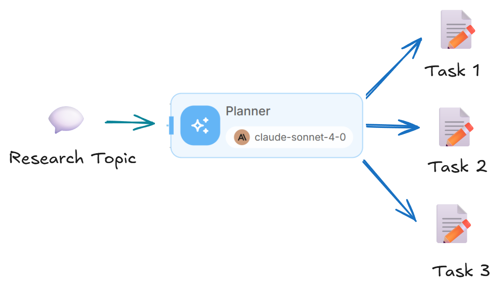
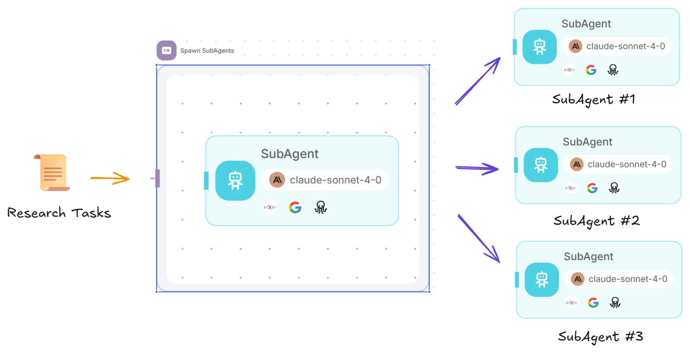
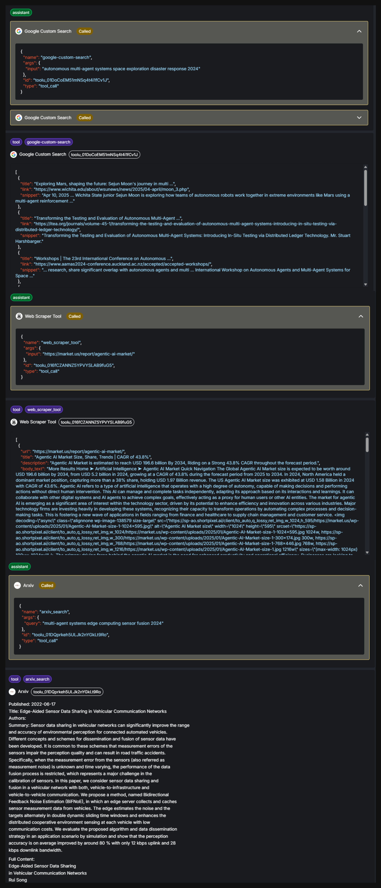
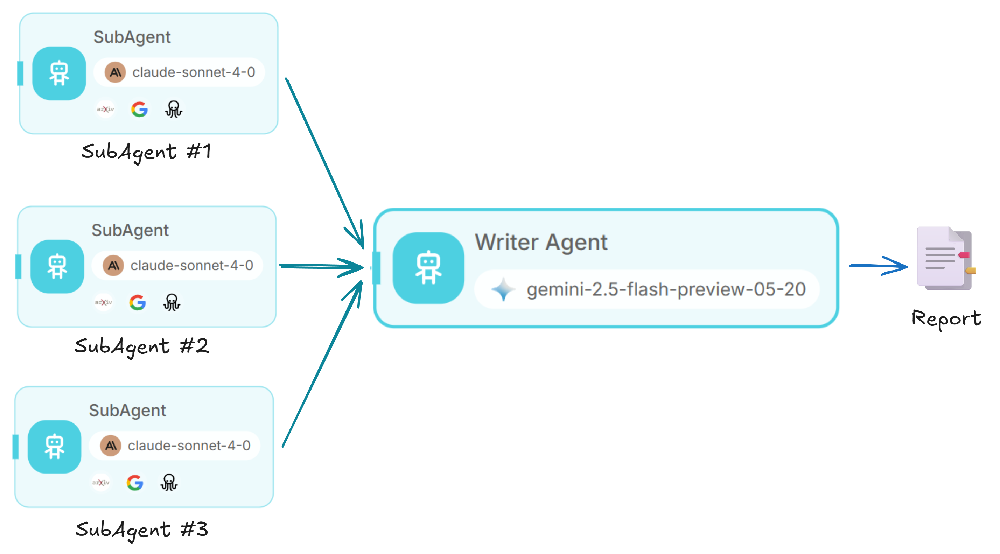
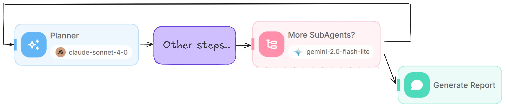

# 深入研究

深度研究代理是一个复杂的多智能体系统，可以通过将复杂的查询分解为可管理的任务、部署专门的研究代理以及将研究结果合成为详细的报告来对任何主题进行全面的研究。

这种方法的灵感来自 Anthropic 的博客 - [我们如何构建多主体研究系统](https://www.anthropic.com/engineering/built-multi-agent-research-system)

## 概述

深度研究代理工作流程由几个协同工作的关键组件组成：

1. **Planner Agent**：分析研究查询并生成专门研究任务的列表
2. **迭代**：创建多个研究代理来处理查询的不同方面
3. **研究子代理**：使用网络搜索和其他工具进行重点研究的个人代理
4. **作家代理**：将所有调查结果综合成一份连贯、全面的报告
5. **条件代理**：确定是否需要额外的研究或者研究结果是否足够
6. **循环**：循环回到Planner Agent以提高研究质量

<figure><figcaption></figcaption></figure>

### 步骤1：创建起始节点

<figure><figcaption></figcaption></figure>

1. 首先向画布添加 **Start** 节点
2. 使用**表单输入**配置开始节点以收集用户的研究查询
3. 使用以下配置设置表单：
   * **表格标题**：“研究”
   * **表单描述**：“接受查询并返回详细报告的研究代理”
   * **表单输入类型**：添加带有标签“Query”和变量名称“query”的字符串输入
4. 使用两个关键变量初始化 Flow State：
   * `subagents`：存储子代理要执行的研究任务列表
   * `findings`: 积累研究成果

<figure><figcaption></figcaption></figure>

### 第 2 步：添加 Planner 代理

<figure><figcaption></figcaption></figure>

1. 将 **LLM** 节点连接到 Start 节点。
2、建立专家研究带头人制度提示词，主要职责如下：
   * 分析并分解用户查询
   * 制定详细的研究计划
   * 为子代理生成特定任务
   * 示例提示词 - [research\_lead\_agent.md](https://github.com/anthropics/anthropic-cookbook/blob/main/patterns/agents/prompts/research_lead_agent.md)

<figure><figcaption></figcaption></figure>

3. 配置 **JSON 结构化输出** 以返回子代理任务列表：

```json
{
  "task": {
    "type": "string", 
    "description": "The research task for subagent"
  }
}
```

4. 通过存储生成的子代理列表来更新流状态

<figure><figcaption></figcaption></figure>

### 步骤 3：创建子代理迭代块

<figure><figcaption></figcaption></figure>

1. 添加**迭代**节点。
2. 将其连接到 Planner 输出
3. 将迭代输入配置为流状态：`{{ $flow.state.subagents }}`。对于数组中的每个项目，将生成一个子代理来执行研究任务。示例：

<figure><figcaption></figcaption></figure>

```json
{
  "subagents": [
    {
      "task": "Research the current state and recent developments in autonomous multi-agent systems technology. Focus on defining what autonomous multi-agent systems are, key technical components (coordination algorithms, communication protocols, decision-making frameworks), major technological advances in the last 2-3 years, and leading research institutions/companies working in this space. Use web search to find recent academic papers, industry reports, and technical documentation. Prioritize sources from IEEE, ACM, Nature, Science, and major tech companies' research divisions. Compile findings into a comprehensive technical overview covering definitions, core technologies, recent breakthroughs, and key players in the field."
    },
    {
      "task": "Investigate real-world applications and deployments of autonomous multi-agent systems across different industries. Research specific use cases in robotics (swarm robotics, warehouse automation), transportation (autonomous vehicle fleets, traffic management), manufacturing (coordinated production systems), defense/military applications, smart cities, and any other domains where these systems are actively deployed. For each application area, identify specific companies, products, success stories, and quantitative results where available. Focus on practical implementations rather than theoretical research. Use web search to find case studies, company announcements, industry reports, and news articles about actual deployments."
    }
  ]
}  
```

### 步骤 4：构建研究子代理

1. 在迭代块内，添加 **Agent** 节点。
2. 配置系统提示词符以充当重点研究子代理：
   * 清晰的任务理解能力
   * 高效的研究规划（每个任务 2-5 个工具调用）
   * 源码质量评估
   * 并行工具使用以提高效率
   * 示例提示词 - [research\_subagent.md](https://github.com/anthropics/anthropic-cookbook/blob/main/patterns/agents/prompts/research_subagent.md)

<figure><figcaption></figcaption></figure>

3.添加以下研究工具，您可以使用自己喜欢的工具：
   * **Google 搜索**：用于网络搜索链接
   * **Web Scraper**：用于提取网页内容。这将从 Google 搜索中抓取链接的内容。
   * **ArXiv Search**：用于搜索和加载学术论文内容

<figure><figcaption></figcaption></figure>

4.设置用户消息传递当前迭代任务：`{{ $iteration.task }}`

### 步骤 5：添加写入代理

<figure><figcaption></figcaption></figure>

1. 迭代完成后连接 **LLM** 节点。
2. 需要更大的上下文 LLM （如 Gemini，具有 1-2 百万上下文大小）来综合所有发现并生成报告。
3. 设置系统提示词以充当专家研究撰稿人：
* 保留研究结果的完整背景
   * 保持引用的完整性
   * 增加结构和清晰度
   * 输出专业的Markdown报告
4. 配置用户消息以包括：
   * 研究主题：`{{ $form.query }}`
   * 现有发现：`{{ $flow.state.findings }}`
   * 新发现：`{{ iterationAgentflow_0 }}`

<figure><figcaption></figcaption></figure>

4. 使用写入代理的输出更新 `{{ $flow.state.findings }}`。

<figure><figcaption></figcaption></figure>

### 第 6 步：实施条件检查

<figure><figcaption></figcaption></figure>

1. 添加**条件代理。**
2. 设置条件逻辑以确定是否需要进行额外研究
3. 配置两种场景：
   *“需要更多的子代理”
   *“调查结果足够”
4. 提供输入上下文，包括：
   * 研究课题
   * 目前的子代理商列表
   * 累积的调查结果

<figure><figcaption></figcaption></figure>

### 步骤 7：创建循环机制

1. 对于 **“需要更多子代理”** 路径，添加 **Loop** 节点
2.配置环回Planner节点
3.设置最大循环次数为5，防止无限循环
4. Planner Agent 将查看当前报告，并生成额外的研究任务。

<figure><figcaption></figcaption></figure>

### 步骤 8：添加最终输出

1. 对于“**发现足够**”路径，添加**直接回复**
2. 配置其输出最终报告：`{{ $flow.state.findings }}`

<figure><figcaption></figcaption></figure>

<figure><figcaption></figcaption></figure>

## 测试流程

1. 从一个简单的主题开始，例如“现实环境中的自治多智能体系统”
2. 观察规划者如何将研究分解为重点任务
3. 监控子代理进行并行研究
4. 审查作家代理的调查结果综合
5. 注意条件代理是否要求额外研究

<figure><figcaption></figcaption></figure>

**生成的报告：**



## 完整的流程结构



## 演练

1. 🧠 Planner Agent - 分析研究查询并生成专门研究任务的列表
2. 🖧 子代理 - 创建多个研究子代理，使用网络搜索、网络抓取和 arxiv 工具进行重点研究
3. ✍️ 作家代理 - 将所有发现综合成一份连贯、全面的报告并附有引文
4. ⇄ 条件代理 - 确定是否需要额外的研究或者研究结果是否足够
5. 🔄 循环回到Planner Agent以生成更多子agent

### 🧠 规划代理

作为专家研究导致：

* 分析并分解用户查询
* 制定详细的研究计划
* 为子代理生成特定任务

输出一系列研究任务。

<figure><figcaption></figcaption></figure>

### 🖧 子代理

对于任务列表中的每项任务，都会生成一个新的子代理来进行重点研究。

每个子代理有：

* 清晰的任务理解能力
* 高效的研究规划（每个任务 2-5 个工具调用）
* 源码质量评估
* 并行工具使用以提高效率

<figure><figcaption></figcaption></figure>

Subagent 可以访问网络搜索、网络抓取和 arxiv 工具。

* 🌐 Google 搜索 - 用于网络搜索链接
* 🗂️ Web Scraper - 用于提取网页内容。这将从 Google 搜索中抓取链接的内容。
* 📑 ArXiv - 搜索、下载和阅读 arXiv 论文内容

<figure><figcaption></figcaption></figure>

### ✍️ 作家代理

充当研究撰稿人，将原始发现转化为清晰、结构化的 Markdown 报告。保留所有上下文和引文。

我们发现 Gemini 是这方面的最佳选择，因为它具有较大的上下文窗口，可以有效地综合所有发现。

<figure><figcaption></figcaption></figure>

### ⇄ 条件代理

通过生成的报告，我们让 LLM 确定是否需要进行额外的研究或者研究结果是否足够。

如果需要更多，规划器代理会审查所有消息，确定需要改进的领域，生成后续研究任务，然后循环继续。

如果发现足够，我们只需从写入代理返回最终报告作为输出。

<figure><figcaption></figcaption></figure>

## 高级配置

#### 定制研究深度

您可以通过修改 Planner 的系统提示词来调整研究深度：

* 增加复杂主题的子代理数量（最多 10-20 个）
* 调整每个子代理的工具调用预算
* 修改循环计数以进行更多迭代研究

但这也伴随着更多代币消费的额外成本。

#### 添加专用工具

通过添加特定领域的工具来增强研究能力：

* 个人工具，如 Gmail、Slack、Google 日历、Teams 等
* 其他网络爬虫、网络搜索工具，如 Firecrawl、Exa、Apify 等

#### 添加 RAG 上下文

您可以使用 [RAG](rag.md) 将更多上下文添加到 LLM。这允许 LLM 在需要时从相关的现有知识源中提取信息。

## 最佳实践

* 由于大量发现导致代币溢出，模型选择和后备选项至关重要。
* 提示词是关键。 Anthropic 开源了他们的整个提示词结构，涵盖任务委托、并行工具使用和思维过程 - [https://github.com/anthropics/anthropic-cookbook/blob/main/patterns/agents/prompts](https://github.com/anthropics/anthropic-cookbook/blob/main/patterns/agents/prompts)
* 工具需要精心设计，何时使用，如何限制工具执行返回结果的长度。
* 这与权衡三角非常相似，优化其中两棵树通常会对另一棵树产生负面影响，在本例中是速度、质量、成本。
