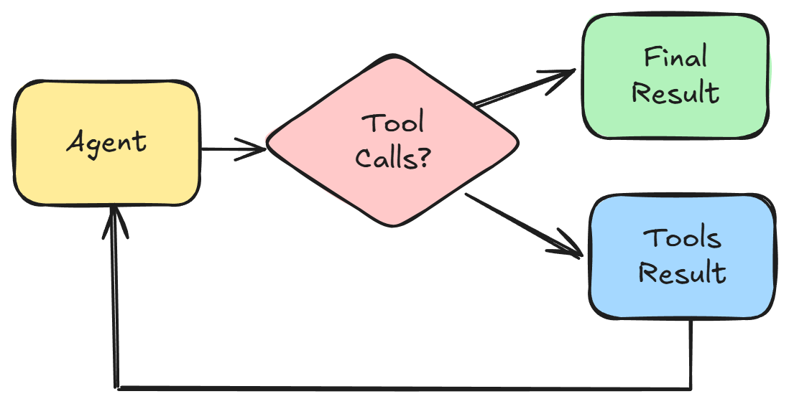

# 人工介入

在之前的教程中，我们探讨了代理如何动态地使用工具来回答查询或完成分配的任务。 **人机交互**通过允许代理在继续操作之前请求人工输入、批准或反馈来添加控制层。

人类参与循环有两种使用方式：

* 使用[Human Input](../using-flowise/agentflowv2.md#id-11.-human-input-node)节点来停止执行
* 为代理工具启用**需要人工输入**

## 人工输入节点

**人工输入**节点允许暂停执行，并且仅在人类提供反馈以批准或拒绝操作后才恢复执行。

在本教程中，我们将学习如何创建自动电子邮件回复代理，在发送电子邮件之前询问用户反馈。

### 概述

此用例的目标是创建一个智能电子邮件回复系统，该系统：

1. 接收传入的电子邮件查询
2. 使用人工智能生成专业的电子邮件回复
3. 发送前请求人工批准
4. 允许修改和改进
5.自动发送批准的电子邮件

<figure><figcaption></figcaption></figure>

#### 第 1 步：设置起始节点

1. 将 **Start** 节点拖放到画布上。这将是传入电子邮件数据的入口点。
2. 使用以下设置配置启动节点：
   * **输入类型**：选择“表单输入”以捕获结构化电子邮件数据
   * **表格标题**：“电子邮件查询”
   * **表格说明**：“传入电子邮件查询”
3. 添加以下表单输入类型：
   * **主题**（字符串）：捕获电子邮件主题行
   * **Body**（字符串）：捕获电子邮件内容
   * **From**（字符串）：捕获发件人的电子邮件地址

<figure><figcaption></figcaption></figure>

#### 步骤 2：创建电子邮件回复代理

1. 添加 **Agent** 节点并将其连接到 Start 节点。该代理将分析传入的电子邮件并生成适当的响应。
2.添加系统消息，例如：

    ```
    You are a customer support agent working in Flowise Inc. Write a professional email reply to user's query. Use the web search tools to get more details about the prospect.

    Always reply as Samantha, Customer Support Representative in Flowise. Don't use placeholders.
    ```
3. 添加以下工具来增强代理的能力：
   * **Google 自定义搜索**：研究客户信息并提供相关背景
   * **当前日期时间**：在响应中包含准确的时间戳

<figure><figcaption></figcaption></figure>

#### 步骤 3：添加人工输入以供批准

1. 添加 **人工输入** 节点并将其连接到电子邮件回复代理。这将创建人机循环检查点。
2. 配置人工输入节点：
   * **描述类型**：“固定”
   * **描述**：“您确定要继续吗？”
   * **启用反馈**：True（允许人类提供额外的反馈）
3. 该节点将暂停工作流程并将 AI 生成的响应呈现给人工审阅者。审稿人可以：
   * **继续**：批准回复并继续发送电子邮件
   * **拒绝**：发送反馈并循环回代理以进行改进

<figure><figcaption></figcaption></figure>

#### 步骤 4：设置环回机制

1. 添加 **Loop** 节点来处理拒绝场景。这允许工作流程返回到电子邮件回复代理以进行改进。
2. 配置Loop节点：
   * **循环返回**：从下拉列表中选择“电子邮件回复代理”
   * **最大循环计数**：5（防止无限循环）
3. 将“人类输入”节点的“拒绝”输出连接到该循环节点。当人员拒绝响应时，工作流程将返回给代理并提供改进反馈。

<figure><figcaption></figcaption></figure>

#### 步骤 5：创建电子邮件主题和正文生成器

1. 添加 **LLM** 节点并将其连接到 Human Input 节点的“proceed”输出。该节点会将批准的响应构建为正确的电子邮件格式。
2. 设置 JSON 结构化输出：
   * **键**：“主题”，**类型**：“字符串”，**描述**：“电子邮件主题”
* **键**：“正文”，**类型**：“字符串”，**描述**：“电子邮件正文”

<figure><figcaption></figcaption></figure>

#### 步骤 6：设置电子邮件发送

1. 添加 **工具** 节点并将其连接到电子邮件主题和正文 LLM 节点。这将处理实际的电子邮件发送。
2. 配置工具节点：
   * **工具**：从可用工具中选择“Gmail”
   * **消息操作**：“sendMessage”
3. 配置工具输入参数：
   * **to**：使用变量 `{{ $form.from }}` 回复原始发件人
   * **subject**：使用 `{{ llmAgentflow_0.output.subject }}` 获取第 5 步生成的主题
   * **正文**：使用 `{{ llmAgentflow_0.output.body }}` 获取第 5 步生成的电子邮件正文

<figure><figcaption></figcaption></figure>

### 工作流程如何运作

当收到电子邮件询问时，会发生以下情况：

1. **表单输入**：系统捕获电子邮件主题、正文和发件人信息
2. **人工智能分析**：电子邮件回复代理分析查询并使用网络搜索获取其他上下文生成专业回复
3. **人工审核**：工作流程暂停并向人工审核者呈现人工智能生成的响应
4. **决策点**：人类可以：
   * **批准**：响应继续进行电子邮件格式化和发送
   * **拒绝**：响应返回给代理并提供改进反馈
5. **电子邮件格式**：如果获得批准，响应将被构建为包含主题和正文的正确电子邮件格式
6. **电子邮件发送**：最终电子邮件将通过 Gmail 自动发送给原始发件人

### 测试工作流程

1. 通过填写包含示例电子邮件查询的表格来启动工作流程

<figure><figcaption></figcaption></figure>

2. 检查人工输入步骤中代理的响应

<figure><figcaption></figcaption></figure>

3. 拒绝回复并提供更多反馈：

<figure><figcaption></figcaption></figure>

4. 查看代理修改后的回复：

<figure><figcaption></figcaption></figure>

5. 继续并验证电子邮件是否正确发送：

<figure><figcaption></figcaption></figure>

### 完整的流程结构



## 需要人工输入代理工具

当代理决定使用工具时，会发生以下情况：

1. 给定用户查询，LLM 确定是否需要工具调用。
2. 如果从 LLM 输出响应中识别出工具调用，Flowise 会找到匹配的工具并执行相应的函数。
3. 工具执行的结果返回到 LLM。
4. 然后 LLM 决定是否需要额外的工具调用，或者是否有足够的信息来返回最终响应。

<figure><figcaption></figcaption></figure>

启用“需要人工输入”后，我们会在检测到工具调用后放置一个额外的检查点：

<figure><figcaption></figcaption></figure>

这对于敏感的工具调用至关重要，例如下订单、预订、会议、发送电子邮件等，这些地方需要人工确认和审查。

我们可以使用上面的示例电子邮件回复系统，但将其简化为只有一个代理。

<figure><figcaption></figcaption></figure>

### 配置

1. 添加 **Agent** 节点并将其连接到 Start 节点。这个代理将处理电子邮件分析和人工批准。
2.向Agent添加系统消息，例如：

    ```
    You are a customer support agent working in Flowise Inc. Create a draft professional email reply to user's query. Use the web search tools to get more details about the prospect.

    Always reply as Samantha, Customer Support Representative in Flowise. Don't use placeholders.

    Today's date is {{ current_date_time }}.
    ```
3. 添加以下工具：
   * **Google 自定义搜索**：用于研究客户信息
   * **Gmail**：用于创建经过人工批准的电子邮件草稿
4.配置Gmail工具：
   * **Gmail 类型**：“草稿”
   * **草稿操作**：“createDraft”
   * **需要人工输入**： ✅ **启用此选项** - 这是创建 HITL 功能的关键功能

<figure><figcaption></figcaption></figure>

### 简化流程如何运作

1. **表单输入**：用户提交电子邮件查询详细信息
2. **人工智能分析**：代理分析电子邮件并使用 Google 搜索获取其他上下文
3. **草稿创建**：当代理尝试创建 Gmail 草稿时，工作流程会暂停
4. **人工审核**：系统呈现电子邮件草稿以供人工批准
5. **决策**：人们可以批准（创建草稿）或拒绝（提供反馈并重试）

### 测试代理

1. 通过填写包含示例电子邮件查询的表格来启动工作流程

    <figure><figcaption></figcaption></figure>


2. 代理在创建 Gmail 草稿之前，会询问用户批准或拒绝。

<figure><figcaption></figcaption></figure>

3. 如果该工具获得批准，代理将继续调用该工具并在 Gmail 中创建草稿。代理足够聪明，可以确定电子邮件的适当主题、正文和收件人。

<figure><figcaption></figcaption></figure>

### 完整的流程结构



## 共享执行跟踪以供外部审查和批准

1. 在仪表板左侧栏中，单击 **执行。**
2. 找到执行跟踪，然后单击“**共享”。**

<figure><figcaption></figcaption></figure>

3. 执行跟踪现在可作为公共链接使用。您可以与其他人分享此链接以供审核。

<figure><figcaption></figcaption></figure>

4. Flowise 之外的用户可以拒绝或批准：

<figure><figcaption></figcaption></figure>
