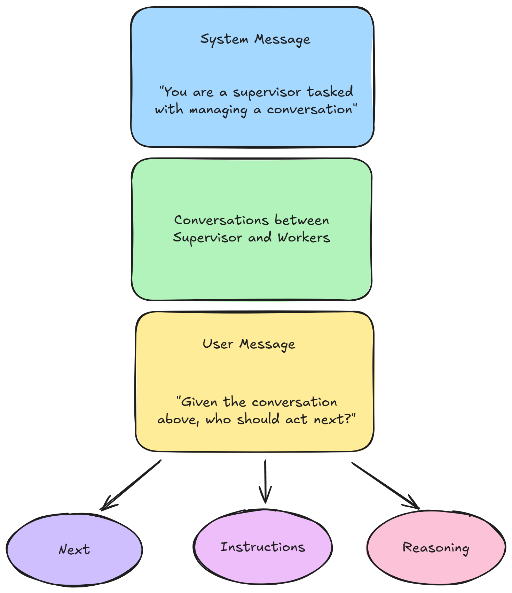

# 主管和工人

主管工作人员模式是一种功能强大的工作流设计，其中主管代理协调多个专门的工作代理来完成复杂的任务。这种模式可以实现更好的任务委派、专业知识和解决方案的迭代细化。

## 概述

在本教程中，我们将构建一个协作系统：

* **Supervisor**：一个 LLM 分析任务并决定下一步应该由哪个工人执行
* **软件工程师**：专门设计和实施软件解决方案
* **代码审查员**：专注于审查代码质量并提供反馈
* **最终答案生成器**：将协作工作编译成全面的解决方案

<figure><figcaption></figcaption></figure>

### 步骤1：创建起始节点

<figure><figcaption></figcaption></figure>

该流程以 **Start** 节点开始，该节点捕获用户输入并初始化工作流程状态。

1. 在画布上添加 **Start** 节点
2. 将**输入类型**配置为“聊天输入”
3. 使用这些初始变量设置 **Flow State**：
   * `next`：跟踪下一个代理
   * `instruction`：指示下一个代理要做什么

<figure><figcaption></figcaption></figure>

### 步骤 2：添加主管 LLM

<figure><figcaption></figcaption></figure>

**Supervisor** 是协调器，决定哪个工作人员应该处理任务的每个部分。

1. 在 Start 节点后连接 **LLM** 节点
2. 将其标记为“主管”
3. 配置系统消息，例如：

```
You are a supervisor tasked with managing a conversation between the following workers:
- Software Engineer  
- Code Reviewer

Given the following user request, respond with the worker to act next.
Each worker will perform a task and respond with their results and status.
When finished, respond with FINISH.
Select strategically to minimize the number of steps taken.
```

4. 使用以下字段设置 **JSON 结构化输出**：
   * `next`：具有值“FINISH、SOFTWARE、REVIEWER”的枚举
   * `instructions`: 下一个worker应该完成的子任务的具体指令
   * `reasoning`：下一个工人被指派去做这项工作的原因
5. 配置**更新流状态**以存储：
   * `next`: `{{ output.next }}`
   * `instruction`: `{{ output.instructions }}`
6. 将 **输入消息** 设置为：_“鉴于上述对话，接下来谁应该采取行动？或者我们应该FINISH？选择以下之一：SOFTWARE、REVIEWER。”_ 输入消息将插入到末尾，就好像用户要求主管分配下一个座席一样。

<figure><figcaption></figcaption></figure>

### 步骤 3：创建路由条件

<figure><figcaption></figcaption></figure>

**检查下一个工作人员**条件节点根据主管的决定路由流程。

1.在Supervisor后面添加**Condition**节点
2. 设置两个条件：
   * **条件 0**：`{{ $flow.state.next }}` 等于“SOFTWARE”
   * **条件 1**：`{{ $flow.state.next }}` 等于“REVIEWER”
3.“Else”分支（条件2）将处理“FINISH”情况

这将创建三个输出路径：一个用于每个工作人员，一个用于完成。

<figure><figcaption></figcaption></figure>

### 步骤 4：配置软件工程师代理

<figure><figcaption></figcaption></figure>

**软件工程师**专注于设计和实施软件解决方案。

1. 将 **Agent** 节点连接到 Condition 0 输出
2.配置系统消息：

```
As a Senior Software Engineer, you are a pivotal part of our innovative development team. Your expertise and leadership drive the creation of robust, scalable software solutions that meet the needs of our diverse clientele.

Your goal is to lead the development of high-quality software solutions.

Design and implement new features for the given task, ensuring it integrates seamlessly with existing systems and meets performance requirements. Use your understanding of React, TailwindCSS, NodeJS to build this feature. Make sure to adhere to coding standards and follow best practices.

The output should be a fully functional, well-documented feature that enhances our product's capabilities. Include detailed comments in the code.
```

4. 将 **输入消息** 设置为： `{{ $flow.state.instruction }}` 。输入消息将插入到末尾，就好像用户正在向软件工程师代理发出指令一样。

<figure><figcaption></figcaption></figure>

<figure><figcaption></figcaption></figure>

### 步骤 5：配置 Code Reviewer 代理

<figure><figcaption></figcaption></figure>

**代码审查员**专注于质量保证和代码审查。

1. 将 **Agent** 节点连接到条件 1 输出
2.配置系统消息：

```
As a Quality Assurance Engineer, you are an integral part of our development team, ensuring that our software products are of the highest quality. Your meticulous attention to detail and expertise in testing methodologies are crucial in identifying defects and ensuring that our code meets the highest standards.

Your goal is to ensure the delivery of high-quality software through thorough code review and testing.

Review the codebase for the new feature designed and implemented by the Senior Software Engineer. Provide constructive feedback, guiding contributors towards best practices and fostering a culture of continuous improvement. Your approach ensures the delivery of high-quality software that is robust, scalable, and aligned with strategic goals.
```

4. 将 **输入消息** 设置为： `{{ $flow.state.instruction }}` 。输入消息将插入到末尾，就好像用户正在向代码审阅者代理发出指令一样。

<figure><figcaption></figcaption></figure>

### 步骤 6：添加环回连接

<figure><figcaption></figcaption></figure>

两个工作代理都需要环回主管以进行持续协调。

1.在Software Engineer后面添加一个**Loop**节点
   * 将 **循环返回** 设置为“主管”
   * 将 **最大循环计数** 设置为 5
2.在Code Reviewer后面添加另一个**Loop**节点
   * 将 **循环返回** 设置为“主管”
   * 将 **最大循环计数** 设置为 5

这些循环支持代理之间的迭代协作。

### 第 7 步：创建最终答案生成器

<figure><figcaption></figcaption></figure>

最终代理将所有协作工作编译成一个全面的解决方案。

1. 将 **Agent** 节点连接到条件 2 输出（“Else”分支）
2. 建议像Gemini一样使用较高的上下文大小LLM，因为对话的来回性质会消耗大量令牌。
3. 设置**输入消息。** 这很重要，因为输入消息将被插入到末尾，就好像用户向最终答案生成器发出指令以查看所有对话并生成最终响应一样。

```
Given the above conversations, generate a detail solution developed by the software engineer and code reviewer.

Your guiding principles:
1. **Preserve Full Context**
   Include all code implementations, improvements and review from the conversation. Do not omit, summarize, or oversimplify key information.

2. **Markdown Output Only** 
   Your final output must be in Markdown format.
```

## 它是如何工作的

Supervisor Worker 模式具有以下几个关键优势：

**智能任务委派**：主管使用上下文和推理为每个子任务分配最合适的工作人员。

**迭代细化**：工作人员可以在彼此的输出的基础上进行构建，软件工程师实现功能，代码审查员提供改进反馈。

**状态协调**：流程在迭代中维护状态，允许主管对接下来应该发生的事情做出明智的决策。

**专业知识**：每个代理都有一个专注的角色和专门的提示词，从而在其领域内产生更高质量的输出。

## 交互示例

以下是典型交互的流程：

1. **User**：“创建一个 React 组件，用于通过表单验证进行用户身份验证”
2. **Supervisor**：决定 SOFTWARE 应首先采取行动来实现组件
3. **软件工程师**：创建带有验证逻辑的React身份验证组件
4. **主管**：决定 REVIEWER 应检查实施情况
5. **代码审查员**：审查代码并提出安全性和用户体验的改进建议
6. **主管**：决定 SOFTWARE 应实施建议的改进
7. **软件工程师**：根据反馈更新组件
8. **Supervisor**：确定任务已完成并路由至 FINISH
9. **最终答案生成器**：编译完整的解决方案以及实施和审查反馈

<figure><figcaption></figcaption></figure>

## 完整的流程结构



## 最佳实践

* 由于代理之间的来回通信，该架构会消耗大量令牌，因此并不适合所有情况。它对于以下方面特别有效：
  * 需要实施和审查的软件开发任务
  * 从多个角度受益的复杂问题解决
  * 质量和迭代很重要的工作流程
  * 需要不同类型专业知识之间协调的任务
* 确保每个代理都有明确定义的具体角色。避免可能导致混乱或冗余工作的职责重叠。
* 建立代理如何传达其进展、发现和建议的标准格式。这有助于主管做出更好的路由决策。
* 适当使用内存设置来维护对话上下文，同时避免令牌限制问题。对于较长的工作流程，请考虑使用“对话摘要缓冲区”等内存优化设置。

## 视频教程


