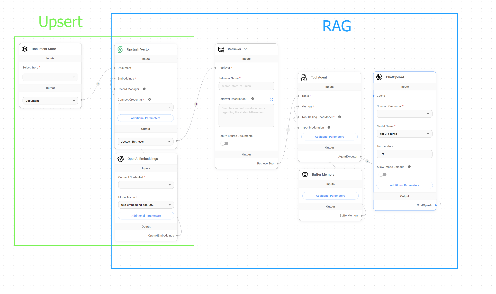
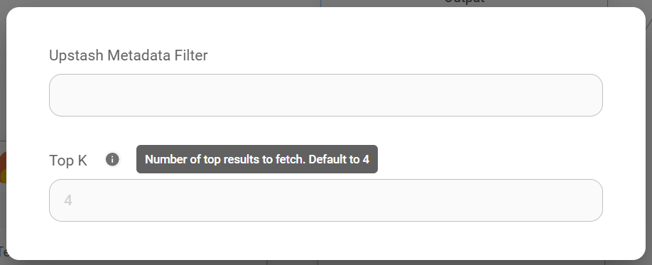
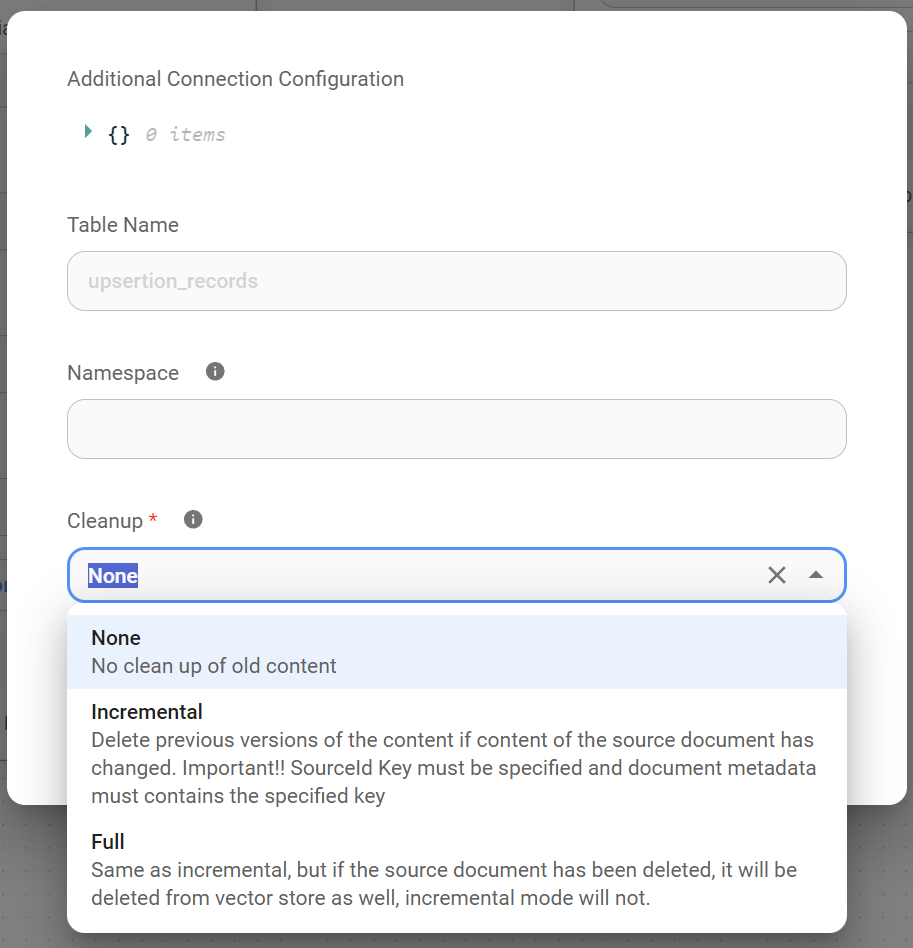

# 更新数据

***

使用 Flowise 将数据写入更新到 [向量存储](../integrations/langchain/vector-stores/) 有两种基本方法：通过 [API 调用](broken-reference) 或使用我们为此目的准备的一组专用节点。

在本指南中，尽管**强烈建议**您在写入更新到矢量存储之前使用[文档存储](../using-flowise/document-stores.md)准备数据，但我们将使用为此目的所需的特定节点来完成整个过程，概述此方法的步骤、优点以及高效数据处理的优化策略。

## 了解写入更新过程

我们需要了解的第一件事是，将数据写入更新到[向量存储](../integrations/langchain/vector-stores/)是形成[检索增强生成(RAG)](multiple-documents-qna.md)系统的基本部分。然而，一旦该过程完成，RAG 就可以独立执行。

换句话说，在 Flowise 中，您可以在没有完整 RAG 设置的情况下写入更新数据，并且可以在没有写入更新过程中使用的特定节点的情况下运行 RAG ，这意味着虽然填充良好的向量存储对于 RAG 的运行至关重要，但实际的检索和生成过程不需要连续写入更新。

<figure><figcaption>
写入更新与 RAG
</figcaption></figure>

## 设置

假设我们有一个 PDF 格式的长数据集，需要将其写入更新到 [Upstash 向量存储](../integrations/langchain/vector-stores/upstash-vector.md) 中，以便我们可以指示 LLM 从该文档中检索特定信息。

为了做到这一点，并为了说明本教程，我们需要创建一个具有 5 个不同节点的 **写入更新流程**：

<figure><figcaption>
写入更新流程
</figcaption></figure>

## 1. 文档加载器

第一步是使用 [文档加载器节点](../integrations/langchain/document-loaders/) **将我们的 PDF 数据上传到 Flowise 实例**。文档加载器是处理各种文档格式的摄取的专用节点，包括 **PDF**、**TXT**、**CSV**、Notion 页面等。

值得一提的是，每个文档加载器都带有两个重要的**附加参数**，它们允许我们随意添加和省略数据集中的元数据。

<figure><figcaption>
附加参数
</figcaption></figure>


**提示词**：添加/省略元数据参数虽然是可选的，但对于在向量存储中写入更新数据集后定位我们的数据集或从中删除不必要的元数据非常有用。


## 2. 文本分割器

一旦我们上传了 PDF 或数据集，我们需要**将其分割成更小的片段、文档或块**。这是一个至关重要的预处理步骤，主要原因有两个：

* **检索速度和相关性：** 将大型文档作为单个实体存储和查询矢量数据库中可能会导致检索时间变慢，并可能导致相关结果降低。将文档分割成更小的块可以实现更有针对性的检索。通过查询更小、更集中的信息单元，我们可以实现更快的响应时间并提高检索结果的精度。
* **成本效益：** 由于我们只检索相关块而不是整个文档，因此 LLM 处理的令牌数量显着减少。这种有针对性的检索方法直接降低了 LLM 的使用成本，因为计费通常基于令牌消耗。通过最大限度地减少发送到 LLM 的不相关信息量，我们还优化了成本。

### 节点

在 Flowise 中，此拆分过程是使用[文本分割器节点](../integrations/langchain/text-splitters/) 完成的。这些节点提供了一系列文本分割策略，包括：

* **字符文本分割：** 将文本分割成固定数量字符的块。这种方法很简单，但可能会将单词或短语分割成多个块，从而可能破坏上下文。
* **标记文本分割：** 根据特定于所选嵌入模型的单词边界或标记化方案来分割文本。这种方法通常会产生语义上更连贯的块，因为它保留了单词边界并考虑了文本的底层语言结构。
* **递归字符文本拆分：** 该策略旨在将文本划分为多个块，在保持指定大小限制的同时保持语义连贯性。它特别适合具有嵌套部分或标题的分层文档。它不是在字符限制下盲目分割，而是递归地分析文本以查找逻辑断点，例如句子结尾或分节符。这种方法确保每个块代表一个有意义的信息单元，即使它稍微超出目标大小。
* **Markdown 文本分割器：** 专为 Markdown 格式文档设计，该拆分器根据 Markdown 标题和结构元素对文本进行逻辑分段，创建与文档中的逻辑部分相对应的块。
* **代码文本分割器：** 专为拆分代码文件而设计，该策略考虑代码结构、函数定义和其他特定于编程语言的元素，以创建适合代码搜索和文档等任务的有意义的块。
* **HTML-to-Markdown 文本分割器：** 此专用拆分器首先将 HTML 内容转换为 Markdown，然后应用 Markdown 文本分割器，从而允许对网页和其他 HTML 文档进行结构化分段。

文本分割器节点提供对文本分割的精细控制，允许自定义参数，例如：

* **块大小：** 每个块所需的最大大小，通常以字符或标记定义。
* **块重叠：** 连续块之间重叠的字符或标记的数量，对于维护跨块的上下文流很有用。


**提示词：** 请注意，块大小和块重叠值不是相加的。选择 `chunk_size=1200` 和 `chunk_overlap=400` 不会导致总块大小为 1600。重叠值确定当前块中包含的前一个块中用于维护上下文的标记数。它不会增加总体块大小。


### 了解块重叠

在基于向量的检索和 LLM 查询的上下文中，块重叠在保持上下文连续性**和**提高响应准确性**方面发挥着重要作用，特别是在处理有限的检索深度或 **top K** 时，该参数确定从 [向量存储](../integrations/langchain/vector-stores/) 检索以响应查询的最相似块的最大数量。

在查询处理期间，LLM 对向量存储执行相似性搜索，以检索与给定查询在语义上最相关的块。如果由顶部 K 参数表示的检索深度设置为一个较小的值（默认为 4），则 LLM 最初仅使用来自这 4 个块的信息来生成其响应。

这种情况给我们带来了一个问题，因为仅依赖有限数量的没有重叠的块可能会导致答案不完整或不准确，特别是在处理需要跨越多个块的信息的查询时。

块重叠通过确保连续块之间共享文本上下文的一部分来帮助解决此问题，**增加给定查询的所有相关信息包含在检索到的块中的可能性**。

换句话说，这种重叠充当块之间的桥梁，使 LLM 能够访问更宽的上下文窗口，即使仅限于一小部分检索到的块（前 K 个）。如果查询涉及超出单个块的概念或信息，则重叠区域会增加捕获所有必要上下文的可能性。

因此，通过在文本分割阶段引入块重叠，我们增强了 LLM 的能力：

1. **保持上下文连续性：** 重叠块提供连续片段之间的信息更平滑的过渡，使模型能够保持对文本的更连贯的理解。
2. **提高检索准确性：** 通过增加捕获目标前 K 个检索块内所有相关信息的概率，重叠有助于实现更准确和上下文适当的响应。

### 准确性与成本

因此，为了进一步优化检索精度和成本之间的权衡，可以使用两种主要策略：

1. **增加/减少块重叠：** 在文本分割期间调整重叠百分比可以对块之间共享上下文的数量进行细粒度控制。较高的重叠百分比通常会改善上下文保留，但也可能会增加成本，因为您需要使用更多块来包含整个文档。相反，较低的重叠百分比可以降低成本，但可能会丢失块之间的关键上下文信息，从而可能导致 LLM 的答案不太准确或不完整。
2. **增加/减少 Top K：** 提高默认的 top K 值 (4) 可扩展考虑用于生成响应的块的数量。虽然这可以提高准确性，但也会增加成本。


**提示词：**最佳**overlap**和**top K**值的选择取决于文档复杂性、嵌入模型特征以及准确性和成本之间所需的平衡等因素。对这些值进行试验对于找到满足特定需求的理想配置非常重要。


## 3. 嵌入

现在，我们已上传数据集并配置了数据在写入更新到 [向量存储](../integrations/langchain/vector-stores/) 之前的分割方式。此时，[嵌入节点](../integrations/langchain/embeddings/)开始发挥作用，**将所有这些块转换为LLM可以轻松理解的“语言”**。

在当前上下文中，嵌入是将文本转换为捕获其含义的数字表示的过程。这种数字表示也称为嵌入向量，是一个多维数字数组，其中每个维度代表文本含义的特定方面。

这些向量允许法学硕士通过测量多维空间中文本之间的距离或相似性来比较和搜索向量存储中的相似文本。

### 了解嵌入/向量存储维度

矢量存储索引中的维数由我们写入更新数据时使用的嵌入模型决定，反之亦然。每个维度代表数据中的特定特征或概念。例如，**维度**可能**代表文本的特定主题、情绪或其他方面**。

我们用来嵌入数据的维度越多，从文本中捕捉微妙含义的潜力就越大。然而，这种增加是以每个查询的计算要求更高为代价的。

一般来说，维度越多，需要更多的资源来存储、处理和比较生成的嵌入向量。因此，理论上，像 Google `embedding-001` 这样使用 768 维的嵌入模型比 OpenAI `text-embedding-3-large` 这样使用 3072 维的嵌入模型更便宜。

值得注意的是，**维度和意义捕获之间的关系并不是严格线性的**；存在一个收益递减点，即增加更多维度所带来的好处可以忽略不计，而增加的不必要的成本却可以忽略不计。


**提示词：** 为了确保嵌入模型和向量存储索引之间的兼容性，维度对齐至关重要。 **模型和索引必须使用相同的维数来表示向量**。维度不匹配将导致插入错误，因为矢量存储旨在处理由所选嵌入模型确定的特定大小的矢量。


## 4.矢量存储

[向量存储 节点](../integrations/langchain/vector-stores/) 是我们写入更新流程的**结束节点。它充当 Flowise 实例和矢量数据库之间的桥梁，使我们能够将生成的嵌入以及任何关联的元数据发送到我们的目标矢量存储索引，以进行持久存储和后续检索。

正是在这个节点中，我们可以设置诸如“**top K**”之类的参数，正如我们之前所说，该参数确定从向量存储中检索以响应查询的最相似块的最大数量。

<figure><figcaption></figcaption></figure>


**提示词：** 较低的 top K 值将产生较少但可能更相关的结果，而较高的值将返回更广泛的结果，可能捕获更多信息。


## 5. 记录管理器

[记录管理器节点](../integrations/langchain/record-managers.md)是我们的写入更新流程中的一个可选但非常有用的补充。它允许我们维护已写入更新矢量存储的所有块的记录，使我们能够根据需要有效地添加或删除块。

如需更深入的指南，我们建议您参阅[本指南](../integrations/langchain/record-managers.md)。

<figure><figcaption></figcaption></figure>

## 6. 完整概述

最后，让我们检查从初始文档加载到最终矢量表示的每个阶段，突出显示关键组件及其在写入更新过程中的作用。

<figure><figcaption></figcaption></figure>

1. **文档摄取**：
   * 我们首先使用适合您的数据格式的 **文档加载器节点** 将原始数据输入 Flowise。
2. **战略拆分**
   * 接下来，**文本分割器节点** 将我们的文档划分为更小、更易于管理的块。这对于高效检索和成本控制至关重要。
   * 通过选择适当的文本分割器节点，并且重要的是，通过微调块大小和块重叠来平衡上下文保留与效率，我们可以灵活地进行这种分割。
3. **有意义的嵌入**
   * 现在，就在我们的数据将被记录到向量存储中之前，**嵌入节点**介入。它将每个文本块及其含义转换为我们的 LLM 可以理解的数字表示形式。
4. **矢量存储索引**
   * 最后，**向量存储 节点**充当 Flowise 和我们的数据库之间的桥梁。它将我们的嵌入以及任何相关元数据发送到指定的向量存储索引。
* 在此节点中，我们可以通过设置 **top K** 参数来控制检索行为，该参数会影响回答查询时考虑的块数。
5. **数据就绪**
   * 写入更新后，我们的数据现在在向量存储中表示为向量，准备进行相似性搜索和检索。
6. **记录保存（可选）**
   * 为了增强控制和管理数据，**记录管理器**节点会跟踪所有写入更新的块。随着您的数据或需求的变化，这有助于轻松更新或删除。

本质上，写入更新过程将我们的原始数据转换为 LLM 就绪格式，并针对快速且经济高效的检索进行了优化。
