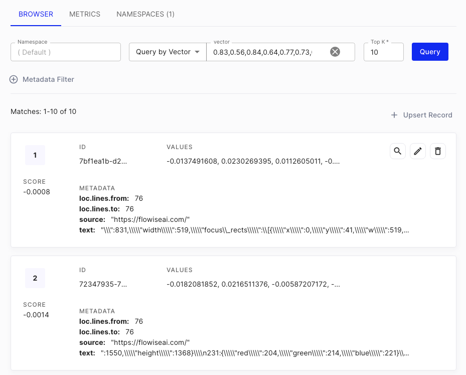

# 网页抓取 QnA

***

假设您有一个网站（可以是商店、电子商务网站、博客），并且您想要废弃该网站的所有相关链接并让 LLM 回答您网站上的任何问题。在本教程中，我们将介绍如何实现这一目标。

您可以从市场模板中找到名为 - **WebPage QnA** 的示例流程。

## 设置

我们将使用 **Cheerio Web Scraper** 节点从给定的 URL 抓取链接，并使用 **HtmlToMarkdown 文本分割器** 将抓取的内容分割成更小的部分。

<figure><figcaption></figcaption></figure>

如果您未指定任何内容，则默认情况下只会抓取给定的 URL 页面。如果要爬取其余相关链接，请单击 Cheerio Web Scraper 的“**其他参数**”。

## 1. 抓取多个页面

1. 在**获取相对链接方法**中选择`Web Crawl` 或`Scrape XML Sitemap`。
2. 在**获取相对链接限制**中输入`0`，以检索提供的URL中的所有可用链接。

<figure><figcaption></figcaption></figure>

### 管理链接（可选）

1. 输入需要抓取的URL。
2. 单击“**获取链接**”，根据**获取相对链接方法**和**附加参数**中的**获取相对链接限制**的输入来检索链接。
3. 在 **已爬网链接** 部分中，通过单击 **红色垃圾桶图标** 删除不需要的链接。
4. 最后，单击“**保存**”。

<figure><figcaption></figcaption></figure>

## 2. 写入更新

1. 在右上角，您会看到一个绿色按钮：

<figure><figcaption></figcaption></figure>

2. 将显示一个对话框，允许用户将数据更新到 Pinecone：

<figure><figcaption></figcaption></figure>

**注意：** 在幕后，将执行以下操作：

* 使用 Cheerio Web Scraper 抓取所有 HTML 数据
* 将所有抓取的数据从 HTML 转换为 Markdown，然后拆分
* 分割的数据将被循环，并使用 OpenAI Embeddings 转换为向量嵌入
* 矢量嵌入将被更新到 Pinecone

3. 在[Pinecone 控制台](https://app.pinecone.io) 上，您将能够看到添加的新向量。

<figure><figcaption></figcaption></figure>

## 3.查询

查询相对简单。验证数据已更新到矢量数据库后，您可以开始在聊天中提问：

<figure><figcaption></figcaption></figure>

在会话检索QA链的附加参数中，您可以指定2个提示词：

* **重新表述提示词：** 用于根据过去的对话历史重新表述问题
* **响应提示词：** 使用改写的问题，从向量数据库中检索上下文，并返回最终响应

<figure><figcaption></figcaption></figure>


建议指定详细的响应提示词信息。例如，您可以指定AI的名称、回答的语言、未找到答案时的响应（以防止产生幻觉）。


您还可以打开“返回源文档”选项以返回 AI 响应来源的文档块列表。

<figure><figcaption></figcaption></figure>

## 额外的网页抓取

除了 Cheerio Web Scraper 之外，还有其他节点也可以执行网页抓取：

* **Puppeteer：** Puppeteer 是一个 Node.js 库，它提供了一个高级 API 用于控制无头 Chrome 或 Chromium。您可以使用 Puppeteer 自动化网页交互，包括从需要 JavaScript 呈现的动态网页中提取数据。
* **Playwright：** Playwright 是一个 Node.js 库，提供高级 API 用于控制多个浏览器引擎，包括 Chromium、Firefox 和 WebKit。您可以使用 Playwright 自动化网页交互，包括从需要 JavaScript 呈现的动态网页中提取数据。
* **Apify：** [Apify](https://apify.com/) 是一个用于网页抓取和数据提取的云平台，它提供了一个 [生态系统](https://apify.com/store)，其中包含一千多个名为 _Actors_ 的现成应用程序，用于各种网页抓取、爬行和数据提取用例。

<figure><figcaption></figcaption></figure>


相同的逻辑可以应用于任何文档用例，而不仅限于网页抓取！


如果您对如何提高性能有任何建议，欢迎您[贡献](broken-reference)！
