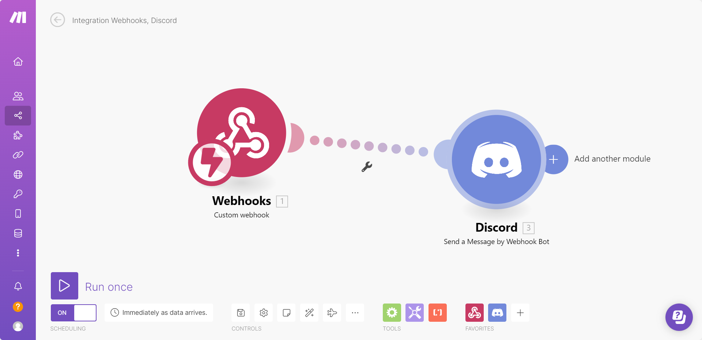
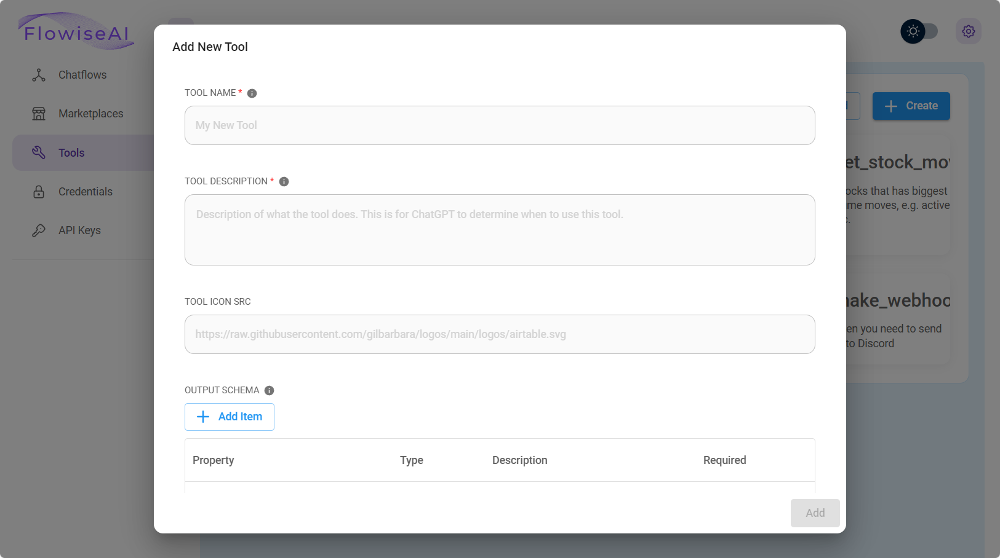

# 调用Webhook

***

本教程将引导您在 FlowiseAI 中创建一个自定义工具，该工具调用 webhook 端点，并在请求正文中传递必要的参数。我们将使用 [Make.com](https://www.make.com/en) 设置将消息发送到 Discord 频道的 Webhook 工作流程。

## 在 Make.com 中设置 Webhook

1. 注册或登录 [Make.com](https://www.make.com/en)。
2. 创建一个包含 **Webhook** 模块和 **Discord** 模块的新工作流，如下所示：

   <figure><figcaption></figcaption></figure>

3. 从 **Webhook** 模块，复制 webhook URL：

   <figure><figcaption></figcaption></figure>

4. 在 **Discord** 模块中，将其配置为将 `message` 从 webhook 正文传递为发送到 Discord 通道的消息：

   <figure><figcaption></figcaption></figure>

5. 单击“**运行一次**”开始侦听传入请求。
6. 发送带有以下 JSON 主体的测试 POST 请求：

   ```json
   {
       "message": "Hello Discord!"
   }
   ```

   <figure><figcaption></figcaption></figure>

7. 如果成功，您将看到该消息出现在您的 Discord 频道中：

   <figure><figcaption></figcaption></figure>

恭喜！您已成功设置将消息发送到 Discord 的 Webhook 工作流程。 🎉

## 在 FlowiseAI 中创建 Webhook 工具

接下来，我们将在 FlowiseAI 中创建一个自定义工具来发送 webhook 请求。

### 第 1 步：添加新工具

1. 打开 **FlowiseAI** 仪表板。
2. 单击“**工具**”，然后选择“**创建**”。

   <figure><figcaption></figcaption></figure>

3. 填写以下字段：

   |领域 |价值|
   |-------|-------|
   | **工具名称** | `make_webhook`（必须位于 Snake_case 中）|
   | **工具说明** |当您需要向 Discord 发送消息时很有用 |
   | **工具图标源** | [Flowise 工具图标](https://github.com/FlowiseAI/Flowise/assets/26460777/517fdab2-8a6e-4781-b3c8-fb92cc78aa0b) |

4. 定义**输入架构**：

   <figure><figcaption></figcaption></figure>

### 步骤 2：添加 Webhook 请求逻辑

输入以下 JavaScript 函数：

```javascript
const fetch = require('node-fetch');
const webhookUrl = 'https://hook.eu1.make.com/abcdef';
const body = {
    "message": $message
};
const options = {
    method: 'POST',
    headers: {
        'Content-Type': 'application/json'
    },
    body: JSON.stringify(body)
};
try {
    const response = await fetch(webhookUrl, options);
    const text = await response.text();
    return text;
} catch (error) {
    console.error(error);
    return '';
}
```

5. 单击“**添加**”保存您的自定义工具。

   <figure><figcaption></figcaption></figure>

### 步骤 3：使用 Webhook 集成构建聊天流

1. 创建一个新画布并添加以下节点：
   - **缓冲内存**
   - **ChatOpenAI**
   - **自定义工具**（选择 `make_webhook`）
   - **OpenAI功能代理**

2. 如图所示连接它们：

   <figure><figcaption></figcaption></figure>

3. 保存聊天流并开始测试。

### 步骤 4：通过 Webhook 发送消息

尝试向聊天机器人询问如下问题：

> _“如何煮鸡蛋？”_

然后，请求代理将此信息发送到 Discord：

   <figure><figcaption></figcaption></figure>

您应该会看到该消息出现在您的 Discord 频道中：

   <figure><figcaption></figcaption></figure>

### 替代 Webhook 测试工具

如果您想在没有 Make.com 的情况下测试 webhook，请考虑使用：

- [Beeceptor](https://beeceptor.com) – 快速设置模拟 API 端点。
- [Webhook.site](https://webhook.site) – 实时检查和调试 HTTP 请求。
- [Pipedream RequestBin](https://pipedream.com/requestbin) – 捕获并分析传入的 webhook。

## 更多教程

- 观看有关通过 Flowise 自定义工具使用 Webhook 的分步指南：
  

- 了解如何使用 webhooks 将 Flowise 连接到 Google 表格：
  

- 了解如何使用 webhooks 将 Flowise 连接到 Microsoft Excel：
  

通过遵循本指南，您可以动态触发 Webhook 工作流程并将自动化扩展到 Gmail、Google Sheets 等各种服务。
