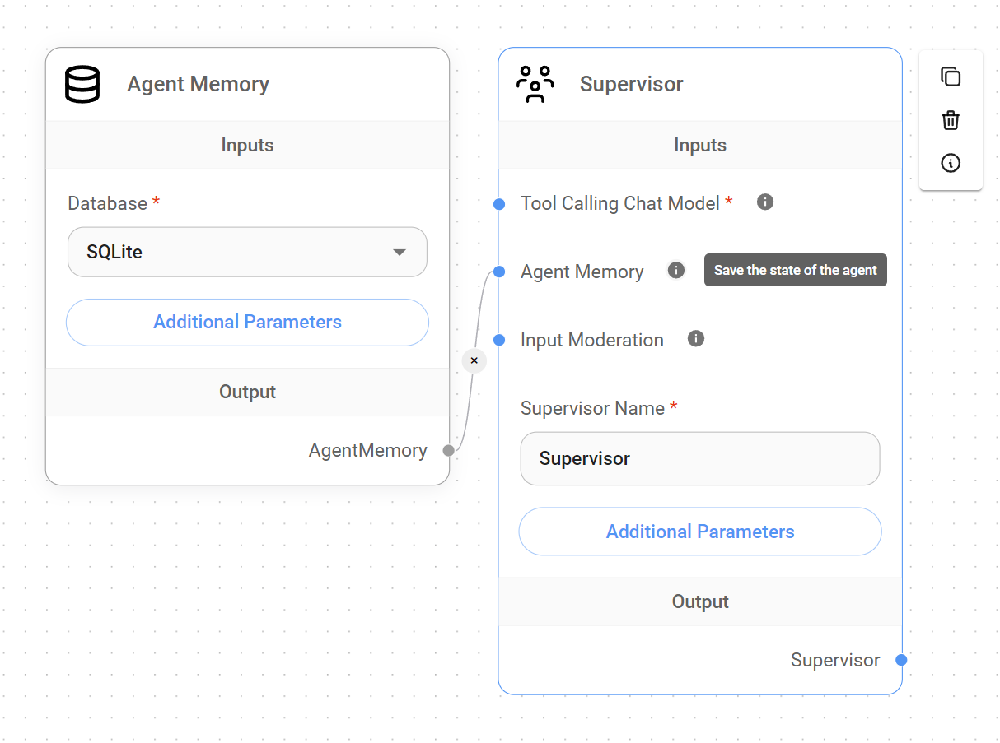
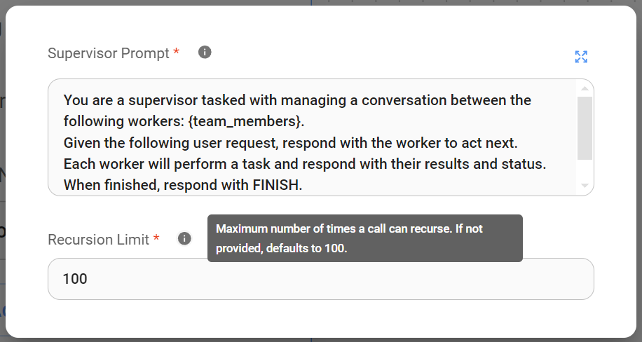
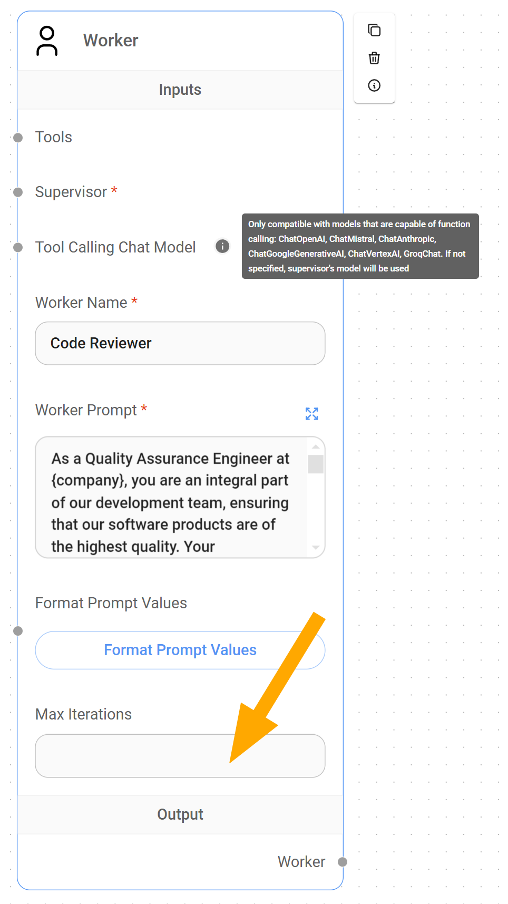

# 多智能体

本指南旨在介绍 Flowise 中的多智能体 AI 系统架构，详细介绍其组件、操作限制和工作流程。

## 概念

类似于在复杂项目上协作的领域专家团队，多智能体系统使用人工智能中的专业化原则。

这种多智能体系统采用分层、顺序工作流程，最大限度地提高效率和专业化。

### 1.系统架构

我们可以将多智能体人工智能架构定义为一个可扩展的人工智能系统，能够通过将复杂项目分解为可管理的子任务来处理复杂的项目。

在 Flowise 中，多智能体系统由两个主节点或代理类型和一个用户组成，在分层图中进行交互以处理请求并提供目标结果：

1. **用户：**用户充当**系统的起点**，提供初始输入或请求。虽然多智能体系统可以设计为处理广泛的请求，但重要的是这些用户请求与系统的预期目的保持一致。任何超出此范围的请求都可能导致结果不准确、意外循环甚至系统错误。因此，用户交互虽然灵活，但应始终与系统的核心功能保持一致，以获得最佳性能。
2. **Supervisor AI：** Supervisor 充当**系统的协调者**，监督整个工作流程。它分析用户请求，将其分解为一系列子任务，将这些子任务分配给专门的工作代理，聚合结果，并最终将处理后的输出呈现给用户。
3. **Worker AI 团队：** 该团队由专门的 AI 智能体或 Worker 组成，每个代理都通过提示词消息指示处理工作流程中的特定任务。这些工人独立操作，接收主管的指令和数据，**执行其专门功能**，根据需要使用工具，并将结果返回给主管。

<figure><figcaption></figcaption></figure>

### 2. 操作限制

为了保持秩序和简单性，这个多智能体系统在两个重要的约束下运行：

* **一次一项任务：** Supervisor 的设计目的是一次专注于一项任务。它等待活动的 Worker 完成其任务并返回结果，然后再分析下一步并委托后续任务。这可确保每个步骤在继续之前成功完成，从而防止过于复杂。
* **每个流程一个主管：** 虽然理论上可以实现一组嵌套的多智能体系统，为高度复杂的工作流程形成更复杂的层次结构，LangChain 定义为“[分层代理团队](https://github.com/langchain-ai/langgraph/blob/main/examples/multi\_agent/hierarchical\_agent\_teams.ipynb)”，由顶级主管和中层主管管理工作人员团队，但 Flowise 的多智能体系统目前由单个主管运行。


在**规划应用程序的工作流程**时，这两个约束非常重要。如果您尝试设计一个工作流程，其中主管需要同时、并行地委派多个任务，系统将无法处理它，您将遇到错误。


## 主管

Supervisor 作为管理整个工作流程的代理并负责将任务委派给适当的 Worker，需要一组组件才能正常运行：

* **聊天模型能够进行函数调用**来管理任务分解、委托和结果聚合的复杂性。
* **代理内存（可选）**：虽然 Supervisor 可以在没有代理内存的情况下运行，但此节点可以显着增强需要访问过去 Supervisor 状态的工作流程。这种**状态保存**可以允许主管从特定点恢复工作或利用过去的数据来改进决策。

<figure><figcaption></figcaption></figure>

### 主管提示词

默认情况下，主管提示词的措辞方式指示主管分析用户请求，将其分解为一系列子任务，并将这些子任务分配给专门的工作代理。

虽然主管提示词可以自定义以满足特定应用程序的需求，但它始终需要以下两个关键元素：

* **{team\_members} 变量：** 该变量对于主管了解可用劳动力至关重要，因为它为主管提供了工人姓名列表。这使得主管能够根据他们的专业知识，勤奋地将任务委派给最合适的工人。
* **“FINISH”关键字：** 该关键字用作管理员提示词中的信号。它指示主管何时应认为任务完成并向用户呈现最终输出。如果没有明确的“FINISH”指令，Supervisor 可能会继续不必要地委派任务，或者无法向用户提供连贯且最终的结果。它表明所有必要的子任务已被执行并且用户的请求已得到满足。

<figure><figcaption></figcaption></figure>


重要的是要理解主管扮演着与工人截然不同的角色。与可以使用高度具体的指令进行定制的 Workers 不同，**Supervisor 通过一般指令进行最有效的操作，这使得它可以根据需要计划和委派任务。**如果您是多智能体系统的新手，我们建议您坚持使用默认的 Supervisor 提示词


### 了解 Supervisor 节点中的递归限制：

此参数限制应用程序中嵌套函数调用的最大深度。在我们当前的环境中，**它限制了 Supervisor 在单个工作流程执行中可以触发自身的次数**。这对于防止无限递归和确保资源的有效利用非常重要。

<figure><figcaption></figcaption></figure>

### 主管如何工作

收到用户查询后，主管通过分析请求并辨别用户的预期结果来启动工作流程。

然后，利用 Supervisor 提示词中的 `{team_members}` 变量（该变量仅提供可用 Worker AI 名称的列表），Supervisor 推断每个 Worker 的专业，并策略性地为工作流程中的每个任务选择最合适的 Worker。


由于主管只有工作人员的姓名来推断他们在工作流程中的功能，因此相应地设置这些名称非常重要。 **准确反映工作人员角色或专业领域的清晰、简洁和描述性名称对于主管在委派任务时做出明智的决策至关重要。**这可确保为正确的工作选择正确的工作人员，从而最大限度地提高系统满足用户请求的准确性。


***

## **工人**

Worker 作为受指示处理系统内特定任务的专门代理，需要两个基本组件才能正常运行：

* **主管：** 每个工作人员必须连接到主管，以便在需要委派​​任务时可以调用它。这种连接在多智能体系统内建立了必要的层次关系，确保主管可以有效地将工作分配给适当的专业工作人员。
* **能够进行函数调用的聊天模型节点**：默认情况下，除非直接分配，否则工作人员会继承主管的聊天模型节点。这种函数调用功能使工作人员能够与为其专门任务设计的工具进行交互。

<figure><figcaption></figcaption></figure>


为每个工作人员分配**不同的聊天模型**的能力为我们的应用程序提供了显着的灵活性和优化机会。通过选择针对特定任务量身定制的[聊天模型](../../integrations/langchain/chat-models/)，我们可以利用更具成本效益的解决方案来完成更简单的任务，并在真正需要时保留专门的、可能更昂贵的模型。


### 了解 Workers 中的最大迭代参数

[LangChain](https://python.langchain.com/v0.1/docs/modules/agents/how\_to/max\_iterations/) 指的是 `Max Iterations Cap` 作为防止代理系统内失控的重要控制机制。在我们当前的背景下，它充当了我们的护栏，防止主管和工人之间过度的、可能无限的互动。

与 Supervisor 节点的 `Recursion Limit` 限制 Supervisor 可以调用自身的次数不同，Worker 节点的 `Max Iteration` 参数限制 Supervisor 可以迭代或查询特定 Worker 的次数。

通过限制最大迭代次数，我们可以确保即使在系统出现意外行为的情况下，成本仍处于控制之中。

***

## 示例：一个实际的用户案例

现在我们已经对多智能体系统如何在 Flowise 中工作有了基本的了解，让我们探索一下实际应用。

想象一下一个 **Lead Outreach 多智能体系统**（可在 Marketplace 中找到），旨在自动执行识别、资格审查和与潜在潜在客户互动的过程。该系统将利用 Supervisor 来协调以下两个 Worker：

* **首席研究员：** 该工作人员使用 Google 搜索工具，负责根据用户定义的标准收集潜在线索。
* **首席销售生成器：** 该工作人员将利用首席研究员收集的信息为销售团队创建个性化电子邮件草稿。

<figure><figcaption></figcaption></figure>

**背景：** 在 Solterra Renewables 工作的一位用户希望收集有关 Evergreen Energy Group（一家位于英国的信誉良好的可再生能源公司）的可用信息，并将其 CEO Amelia Croft 作为潜在的领导者。

**用户请求：** Solterra Renewables 员工向多智能体系统提供以下查询：“_我需要有关 Evergreen Energy Group 和 Amelia Croft 作为我们业务的潜在新客户的信息。_”

1. **主管：**
   * 主管收到用户请求并将“领导研究”任务委托给`Lead Researcher Worker`。
2. **首席研究员：**
   * 首席研究员使用 Google 搜索工具收集有关长青能源集团的信息，重点关注：
     * 公司背景、行业、规模和地点。
     * 最近的新闻和动态。
     * 主要管理人员，包括确认 Amelia Croft 的 CEO 角色。
   * 首席研究员将收集到的信息发送回 `Supervisor`。
3. **主管：**
* 主管收到首席研究员工作者的研究数据，并确认 Amelia Croft 是相关负责人。
   * 主管将“生成销售电子邮件”任务委托给 `Lead Sales Generator Worker`，并提供：
     *长荣能源集团研究资料。
     * 阿米莉亚·克罗夫特的电子邮件。
     * 有关 Solterra 可再生能源的背景。
4. **首席销售发电机工人：**
   * 首席销售生成人员为 Amelia Croft 量身定制个性化电子邮件草稿，考虑到：
     * 她作为 CEO 的角色以及 Solterra Renewables 服务与她的公司的相关性。
     * 来自长青能源集团当前重点或项目研究的信息。
   * 首席销售生成器工作人员将完成的电子邮件草稿发送回 `Supervisor`。
5. **主管：**
   * 主管收到生成的电子邮件草稿并发出“FINISH”指令。
   * 主管将电子邮件草稿输出回用户 `Solterra Renewables employee`。
6. **用户收到输出：** Solterra Renewables 员工收到一份个性化的电子邮件草稿，可供审核并发送给 Amelia Croft。

## 视频教程

在这里，您可以找到来自 [Leon 的 YouTube 频道](https://www.youtube.com/@leonvanzyl) 的视频教程列表，展示如何使用无代码在 Flowise 中构建多智能体应用程序。






