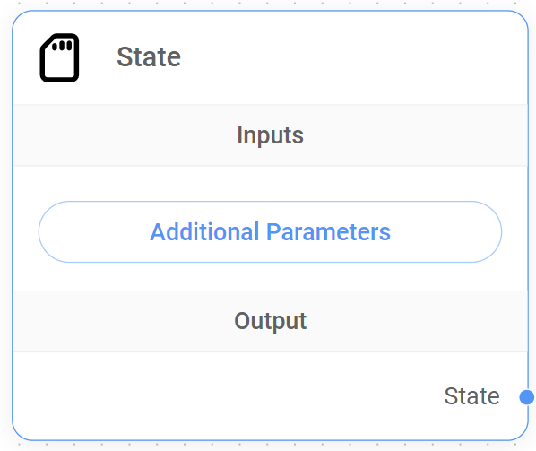
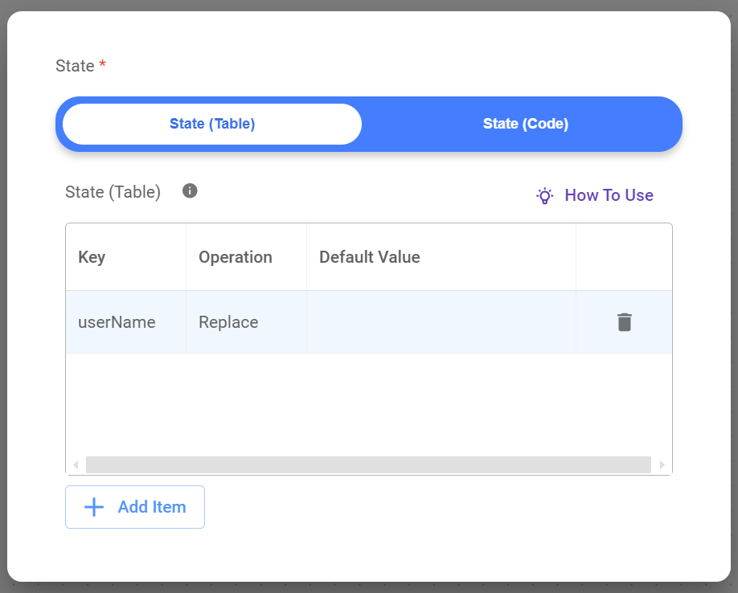
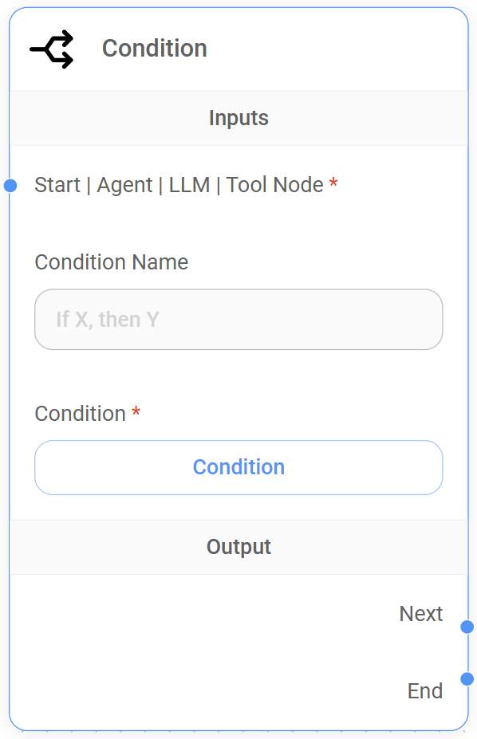
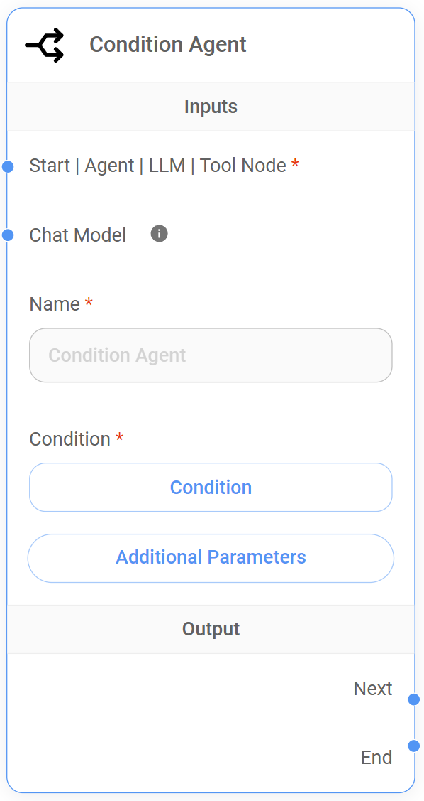
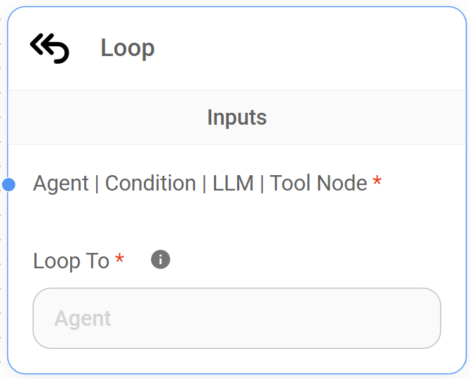
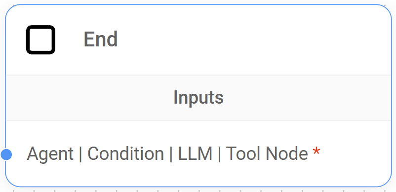

# 顺序智能体

本指南全面概述了 Flowise 中的 Sequential Agent AI 系统架构，探索其核心组件和工作流程设计原则。


**免责声明**：本文档旨在帮助 Flowise 用户理解并使用 Sequential Agent 系统架构构建会话工作流程。它无意成为 LangGraph 框架的全面技术参考，也不应被解释为定义行业标准或核心 LangGraph 概念。


## 概念

Flowise 的顺序智能体架构建立在 [LangGraph](https://www.langchain.com/langgraph) 之上，通过将工作流程构建为有向循环图 (DCG)**，允许受控循环和迭代过程，从而促进**对话代理系统的开发。

该图由互连的节点组成，定义了信息和操作的顺序流，使代理能够以结构化方式处理输入、执行任务并生成响应。

<figure><figcaption></figcaption></figure>

### 了解顺序智能体的 DCG 架构

该架构通过其 DCG 结构定义了清晰易懂的操作序列，从而简化了复杂会话工作流程的管理。

让我们探讨一下这种方法的一些关键要素：



* **基于节点的处理：** 图中的每个节点代表一个离散的处理单元，封装其自己的功能，如语言处理、工具执行或条件逻辑。
* **作为连接的数据流：** 图中的边代表节点之间的数据流，其中一个节点的输出成为后续节点的输入，从而实现一系列处理步骤。
* **状态管理：** 状态作为共享对象进行管理，在整个对话过程中持续存在。这允许节点随着工作流程的进展访问相关信息。



* **流程：** 工作流程中数据的移动或方向。它描述了会话期间信息如何在节点之间传递。
* **工作流程：** 系统的整体设计和结构。它是定义节点序列、节点连接以及编排对话流的逻辑的蓝图。
* **状态：** 表示会话当前快照的共享数据结构。它包括对话历史记录 `state.messages` 和用户定义的任何自定义状态变量。
* **自定义状态：** 添加到状态对象的用户定义的键值对，用于存储与工作流程相关的附加信息。
* **工具：** 可以由工作流访问和执行以执行特定任务（例如检索信息、处理数据或与其他应用程序交互）的外部系统 API 或服务。
* **人在环 (HITL)：** 允许人为干预工作流程（主要是在工具执行期间）的功能。它使人工审阅者能够在执行工具调用之前批准或拒绝工具调用。
* **并行节点执行：** 是指通过使用分支机制，在一个工作流程内同时执行多个节点的能力。这意味着工作流的不同分支可以同时处理信息或与工具交互，即使整体执行流程保持顺序。



***

## 顺序智能体与多智能体

虽然 Flowise 中的多智能体和顺序智能体系统均基于 LangGraph 框架构建并具有相同的基本原理，但顺序智能体架构提供了[较低的抽象级别](#user-content-fn-1)[^1]，从而对工作流程的每个步骤提供更精细的控制。

**多智能体系统**，其特点是分层结构，中央主管代理将任务委托给专门的工作代理，**擅长通过将复杂的工作流程分解为可管理的子任务来处理复杂的工作流程**。通过在后台预先配置核心系统元素（例如条件节点），可以实现对子任务的分解，这需要在顺序智能体系统中进行手动设置。因此，用户可以更轻松地构建和管理代理团队。

相比之下，**顺序智能体系统**像简化的装配线一样运行，其中数据按顺序流经节点链，使其成为需要精确操作顺序和增量数据细化的任务的理想选择。与多智能体系统相比，它对底层工作流结构的较低级别访问使其从根本上更加灵活和可定制，提供并行节点执行和对系统逻辑的完全控制，将条件、状态和循环节点合并到工作流中，允许创建新的动态分支功能。

### 状态、循环和条件节点简介

Flowise 的顺序智能体提供了创建对话系统的新功能，该系统可以适应用户输入、根据上下文做出决策并执行迭代任务。

这些功能是通过引入四个新核心节点而实现的；状态节点、循环节点和两个条件节点。

<figure><figcaption></figcaption></figure>

* **状态节点：** 我们将状态定义为共享数据结构，表示应用程序或工作流程的当前快照。状态节点允许我们从对话开始就将自定义状态添加到我们的工作流程中。工作流中的其他节点可以访问和修改此自定义状态，从而实现动态行为和数据共享。
* **循环节点：**此节点**在顺序智能体工作流程中引入受控循环**，从而实现迭代过程，其中可以根据特定条件重复节点序列。这允许代理优化输出、从用户收集附加信息或多次执行任务。
* **条件节点：** 条件和条件代理节点提供必要的控制来**创建具有分支路径的复杂对话流**。条件节点直接评估条件，而条件代理节点使用代理的推理来确定分支逻辑。这使我们能够根据用户输入、自定义状态或其他节点采取的操作结果动态引导流的行为。

### 选择正确的系统

为您的应用选择理想的系统取决于对您特定工作流程需求的了解。任务复杂性、并行处理的需求以及您所需的数据流控制级别等因素都是关键考虑因素。

* **为了简单起见：** 如果您的工作流程相对简单，任务可以一个接一个地完成，因此不需要并行节点执行或人机循环 (HITL)，则多智能体方法提供了易用性和快速设置。
* **为了灵活性：** 如果您的工作流程需要并行执行、动态对话、自定义状态管理以及合并 HITL 的能力，**顺序智能体** 方法提供必要的灵活性和控制。

下表比较了 Flowise 中的多智能体和顺序智能体实现，突出显示了关键差异和设计注意事项：

<table><thead><tr><th width="173.33333333333331"></th><th width="281">多Agent</th><th>顺序智能体</th></tr></thead><tbody><tr><td>结构</td><td><strong>分层的</strong>;主管委派给专业工人。</td><td><strong>线性、循环和/或</strong> <strong>分支</strong>;节点按顺序连接，并具有分支的条件逻辑。</td></tr><tr><td>工作流程</td><td>灵活；旨在将复杂的任务分解为 <strong>子任务的顺序</strong>，陆续完成。</td><td>高度灵活； <strong>支持并行节点执行</strong>、复杂的对话流、分支逻辑以及单个对话轮中的循环。</td></tr><tr><td>并行节点执行</td><td><strong>否</strong>;主管一次处理一项任务。</td><td><strong>是的</strong>;可以在一次运行中并行触发多个操作。</td></tr><tr><td>状态管理</td><td><strong>隐含的</strong>;状态已就位，但开发人员并未明确管理。</td><td><strong>显式的</strong>;状态就位，开发人员可以使用状态节点和各个节点中的“更新状态”字段来定义和管理初始或自定义状态。</td></tr><tr><td>工具使用</td><td><strong>工人</strong> 可以根据需要访问和使用工具。</td><td>工具通过以下方式访问和执行 <strong>代理节点</strong> 和 <strong>工具节点</strong>。</td></tr><tr><td>人机交互 (HITL)</td><td>HITL 是 <strong>不支持。</strong></td><td><strong>支持</strong> 通过代理节点和工具节点的“需要批准”功能，允许人工审核并批准或拒绝工具执行。</td></tr><tr><td>复杂性</td><td>更高层次的抽象； <strong>简化工作流程设计。</strong></td><td>较低的抽象级别； <strong>更复杂的工作流程设计</strong>，需要仔细规划节点交互、自定义状态管理和条件逻辑。</td></tr><tr><td>理想的用例</td><td><ul><li>自动化线性流程（例如数据提取、潜在客户生成）。</li><li>需要依次完成子任务的情况。</li></ul></td><td><ul><li>构建具有动态流的会话系统。</li><li>需要并行节点执行或分支逻辑的复杂工作流程。</li><li>需要在对话中的多个点做出决策的情况。</li></ul></td></tr></tbody></table>


**注意**：尽管多智能体系统在技术上是基于顺序智能体架构构建的更高级别的层，但它们提供了独特的用户体验和工作流设计方法。上面的比较将它们视为单独的系统，以帮助您选择适合您特定需求的最佳选项。


***

## 顺序智能体节点

顺序智能体为 Flowise 带来了全新的维度，**引入了 10 个专用节点**，每个节点都有特定的用途，为我们的对话代理如何与用户交互、处理信息、做出决策和执行操作提供更多控制。

以下部分旨在全面了解每个节点的功能、输入、输出和最佳实践，最终使您能够为各种应用程序设计复杂的对话工作流程。

<figure><figcaption></figcaption></figure>

***

## 1.启动节点

顾名思义，启动节点是 **顺序智能体架构中所有工作流的入口点**。它接收初始用户查询，初始化对话状态，并启动流程。

<figure><figcaption></figcaption></figure>

### 了解起始节点

启动节点确保我们的对话工作流程具有正确运行所需的设置和上下文。 **它负责设置将在整个工作流程的其余部分中使用的关键功能**：

* **定义默认的LLM：** 启动节点要求我们指定一个与函数调用兼容的聊天模型（LLM），使工作流中的代理能够与工具和外部系统进行交互。这将是工作流程中使用的默认 LLM。
* **初始化内存：** 我们可以选择连接代理内存节点来存储和检索对话历史记录，从而实现更多上下文感知响应。
* **设置自定义状态：** 默认情况下，状态包含一个不可变的 `state.messages` 数组，它充当用户和代理之间对话的记录或历史记录。启动节点允许您将自定义状态连接到添加状态节点的工作流程，从而能够存储与工作流程相关的其他信息
* **启用审核：** 我们可以选择连接输入审核来分析用户的输入并防止可能有害的内容发送到 LLM。

### 输入

<table><thead><tr><th width="212"></th><th width="102">必填</th><th>描述</th></tr></thead><tbody><tr><td>聊天模型</td><td><strong>是的</strong></td><td>默认的 LLM 将为对话提供支持。仅兼容 <strong>能够进行函数调用的模型</strong>。</td></tr><tr><td>代理内存节点</td><td>否</td><td>将代理内存节点连接到 <strong>启用持久性和上下文保存</strong>。</td></tr><tr><td>状态节点</td><td>否</td><td>将状态节点连接到 <strong>设置自定义状态</strong>，可以由工作流中的其他节点访问和修改的共享上下文。</td></tr><tr><td>输入调节</td><td>否</td><td>将审核节点连接到 <strong>过滤内容</strong> 通过检测可能生成有害输出的文本，防止其发送到 LLM。</td></tr></tbody></table>

### 输出

起始节点可以连接到以下节点作为输出：

* **代理节点：** 将对话流路由到代理节点，然后代理节点可以根据对话的上下文执行操作或访问工具。
* **LLM 节点：** 将对话流路由到 LLM 节点以进行处理和响应生成。
* **条件代理节点：** 连接到条件代理节点，以根据代理对对话的评估来实现分支逻辑。
* **条件节点：** 连接到条件节点，根据预定义的条件实现分支逻辑。

### 最佳实践



**选择正确的聊天模式**

确保您选择的 LLM 支持函数调用，这是启用代理工具交互的关键功能。此外，请选择符合您应用程序的复杂性和要求的 LLM。必要时，您可以通过在 Agent/LLM/Condition Agent 节点级别设置来覆盖默认的 LLM。

**考虑上下文和持久性**

如果您的用例需要，请利用代理内存节点来维护上下文并个性化交互。



**聊天模型 (LLM) 选择不正确**

* **问题：** 在开始节点中选择的聊天模型不适合工作流的预期任务或功能，导致性能不佳或响应不准确。
* **示例：** 某个工作流需要具有较强摘要能力的聊天模型，但启动节点选择了针对代码生成进行优化的模型，导致摘要不充分。
* **解决方案：** 选择符合您工作流程特定要求的聊天模型。考虑模型的优点、缺点以及它擅长的任务类型。请参阅文档并尝试不同的模型以找到最合适的。

**俯瞰代理内存节点配置**

* **问题：** 代理内存节点未正确连接或配置，导致会话之间的对话历史数据丢失。
* **示例：** 您打算使用持久内存来存储用户首选项，但代理内存节点未连接到启动节点，导致在每个新对话上重置首选项。
* **解决方案：** 确保代理内存节点已连接到启动节点并配置了适当的数据库 (SQLite)。对于大多数用例，默认的 SQLite 数据库就足够了。

**输入调节不足**

* **问题：** 未正确启用或配置“输入审核”，从而允许潜在有害或不适当的用户输入到达 LLM 并生成不良响应。
* **示例：** 用户提交攻击性语言，但输入审核未能检测到或根本未设置，从而允许查询到达 LLM。
* **解决方案：** 在启动节点中添加并配置输入审核节点，以过滤掉潜在有害或不当的语言。自定义审核设置以符合您的特定要求和用例。



## 2.代理内存节点

代理内存节点 **提供持久内存存储机制**，允许顺序智能体工作流程保留对话历史记录 `state.messages` 以及先前跨多个交互定义的任何自定义状态

这种长期记忆对于代理从之前的交互中学习、在扩展对话中保持上下文以及提供更相关的响应至关重要。

<figure><figcaption></figcaption></figure>

### 数据记录的地方

默认情况下，Flowise 利用其**内置 SQLite 数据库**来存储对话历史记录和自定义状态数据，创建一个“**检查点**”表来管理这些持久信息。

####了解“检查点”表结构和数据格式

该表**存储对话期间各个点的系统状态快照**，从而实现对话历史记录的持久化和检索。每行代表工作流程执行中的一个特定点或“检查点”。

<figure><figcaption></figcaption></figure>

#### 表结构

* **thread\_id:** 代表特定对话会话的唯一标识符，**我们的会话 ID**。它将与单个工作流程执行相关的所有检查点组合在一起。
* **checkpoint\_id:** 工作流中每个执行步骤（节点执行）的唯一标识符。它有助于跟踪操作顺序并识别每个步骤的状态。
* **parent\_id:** 表示导致当前检查点的前一个执行步骤的检查点\_id。这在检查点之间建立了层次关系，允许重建工作流的执行流程。
* **检查点：** 包含 JSON 字符串，表示该特定检查点处工作流的当前状态。这包括变量的值、交换的消息以及在执行过程中该点捕获的任何其他相关数据。
* **元数据：** 提供有关检查点的附加上下文，特别是与节点操作相关的上下文。

#### 它是如何工作的

当顺序智能体工作流程执行时，系统会在此表中记录每个重要步骤的检查点。这种机制有几个好处：

* **执行跟踪：** 检查点使系统能够了解工作流程中的执行路径和操作顺序。
* **状态管理：** 检查点存储每个步骤的工作流状态，包括变量值、对话历史记录和任何其他相关数据。这使得系统能够保持上下文意识并根据当前状态做出明智的决策。
* **工作流程恢复：** 如果工作流程暂停或中断（例如，由于系统错误或用户请求），系统可以使用存储的检查点从上次记录的状态恢复执行。这可确保对话或任务从中断处继续，保留用户的进度并防止数据丢失。

### **输入**

代理内存节点**没有特定的输入连接**。

### 节点设置

<table><thead><tr><th width="189"></th><th width="107">必填</th><th>描述</th></tr></thead><tbody><tr><td>数据库</td><td><strong>是的</strong></td><td>用于存储对话历史记录的数据库类型。目前， <strong>仅支持 SQLite</strong>。</td></tr></tbody></table>

### 附加参数

<table><thead><tr><th width="189"></th><th width="107">必填</th><th>描述</th></tr></thead><tbody><tr><td>数据库文件路径</td><td>否</td><td>SQLite 数据库文件的文件路径。 <strong>如果没有提供，系统将使用默认位置</strong>。</td></tr></tbody></table>

### **输出**

代理内存节点仅与**启动节点**交互，从而使对话历史记录从工作流程的一开始就可用。

### **最佳实践**



**战略用途**

仅在必要时才使用代理内存。对于简单的、无状态的交互来说，这可能有点矫枉过正。将其保留用于需要跨回合或会话保留信息的场景。



**不必要的开销**

* **问题：** 对每次交互使用代理内存，即使不需要，也会带来不必要的存储和处理开销。这会减慢响应时间并增加资源消耗。
* **示例：** 基于单个用户请求提供信息的简单天气聊天机器人不需要存储对话历史记录。
* **解决方案：** 分析系统的要求，仅当持久数据存储对于功能或用户体验至关重要时才使用代理内存。



***

## 3. 状态节点

状态节点只能连接到开始节点，**提供了一种从对话开始就将用户定义或自定义状态**设置到我们的工作流程中的机制。此自定义状态是一个 JSON 对象，该对象是共享的，可以由图中的节点更新，随着流程的进展从一个节点传递到另一个节点。

<figure><figcaption></figcaption></figure>

### 了解状态节点

默认情况下，状态包含一个 `state.messages` 数组，它充当我们的对话历史记录。该数组存储用户和代理或工作流中任何其他参与者之间交换的所有消息，并在整个工作流执行过程中保留它。

由于根据定义，此 `state.messages` 数组是不可变的且无法修改，**状态节点的目的是允许我们定义自定义键值对**，扩展状态对象以保存与我们的工作流程相关的任何其他信息。


当不使用**代理内存节点**时，状态在内存中运行，并且不会保留以供将来使用。


### 输入

状态节点**没有特定的输入连接**。

### 输出

状态节点只能连接到**开始节点**，允许从工作流开始时设置自定义状态，并允许其他节点访问并可能修改此共享的自定义状态。

### 附加参数

<table><thead><tr><th width="157"></th><th width="113">必填</th><th>描述</th></tr></thead><tbody><tr><td>自定义状态</td><td><strong>是的</strong></td><td>代表 JSON 对象 <strong>工作流程的初始自定义状态</strong>。该对象可以包含与应用程序相关的任何键值对。</td></tr></tbody></table>

### 如何设置自定义状态<a href="#alert-dialog-title" id="alert-dialog-title"></a>

指定状态对象的**键**、**操作类型**和**默认值**。操作类型可以是“替换”或“追加”。

* **更换**
  1. 将现有值替换为新值。
  2. 如果新值为null，则保留现有值。
* **追加**
  1. 将新值附加到现有值。
  2. 默认值可以为空或数组。例如：\[“a”，“b”]
  3. 最终值是一个数组。

#### 使用 JS 的示例


```javascript
{
    aggregate: {
        value: (x, y) => x.concat(y), // here we append the new message to the existing messages
        default: () => []
    }
}
```


#### 使用表格的示例

要使用状态节点中的表接口定义自定义状态，请执行以下步骤：

1. **添加项目：** 单击“+添加项目”按钮向表中添加行。每行代表您的自定义状态中的一个键值对。
2. **指定键：** 在“键”列中，输入要在状态对象中定义的每个键的名称。例如，您可能有“userName”、“userLocation”等键。
3. **选择操作：** 在“操作”栏中，为每个按键选择所需的操作。您有两个选择：
   * **替换：** 这会将键的现有值替换为节点提供的新值。如果新值为 null，则保留现有值。
   * **附加：** 这会将新值附加到键的现有值中。最终值将是一个数组。
4. **设置默认值：** 在“默认值”栏中，输入每个键的初始值。如果没有其他节点为该键提供值，则将使用该值。默认值可以为空或数组。

#### 示例表

|关键|运营|默认值 |
| -------- | --------- | ------------- |
|用户名 |更换|空 |

<figure><figcaption></figcaption></figure>

1. 该表定义了自定义State中的一个键：`userName`。
2. `userName` 键将使用“替换”操作，这意味着只要节点提供新值，其值就会更新。
3. `userName` 键有一个默认值_null,_ 表示它没有初始值。


请记住，这种基于表的方法是使用 JavaScript 定义自定义状态的替代方法。两种方法都达到相同的结果。


#### 使用 API 的示例

```json
{
    "question": "hello",
    "overrideConfig": {
        "stateMemory": [
            {
                "Key": "userName",
                "Operation": "Replace",
                "Default Value": "somevalue"
            }
        ]
    }
}
```

### 最佳实践



**规划您的自定义状态结构**

在构建工作流程之前，设计自定义状态的结构。组织良好的自定义状态将使您的工作流程更易于理解、管理和调试。

**使用有意义的键名**

选择具有描述性且一致的键名称，以清楚地表明其所保存数据的用途。这将提高代码的可读性，并使其他人（或将来的您）更容易理解自定义状态的使用方式。

**保持自定义状态最少**

仅将对于工作流逻辑和决策至关重要的信息存储在自定义状态中。

**考虑状态持久性**

如果您需要在多个对话会话中保留状态（例如，用于用户首选项、订单历史记录等），请使用代理内存节点将状态存储在持久数据库中。



**状态更新不一致**

* **问题：** 在没有明确策略的情况下更新多个节点中的自定义状态可能会导致不一致和意外行为。
* **示例**
  1. 代理 1 将 `orderStatus` 更新为“付款已确认”。
  2. 代理 2 在不同的分支中将 `orderStatus` 更新为“订单完成”，而不检查之前的状态。
* **解决方案：** 使用条件节点来控制自定义状态更新的流程，并确保自定义状态转换以逻辑且一致的方式发生。



***

## 4.代理节点

代理节点是**顺序智能体架构的核心组件。**它在我们的工作流程中充当决策者和协调者。

<figure><figcaption></figcaption></figure>

### 了解代理节点

从前面的节点接收到输入（始终包括完整的对话历史记录 `state.messages` 和执行中该点的任何自定义状态）后，代理节点使用其定义的“角色”（由系统提示词建立）来确定是否需要外部工具来满足用户的请求。

* 如果需要工具，代理节点会自主选择并执行适当的工具。此执行可以是自动的，或者对于敏感任务，需要人工批准 (HITL) 才能继续。一旦工具完成其操作，代理节点就会接收结果，使用指定的聊天模型 (LLM) 对其进行处理，并生成全面的响应。
* 在不需要工具的情况下，代理节点直接利用聊天模型 (LLM) 根据当前对话上下文制定响应。

### 输入

<table><thead><tr><th width="195"></th><th width="107">必填</th><th>描述</th></tr></thead><tbody><tr><td>外部工具</td><td>否</td><td>为代理节点提供 <strong>访问一套外部工具</strong>，使其能够执行操作并检索信息。</td></tr><tr><td>聊天模型</td><td>否</td><td>添加新的聊天模型 <strong>覆盖默认的聊天模型</strong> 工作流程的 (LLM)。仅与能够调用函数的模型兼容。</td></tr><tr><td>启动节点</td><td><strong>是的</strong></td><td>收到 <strong>初始用户输入</strong>，以及自定义状态（如果已设置）和其余默认值 <code>state.messages</code> 从起始节点开始的数组。</td></tr><tr><td>条件节点</td><td><strong>是的</strong></td><td>从前面的条件节点接收输入，使代理节点能够 <strong>根据条件节点评估的结果采取行动或指导对话</strong>。</td></tr><tr><td>条件代理节点</td><td><strong>是的</strong></td><td>从前面的条件代理节点接收输入，使代理节点能够 <strong>根据条件代理节点的评估结果采取行动或指导对话</strong>。</td></tr><tr><td>代理节点</td><td><strong>是的</strong></td><td>从前面的代理节点接收输入， <strong>启用链式代理操作</strong> 并维持对话情境</td></tr><tr><td>LLM 节点</td><td><strong>是的</strong></td><td>接收来自 LLM 节点的输出，使代理节点能够 <strong>处理 LLM 的响应</strong>。</td></tr><tr><td>工具节点</td><td><strong>是的</strong></td><td>接收来自工具节点的输出，使代理节点能够 <strong>处理工具的输出并将其集成到其响应中</strong>。</td></tr></tbody></table>


**代理节点至少需要来自以下节点的一个连接**：启动节点、代理节点、条件节点、条件代理节点、LLM 节点或工具节点。


### 输出

代理节点可以连接到以下节点作为输出：

* **代理节点：** 将控制权传递给后续代理节点，从而实现工作流程中多个代理操作的链接。这允许更复杂的对话流程和任务编排。
* **LLM 节点：** 将代理的输出传递到 LLM 节点，从而能够根据代理的操作和见解进行进一步的语言处理、响应生成或决策。
* **条件代理节点：** 将流程定向到条件代理节点。该节点评估代理节点的输出及其预定义条件，以确定工作流程中适当的下一步。
* **条件节点：** 与条件代理节点类似，条件节点使用预定义的条件来评估代理节点的输出，根据结果引导流程沿不同的分支流动。
* **结束节点：** 结束对话流程。
* **循环节点：** 将流程重定向回前一个节点，从而在工作流程中启用迭代或循环过程。这对于需要多个步骤或涉及基于先前交互来细化结果的任务非常有用。例如，您可以循环回到较早的代理节点或 LLM 节点，以收集其他信息或根据当前代理节点的输出优化对话流。

### 节点设置

<table><thead><tr><th width="201"></th><th width="101">必填</th><th>描述</th></tr></thead><tbody><tr><td>代理名称</td><td><strong>是的</strong></td><td>为代理节点添加描述性名称，以增强工作流可读性并轻松 <strong>使用循环时将其重新定位</strong> 在工作流程内。</td></tr><tr><td>系统提示词</td><td>否</td><td>定义 <strong>智能体的“角色”</strong> 和 <strong>指导其行为</strong>。例如，“<em>您是专门从事技术支持的客户服务代理</em> [...]。”</td></tr><tr><td>需要批准</td><td>否</td><td><strong>激活人机交互 (HITL) 功能</strong>。如果设置为 '<strong>真实</strong>，”代理节点在执行任何工具之前将请求人工批准。这对于敏感操作或需要人工监督时特别有价值。默认为 '<strong>错误</strong>，'允许代理节点自主执行工具。</td></tr></tbody></table>

### 附加参数

<table><thead><tr><th width="200"></th><th width="102">必填</th><th>描述</th></tr></thead><tbody><tr><td>人工提示词</td><td>否</td><td>此提示词附加到 <code>state.messages</code> 数组作为人类消息。它使我们能够 <strong>将类似人类的消息注入对话流中</strong> 在代理节点处理其输入之后和下一个节点接收代理节点的输出之前。</td></tr><tr><td>批准提示词</td><td>否</td><td><strong>当 HITL 功能处于活动状态时，向人工审阅者呈现的可自定义提示词</strong>。此提示词提供有关工具执行的上下文，包括工具的名称和用途。变量 <code>{tools}</code> 提示词中的内容将动态替换为代理建议的实际工具列表，确保人工审核者拥有做出明智决定所需的所有信息。</td></tr><tr><td>批准按钮文本</td><td>否</td><td>定制 <strong>批准工具执行按钮上显示的文本</strong> 在 HITL 界面中。这允许根据特定上下文定制语言并确保人工审阅者的清晰度。</td></tr><tr><td>拒绝按钮文本</td><td>否</td><td>定制 <strong>按钮上显示的用于拒绝工具执行的文本</strong> 在 HITL 界面中。与“批准按钮文本”一样，此自定义功能增强了清晰度，并为审核人员认为工具执行不必要或可能有害时提供了明确的操作。</td></tr><tr><td>更新状态</td><td>否</td><td>提供了一个 <strong>修改工作流程中共享的自定义状态对象的机制</strong>。这对于存储代理收集的信息或影响后续节点的行为非常有用。</td></tr><tr><td>最大迭代次数</td><td>否</td><td>限制了 <strong>迭代次数</strong> 代理节点可以在单个工作流程中执行。</td></tr></tbody></table>

### 最佳实践



**清除系统提示词**

制作简洁、明确的系统提示词，准确反映座席的角色和能力。这指导代理的决策并确保其在定义的范围内行动。

**战略工具选择**

选择并配置代理节点可用的工具，确保它们符合代理的目的和工作流程的总体目标。

**HITL 适用于敏感任务**

对于涉及敏感数据、需要人工判断或存在意外后果风险的任务，请使用“需要批准”选项。

**利用自定义状态更新**

有策略地更新自定义 State 对象以存储收集的信息或影响下游节点的行为。



**由于工具过载，代理不采取行动**

* **问题：** 当代理节点在单个工作流程执行中可以访问大量工具时，即使某个工具显然是必要的，它也可能很难决定哪个工具最适合使用。这可能会导致代理根本无法调用任何工具，从而导致响应不完整或不准确。
* **示例：** 想象一个客户支持代理旨在处理各种查询。您已为其配备了用于订单跟踪、账单信息、产品退货、技术支持等的工具。用户询问：“我的订单状态如何？”但是，代理因潜在工具的数量而不知所措，只给出了一个笼统的答案，例如“我可以帮助您。您的订单号是多少？”无需实际使用订单跟踪工具。
* **解决方案**
  1. **完善系统提示词：** 在代理节点的系统提示词中提供更清晰的说明和示例，以指导其正确选择工具。如果需要，请强调每个工具的具体功能以及应使用它们的情况。
  2. **限制每个节点的工具选择：** 如果可能，将复杂的工作流程分解为更小、更易于管理的部分，每个部分都有一组更有针对性的工具。这可以帮助减少代理的认知负担并提高其工具选择的准确性。

**忽略敏感任务的 HITL**

* **问题：** 对于涉及敏感信息、关键决策或具有潜在现实世界后果的行动的任务，未能利用代理节点的“需要批准”(HITL) 功能可能会导致意外结果或损害用户信任。
* **示例：** 您的旅行预订代理可以访问用户的付款信息，并可以自动预订航班和酒店。如果没有 HITL，对用户意图的误解或客服人员的理解错误可能会导致错误预订或未经授权使用用户的付款详细信息。
* **解决方案**
  1. **识别敏感操作：** 分析您的工作流程并识别涉及访问或处理敏感数据（例如付款信息、个人详细信息）的任何操作。
  2. **实施“需要批准”：** 对于这些敏感操作，请在代理节点中启用“需要批准”选项。这确保了在访问任何敏感数据或采取任何不可逆转的操作之前，人员会审查代理建议的操作和相关上下文。
  3. **设计清晰的审批提示词：** 为人工审核者提供清晰简洁的提示词，总结智能体的意图、建议的行动以及审核者做出明智决定所需的相关信息。

**系统提示词不清楚或不完整**

* **问题：** 提供给代理节点的系统提示词缺乏必要的特异性和上下文来指导代理有效地执行其预期任务。模糊或过于笼统的提示词可能会导致不相关的响应、难以理解用户意图以及无法适当地利用工具或数据。
* **示例：** 您正在构建一个旅行预订代理，您的系统提示词只是简单地指出“_您是一位有用的人工智能助手。_”这缺乏代理有效指导用户完成航班搜索、酒店预订和行程规划所需的具体说明和上下文。
* **解决方案：** 制作详细且上下文感知的系统提示词：


```
You are a travel booking agent. Your primary goal is to assist users in planning and booking their trips. 
- Guide them through searching for flights, finding accommodations, and exploring destinations.
- Be polite, patient, and offer travel recommendations based on their preferences.
- Utilize available tools to access flight data, hotel availability, and destination information.
```




***

## 5. LLM 节点

与代理节点一样，LLM 节点是 **顺序智能体架构的核心组件**。默认情况下，两个节点都使用相同的聊天模型 (LLM)，提供相同的基本语言处理功能，但 LLM 节点在这些关键领域中脱颖而出。

<figure><figcaption></figcaption></figure>

### LLM 节点的主要优势

虽然LLM 节点和代理节点之间的详细比较可在[本节](./#agent-node-vs.-llm-node-selecting-the-optimal-node-for-conversational-tasks) 中找到，但这里简要概述了 **LLM 节点的主要优势**：

* **结构化数据：** LLM 节点提供了专用功能来为其输出定义 JSON 模式。这使得从 LLM 的响应中提取结构化信息并将该数据传递到工作流中的后续节点变得异常容易。代理节点没有此内置 JSON 架构功能
* **HITL：** 虽然两个节点都支持 HITL 进行工具执行，但 LLM 节点将此控制权推迟到工具节点本身，从而在工作流程设计中提供更大的灵活性。

### 输入

<table><thead><tr><th width="184"></th><th width="111">必填</th><th>描述</th></tr></thead><tbody><tr><td>聊天模型</td><td>否</td><td>添加新的聊天模型 <strong>覆盖默认的聊天模型</strong> 工作流程的 (LLM)。仅与能够调用函数的模型兼容。</td></tr><tr><td>启动节点</td><td><strong>是的</strong></td><td>收到 <strong>初始用户输入</strong>，以及自定义状态（如果已设置）和其余默认值 <code>state.messages</code> 从起始节点开始的数组。</td></tr><tr><td>代理节点</td><td><strong>是的</strong></td><td>接收来自代理节点的输出，其中可能包括工具执行结果或代理生成的响应。</td></tr><tr><td>条件节点</td><td><strong>是的</strong></td><td>从前面的条件节点接收输入，使 LLM 节点能够 <strong>根据条件节点评估的结果采取行动或指导对话</strong>。</td></tr><tr><td>条件代理节点</td><td><strong>是的</strong></td><td>从前面的条件代理节点接收输入，使 LLM 节点能够 <strong>根据条件代理节点的评估结果采取行动或指导对话</strong>。</td></tr><tr><td>LLM 节点</td><td><strong>是的</strong></td><td>接收来自另一个 LLM 节点的输出， <strong>启用链式推理</strong> 或跨多个 LLM 节点的信息处理。</td></tr><tr><td>工具节点</td><td><strong>是的</strong></td><td>接收来自工具节点的输出， <strong>提供工具执行的结果以供进一步处理</strong> 或响应生成。</td></tr></tbody></table>


**LLM 节点至少需要来自以下节点的一个连接**：启动节点、代理节点、条件节点、条件代理节点、LLM 节点或工具节点。


### **节点设置**

<table><thead><tr><th width="240"></th><th width="118">必填</th><th>描述</th></tr></thead><tbody><tr><td>LLM 节点名称</td><td><strong>是的</strong></td><td>向 LLM 节点添加描述性名称，以增强工作流可读性并轻松<strong>使用循环时将其重新定位</strong> 在工作流程内。</td></tr></tbody></table>

### 输出

LLM 节点可以连接到以下节点作为输出：

* **代理节点：** 将 LLM 的输出传递给代理节点，然后代理节点可以使用该信息来决定操作、执行工具或指导对话流。
* **LLM 节点：** 将输出传递到后续 LLM 节点，从而启用多个 LLM 操作的链接。这对于完善文本生成、执行多重分析或将复杂的语言处理分解为多个阶段等任务非常有用。
* **工具节点**：将输出传递到工具节点，从而能够根据 LLM 节点的指令执行特定工具。
* **条件代理节点：** 将流程定向到条件代理节点。该节点评估 LLM 节点的输出及其预定义条件，以确定工作流中适当的下一步。
* **条件节点：** 与条件代理节点类似，条件节点使用预定义的条件来评估 LLM 节点的输出，根据结果引导流沿不同的分支。
* **结束节点：** 结束对话流程。
* **循环节点：** 将流程重定向回前一个节点，从而在工作流程中启用迭代或循环过程。这可用于在多次迭代中优化 LLM 的输出。

### 附加参数

<table><thead><tr><th width="200"></th><th width="141">必填</th><th>描述</th></tr></thead><tbody><tr><td>系统提示词</td><td>否</td><td>定义 <strong>代理的“角色”并指导其行为</strong>。例如，“<em>您是专门从事技术支持的客户服务代理</em> [...]。”</td></tr><tr><td>人工提示词</td><td>否</td><td>此提示词附加到 <code>state.messages</code> 数组作为人类消息。它使我们能够 <strong>将类似人类的消息注入对话流中</strong> 在 LLM 节点处理其输入之后且在下一个节点接收 LLM 节点的输出之前。</td></tr><tr><td>JSON 结构化输出</td><td>否</td><td>指示 LLM（聊天模型） <strong>以 JSON 结构模式提供输出</strong> （键、类型、枚举值、描述）。</td></tr><tr><td>更新状态</td><td>否</td><td>提供了一个 <strong>修改工作流程中共享的自定义状态对象的机制</strong>。这对于存储 LLM 节点收集的信息或影响后续节点的行为非常有用。</td></tr></tbody></table>

### 最佳实践



**清除系统提示词**

制作简洁且明确的系统提示词，准确反映 LLM 节点的角色和功能。这指导 LLM 节点的决策并确保其在其定义的范围内运行。

**优化结构化输出**

让您的 JSON 架构尽可能简单，重点关注基本数据元素。仅当您需要从 LLM 的响应中提取特定数据点或下游节点需要 JSON 输入时，才启用 JSON 结构化输出。

**战略工具选择**

选择并配置 LLM 节点可用的工具（通过工具节点），确保它们符合应用程序目的和工作流程的总体目标。

**HITL 适用于敏感任务**

对于涉及敏感数据、需要人工判断或存在意外后果风险的任务，请使用“需要批准”选项。

**利用状态更新**

有策略地更新自定义 State 对象以存储收集的信息或影响下游节点的行为。



**由于 HITL 设置不正确而导致工具意外执行**

* **问题：** 虽然 LLM 节点可以触发工具节点，但它依赖于工具节点的配置来进行人机交互 (HITL) 批准。未能为敏感操作正确配置 HITL 可能会导致工具在未经人工审核的情况下执行，从而可能导致意外后果。
* **示例：** 您的 LLM 节点旨在与更改用户数据的工具进行交互。您打算在执行之前让人工检查这些更改，但连接的工具节点的“需要批准”选项未启用。这可能会导致该工具仅根据 LLM 的输出自动修改用户数据，而无需任何人为监督。
* **解决方案**
  1. **仔细检查工具节点设置：** 始终确保在处理敏感操作的任何工具节点的设置中启用“需要批准”选项。
  2. **彻底测试 HITL：** 在部署工作流程之前，测试 HITL 流程，以确保按预期触发人工审核步骤，并且批准/拒绝机制正常运行。

**过度使用或误解 JSON 结构化输出**

* **问题：** 虽然 LLM 节点的 JSON 结构化输出功能很强大，但误用它或不完全理解其含义可能会导致数据错误。
* **示例：** 您为 LLM 节点的输出定义了复杂的 JSON 模式，即使下游任务仅需要简单的文本响应。这增加了不必要的复杂性，并使您的工作流程更难以理解和维护。此外，如果 LLM 的输出不符合定义的架构，则可能会导致后续节点出现错误。
* **解决方案**
  1. **有策略地使用 JSON 输出：** 仅当您明确需要从 LLM 的响应中提取特定数据点或下游工具节点需要 JSON 输入时，才启用 JSON 结构化输出。
  2. **保持架构简单：** 将 JSON 架构设计得尽可能简单明了，仅关注任务绝对必需的数据元素。



***

## 6. 工具节点

工具节点是 Flowise 顺序智能体系统的重要组件，**支持在对话工作流程中集成和执行外部工具**。它充当 LLM 节点基于语言的处理与外部工具、API 或服务的专门功能之间的桥梁。

<figure><figcaption></figcaption></figure>

### 了解工具节点

工具节点的主要功能是根据从 LLM 节点接收的指令**执行外部工具**，并**为工具执行过程中的人机交互 (HITL)** 干预提供灵活性。

#### 这是其工作原理的分步说明

1. **工具调用接收：** 工具节点接收来自 LLM 节点的输入。如果 LLM 的输出包含 `tool_calls` 属性，则工具节点将继续执行工具。
2. **执行：**工具节点直接将LLM的`tool_calls`（包括工具名称和任何所需参数）传递给指定的外部工具。否则，工具节点不会在该特定工作流程执行中执行任何工具。它不会以任何方式处理或解释 LLM 的输出。
3. **人在环 (HITL)：** 工具节点允许可选的 HITL，从而可以在工具执行发生之前进行人工审查和批准或拒绝。
4. **输出传递：** 工具执行后（自动或在 HITL 批准后），工具节点接收工具的输出并将其传递到工作流中的下一个节点。如果工具节点的输出未连接到后续节点，则工具的输出将返回到原始 LLM 节点以进行进一步处理。

### 输入

<table><thead><tr><th width="164"></th><th width="107">必填</th><th>描述</th></tr></thead><tbody><tr><td>LLM 节点</td><td><strong>是的</strong></td><td>接收来自 LLM 节点的输出，该节点可能包含也可能不包含 <code>tool_calls</code> 财产。如果存在，工具节点将使用它们来执行指定的工具。</td></tr><tr><td>外部工具</td><td>否</td><td>为工具节点提供<strong>访问一套外部工具</strong>，使其能够执行操作并检索信息。</td></tr></tbody></table>

### 节点设置

<table><thead><tr><th width="183"></th><th width="101">必填</th><th>描述</th></tr></thead><tbody><tr><td>工具节点名称</td><td><strong>是的</strong></td><td>向工具节点添加描述性名称以增强工作流程的可读性。</td></tr><tr><td>需要批准 (HITL)</td><td>否</td><td><strong>激活人机交互 (HITL) 功能</strong>。如果设置为 '<strong>真实</strong>，”工具节点在执行任何工具之前将请求人工批准。这对于敏感操作或需要人工监督时特别有价值。默认为 '<strong>错误</strong>，'允许工具节点自主执行工具。</td></tr></tbody></table>

### 输出

工具节点可以连接到以下节点作为输出：

* **代理节点：** 将工具节点的输出（执行工具的结果）传递给代理节点。然后，代理节点可以使用此信息来决定操作、执行进一步的工具或指导对话流程。
* **LLM 节点：** 将输出传递到后续 LLM 节点。这样可以将工具结果集成到 LLM 的处理中，从而可以根据工具的输出进一步分析或细化对话流。
* **条件代理节点：** 将流程定向到条件工具节点。该节点评估工具节点的输出及其预定义条件，以确定工作流程中适当的下一步。
* **条件节点：** 与条件代理节点类似，条件节点使用预定义的条件来评估工具节点的输出，根据结果引导流程沿不同的分支流动。
* **结束节点：** 结束对话流程。
* **循环节点：** 将流程重定向回前一个节点，从而在工作流程中启用迭代或循环过程。这可用于需要多个工具执行或涉及根据工具结果细化对话的任务。

### 附加参数

<table><thead><tr><th width="200"></th><th width="102">必填</th><th>描述</th></tr></thead><tbody><tr><td>批准提示词</td><td>否</td><td><strong>当 HITL 功能处于活动状态时，向人工审阅者呈现的可自定义提示词</strong>。此提示词提供有关工具执行的上下文，包括工具的名称和用途。变量 <code>{tools}</code>提示词中的 将会动态替换为 LLM 节点建议的实际工具列表，确保人工审核者拥有做出明智决策所需的所有必要信息。</td></tr><tr><td>批准按钮文本</td><td>否</td><td>定制 <strong>批准工具执行按钮上显示的文本</strong> 在 HITL 界面中。这允许根据特定上下文定制语言并确保人工审阅者的清晰度。</td></tr><tr><td>拒绝按钮文本</td><td>否</td><td>定制 <strong>按钮上显示的用于拒绝工具执行的文本</strong> 在 HITL 界面中。与“批准按钮文本”一样，此自定义功能增强了清晰度，并为审核人员认为工具执行不必要或可能有害时提供了明确的操作。</td></tr><tr><td>更新状态</td><td>否</td><td>提供了一个 <strong>修改工作流程中自定义状态对象的机制</strong>。这对于存储工具节点收集的信息（工具执行后）或影响后续节点的行为非常有用。</td></tr></tbody></table>

### 最佳实践



**战略性 HITL 布局**

考虑哪些工具需要人工监督 (HITL) 并相应地启用“需要批准”选项。

**信息批准提示词**

使用 HITL 时，为人工审阅者设计清晰且信息丰富的提示词。从对话中提供足够的上下文并总结该工具的预期操作。



**未处理的工具输出格式**

* **问题：** 工具节点以工作流中后续节点不期望或不处理的格式输出数据，从而导致错误或不正确的处理。
* **示例：** 工具节点以 JSON 格式从 API 检索数据，但以下 LLM 节点需要文本输入，从而导致解析错误。
* **解决方案：** 确保外部工具的输出格式与连接到工具节点输出的节点的输入要求兼容。



***

## 7. 条件节点

条件节点充当顺序智能体工作流程中的决策点，评估一组预定义条件以确定流程的下一个路径。

<figure><figcaption></figcaption></figure>

### 理解条件节点

条件节点对于构建适应不同情况和用户输入的工作流程至关重要。它检查对话的当前状态，其中包括交换的所有消息和先前定义的任何自定义状态变量。然后，根据对节点设置中指定的条件的评估，条件节点将流程引导至其输出之一。

例如，在代理或 LLM 节点提供响应后，条件节点可以检查响应是否包含特定关键字或自定义状态中是否满足特定条件。如果是，该流可能会被定向到代理节点以执行进一步操作。如果没有，它可能会导致不同的路径，可能会结束对话或提示词用户提出其他问题。

这使我们能够**在工作流程中创建分支**，其中所采取的路径取决于流经系统的数据。

#### 这是其工作原理的分步说明

1. 条件节点接收来自任何先前节点的输入：启动节点、代理节点、LLM 节点或工具节点。
2. 它可以访问完整的对话历史记录和自定义状态（如果有），为其提供充足的上下文来使用。
3. 我们定义节点将评估的条件。这可以是检查关键字、比较状态中的值，或者我们可以通过 JavaScript 实现的任何其他逻辑。
4. 根据条件评估为 **true** 或 **false**，条件节点将流沿其预定义输出路径之一发送。这为我们的工作流程创建了一个“岔路口”或分支。

### 如何设置条件

条件节点允许我们通过选择 **基于表格的界面** 或 **JavaScript 代码编辑器** 来定义控制对话流的条件，从而在工作流程中定义动态分支逻辑。

<figure><figcaption></figcaption></figure>

<details>

<summary>使用 CODE 的条件</summary>

**条件节点使用 JavaScript** 来评估对话流中的特定条件。

我们可以根据关键字、状态变化或其他因素设置条件，以根据对话的上下文动态地将工作流引导到不同的分支。以下是一些示例：

**关键字条件**

这会检查对话历史记录中是否存在特定单词或短语。

* **示例：** 我们想要检查用户在上一条消息中是否说“是”。


```javascript
const lastMessage = $flow.state.messages[$flow.state.messages.length - 1].content; 
return lastMessage.includes("yes") ? "Output 1" : "Output 2";
```


1. 此代码从 state.messages 获取最后一条消息并检查它是否包含“yes”。
2. 如果发现“是”，则流程转到“输出1”；否则，转到“输出 2”。

**状态改变条件**

这会检查自定义状态中的特定值是否已更改为所需值。

* **示例：** 我们正在跟踪自定义状态的 orderStatus 变量，并且我们想要检查它是否已变为“已确认”。


```javascript
return $flow.state.orderStatus === "confirmed" ? "Output 1" : "Output 2";
```


1.这段代码直接将我们自定义State中的orderStatus值与“confirmed”进行比较。
2. 如果匹配，则流程转到“输出1”；否则，转到“输出 2”。

</details>

<details>

<summary>使用 TABLE 的条件</summary>

条件节点允许我们使用**用户友好的表格界面**定义条件，从而无需编写 JavaScript 代码即可轻松创建动态工作流程。

您可以根据关键字、状态变化或其他因素设置条件，以引导对话流沿着不同的分支流动。以下是一些示例：

**关键字条件**

这会检查对话历史记录中是否存在特定单词或短语。

* **示例：** 我们想要检查用户在上一条消息中是否说“是”。
* **设置**

    <table data-header-hidden><thead><tr><th width="294"></th><th width="116"></th><th width="99"></th><th></th></tr></thead><tbody><tr><td><strong>变量</strong></td><td><strong>操作</strong></td><td><strong>价值</strong></td><td><strong>输出名称</strong></td></tr><tr><td>$flow.state.messages[-1].content</td><td>是</td><td>是的</td><td>输出1</td></tr></tbody></table>

    1. 该表条目检查 `state.messages` 中最后一条消息 (\[-1]) 的内容 (.content) 是否等于“Yes”。
    2. 如果满足条件，则流程转至“输出 1”。否则，工作流将定向到默认的“结束”输出。

**状态改变条件**

这会检查我们的自定义状态中的特定值是否已更改为所需的值。

* **示例：** 我们正在自定义状态中跟踪 orderStatus 变量，并且我们想要检查它是否已变为“已确认”。
* **设置**

    <table data-header-hidden><thead><tr><th width="266"></th><th width="113"></th><th></th><th></th></tr></thead><tbody><tr><td><strong>变量</strong></td><td><strong>操作</strong></td><td><strong>价值</strong></td><td><strong>输出名称</strong></td></tr><tr><td>$flow.state.orderStatus</td><td>是</td><td>已确认</td><td>输出1</td></tr></tbody></table>

    1. 该表项检查自定义 State 中 orderStatus 的值是否等于“已确认”。
    2. 如果满足条件，则流程转至“输出 1”。否则，工作流将定向到默认的“结束”输出。

</details>

### 使用表接口定义条件

这种可视化方法使您可以根据用户输入、对话的当前状态或其他节点采取的操作结果等因素轻松设置规则来确定对话流的路径。

<details>

<summary>基于表：条件节点</summary>

* **更新于 09/08/2024**

    <table><thead><tr><th width="134"></th><th width="189">描述</th><th>选项/语法</th></tr></thead><tbody><tr><td><strong>变量</strong></td><td>要在条件中评估的变量或数据元素。</td><td>- <code>$flow.state.messages.length</code> (留言总数)<br>- <code>$flow.state.messages[0].con</code> （第一条留言内容）<br>- <code>$flow.state.messages[-1].con</code> （最后留言内容）<br>- <code>$vars.&#x3C;variable-name></code> （全局变量）</td></tr><tr><td><strong>操作</strong></td><td>对变量执行的比较或逻辑运算。</td><td>- 包含<br>- 不包含<br>- 开始于<br>- 结束于<br>- 是<br>- 不是<br>- 为空<br>- 不为空<br>- 大于<br>- 小于<br>- 等于<br>- 不等于<br>- 大于或等于<br>- 小于或等于</td></tr><tr><td><strong>价值</strong></td><td>与变量进行比较的值。</td><td>- 取决于变量的数据类型和所选操作。<br>- 示例：“是”、10、“你好”</td></tr><tr><td><strong>输出名称</strong></td><td>如果条件评估为，则遵循的输出路径的名称 <code>true</code>。</td><td>- 用户定义的名称（例如“Agent1”、“End”、“Loop”）</td></tr></tbody></table>

</details>

### 输入

<table><thead><tr><th width="167"></th><th width="118">必填</th><th>描述</th></tr></thead><tbody><tr><td>启动节点</td><td><strong>是的</strong></td><td>从起始节点接收状态。这允许条件节点 <strong>根据对话的初始上下文评估条件</strong>，包括任何自定义状态。</td></tr><tr><td>代理节点</td><td><strong>是的</strong></td><td>接收代理节点的输出。这使得条件节点能够 <strong>根据智能体的行动做出决定</strong> 以及对话历史记录，包括任何自定义状态。</td></tr><tr><td>LLM 节点</td><td><strong>是的</strong></td><td>接收 LLM 节点的输出。这允许条件节点 <strong>根据 LLM 的响应评估条件</strong> 以及对话历史记录，包括任何自定义状态。</td></tr><tr><td>工具节点</td><td><strong>是的</strong></td><td>接收工具节点的输出。这使得条件节点能够 <strong>根据工具执行的结果做出决策</strong> 以及对话历史记录，包括任何自定义状态。</td></tr></tbody></table>


**条件节点至少需要来自以下节点的一个连接**：启动节点、代理节点、LLM 节点或工具节点。


### 输出

条件节点**使用基于表的界面或 JavaScript 根据预定义条件**动态确定其输出路径。这为根据条件评估指导工作流程提供了灵活性。

#### 条件评估逻辑

* **基于表的条件：** 表中的条件按从上到下的顺序进行评估。第一个值为 true 的条件会触发其相应的输出。如果没有满足任何预定义条件，工作流将定向到默认的“结束”输出。
* **基于代码的条件：** 使用 JavaScript 时，我们必须显式返回所需输出路径的名称，包括默认“End”输出的名称。
* **单一输出路径：** 一次仅激活一个输出路径。即使多个条件可能为真，也只有第一个匹配条件决定流程。

#### 连接输出

每个预定义的输出（包括默认的“End”输出）都可以连接到以下任何节点：

* **代理节点：** 继续与代理进行对话，可能根据条件的结果采取行动。
* **LLM 节点：** 使用 LLM 处理当前状态和对话历史记录，生成响应或做出进一步决策。
* **结束节点：** 终止对话流。如果任何输出（包括默认的“结束”输出）连接到结束节点，则条件节点将输出前一个节点的最后响应并结束工作流。
* **循环节点：** 将流程重定向回先前的顺序节点，从而根据条件的结果启用迭代过程。

### 节点设置

<table><thead><tr><th width="178"></th><th width="110">必填</th><th>描述</th></tr></thead><tbody><tr><td>条件节点名称</td><td>否</td><td>可选的， <strong>人类可读的名称</strong> 对于正在评估的条件。这有助于一目了然地了解工作流程。</td></tr><tr><td>条件</td><td><strong>是的</strong></td><td>这就是我们 <strong>定义将被评估以确定输出路径的逻辑</strong>。</td></tr></tbody></table>

### 最佳实践



**清晰的条件命名**

对您的条件使用描述性名称（例如，“如果用户未满 18 岁，则使用策略顾问代理”、“如果订单已确认，则使用终端节点”），以使您的工作流程更易于理解和调试。

**优先考虑简单条件**

从简单的条件开始，然后根据需要逐渐增加复杂性。这使您的工作流程更易于管理并降低错误风险。



**条件逻辑和工作流程设计不匹配**

* **问题：** 您在条件节点中定义的条件不能准确反映工作流程的预期逻辑，导致意外分支或不正确的执行路径。
* **示例：** 您设置了一个条件来检查用户的年龄是否大于 18 岁，但该条件的输出路径指向为 18 岁以下用户设计的部分。
* **解决方案：** 检查您的条件并确保与每个条件关联的输出路径与预期的工作流逻辑匹配。为输出使用清晰且具有描述性的名称以避免混淆。

**状态管理不足**

* **问题：** 条件节点依赖于未正确更新的自定义状态变量，导致条件评估不准确和分支不正确。
* **示例：** 您正在自定义状态中跟踪“userLocation”变量，但当用户提供其位置时该变量不会更新。条件节点根据过时的值评估条件，导致路径不正确。
* **解决方案：** 确保在整个工作流程中正确更新条件中使用的任何自定义状态变量。



***

## 8.条件代理节点

条件代理节点在顺序智能体流程中提供**动态和智能路由**。它结合了 **LLM 节点**（LLM 和 JSON 结构化输出）和 **条件节点**（用户定义条件）的功能，使我们能够在单个节点内利用基于代理的推理和条件逻辑。

<figure><figcaption></figcaption></figure>

### 关键功能

* **基于代理的统一路由：** 将代理推理、结构化输出和条件逻辑结合在单个节点中，简化工作流设计。
* **上下文感知：** 代理在评估条件时会考虑整个对话历史记录和任何自定义状态。
* **灵活性：** 提供基于表格和基于代码的选项来定义条件，以满足不同的用户偏好和技能水平。

### 设置条件代理节点

条件代理节点充当专用代理，可以**处理信息并做出路由决策**。配置方法如下：

1. **定义智能体的角色**
   * 在“系统提示词”字段中，提供对代理角色及其需要为条件路由执行的任务的清晰简洁的描述。该提示词将指导座席对对话及其决策过程的理解。
2. **构建代理的输出（可选）**
   * 如果您希望代理生成结构化输出，请使用“JSON 结构化输出”功能。定义所需的输出架构，指定键、数据类型和任何枚举值。代理在评估条件时将使用此结构化输出。
3. **定义条件**
   * 选择基于表的界面或 JavaScript 代码编辑器来定义决定路由行为的条件。
     * **基于表的接口：** 将行添加到表中，指定要检查的变量、比较操作、要比较的值以及满足条件时要遵循的输出名称。
     * **JavaScript 代码：** 编写自定义 JavaScript 片段来评估条件。使用 `return` 语句根据条件结果指定要遵循的输出路径的名称。
4. **连接输出**
   * 将每个预定义的输出（包括默认的“结束”输出）连接到工作流中相应的后续节点。这可以是代理节点、LLM 节点、循环节点或终端节点。

### 如何设置条件

条件代理节点允许我们在工作流程中定义动态分支逻辑，方法是选择 **基于表格的界面** 或 **JavaScript 代码编辑器** 来定义控制对话流的条件。

<figure><figcaption></figcaption></figure>

<details>

<summary>使用 CODE 的条件</summary>

条件代理节点与条件节点一样，**使用 JavaScript 代码来评估对话流中的特定条件**。

但是，条件代理节点可以根据更广泛的因素评估条件，包括关键字、状态变化及其自身输出的内容（作为自由格式文本或结构化 JSON 数据）。这允许做出更细致和上下文感知的路由决策。以下是一些示例：

**关键字条件**

这会检查对话历史记录中是否存在特定单词或短语。

* **示例：** 我们想要检查用户在上一条消息中是否说“是”。


```javascript
const lastMessage = $flow.state.messages[$flow.state.messages.length - 1].content; 
return lastMessage.includes("yes") ? "Output 1" : "Output 2";
```


1. 此代码从 state.messages 获取最后一条消息并检查它是否包含“yes”。
2. 如果发现“是”，则流程转到“输出1”；否则，转到“输出 2”。

**状态改变条件**

这会检查自定义状态中的特定值是否已更改为所需值。

* **示例：** 我们正在跟踪自定义状态的 orderStatus 变量，并且我们想要检查它是否已变为“已确认”。


```javascript
return $flow.state.orderStatus === "confirmed" ? "Output 1" : "Output 2";
```


1.这段代码直接将我们自定义State中的orderStatus值与“confirmed”进行比较。
2. 如果匹配，则流程转到“输出1”；否则，转到“输出 2”。

</details>

<details>

<summary>使用 TABLE 的条件</summary>

条件代理节点还提供了一个**用户友好的表格界面来定义条件**，与条件节点类似。您可以根据关键字、状态更改或代理自己的输出设置条件，从而无需编写 JavaScript 代码即可创建动态工作流程。

这种基于表格的方法简化了条件管理，并且更容易可视化分支逻辑。以下是一些示例：

**关键字条件**

这会检查对话历史记录中是否存在特定单词或短语。

* **示例：** 我们想要检查用户在上一条消息中是否说“是”。
* **设置**

    <table data-header-hidden><thead><tr><th width="305"></th><th width="116"></th><th width="99"></th><th></th></tr></thead><tbody><tr><td><strong>变量</strong></td><td><strong>操作</strong></td><td><strong>价值</strong></td><td><strong>输出名称</strong></td></tr><tr><td>$flow.state.messages[-1].content</td><td>是</td><td>是的</td><td>输出1</td></tr></tbody></table>

    1. 该表条目检查 `state.messages` 中最后一条消息 (\[-1]) 的内容 (.content) 是否等于“Yes”。
    2. 如果满足条件，则流程转至“输出 1”。否则，工作流将定向到默认的“结束”输出。

**状态改变条件**

这会检查我们的自定义状态中的特定值是否已更改为所需的值。

* **示例：** 我们正在自定义状态中跟踪 orderStatus 变量，并且我们想要检查它是否已变为“已确认”。
* **设置**

    <table data-header-hidden><thead><tr><th width="266"></th><th width="113"></th><th></th><th></th></tr></thead><tbody><tr><td><strong>变量</strong></td><td><strong>操作</strong></td><td><strong>价值</strong></td><td><strong>输出名称</strong></td></tr><tr><td>$flow.state.orderStatus</td><td>是</td><td>已确认</td><td>输出1</td></tr></tbody></table>

    1. 该表项检查自定义 State 中 orderStatus 的值是否等于“已确认”。
    2. 如果满足条件，则流程转至“输出 1”。否则，工作流将定向到默认的“结束”输出。

</details>

### 使用表接口定义条件

这种可视化方法使您可以根据用户输入、对话的当前状态或其他节点采取的操作结果等因素轻松设置规则来确定对话流的路径。

<details>

<summary>基于表：条件代理节点</summary>

* **更新于 09/08/2024**

    <table><thead><tr><th width="125"></th><th width="186">描述</th><th>选项/语法</th></tr></thead><tbody><tr><td><strong>变量</strong></td><td>要在条件中评估的变量或数据元素。这可以包括来自代理输出的数据。</td><td>- <code>$flow.output.content</code> （代理输出 - 字符串）<br>- <code>$flow.output.&#x3C;replace-with-key></code> （代理的 JSON 键输出 - 字符串/数字）<br>- <code>$flow.state.messages.length</code> (留言总数)<br>- <code>$flow.state.messages[0].con</code> （第一条留言内容）<br>- <code>$flow.state.messages[-1].con</code> （最后留言内容）<br>- <code>$vars.&#x3C;variable-name></code> （全局变量）</td></tr><tr><td><strong>操作</strong></td><td>对变量执行的比较或逻辑运算。</td><td>- 包含<br>- 不包含<br>- 开始于<br>- 结束于<br>- 是<br>- 不是<br>- 为空<br>- 不为空<br>- 大于<br>- 小于<br>- 等于<br>- 不等于<br>- 大于或等于<br>- 小于或等于</td></tr><tr><td><strong>价值</strong></td><td>与变量进行比较的值。</td><td>- 取决于变量的数据类型和所选操作。<br>- 示例：“是”、10、“你好”</td></tr><tr><td><strong>输出名称</strong></td><td>如果条件评估为，则遵循的输出路径的名称 <code>true</code>。</td><td>- 用户定义的名称（例如“Agent1”、“End”、“Loop”）</td></tr></tbody></table>

</details>

### 输入

<table><thead><tr><th width="167"></th><th width="118">必填</th><th>描述</th></tr></thead><tbody><tr><td>启动节点</td><td>是的</td><td>从起始节点接收状态。这允许条件代理节点 <strong>根据初始上下文评估条件</strong> 对话的内容，包括任何自定义状态。</td></tr><tr><td>代理节点</td><td>是的</td><td>接收代理节点的输出。这使得条件代理节点能够 <strong>根据智能体的行动做出决定</strong> 以及对话历史记录，包括任何自定义状态。</td></tr><tr><td>LLM 节点</td><td>是的</td><td>接收 LLM 节点的输出。这允许条件代理节点 <strong>根据 LLM 的响应评估条件</strong> 以及对话历史记录，包括任何自定义状态。</td></tr><tr><td>工具节点</td><td>是的</td><td>接收工具节点的输出。这使得条件代理节点能够<strong>根据工具执行的结果做出决策</strong> 以及对话历史记录，包括任何自定义状态。</td></tr></tbody></table>


**条件代理节点至少需要来自以下节点的一个连接**：启动节点、代理节点、LLM 节点或工具节点。


### 节点设置

<table><thead><tr><th width="178">参数</th><th width="110">必填</th><th>描述</th></tr></thead><tbody><tr><td>名称</td><td>否</td><td>向条件代理节点添加描述性名称，以增强工作流程的可读性和轻松性。</td></tr><tr><td>条件</td><td><strong>是的</strong></td><td>这就是我们 <strong>定义将被评估以确定输出路径的逻辑</strong>。</td></tr></tbody></table>

### 输出

条件代理节点与条件节点一样，**使用基于表的界面或 JavaScript 根据定义的条件**动态确定其输出路径。这为根据条件评估指导工作流程提供了灵活性。

#### 条件评估逻辑

* **基于表的条件：** 表中的条件按从上到下的顺序进行评估。第一个值为 true 的条件会触发其相应的输出。如果没有满足任何预定义条件，工作流将定向到默认的“结束”输出。
* **基于代码的条件：** 使用 JavaScript 时，我们必须显式返回所需输出路径的名称，包括默认“End”输出的名称。
* **单一输出路径：** 一次仅激活一个输出路径。即使多个条件可能为真，也只有第一个匹配条件决定流程。

#### 连接输出

每个预定义的输出（包括默认的“End”输出）都可以连接到以下任何节点：

* **代理节点：** 继续与代理进行对话，可能根据条件的结果采取行动。
* **LLM 节点：** 使用 LLM 处理当前状态和对话历史记录，生成响应或做出进一步决策。
* **结束节点：** 终止对话流。如果默认的“结束”输出连接到结束节点，则条件节点将输出前一个节点的最后一个响应并结束对话。
* **循环节点：** 将流程重定向回先前的顺序节点，从而根据条件的结果启用迭代过程。

#### 与条件节点的主要区别

* 条件**代理节点将代理的推理**和结构化输出合并到条件评估过程中。
* 它为基于代理的条件路由提供了一种更加集成的方法。

### 附加参数

<table><thead><tr><th width="180"></th><th width="111">必填</th><th>描述</th></tr></thead><tbody><tr><td>系统提示词</td><td>否</td><td><strong>定义条件代理的“角色”并指导其做出路由决策的行为。</strong> 例如：“您是专门从事技术支持的客户服务代理。您的目标是帮助客户解决与我们产品相关的技术问题。根据用户的查询，确定具体的技术问题（例如，连接问题、软件错误、硬件故障）。”</td></tr><tr><td>人工提示词</td><td>否</td><td>此提示词附加到 <code>state.messages</code> 数组作为人类消息。它使我们能够 <strong>将类似人类的消息注入对话流中</strong> 在条件代理节点处理完其输入之后且在下一个节点接收条件代理节点的输出之前。</td></tr><tr><td>JSON 结构化输出</td><td>否</td><td>指示条件代理节点<strong>以 JSON 结构模式提供输出</strong> （键、类型、枚举值、描述）。</td></tr></tbody></table>

### 最佳实践



**制作清晰且重点突出的系统提示词**

在系统提示词中向客服人员提供明确的角色和清晰的指示。这将指导其推理并帮助其生成条件逻辑的相关输出。

**可靠条件下的结构输出**

使用 JSON 结构化输出功能定义条件代理输出的架构。这将确保输出一致且易于解析，使其在条件评估中使用更加可靠。



**由于非结构化输出导致路由不可靠**

* **问题：** 条件代理节点未配置为输出结构化 JSON 数据，导致不可预测的输出格式，从而难以定义可靠的条件。
* **示例：** 条件代理节点被要求确定用户情绪（积极、消极、中立），但将其评估输出为自由格式的文本字符串。代理语言的可变性使得在条件表或代码中创建准确的条件变得具有挑战性。
* **解决方案：** 使用 JSON 结构化输出功能来定义代理输出的架构。例如，使用枚举“积极”、“消极”和“中性”指定“情绪”键。这将确保代理的输出结构一致，从而更容易创建可靠的条件。



***

## 9. 循环节点

循环节点允许我们在对话流中创建循环，**将对话重定向回特定点**。这对于我们需要根据用户输入或特定条件重复特定序列的操作或问题的场景非常有用。

<figure><figcaption></figcaption></figure>

### 了解循环节点

循环节点充当连接器，将流程重定向回图中的特定点，从而允许我们在对话流程中创建循环。 **它将当前状态传递给我们的目标节点，其中包括循环节点之前的节点的输出。**此数据传输允许我们的目标节点处理来自循环的上一次迭代的信息并相应地调整其行为。

例如，假设我们正在构建一个帮助用户预订航班的聊天机器人。我们可以使用循环根据用户反馈迭代地细化搜索条件。

#### 这是循环节点的使用方法

1. **LLM 节点（初始搜索）：** LLM 节点接收用户的初始航班请求（例如，“查找 7 月从马德里飞往纽约的航班”）。它查询航班搜索 API 并返回可能的航班列表。
2. **代理节点（当前选项）：** 代理节点向用户呈现航班选项，并询问他们是否想要优化搜索（例如，“您想要按价格、航空公司或出发时间进行过滤吗？”）。
3. **条件代理节点：** 条件代理节点检查用户的响应并有两个输出：
   * **如果用户想要细化：** 流程转到“细化搜索”LLM 节点。
   * **如果用户对结果感到满意：** 流程将继续进行预订流程。
4. **LLM 节点（细化搜索）：** 此 LLM 节点收集用户的细化标准（例如，“仅显示低于 500 美元的航班”）并使用新的搜索参数更新状态。
5. **循环节点：** 循环节点将流重定向回初始 LLM 节点（“初始搜索”）。它传递了更新后的状态，其中现在包含精炼的搜索条件。
6. **迭代：** 初始 LLM 节点使用细化标准执行新搜索，并从步骤 2 开始重复该过程。

**在此示例中，循环节点启用迭代搜索细化过程。**系统可以继续循环并细化搜索结果，直到用户对所呈现的选项感到满意。

### 输入

<table><thead><tr><th width="197"></th><th width="104">必填</th><th>描述</th></tr></thead><tbody><tr><td>代理节点</td><td><strong>是的</strong></td><td>接收前一个代理节点的输出。然后，该数据被发送回“循环到”参数中指定的目标节点。</td></tr><tr><td>LLM 节点</td><td><strong>是的</strong></td><td>接收前一个 LLM 节点的输出。然后，该数据被发送回“循环到”参数中指定的目标节点。</td></tr><tr><td>工具节点</td><td><strong>是的</strong></td><td>接收前一个工具节点的输出。然后，该数据被发送回“循环到”参数中指定的目标节点。</td></tr><tr><td>条件节点</td><td><strong>是的</strong></td><td>接收前一个条件节点的输出。然后，该数据被发送回“循环到”参数中指定的目标节点。</td></tr><tr><td>条件代理节点</td><td><strong>是的</strong></td><td>接收前一个条件代理节点的输出。然后，该数据被发送回“循环到”参数中指定的目标节点。</td></tr></tbody></table>


**循环节点至少需要来自以下节点的一个连接**：代理节点、LLM 节点、工具节点、条件节点或条件代理节点。


### 节点设置

<table><thead><tr><th width="125"></th><th width="109">必填</th><th>描述</th></tr></thead><tbody><tr><td>循环至</td><td><strong>是的</strong></td><td>循环节点要求我们 <strong>指定目标节点</strong> （“循环到”）对话流应重定向到的位置。该目标节点必须是<strong>代理节点</strong> 或 <strong>LLM 节点</strong>。</td></tr></tbody></table>

### 输出

**循环节点没有任何直接输出连接**。它将流程重定向回图中的特定顺序节点。

### 最佳实践



**明确循环目的**

为工作流程中的每个循环定义明确的目的。如果可能的话，用便签记录您想要通过循环实现的目标。



**令人困惑的工作流程结构**

* **问题：** 过多或设计不当的循环使工作流程难以理解和维护。
* **示例：** 您使用多个嵌套循环，没有明确的目的或标签，使得很难遵循对话的流程。
* **解决方案：** 谨慎使用循环，仅在必要时使用。清楚地记录您的循环节点及其连接的节点。

**由于缺少或不正确的退出条件而导致无限循环**

* **问题：** 循环永远不会终止，因为触发循环退出的条件缺失或定义不正确。
* **示例：** 循环节点用于迭代收集用户信息。但是，工作流缺少条件代理节点来检查是否已收集所有必需的信息。结果，循环无限期地继续，反复询问用户相同的信息。
* **解决方案：** 始终为循环定义清晰且准确的退出条件。使用条件节点检查状态变量、用户输入或指示循环何时应终止的其他因素。



***

## 10. 结束节点

结束节点标志着顺序智能体工作流程中最终的**对话终止点**。它表示不需要进一步的处理、操作或交互。

<figure><figcaption></figcaption></figure>

### 了解终端节点

终端节点充当 Flowise 顺序智能体架构中的信号，**表明对话已达到预期结论**。到达最终节点后，系统“理解”会话目标已得到满足，并且流程中不需要进一步的操作或交互。

### 输入

<table><thead><tr><th width="212"></th><th width="103">必填</th><th>描述</th></tr></thead><tbody><tr><td>代理节点</td><td><strong>是的</strong></td><td>接收来自前一个代理节点的最终输出，指示代理处理的结束。</td></tr><tr><td>LLM 节点</td><td><strong>是的</strong></td><td>接收来自前一个 LLM 节点的最终输出，指示 LLM 节点处理的结束。</td></tr><tr><td>工具节点</td><td><strong>是的</strong></td><td>接收前一个工具节点的最终输出，指示工具节点执行的完成。</td></tr><tr><td>条件节点</td><td><strong>是的</strong></td><td>接收前一个条件节点的最终输出，指示条件节点执行的结束。</td></tr><tr><td>条件代理节点</td><td><strong>是的</strong></td><td>接收来自前一个条件节点的最终输出，指示条件代理节点的处理完成。</td></tr></tbody></table>


**端节点至少需要来自以下节点的一个连接**：代理节点、LLM 节点或工具节点。


### 输出

**结束节点没有任何输出**连接，因为它表示信息流的终止。

### 最佳实践



**提供最终答复**

如果合适，将终端节点连接到专用 LLM 或代理节点，为用户生成最终消息或摘要，从而结束对话。



**提前终止对话**

* **问题：** 结束节点在工作流程中放置得太早，导致对话在完成所有必要步骤或完全解决用户请求之前结束。
* **示例：** 旨在收集用户反馈的聊天机器人会在用户提供第一条评论后结束对话，而不给他们提供其他反馈或提出问题的机会。
* **解决方案：** 检查您的工作流程逻辑，并确保仅在完成所有必要步骤或用户明确表明其结束对话的意图后才放置结束节点。

**用户缺乏封闭性**

* **问题：** 对话突然结束，没有向用户发出明确的信号，也没有提供结束感的最终消息。
* **示例：** 客户支持聊天机器人在解决问题后立即结束对话，而不与用户确认解决方案或提供进一步的帮助。
* **解决方案：** 将终端节点连接到专用 LLM 或代理节点，以生成最终响应，总结对话、确认所采取的任何操作，并为用户提供一种结束感。



***

## 条件节点与条件代理节点

条件和条件代理节点在 Flowise 的顺序智能体架构中对于创建动态对话体验至关重要。

这些节点支持自适应工作流程，响应用户输入、上下文和复杂决策，但其条件评估和复杂程度的方法有所不同。

<details>

<summary><strong>条件节点</strong></summary>

**目的**

根据简单的预定义逻辑条件创建分支。

**状况评估**

使用基于表格的界面或 JavaScript 代码编辑器来定义根据自定义状态和/或完整对话历史记录进行检查的条件。

**输出行为**

* 支持多个输出路径，每个路径与特定条件相关联。
* 条件按顺序评估。第一个匹配条件决定输出。
* 如果不满足任何条件，流程将遵循默认的“结束”输出。

**最适合**

* 基于易于定义的条件的直接路由决策。
* 可以使用简单比较、关键字检查或自定义状态变量值来表达逻辑的工作流程。

</details>

<details>

<summary><strong>条件代理节点</strong></summary>

**目的**

根据代理对对话及其结构化输出的分析来创建动态路由。

**状况评估**

* 如果没有连接聊天模型，它将使用默认系统 LLM （来自起始节点）来处理对话历史记录和任何自定义状态。
* 它可以生成结构化输出，然后用于条件评估。
* 使用基于表格的界面或 JavaScript 代码编辑器来定义根据代理自己的输出（结构化或非结构化）进行检查的条件。

**输出行为**

与条件节点相同：

* 支持多个输出路径，每个路径与特定条件相关联。
* 条件按顺序评估。第一个匹配条件决定输出。
* 如果不满足任何条件，则流程遵循默认的“End”输出。

**最适合**

* 更复杂的路由决策，需要了解对话上下文、用户意图或细微差别的因素。
* 简单的逻辑条件不足以捕获所需的路由逻辑的场景。
* **示例：** 聊天机器人需要确定用户的问题是否与特定产品类别相关。条件代理节点可用于分析用户的查询并输出带有“类别”字段的 JSON 对象。然后，条件代理节点可以使用此结构化输出将用户路由到适当的产品专家。

</details>

### 总结

<table><thead><tr><th width="218"></th><th width="258">条件节点</th><th>条件代理节点</th></tr></thead><tbody><tr><td><strong>决策逻辑</strong></td><td>基于预定义的逻辑条件。</td><td>基于代理的推理和结构化输出。</td></tr><tr><td><strong>代理参与</strong></td><td>没有智能体参与状况评估。</td><td>使用代理处理上下文并生成条件输出。</td></tr><tr><td><strong>结构化输出</strong></td><td>不可能。</td><td>可能并鼓励进行可靠的状况评估。</td></tr><tr><td><strong>状态评估</strong></td><td>仅定义根据完整对话历史记录检查的条件。</td><td>可以定义根据代理自己的输出（结构化或非结构化）进行检查的条件。</td></tr><tr><td><strong>复杂性</strong></td><td>适合简单的分支逻辑。</td><td>处理更细致和上下文感知的路由。</td></tr><tr><td><strong>理想的用例</strong></td><td><ul><li>根据用户的年龄或对话中的关键字进行路由。</li></ul></td><td><ul><li>基于用户情绪、意图或复杂上下文因素的路由。</li></ul></td></tr></tbody></table>

### 选择正确的节点

* **条件节点：** 当您的路由逻辑涉及基于易于定义的条件的简单决策时，请使用条件节点。例如，它非常适合检查特定关键字、比较 State 中的值或评估其他简单的逻辑表达式。
* **条件代理节点：** 但是，当您的路由需要更深入地了解对话的细微差别时，条件代理节点是更好的选择。该节点充当您的智能路由助手，利用 LLM 来分析对话，根据上下文做出判断，并提供结构化输出来驱动更复杂和动态的路由。

***

## 代理节点与 LLM 节点

重要的是要了解 **LLM 节点和代理节点都可以被视为我们系统中的代理实体**，因为它们都利用大型语言模型 (LLM) 或聊天模型的功能。

然而，虽然两个节点都可以处理语言并与工具交互，但它们是为工作流程中的不同目的而设计的。

<details>

<summary>代理节点</summary>

**焦点**

代理节点的主要焦点是在对话上下文中模拟人类代理的操作和决策。

它充当工作流程中的高级协调员，将语言理解、工具执行和决策结合在一起，以创建更加人性化的对话体验。

**优势**

* 有效管理多个工具的执行并整合其结果。
* 为人机交互 (HITL) 提供内置支持，从而实现敏感操作的人工审核和批准。

**最适合**

* 代理需要指导用户、收集信息、做出选择和管理整个对话流程的工作流程。
* 需要与多种外部工具集成的场景。
* 涉及敏感数据或人类监督有益的行动的任务，例如批准金融交易

</details>

<details>

<summary>LLM 节点</summary>

**焦点**

与代理节点类似，但它在通过工具节点使用工具和人机交互 (HITL) 时提供了更大的灵活性。

**优势**

* 启用 JSON 模式的定义来构造 LLM 的输出，从而更容易提取特定信息。
* 提供工具集成的灵活性，允许更复杂的 LLM 和工具调用序列，并提供对 HITL 功能的细粒度控制。

**最适合**

* 需要从 LLM 的响应中提取结构化数据的场景。
* 需要混合使用自动化和人工审核工具执行的工作流程。例如，LLM 节点可能调用一个工具来检索产品信息（自动），然后调用另一个工具来处理付款，这需要 HITL 批准。

</details>

### 总结

<table><thead><tr><th width="206"></th><th width="253">代理节点</th><th>LLM 节点</th></tr></thead><tbody><tr><td><strong>工具交互</strong></td><td>直接调用和管理多个工具，内置HITL。</td><td>通过工具节点触发工具，在工具级别进行精细的 HITL 控制。</td></tr><tr><td><strong>人机交互 (HITL)</strong></td><td>HITL 在代理节点级别控制（所有连接的工具均受影响）。</td><td>HITL 在单个工具节点级别进行管理（更灵活）。</td></tr><tr><td><strong>结构化输出</strong></td><td>依赖于 LLM 的自然输出格式。</td><td>依赖于 LLM 的自然输出格式，但如果需要，提供 JSON 架构定义来构造 LLM 输出。</td></tr><tr><td><strong>理想的用例</strong></td><td><ul><li>具有复杂工具编排的工作流程。</li><li>在代理级别简化了 HITL。</li></ul></td><td><ul><li>从 LLM 输出中提取结构化数据</li><li>具有复杂 LLM 和工具交互的工作流程，需要混合 HITL 级别。</li></ul></td></tr></tbody></table>

### 选择正确的节点

* **选择代理节点：** 当您需要创建一个可以管理多个工具执行的对话系统时，请使用代理节点，所有工具共享相同的 HITL 设置（对整个代理节点启用或禁用）。代理节点还非常适合处理需要一致的类似代理行为的复杂多步骤对话。
* **选择 LLM 节点：** 另一方面，当您需要使用 JSON 架构功能（代理节点中不提供此功能）从 LLM 的输出中提取结构化数据时，请使用 LLM 节点。 LLM 节点还擅长在单个工具级别对 HITL 进行细粒度控制来编排工具执行，允许您通过使用连接到 LLM 节点的多个工具节点来混合自动和人工审核的工具执行。

[^1]: In our current context, a lower level of abstraction refers to a system that exposes a greater degree of implementation detail to the developer.
