# 智能体流程 V2

本指南探讨了 AgentFlow V2 架构，详细介绍了其核心概念、用例、流程状态和综合节点参考。


**免责声明：** 本文档描述了当前官方版本的 AgentFlow V2。特性、功能和节点参数可能会在 Flowise 的未来更新和版本中发生变化。请参阅最新的官方发行说明或应用内信息以获取最新详细信息。




## 核心理念

AgentFlow V2 代表了重大的架构演变，在 Flowise 中引入了新的范例，重点关注显式工作流程编排和增强的灵活性。与 V1 主要依赖外部框架来实现其核心代理图逻辑不同，V2 将重点转移到使用一组作为核心 Flowise 原生开发的专用独立节点来设计整个工作流程。

在这个V2架构中，每个节点作为一个独立的单元，根据其特定的设计和配置执行离散的操作。画布上节点之间的可视连接明确定义了工作流的路径和控制顺序，数据可以通过引用当前流程中任何先前执行的节点的输出在节点之间传递，并且流状态提供了用于管理和共享整个工作流中的数据的显式机制。

V2 架构实现了全面的节点依赖性和执行队列系统，该系统精确地遵循这些定义的路径，同时保持组件之间的明确分离，从而使工作流程变得更加复杂且更易于设计。这使得诸如循环、条件分支、人机交互等复杂模式成为可能。这使得它更能适应不同的用例，同时保持更具可维护性和可扩展性。

<figure>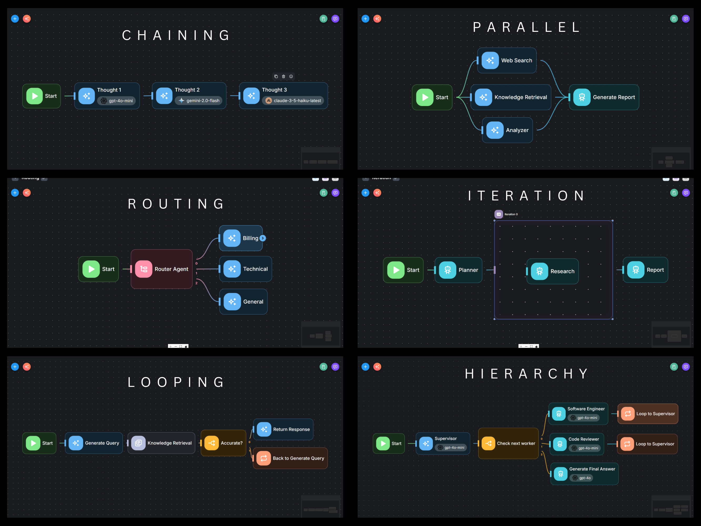<figcaption></figcaption></figure>

## 智能体流程 和自动化平台之间的区别

最常被问到的问题之一：智能体流程 和 n8n、Make 或 Zapier 等自动化平台有什么区别？

### 💬 **代理间通信**

支持代理之间的多模式通信。主管代理可以制定任务并将其委派给多个工作代理，工作代理的输出随后返回给主管。

在每个步骤中，代理都可以访问完整的对话历史记录，使主管能够确定下一个任务，而工作代理能够解释任务、选择适当的工具并相应地执行操作。

这种架构支持跨多个代理的**协作、委派和共享任务管理**，传统自动化工具通常不提供此类功能。

<figure><picture><source srcset="../.gitbook/assets/Screenshot 2025-05-16 153946.png" media="(prefers-color-scheme: dark)"></picture><figcaption></figcaption></figure>

### 🙋‍♂ 人机交互

在等待人工输入时暂停执行，不会阻塞正在运行的线程。每个检查点都会被保存，即使在应用程序重新启动后，工作流程也可以从同一点恢复。

使用检查点可以实现**长时间运行、有状态的代理**。

代理还可以配置为 **在执行工具之前请求权限**，类似于 Claude 在使用 MCP 工具之前请求用户批准的方式。这有助于防止在没有明确用户批准的情况下自主执行敏感操作。

<figure><picture><source srcset="../.gitbook/assets/Screenshot 2025-05-16 154908.png" media="(prefers-color-scheme: dark)"></picture><figcaption></figcaption></figure>

### 📖 共享状态

共享状态支持代理之间的数据交换，对于跨分支或流程中的非相邻步骤传递数据特别有用。请参阅[#了解流状态](agentflowv2.md#understanding-flow-state "mention")

### ⚡ 流式输出

支持服务器发送事件 (SSE)，以实时传输 LLM 或代理响应。随着工作流程的进展，流式传输还可以订阅执行更新。

<figure>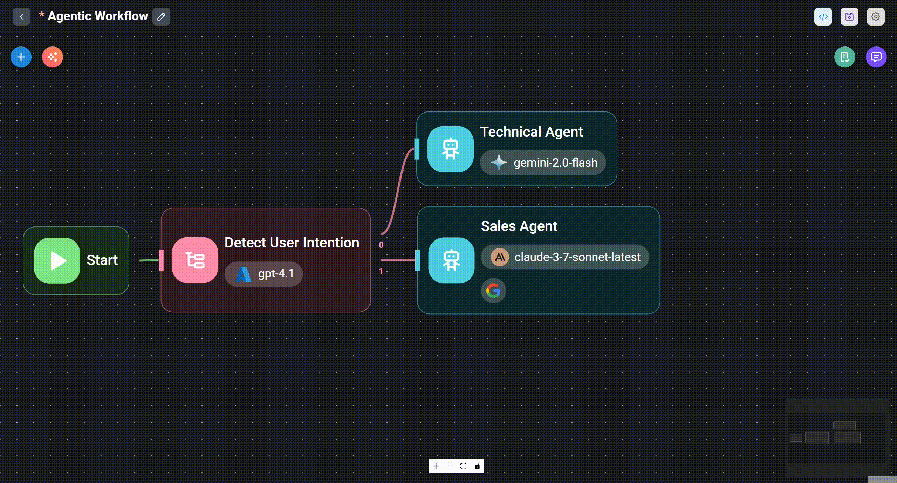<figcaption></figcaption></figure>

### 🌐 MCP 工具

虽然传统自动化平台通常具有广泛的预构建集成库，但 智能体流程 允许将 MCP（[模型上下文协议](https://github.com/modelcontextprotocol)）工具作为工作流程的一部分进行连接，而不是单独充当代理工具。

自定义 MCP 也可以独立创建，无需依赖平台提供的集成。 MCP 被广泛认为是行业标准，通常由官方提供商支持和维护。例如，GitHub MCP 由 GitHub 团队开发和维护，并为 Atlassian Jira、Brave Search 等提供类似的支持。

<figure><picture><source srcset="../.gitbook/assets/Screenshot 2025-05-16 160752.png" media="(prefers-color-scheme: dark)"></picture><figcaption></figcaption></figure>

## 智能体流程 V2 节点参考

本节提供每个可用节点的详细参考，概述其特定用途、关键配置参数、预期输入、生成的输出及其在 AgentFlow V2 架构中的作用。

<figure><picture><source srcset="../.gitbook/assets/agentflowv2/darkmode/v2-01-d (1).png" media="(prefers-color-scheme: dark)">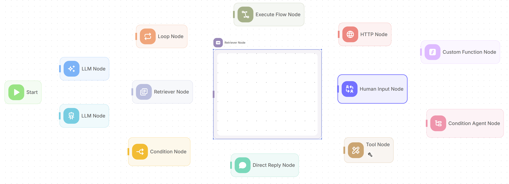</picture><figcaption></figcaption></figure>

***

### **1。启动节点**

用于启动任何 AgentFlow V2 工作流执行的指定入口点。每个流都必须从此节点开始。

* **功能：** 定义如何触发工作流程并设置初始条件。它可以直接从聊天界面接受输入，也可以通过呈现给用户的可定制表单接受输入。它还允许在执行开始时初始化 `Flow State` 变量，并可以管理如何处理运行的会话内存。
* **配置参数**
  * **输入类型**：确定如何启动工作流执行，可以通过用户的 `Chat Input` 启动，也可以通过提交的 `Form Input` 启动。
    * **表单标题、表单描述、表单输入类型**：如果选择 `Form Input`，这些字段将配置呈现给用户的表单外观，允许使用定义的标签和变量名称的各种输入字段类型。
  * **临时内存**：如果启用，则指示工作流开始执行，而不考虑对话线程中的任何过去的消息，从而有效地从干净的内存板开始。
  * **流程状态**：定义工作流运行时状态 `$flow.state` 的完整初始键值对集。后续节点将使用或更新的所有状态密钥必须在此处声明和初始化。
* **输入：** 接收触发工作流的初始数据，该数据可以是聊天消息或通过表单提交的数据。
* **输出：** 提供单个输出锚点连接到第一个操作节点，传递初始输入数据和初始化的流状态。

<figure><picture><source srcset="../.gitbook/assets/agentflowv2/darkmode/v2-02-d.png" media="(prefers-color-scheme: dark)">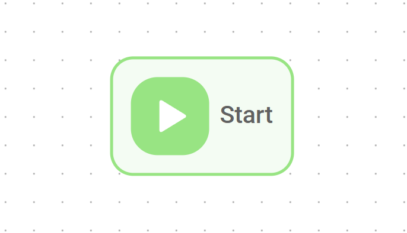</picture><figcaption></figcaption></figure>

***

### **2。 LLM 节点**

提供对配置的大型语言模型 (LLM) 的直接访问以执行 AI 任务，使工作流程能够在需要时执行结构化数据提取。

* **功能：** 该节点根据提供的指令（消息）和上下文向 LLM 发送请求。它可用于文本生成、摘要、翻译、分析、回答问题以及根据定义的模式生成结构化 JSON 输出。它可以访问对话线程的内存，并且可以读/写 `Flow State`。
* **配置参数**
  * **模型**：指定所选服务的 AI 模型，例如 OpenAI 的 GPT-4o 或 Google Gemini。
  * **消息**：定义 LLM 的对话输入，将其构建为一系列角色 - 系统、用户、助理、开发人员 - 以指导 AI 的响应。可以使用 `{{ variable }}` 插入动态数据。
  * **内存**：如果启用，则确定 LLM 在生成响应时是否应考虑当前对话线程的历史记录。
    * **内存类型、窗口大小、最大令牌限制**：如果使用内存，这些设置会细化对话历史记录的管理方式并将其呈现给 LLM — 例如，是否包含所有消息、仅包含最近的轮次窗口或汇总版本。
    * **输入消息**：指定在由 LLM/Agent 处理之前将作为最新用户消息附加到现有对话上下文（包括初始上下文和内存）末尾的变量或文本。
  * **返回响应为**：配置 LLM 的输出如何分类 - 作为 `User Message` 或 `助手 Message` - 这可能会影响后续内存系统或日志记录的处理方式。
  * **JSON 结构化输出**：指示 LLM 根据特定的 JSON 模式格式化其输出 - 包括键、数据类型和描述 - 确保数据可预测、机器可读。
  * **更新流程状态**：允许节点在执行期间通过更新预定义键来修改工作流程的运行时状态 `$flow.state`。例如，这使得可以将此 LLM 节点的输出存储在这样的键下，使其可供后续节点访问。
* **输入：** 该节点利用来自工作流初始触发器或之前节点输出的数据，并将这些数据合并到 `Messages` 或 `Input Message` 字段中。当输入变量引用它时，它还可以从 `$flow.state` 检索值。
* **输出：** 产生 LLM 的响应，该响应可以是纯文本或结构化 JSON 对象。此输出的分类（用户或助理）由 `Return Response` 设置确定。

<figure><picture><source srcset="../.gitbook/assets/agentflowv2/darkmode/v2-03-d.png" media="(prefers-color-scheme: dark)">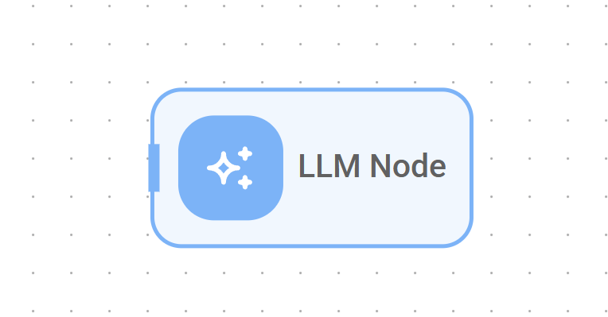</picture><figcaption></figcaption></figure>

***

### **3。代理节点**

代表一个自主的人工智能实体，能够推理、规划以及与工具或知识源交互以实现给定的目标。

* **功能：** 该节点使用 LLM 动态决定一系列操作。根据用户的目标（通过消息/输入提供），它可以选择使用可用的工具或查询文档存储来收集信息或执行操作。它管理自己的推理周期，并可以利用对话线程和 `Flow State` 的内存。适用于需要多步骤推理或与外部系统或工具动态交互的任务。
* **配置参数**
  * **模型**：指定所选服务的 AI 模型（例如 OpenAI 的 GPT-4o 或 Google Gemini），这将驱动代理的推理和决策过程。
* **消息**：定义代理的初始对话输入、目标或上下文，将其构建为一系列角色（系统、用户、助理、开发人员），以指导代理的理解和后续操作。可以使用 `{{ variable }}` 插入动态数据。
  * **工具**：指定代理有权使用哪些预定义的 Flowise 工具来实现其目标。
    * 对于每个选定的工具，可选的 **需要人工输入标志** 指示工具的操作是否可能会暂停以请求人工干预。
  * **知识/文档存储**：配置对 Flowise 管理的文档存储中的信息的访问。
    * **文档存储**：选择代理可以从中检索信息的预配置文档存储。这些商店必须提前设置并填充。
    * **描述知识**：提供此文档存储的内容和用途的自然语言描述。此描述指导代理了解商店包含什么类型的信息以及何时适合查询它。
  * **知识/向量嵌入**：配置对外部预先存在的向量存储的访问，作为代理的附加知识源。
    * **矢量存储**：选择代理可以查询的特定预配置矢量数据库。
    * **嵌入模型**：指定与所选矢量存储关联的嵌入模型，确保查询的兼容性。
    * **知识名称**：为这个基于向量的知识源分配一个简短的描述性名称，代理可以使用该名称作为参考。
    * **描述知识**：提供此向量存储的内容和用途的自然语言描述，指导代理何时以及如何利用此特定知识源。
    * **返回源文档**：如果启用，则指示代理将源文档信息包含在从矢量存储检索的数据中。
  * **内存**：如果启用，则确定代理在做出决策和生成响应时是否应考虑当前对话线程的历史记录。
    * **内存类型、窗口大小、最大令牌限制**：如果使用内存，这些设置会优化对话历史记录的管理和呈现给客服人员的方式 - 例如，是否包含所有消息、仅包含最近的轮次窗口或汇总版本。
    * **输入消息**：指定在由 LLM/Agent 处理之前将作为最新用户消息附加到现有对话上下文（包括初始上下文和内存）末尾的变量或文本。
  * **返回响应**：配置代理的最终输出或消息的分类方式（用户消息或助理消息），这可能会影响后续内存系统或日志记录的处理方式。
  * **更新流程状态**：允许节点在执行期间通过更新预定义键来修改工作流程的运行时状态 `$flow.state`。例如，这使得可以将该代理节点的输出存储在这样的键下，从而使其可供后续节点访问。
* **输入：** 该节点利用来自工作流初始触发器或来自先前节点输出的数据，通常合并到 `Messages` 或 `Input Message` 字段中。它根据需要访问配置的工具和知识源。
* **输出：** 在完成推理、规划以及与工具或知识源的任何交互后，生成代理生成的最终结果或响应。

<figure><picture><source srcset="../.gitbook/assets/agentflowv2/darkmode/v2-04-d.png" media="(prefers-color-scheme: dark)">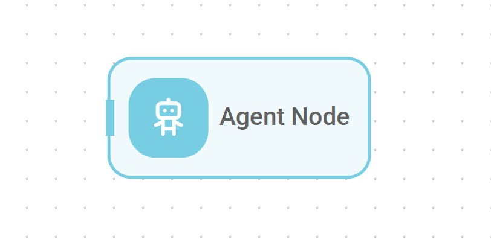</picture><figcaption></figcaption></figure>

***

### **4。工具节点**

提供一种在工作流程序列中直接、确定性地执行特定的、预定义的 Flowise 工具的机制。与代理节点不同，LLM 根据推理动态选择工具，而工具节点则完全执行工作流设计者在配置期间选择的工具。

* **功能：** 当工作流需要在定义点执行已知的特定功能并具有可用的输入时，使用此节点。它确保确定性操作，而不涉及工具选择的 LLM 推理。
* **它是如何工作的**
  1. **触发：** 当工作流执行到达工具节点时，它就会激活。
  2. **工具标识：** 它标识在其配置中选择的特定 Flowise 工具。
  3. **输入参数解析：** 它查看工具输入参数配置。对于所选工具的每个所需输入参数。
  4. **执行：** 它调用与所选 Flowise 工具关联的底层代码或 API 调用，传递已解析的输入参数。
  5. **输出生成：** 它接收工具执行返回的结果。
  6. **输出传播：** 它通过其输出锚点提供此结果以供后续节点使用。
* **配置参数**
  * **工具选择**：选择该节点将从下拉列表中执行的特定的已注册 Flowise 工具。
  * **输入参数**：定义如何将工作流程中的数据提供给所选工具。此部分根据所选工具动态调整，呈现其特定的所需输入参数：
    * **映射参数名称**：对于所选工具所需的每个输入（例如，计算器的 `input`），此字段将显示工具本身定义的预期参数名称。
    * **提供参数值**：使用 `{{ previousNode.output }}`、`{{ $flow.state.someKey }}` 等动态变量或输入静态文本来设置相应参数的值。
  * **更新流程状态**：允许节点在执行期间通过更新预定义键来修改工作流程的运行时状态 `$flow.state`。例如，这使得可以将此工具节点的输出存储在这样的键下，使其可供后续节点访问。
* **输入：** 通过 `Input Arguments` 映射、从先前节点输出、`$flow.state` 或静态配置获取值，接收工具参数的必要数据。
* **输出：** 生成由执行工具生成的原始输出 - 例如，来自 API 的 JSON 字符串、文本结果或数值。

<figure><picture><source srcset="../.gitbook/assets/agentflowv2/darkmode/v2-16-d.png" media="(prefers-color-scheme: dark)">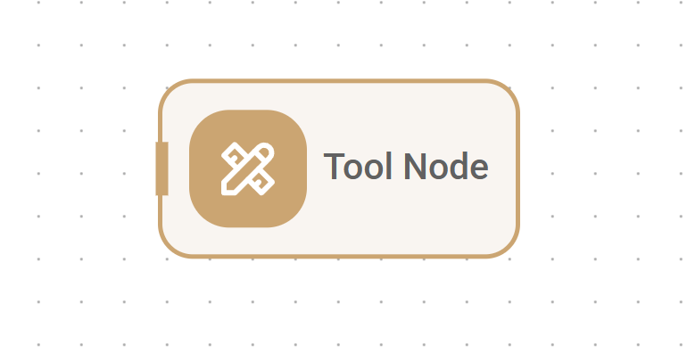</picture><figcaption></figcaption></figure>

***

### **5。检索器节点**

从配置的文档存储中执行有针对性的信息检索。

* **功能：** 该节点查询一个或多个指定的文档存储，根据语义相似性获取相关文档块。当唯一需要的操作是检索并且不需要 LLM 进行动态工具选择时，它是使用代理节点的集中替代方案。
* **配置参数**
  * **知识/文档存储**：指定此节点应查询哪些预配置和填充的文档存储以查找相关信息。
  * **检索器查询**：定义将用于搜索所选文档存储的文本查询。可以使用 `{{ variables }}` 插入动态数据。
  * **输出格式**：选择如何呈现检索到的信息 - 可以是普通的 `Text` 或 `Text with Metadata`，其中可能包括源文档名称或位置等详细信息。
* **更新流程状态**：允许节点在执行期间通过更新预定义键来修改工作流程的运行时状态 `$flow.state`。例如，这使得可以将此 检索器 节点的输出存储在这样的键下，使其可供后续节点访问。
* **输入：** 需要一个查询字符串 - 通常作为上一步或用户输入的变量提供 - 并访问选定的文档存储以获取信息。
* **输出：** 生成从知识库检索的文档块，根据所选的 `Output Format` 进行格式化。

<figure><picture><source srcset="../.gitbook/assets/agentflowv2/darkmode/v2-06-d.png" media="(prefers-color-scheme: dark)">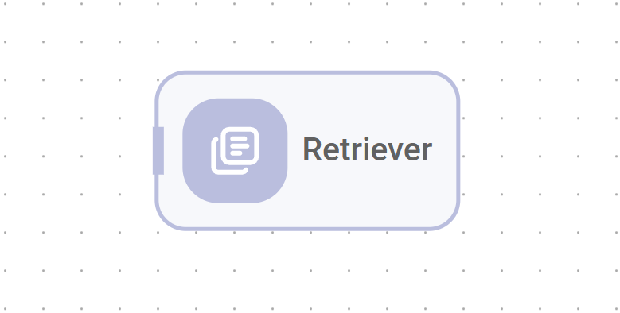</picture><figcaption></figcaption></figure>

***

### 6. HTTP 节点

通过超文本传输协议 (HTTP) 促进与外部 Web 服务和 API 的直接通信。

* **功能：** 该节点使工作流程能够与可通过 HTTP 访问的任何外部系统进行交互。它可以向指定的 URL 发送各种类型的请求（GET、POST、PUT、DELETE、PATCH），允许与第三方 API 集成、从 Web 资源获取数据或触发外部 Webhook。该节点支持配置身份验证方法、自定义标头、查询参数和不同的请求正文类型，以适应不同的 API 要求。
* **配置参数**
  * **HTTP 凭据**：可以选择预先配置的凭据（例如基本身份验证、承载令牌或 API 密钥）来验证对目标服务的请求。
  * **请求方法**：指定用于请求的 HTTP 方法 - 例如，`GET`、`POST`、`PUT`、`DELETE`、`PATCH`。
  * **目标 URL**：定义请求将发送到的外部端点的完整 URL。
  * **请求标头**：将任何必要的 HTTP 标头设置为要包含在请求中的键值对。
  * **URL 查询参数**：定义将作为查询参数附加到 URL 的键值对。
  * **请求正文类型**：如果发送数据，请选择请求负载的格式 - 选项包括 `JSON`、`Raw text`、`Form Data` 或 `x-www-form-urlencoded`。
  * **请求正文**：为 POST 或 PUT 等方法提供实际数据负载。格式应与所选的 `Body Type` 匹配，并且可以使用 `{{ variables }}` 插入动态数据。
  * **响应类型**：指定工作流应如何解释从服务器收到的响应 - 选项包括 `JSON`、`Text`、`Array Buffer` 或 `Base64` （适用于二进制数据）。
* **输入：** 接收配置数据，例如 URL、方法、标头和正文，通常包含来自先前工作流程步骤或 `$flow.state` 的动态值。
* **输出：** 生成从外部服务器接收到的响应，并根据所选的 `Response Type` 进行解析。

<figure><picture><source srcset="../.gitbook/assets/agentflowv2/darkmode/v2-07-d.png" media="(prefers-color-scheme: dark)">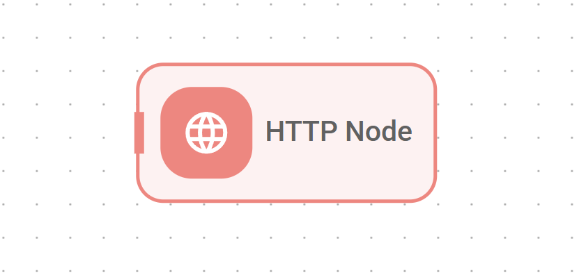</picture><figcaption></figcaption></figure>

***

### **7。条件节点**

根据定义的规则在工作流程中实现确定性分支逻辑。

* **功能：** 该节点充当决策点，评估一个或多个指定条件以引导工作流沿着不同的路径前进。它使用各种逻辑运算符（例如等于、包含、大于或为空）来比较输入值（可以是字符串、数字或布尔值）。根据这些条件评估为真还是假，工作流执行将沿着连接到该节点的不同输出分支之一继续进行。
* **配置参数**
  * **条件**：配置节点将评估的逻辑规则集。
    * **类型**：指定此规则要比较的数据类型 - `String`、`Number` 或 `Boolean`。
    * **值 1**：定义用于比较的第一个值。可以使用 `{{ variables }}` 插入动态数据。
    * **操作**：选择要在值 1 和值 2 之间应用的逻辑运算符 — 例如，`equal`、`notEqual`、`contains`、`larger`、`isEmpty`。
    * **值 2**：如果所选操作需要，定义用于比较的第二个值。动态数据也可以使用 `{{ variables }}` 插入此处。
* **输入：** 需要评估每个条件的 `Value 1` 和 `Value 2` 数据。这些值由先前的节点输出提供或从 `$flow.state` 检索。
* **输出：** 提供多个输出锚点，对应于评估条件的布尔结果（真/假）。工作流沿着连接到与结果匹配的输出锚点的特定路径继续。

<figure><picture><source srcset="../.gitbook/assets/agentflowv2/darkmode/v2-08-d.png" media="(prefers-color-scheme: dark)">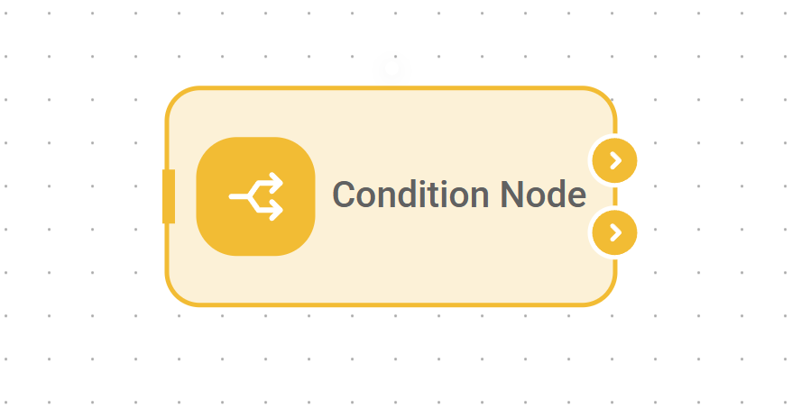</picture><figcaption></figcaption></figure>

***

### **8。条件代理节点**

提供基于自然语言指令和上下文的人工智能驱动的动态分支。

* **功能：** 该节点使用大型语言模型 (LLM) 来路由工作流。它根据定义决策任务的高级自然语言“指令”指导，根据一组用户定义的“场景”（潜在结果或类别）分析提供的输入数据。然后 LLM 确定哪种场景最适合当前输入上下文。基于这种人工智能驱动的分类，工作流执行沿着与所选场景相对应的特定输出路径进行。该节点对于用户意图识别、复杂条件路由或微妙的情境决策等任务特别有用，在这些任务中，简单的预定义规则（如条件节点中的规则）是不够的。
* **配置参数**
  * **模型**：指定所选服务中将执行分析和场景分类的 AI 模型。
  * **说明**：用自然语言定义 LLM 的总体目标或任务 - 例如，“确定用户的请求是否与销售、支持或一般查询有关。”
  * **输入**：使用 `{{ variables }}` 指定数据，通常是来自上一步或用户输入的文本，LLM 将分析该数据以做出路由决策。
  * **场景**：配置一个数组，定义工作流程可能采取的可能结果或不同路径。每个场景都用自然语言描述 - 例如，“销售查询”、“支持请求”、“一般问题” - 每个场景都对应于节点上的唯一输出锚点。
* **输入：** 需要 `Input` 数据进行分析，并需要 `Instructions` 来指导 LLM。
* **输出：** 提供多个输出锚点，每个定义的 `Scenario` 一个。工作流沿着连接到 LLM 确定与输入最匹配的输出锚点的特定路径继续。

<figure><picture><source srcset="../.gitbook/assets/agentflowv2/darkmode/v2-09-d.png" media="(prefers-color-scheme: dark)">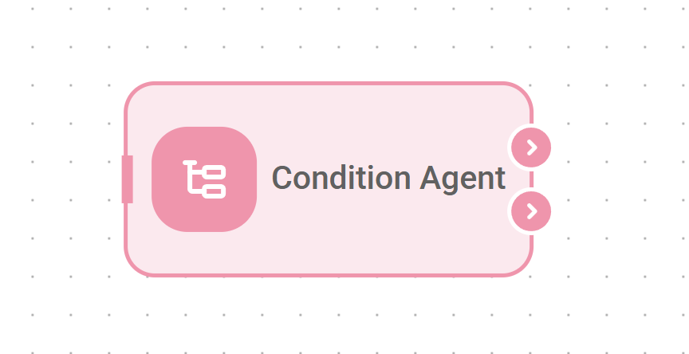</picture><figcaption></figcaption></figure>

***

### **9。迭代节点**

为输入数组中的每个项目执行定义的“子流”（嵌套在其中的一系列节点），实现“for-each”循环。

* **功能：** 该节点设计用于处理数据集合。它采用直接提供或通过变量引用的数组作为其输入。对于该数组中的每个单独元素，迭代节点顺序执行视觉上放置在画布上其边界内的其他节点的序列。
* **配置参数**
  * **数组输入**：指定节点将迭代的输入数组。这是通过引用一个变量来提供的，该变量保存来自前一个节点的输出或来自 `$flow.state` 的数组——例如 `{{ $flow.state.itemList }}`。
* **输入：** 需要为其 `Array Input` 参数提供一个数组。
* **输出：** 提供单个输出锚点，该锚点仅在嵌套子流完成输入数组中所有项目的执行后才变为活动状态。通过此输出传递的数据可以包括聚合结果或循环内修改的变量的最终状态，具体取决于子流的设计。放置在迭代块内的节点具有自己独特的输入和输出连接，这些连接定义了每个项目的操作顺序。

<figure><picture><source srcset="../.gitbook/assets/agentflowv2/darkmode/v2-10-d (1).png" media="(prefers-color-scheme: dark)">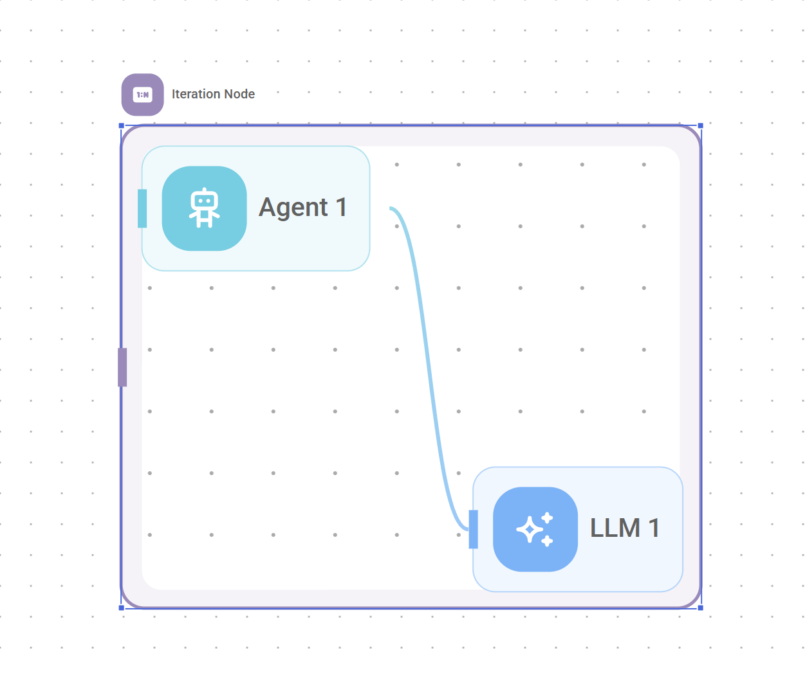</picture><figcaption></figcaption></figure>

***

### **10。循环节点**

将工作流执行显式重定向回先前执行的节点。

* **功能：** 该节点允许在工作流程中创建循环或迭代重试。当执行流程到达循环节点时，不会继续前进到新的节点；相反，它“跳”回到当前工作流运行中先前已执行过的指定目标节点。此操作会导致重新执行该目标节点以及流的该部分中的任何后续节点。
* **配置参数**
  * **循环返回**：选择执行应返回到的当前工作流中先前执行的节点的唯一 ID。
  * **最大循环计数**：定义在单个工作流执行中可以执行此循环操作的最大次数，防止无限循环。默认值为 5。
* **输入：** 接收执行信号以激活。它在内部跟踪当前执行中循环发生的次数。
* **输出：** 该节点没有标准的前向输出锚点，因为其主要功能是将执行流向后重定向到 `Loop Back To` 目标节点，然后工作流从该节点继续。

<figure><picture><source srcset="../.gitbook/assets/agentflowv2/darkmode/v2-11-d.png" media="(prefers-color-scheme: dark)">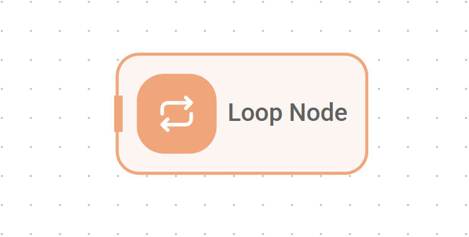</picture><figcaption></figcaption></figure>

***

### **11。人工输入节点**

暂停工作流执行以请求人类用户的显式输入、批准或反馈 - 人在环 (HITL) 流程的关键组件。

* **功能：** 该节点停止工作流程的自动进展，并通过聊天界面向人类用户呈现信息或问题。显示给用户的内容可以是预定义的静态文本，也可以是由 LLM 基于当前工作流程上下文动态生成的。向用户提供不同的操作选择——例如“继续”、“拒绝”——如果启用，还会有一个提供文本反馈的字段。一旦用户做出选择并提交响应，工作流就会沿着与其选择的操作相对应的特定输出路径恢复执行。
* **配置参数**
  * **描述类型**：确定如何生成向用户呈现的消息或问题 - `Fixed`（静态文本）或 `Dynamic`（由 LLM 生成）。
    * **如果描述类型为 `Fixed`**
* **描述**：此字段包含要向用户显示的确切文本。它支持使用 `{{ variables }}` 插入动态数据
    * **如果 `Description Type` 是 `Dynamic`**
      * **模型**：从所选服务中选择将生成面向用户的消息的 AI 模型。
      * **提示词**：为选定的 LLM 提供说明或提示词，以生成向用户显示的消息。
  * **反馈：** 如果启用，将通过反馈窗口提示词用户留下反馈，并且此反馈将附加到节点的输出中。
* **输入：** 接收执行信号以暂停工作流程。如果配置为动态内容，它可以通过 `Description` 或 `Prompt` 字段中的变量利用先前步骤中的数据或 `$flow.state` 。
* **输出：** 提供两个输出锚点，每个输出锚点对应一个不同的用户操作 - 一个锚点用于“继续”，另一个锚点用于“拒绝”。工作流程沿着连接到与用户选择匹配的锚点的路径继续。

<figure><picture><source srcset="../.gitbook/assets/agentflowv2/darkmode/v2-12-d.png" media="(prefers-color-scheme: dark)">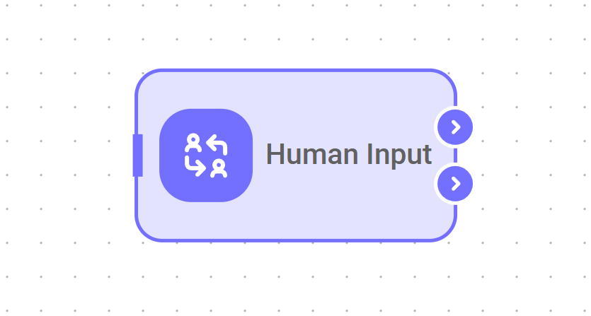</picture><figcaption></figcaption></figure>

***

### **12。直接回复节点**

向用户发送最终消息并终止当前执行路径。

* **功能：** 该节点充当特定分支或整个工作流程的端点。它采用配置的消息（可以是静态文本或变量中的动态内容）并通过聊天界面将其直接传递给最终用户。发送此消息后，工作流沿此特定路径的执行结束；从该点连接的其他节点将不会被处理。
* **配置参数**
  * **消息**：定义文本或变量 `{{ variable }}`，保存要作为最终回复发送给用户的内容。
* **输入：** 接收消息内容，该消息内容源自前一个节点的输出或存储在 `$flow.state` 中的值。
* **输出：** 该节点没有输出锚点，因为它的功能是在发送回复后终止执行路径。

<figure><picture><source srcset="../.gitbook/assets/agentflowv2/darkmode/v2-13-d.png" media="(prefers-color-scheme: dark)">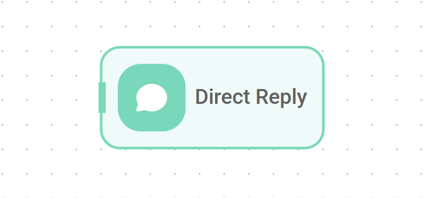</picture><figcaption></figcaption></figure>

***

### **13。自定义函数节点**

提供一种在工作流程中执行自定义服务器端 Javascript 代码的机制。

* **功能：** 该节点允许编写和运行任意 Javascript 片段，提供了一种有效的方法来实现复杂的数据转换、定制业务逻辑或与其他标准节点不直接支持的资源的交互。执行的代码在 Node.js 环境中运行，并具有访问数据的特定方式：
  * **输入变量：** 通过 `Input 变量` 配置传递的值可在函数内访问，通常以 `$` 为前缀 - 例如，如果定义了输入变量 `userid`，则可以将其作为 `$userid` 进行访问。
  * **流上下文：** 默认流配置变量可用，例如 `$flow.sessionId`、`$flow.chatId`、`$flow.chatflowId`、`$flow.input`（启动工作流的初始输入）以及整个 `$flow.state` 对象。
* **自定义变量：** Flowise 中设置的任何自定义变量 — 例如，`$vars。<variable-name>`。
  * **库：** 该函数可以利用已导入并在 Flowise 后端环境中可用的任何库。**该函数必须在执行结束时返回一个字符串值**。
* **配置参数**
  * **输入变量**：配置输入定义数组，这些定义将作为变量传递到 Javascript 函数的范围内。对于您想要定义的每个变量，您将指定：
* **变量名称**：您将用来在 Javascript 代码中引用此变量的名称，通常以 `$` 为前缀 - 例如，如果您在此处输入 `myValue`，您可以在脚本中将其作为 `$myValue` 访问，这与输入架构属性的映射方式相对应。
    * **变量值**：分配给该变量的实际数据，可以是静态文本，或更常见的是来自工作流程的动态值，例如 `{{ previousNode.output }}` 或 `{{ $flow.state.someKey }}`。
  * **Javascript 函数**：编写服务器端 Javascript 函数的代码编辑器字段。该函数最终必须返回一个字符串值。
  * **更新流程状态**：允许节点在执行期间通过更新预定义键来修改工作流程的运行时状态 `$flow.state`。例如，这使得可以将此自定义函数节点的字符串输出存储在这样的键下，以便后续节点可以访问它。
* **输入：** 通过 `Input 变量` 中配置的变量接收数据。还可以隐式访问 `$flow` 上下文和 `$vars` 的元素。
* **输出：** 生成执行的 Javascript 函数返回的字符串值。

<figure><picture><source srcset="../.gitbook/assets/agentflowv2/darkmode/v2-14-d.png" media="(prefers-color-scheme: dark)">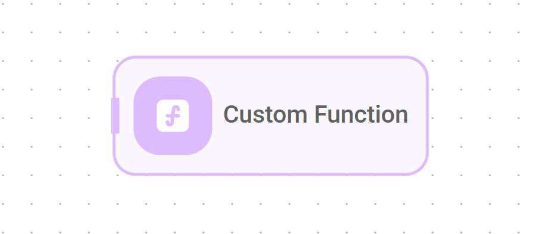</picture><figcaption></figcaption></figure>

***

### **14。执行流程节点**

允许从当前工作流程中调用和执行另一个完整的 Flowise 聊天流 或 AgentFlow。

* **功能性：** 该节点作为子工作流调用者，促进了逻辑的模块化设计和可重用性。它允许当前工作流程触发一个单独的、预先存在的工作流程（由 Flowise 实例中的名称或 ID 标识），将初始输入传递给它，可选择覆盖该特定运行的目标流程的特定配置，然后将其最终输出接收回调用工作流程以继续处理。
* **配置参数**
  * **连接凭据**：如果调用的目标流需要特定的身份验证或执行权限，则可以选择提供 聊天流 API 凭据。
  * **选择流**：指定此节点将从 Flowise 实例中的可用流列表中执行的特定 聊天流 或 AgentFlow。
  * **输入**：定义数据 - 静态文本或 `{{ variable }}` - 将在调用目标工作流时作为主要输入传递到目标工作流。
  * **覆盖配置**：可以选择提供一个 JSON 对象，其中包含参数，这些参数将专门针对此执行实例覆盖目标工作流的默​​认配置 - 例如，临时更改子流程中使用的模型或提示词。
  * **基础 URL**：可以选择为托管目标流的 Flowise 实例指定替代基础 URL。这在分布式设置中或当通过不同路由访问流时非常有用，如果未设置，则默认为当前实例的 URL 。
  * **返回响应为**：确定执行子流程的最终输出在返回到当前工作流程时应如何分类 - 作为 `User Message` 或 `助手 Message`。
  * **更新流程状态**：允许节点在执行期间通过更新预定义键来修改工作流程的运行时状态 `$flow.state`。例如，这使得可以将此执行流节点的输出存储在这样的键下，从而使其可供后续节点访问。
* **输入：** 需要选择目标流量及其 `Input` 数据。
* **输出：** 生成执行的目标工作流返回的最终输出，根据 `Return Response As` 设置进行格式化。

<figure><picture><source srcset="../.gitbook/assets/agentflowv2/darkmode/v2-15-d.png" media="(prefers-color-scheme: dark)">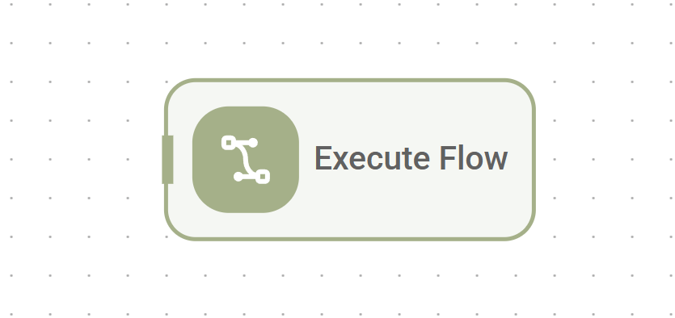</picture><figcaption></figcaption></figure>

## 理解流状态

**流状态**是实现 AgentFlow V2 灵活性和数据管理功能的关键架构功能。此机制提供了一种在单个工作流实例的执行过程中动态管理和共享数据的方法。

### **什么是心流状态？**

* 流状态 (`$flow.state`) 是一个**运行时键值存储**，在单次执行中的节点之间共享。
* 它充当临时内存或共享上下文，仅在特定运行/执行期间存在。

### **心流状态的目的**

`$flow.state` 的主要目的是实现节点之间的**显式数据共享和通信，特别是那些在工作流图中可能未直接连接的**，或者当数据需要在多个步骤中有意持久化和修改时。它解决了几个常见的编排挑战：

1. **跨分支传递数据：** 如果工作流分成条件路径，则一个分支中生成或更新的数据可以存储在 `$flow.state` 中，以便稍后在路径合并或其他分支需要该信息时访问。
2. **跨非相邻步骤访问数据：** 由早期节点初始化或更新的信息可以由较晚的节点检索，而无需将其显式传递通过每个中间节点的输入和输出。

### **心流状态如何工作**

1. **密钥的初始化/声明**
   * 将在整个工作流程中使用的所有状态键**必须使用**启动节点**中的 `Flow State` 参数使用其默认值（即使为空）进行初始化**。此步骤有效地声明了该工作流程的 `$flow.state` 的架构或结构。您可以在此处定义初始键值对。

<figure><picture><source srcset="../.gitbook/assets/Screenshot 2025-05-16 160038.png" media="(prefers-color-scheme: dark)"></picture><figcaption></figcaption></figure>

2. **更新状态/修改现有密钥**

* 许多操作节点 — 例如 `LLM`、`Agent`、`工具`、`HTTP`、`检索器`、`Custom Function` — 在其配置中包含 `Update Flow State` 参数。
* 此参数允许节点**修改 `$flow.state` 内预先存在的键的值**。
* 值可以是静态文本、当前节点的直接输出、上一个节点的输出以及许多其他变量。类型 `{{` 将显示所有可用变量。
* 当节点成功执行时，它会使用新值**更新** `$flow.state` 中的指定键。 **运行节点无法创建新密钥；只能更新预定义的密钥。**

<figure><picture><source srcset="../.gitbook/assets/Screenshot 2025-05-16 160347.png" media="(prefers-color-scheme: dark)"></picture><figcaption></figcaption></figure>

3. **从状态读取**

* 任何接受变量的节点输入参数都可以从 Flow State 中读取值。
* 使用特定语法：`{{ $flow.state.yourKey }}` — 将 `yourKey` 替换为在启动节点中初始化的实际键名称。
* 例如，LLM 节点的提示词可能包括 `"...based on the user status: {{ $flow.state.customerStatus }}"`。

<figure><picture><source srcset="../.gitbook/assets/Screenshot 2025-05-16 161711.png" media="(prefers-color-scheme: dark)"></picture><figcaption></figcaption></figure>

### **范围和持久性：**

* 它在工作流执行开始时创建并初始化，并在特定执行结束时销毁。
* 它**不会**在不同的用户会话或同一工作流程的单独运行中持续存在。
* 工作流的每个并发执行都维护自己独立的`$flow.state`。

## 视频资源




