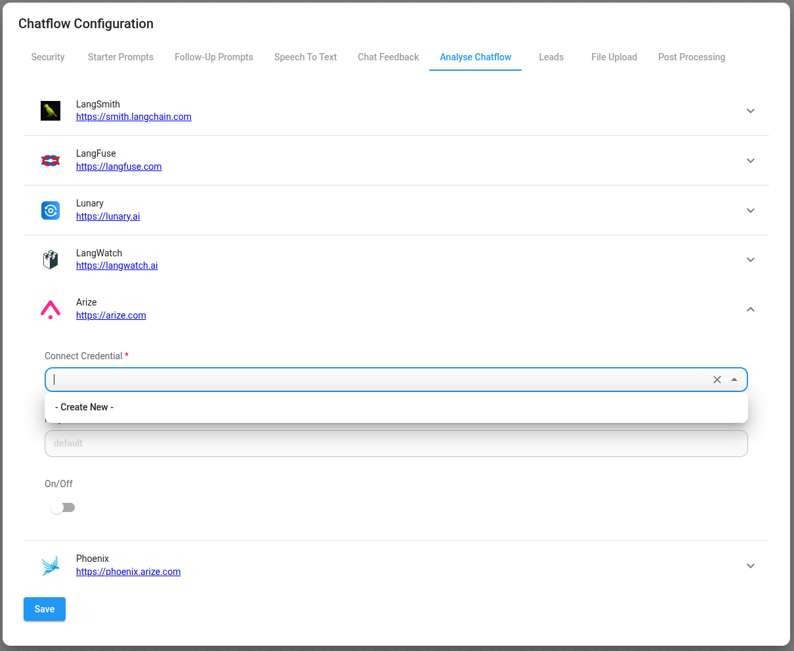
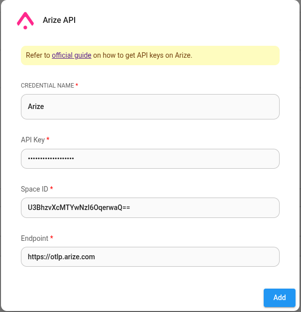
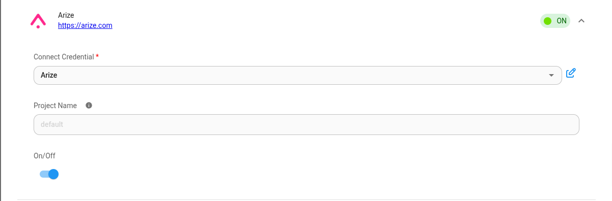

#阿里兹

***

[Arize AI](https://docs.arize.com/arize) 是一个生产级可观测性平台，用于大规模监控、调试和改进 LLM 应用程序和 AI 智能体。如需免费的开源替代方案，请探索[Phoenix](https://docs.flowiseai.com/using-flowise/analytics/phoenix)。

## 设置

1. 在 聊天流 或 智能体流程 的右上角，单击 **设置** > **配置**

<figure><figcaption></figcaption></figure>

2. 然后进入分析聊天流部分

<figure><figcaption></figcaption></figure>

3. 您将看到提供程序列表及其配置字段。单击阿里兹。

<figure><figcaption></figcaption></figure>

4. 为 Arize 创建凭据。请参阅[官方指南](https://docs.arize.com/arize/llm-tracing/quickstart-llm#get-your-api-keys)，了解如何获取 Arize API 密钥。

<figure><figcaption></figcaption></figure>

5.填写其他配置详细信息，然后打开提供商**ON**

<figure><figcaption></figcaption></figure>
