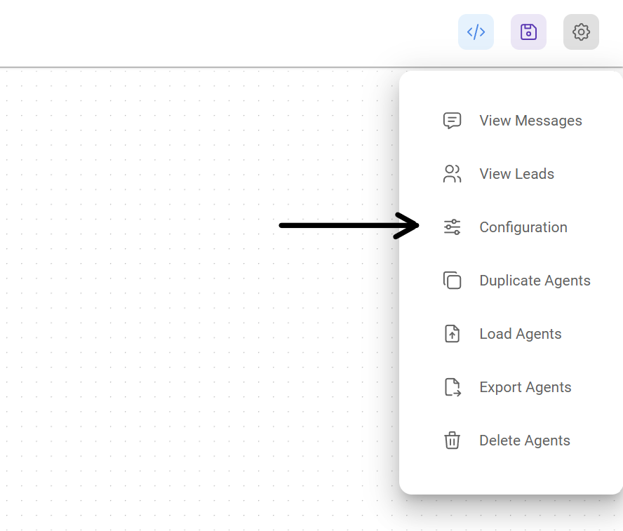
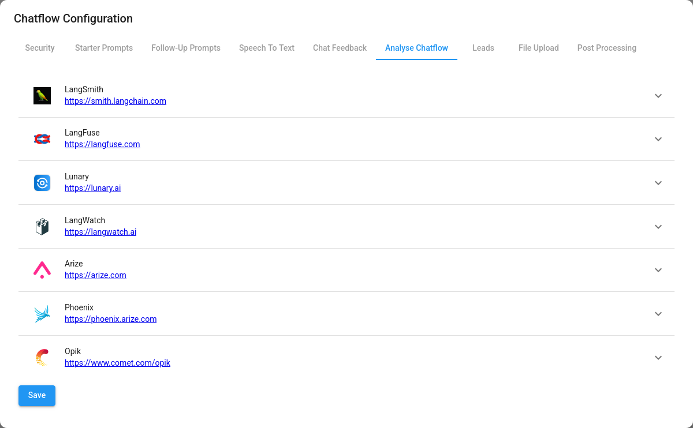
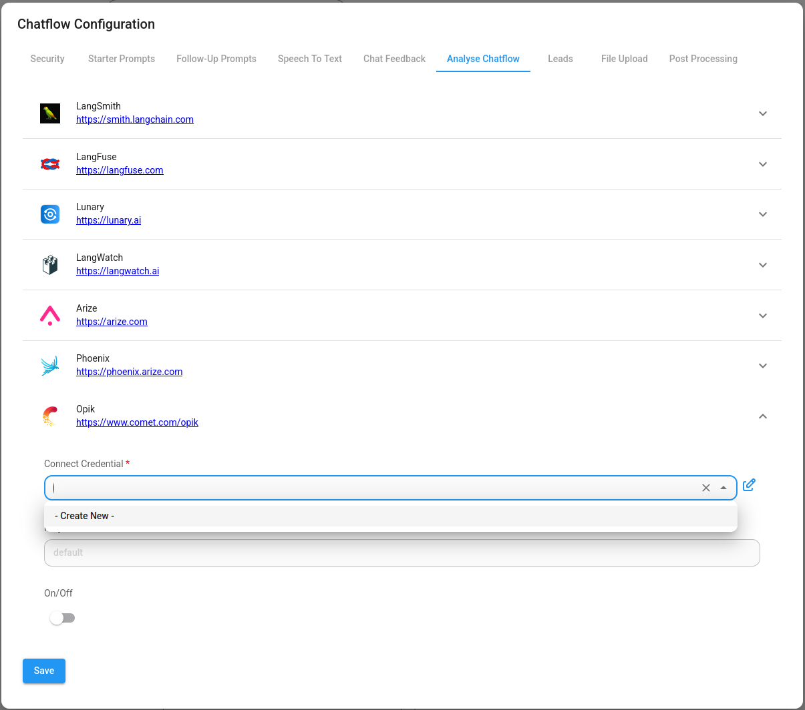
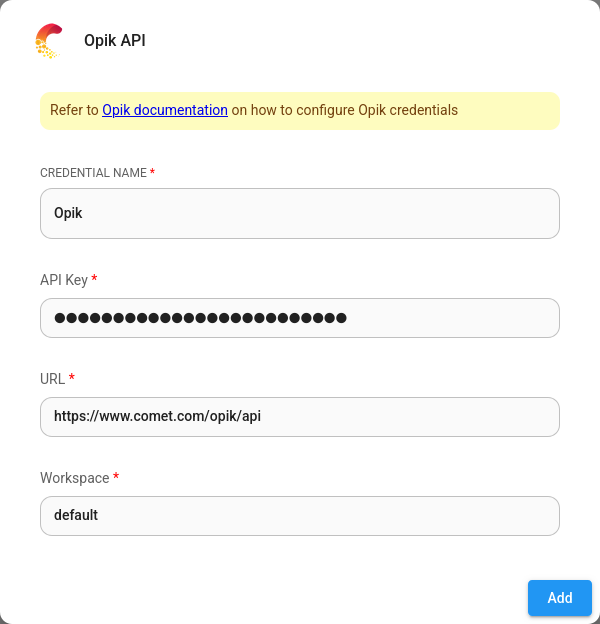
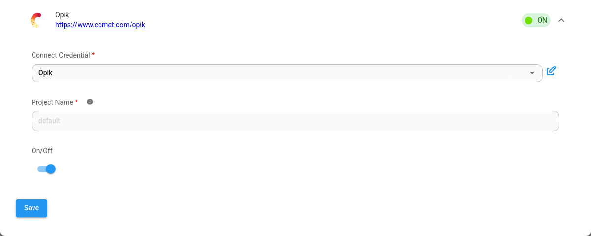
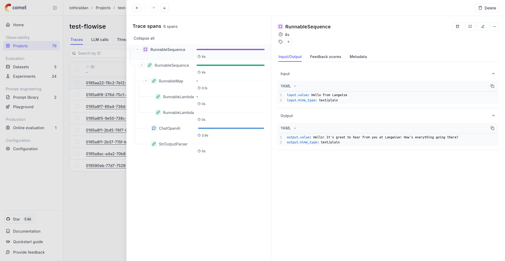

# 奥皮克

***

## 设置

1. 在 聊天流 或 智能体流程 的右上角，单击 **设置** > **配置**

<figure><figcaption></figcaption></figure>

2. 然后进入分析聊天流部分

<figure><figcaption></figcaption></figure>

3. 您将看到提供程序列表及其配置字段。单击“奥皮克”。

<figure><figcaption></figcaption></figure>

4. 为 Opik 创建凭据。请参阅[官方指南](https://www.comet.com/docs/opik/tracing/sdk_configuration)，了解如何获取 Opik API 密钥。

<figure><figcaption></figcaption></figure>

5.填写其他配置详细信息，然后打开提供商**ON**

<figure><figcaption></figcaption></figure>

现在您可以使用 Opik UI 分析您的聊天流和智能体流程：

<figure><figcaption></figcaption></figure>