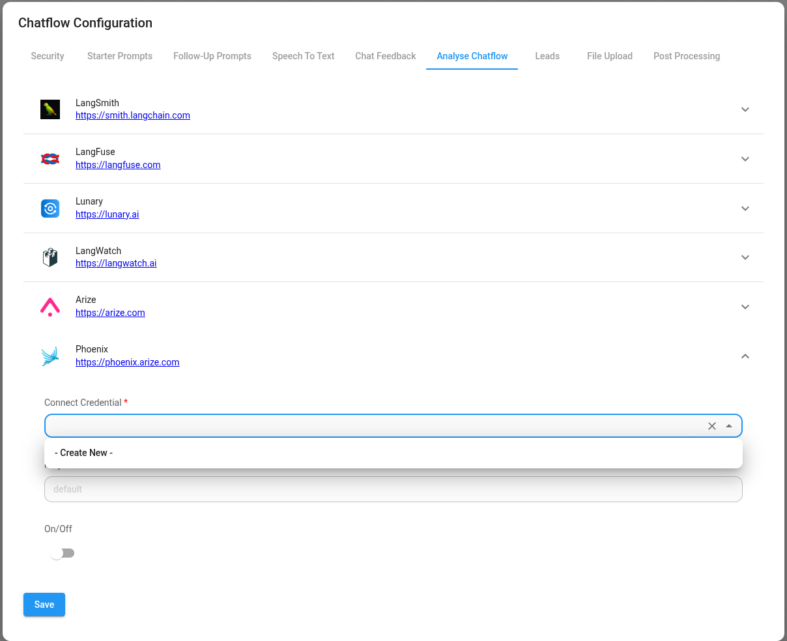
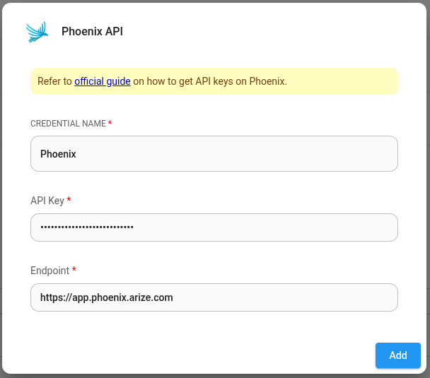
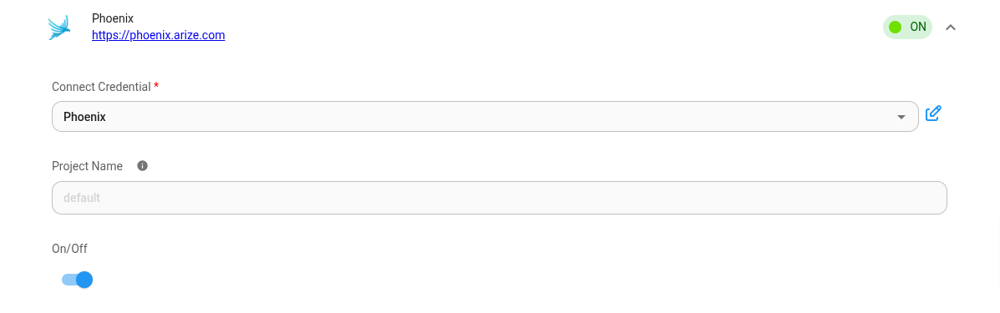

# 凤凰城

***

[Phoenix](https://docs.arize.com/phoenix/self-hosting) 是一款开源可观察性工具，专为 AI 和 LLM 应用程序的实验、评估和故障排除而设计。它可以以 [Cloud](https://app.phoenix.arize.com/login) 形式在线访问，也可以自行托管并在您自己的计算机或服务器上运行。

## 设置

1. 在 聊天流 或 智能体流程 的右上角，单击 **设置** > **配置**

<figure><figcaption></figcaption></figure>

2. 然后进入分析聊天流部分

<figure><figcaption></figcaption></figure>

3. 您将看到提供程序列表及其配置字段。点击凤凰。

<figure><figcaption></figcaption></figure>

4. 为 Phoenix 创建凭据。请参阅[官方指南](https://docs.arize.com/phoenix/environments)，了解如何获取 Phoenix API 密钥。

<figure><figcaption></figcaption></figure>

5. 填写其他配置详细信息，然后打开提供商**开启**。单击“保存”。

<figure><figcaption></figcaption></figure>
