# 文档存储

***

Flowise 的文档存储提供了一种多功能的数据管理方法，使您能够上传、拆分和准备数据集并将其写入更新到单个位置。

这种集中式方法简化了数据处理，并允许有效管理各种数据格式，从而更轻松地在 Flowise 应用程序中组织和访问数据。

## 设置

在本教程中，我们将设置一个 [检索增强一代 (RAG)](broken-reference/) 系统来检索有关 _LibertyGuard Deluxe Homeowners Policy_ 的信息，这是法学硕士未接受过广泛培训的主题。

使用 **Flowise 文档存储**，我们将准备并写入更新有关 LibertyGuard 及其家庭保险单集的数据。这将使我们的 RAG 系统能够准确回答用户有关 LibertyGuard 家庭保险产品的查询。

## 1. 添加文档存储

首先添加文档存储并为其命名。在我们的例子中，“LibertyGuard 豪华房主政策”。

<figure>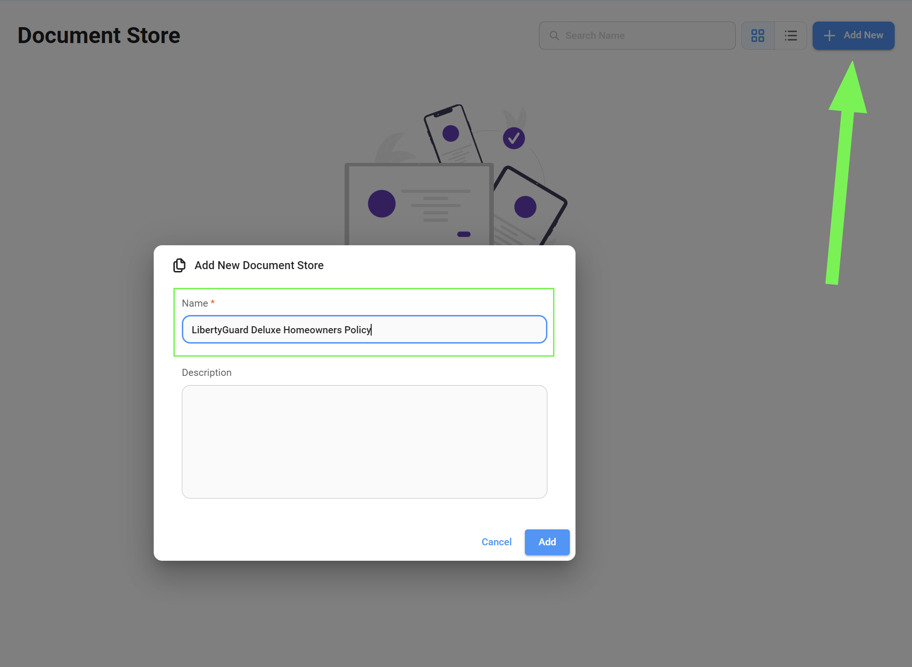<figcaption></figcaption></figure>

## 2. 选择文档加载器

进入您刚刚创建的文档存储，然后选择您要使用的[文档加载器](../integrations/langchain/document-loaders/)。在我们的例子中，由于我们的数据集采用 PDF 格式，因此我们将使用 [PDF Loader](../integrations/langchain/document-loaders/pdf-file.md)。

文档加载器是处理各种文档格式的摄取的专用节点。

<figure><figcaption></figcaption></figure>

<figure><figcaption></figcaption></figure>

## 3. 准备数据

### 第 1 步：文档加载器

* 首先，我们首先上传 PDF 文件。
* 然后，我们添加一个**唯一的元数据密钥**。这是可选的，但这是一个很好的做法，因为它允许我们在以后需要时定位和过滤相同的数据集。
* 每个加载器都带有预配置的元数据，在某些情况下您可以使用省略元数据键来删除不必要的元数据。

<figure><figcaption></figcaption></figure>

### 步骤 2：文本分割器

* 选择您要用于分块数据的[文本分割器](../integrations/langchain/text-splitters/)。在我们的特定情况下，我们将使用[递归字符文本分割器](../integrations/langchain/text-splitters/recursive-character-text-splitter.md)。
* 文本分割器用于将加载的文档分割成更小的片段、文档或块。这是一个至关重要的预处理步骤，主要原因有两个：

    * **检索速度和相关性：** 将大型文档作为单个实体存储和查询矢量数据库中可能会导致检索时间变慢，并可能导致相关结果降低。将文档分割成更小的块可以实现更有针对性的检索。通过查询更小、更集中的信息单元，我们可以实现更快的响应时间并提高检索结果的精度。
    * **成本效益：** 由于我们只检索相关块而不是整个文档，因此 LLM 处理的令牌数量显着减少。这种有针对性的检索方法直接降低了 LLM 的使用成本，因为计费通常基于令牌消耗。通过最大限度地减少发送到 LLM 的不相关信息量，我们还优化了成本。

    有不同的文本分块策略，包括：

    * **字符文本分割：** 将文本分割成固定数量字符的块。这种方法很简单，但可能会将单词或短语分割成多个块，从而可能破坏上下文。
* **标记文本分割：** 根据特定于所选嵌入模型的单词边界或标记化方案来分割文本。这种方法通常会产生语义上更连贯的块，因为它保留了单词边界并考虑了文本的底层语言结构。
    * **递归字符文本拆分：** 该策略旨在将文本划分为多个块，在保持指定大小限制的同时保持语义连贯性。它特别适合具有嵌套部分或标题的分层文档。它不是在字符限制下盲目分割，而是递归地分析文本以查找逻辑断点，例如句子结尾或分节符。这种方法确保每个块代表一个有意义的信息单元，即使它稍微超出目标大小。
    * **Markdown 文本分割器：** 专为 Markdown 格式文档设计，该拆分器根据 Markdown 标题和结构元素对文本进行逻辑分段，创建与文档中的逻辑部分相对应的块。
    * **代码文本分割器：** 专为拆分代码文件而设计，该策略考虑代码结构、函数定义和其他特定于编程语言的元素，以创建适合代码搜索和文档等任务的有意义的块。
    * **HTML-to-Markdown 文本分割器：** 此专用拆分器首先将 HTML 内容转换为 Markdown，然后应用 Markdown 文本分割器，从而允许对网页和其他 HTML 文档进行结构化分段。

    您还可以自定义参数，例如：

    * **块大小：** 每个块所需的最大大小，通常以字符或标记定义。
    * **块重叠：** 连续块之间重叠的字符或标记的数量，对于维护跨块的上下文流很有用。


在本指南中，我们添加了慷慨的 **块重叠** 大小，以确保块之间不会丢失相关数据。但是，最佳重叠大小取决于数据的复杂性。您可能需要根据您的特定数据集和要提取的信息的性质来调整此值。


<figure><figcaption></figcaption></figure>

## 4.预览您的数据

现在，我们可以预览如何使用当前的 [文本分割器](../integrations/langchain/text-splitters/) 配置对数据进行分块； `chunk_size=1500` 和 `chunk_overlap=750`。

<figure>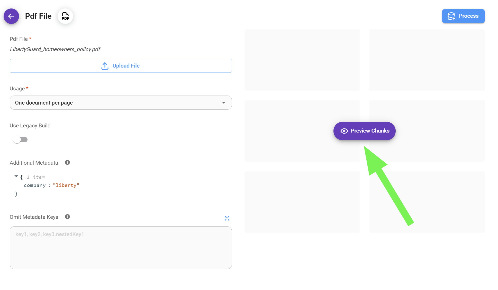<figcaption></figcaption></figure>

请务必尝试不同的[文本分割器](../integrations/langchain/text-splitters/)、块大小和重叠值，以找到适合您的特定数据集的最佳配置。此预览允许您优化分块过程并确保生成的块适合您的 RAG 系统。

<figure>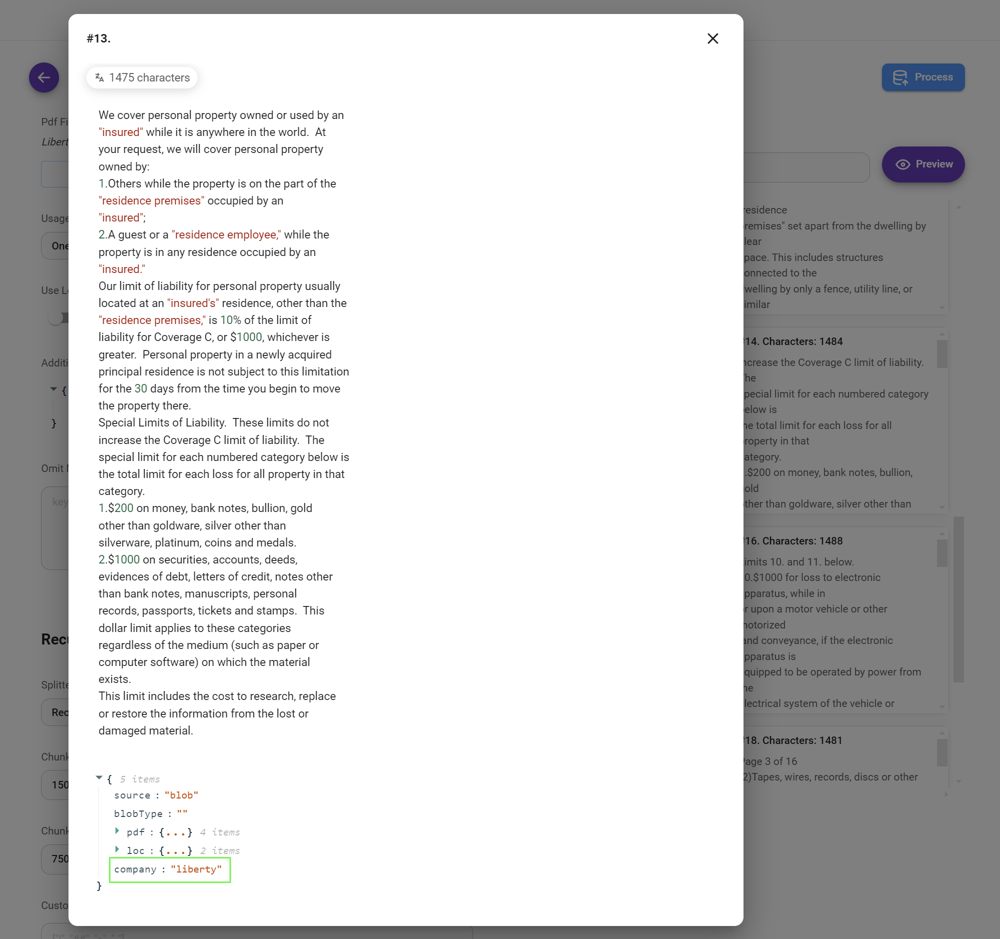<figcaption></figcaption></figure>


请注意，我们的自定义元数据 `company: "liberty"` 已插入到每个块中。即使我们对其他数据集使用相同的向量存储索引，此元数据也使我们能够稍后轻松地从该特定数据集中过滤和检索信息。


### 理解块重叠<a href="#understanding-chunk-overlap" id="understanding-chunk-overlap"></a>

在基于向量的检索和 LLM 查询的上下文中，块重叠在保持上下文连续性**和**提高响应准确性**方面发挥着重要作用，特别是在处理有限的检索深度或 **top K** 时，该参数确定从 [向量存储](https://docs.flowiseai.com/integrations/langchain/vector-stores) 检索以响应查询的最相似块的最大数量。

在查询处理期间，LLM 对向量存储执行相似性搜索，以检索与给定查询在语义上最相关的块。如果由顶部 K 参数表示的检索深度设置为一个较小的值（默认为 4），则 LLM 最初仅使用来自这 4 个块的信息来生成其响应。

这种情况给我们带来了一个问题，因为仅依赖有限数量的没有重叠的块可能会导致答案不完整或不准确，特别是在处理需要跨越多个块的信息的查询时。

块重叠通过确保连续块之间共享文本上下文的一部分来帮助解决此问题，**增加给定查询的所有相关信息包含在检索到的块中的可能性**。

换句话说，这种重叠充当块之间的桥梁，使 LLM 能够访问更宽的上下文窗口，即使仅限于一小部分检索到的块（前 K 个）。如果查询涉及超出单个块的概念或信息，则重叠区域会增加捕获所有必要上下文的可能性。

因此，通过在文本分割阶段引入块重叠，我们增强了 LLM 的能力：

1. **保持上下文连续性：** 重叠块提供连续片段之间的信息更平滑的过渡，使模型能够保持对文本的更连贯的理解。
2. **提高检索准确性：** 通过增加捕获目标前 K 个检索块内所有相关信息的概率，重叠有助于实现更准确和上下文适当的响应。

### 准确性与成本<a href="#accuracy-vs.-cost" id="accuracy-vs.-cost"></a>

因此，为了进一步优化检索精度和成本之间的权衡，可以使用两种主要策略：

1. **增加/减少块重叠：** 在文本分割期间调整重叠百分比可以对块之间共享上下文的数量进行细粒度控制。较高的重叠百分比通常会改善上下文保留，但也可能会增加成本，因为您需要使用更多块来包含整个文档。相反，较低的重叠百分比可以降低成本，但可能会丢失块之间的关键上下文信息，从而可能导致 LLM 的答案不太准确或不完整。
2. **增加/减少 Top K：** 提高默认的 top K 值 (4) 可扩展考虑用于生成响应的块的数量。虽然这可以提高准确性，但也会增加成本。

**提示词：**最佳**overlap**和**top K**值的选择取决于文档复杂性、嵌入模型特征以及准确性和成本之间所需的平衡等因素。对这些值进行试验对于找到满足特定需求的理想配置非常重要。

## 5. 处理您的数据

一旦您对分块过程感到满意，就可以处理数据了。

<figure><figcaption></figcaption></figure>

处理数据后，您仍然可以通过删除或添加内容来优化各个数据块。这种精细控制具有以下几个优点：

* **提高准确性：** 识别并纠正原始数据中存在的不准确或不一致之处，确保您的应用程序中使用的信息可靠。
* **提高相关性：** 细化块内容以强调关键信息并删除不相关的部分，从而提高检索过程的精度和有效性。
* **查询优化：** 定制块以更好地与预期的用户查询保持一致，使它们更有针对性并改善整体用户体验。

## 6. 配置写入更新过程

通过正确处理我们的数据（通过文档加载器加载并适当分块），我们现在可以继续配置 upsert 过程。

<figure><figcaption></figcaption></figure>

upsert 过程包括三个基本步骤：

* **嵌入：** 我们首先选择适当的嵌入模型来编码我们的数据集。该模型会将我们的数据转换为数值向量表示。
* **矢量存储：** 接下来，我们确定数据集所在的矢量存储。
* **记录管理器（可选）：** 最后，我们可以选择实现记录管理器。该组件提供了在数据集存储在矢量存储中后管理数据集的功能。

<figure><figcaption></figcaption></figure>

### 第 1 步：选择嵌入

点击“选择嵌入”卡并选择您首选的[嵌入模型](../integrations/langchain/embeddings/)。在我们的示例中，我们将选择 OpenAI 作为嵌入提供程序，并使用具有 `1536` 维度的 `text-embedding-ada-002` 模型。

嵌入是将文本转换为捕获其含义的数字表示的过程。这种数字表示也称为嵌入向量，是一个多维数字数组，其中每个维度代表文本含义的特定方面。

这些向量允许法学硕士通过测量多维空间中文本之间的距离或相似性来比较和搜索向量存储中的相似文本。

#### 了解嵌入/向量存储维度<a href="#understanding-embeddings-vector-store-dimensions" id="understanding-embeddings-vector-store-dimensions"></a>

矢量存储索引中的维数由我们写入更新数据时使用的嵌入模型决定，反之亦然。每个维度代表数据中的特定特征或概念。例如，**维度**可能**代表文本的特定主题、情绪或其他方面**。

我们用来嵌入数据的维度越多，从文本中捕捉微妙含义的潜力就越大。然而，这种增加是以每个查询的计算要求更高为代价的。

一般来说，维度越多，需要更多的资源来存储、处理和比较生成的嵌入向量。因此，理论上，像 Google `embedding-001` 这样使用 768 维的嵌入模型比 OpenAI `text-embedding-3-large` 这样使用 3072 维的嵌入模型更便宜。

值得注意的是，**维度和意义捕获之间的关系并不是严格线性的**；存在一个收益递减点，即增加更多维度所带来的好处可以忽略不计，而增加的不必要的成本却可以忽略不计。


为了确保嵌入模型和向量存储索引之间的兼容性，维度对齐至关重要。 **嵌入模型和向量存储索引必须具有相同的维度数**。维度不匹配将导致插入错误，因为矢量存储旨在处理由所选嵌入模型确定的特定大小的矢量。


<figure><figcaption></figcaption></figure>

### 第 2 步：选择矢量存储

点击“选择向量存储”卡，然后选择您喜欢的[向量存储](../integrations/langchain/vector-stores/)。在我们的例子中，由于我们需要一个生产就绪选项，因此我们将选择 Upstash。

矢量存储是一种特殊类型的数据库，用于存储矢量嵌入。我们可以微调诸如“**top K**”之类的参数，这些参数确定从向量存储中检索以响应查询的最相似块的最大数量。


较低的 top K 值将产生较少但可能更相关的结果，而较高的值将返回更广泛的结果，可能捕获更多信息。


<figure>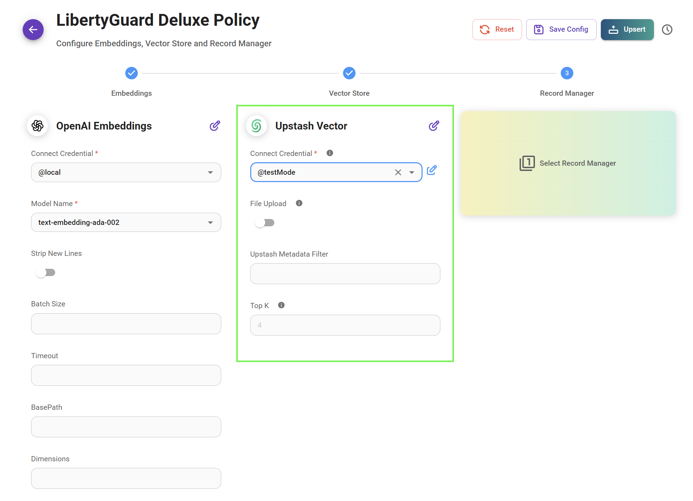<figcaption></figcaption></figure>

### 步骤 3：选择记录管理器

记录管理器是我们的写入更新流程中的一个可选但非常有用的补充。它允许我们维护已写入更新矢量存储的所有块的记录，使我们能够根据需要有效地添加或删除块。

换句话说，在新的写入更新期间对文档进行的任何更改都不会导致向量存储中存储重复的向量嵌入。

有关如何设置和使用此功能的详细说明，请参阅专用的[指南](../integrations/langchain/record-managers.md)。

<figure>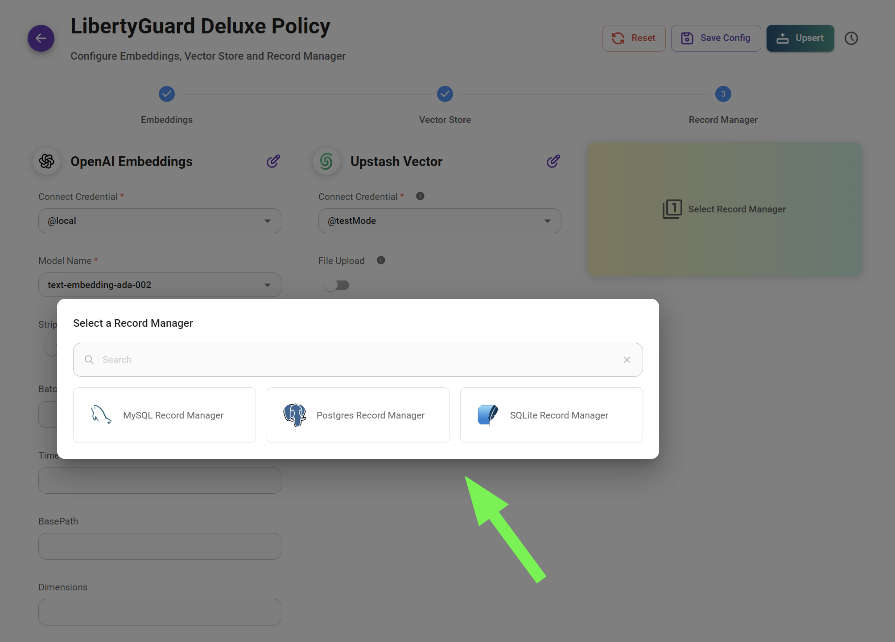<figcaption></figcaption></figure>

## 7. 将您的数据更新到矢量存储

要开始写入更新过程并将数据传输到矢量存储，请单击“写入更新”按钮。

<figure><figcaption></figcaption></figure>

如下图所示，我们的数据已成功插入到 Upstash 矢量数据库中。数据被分为 85 个块，以优化写入更新过程并确保高效的存储和检索。

<figure>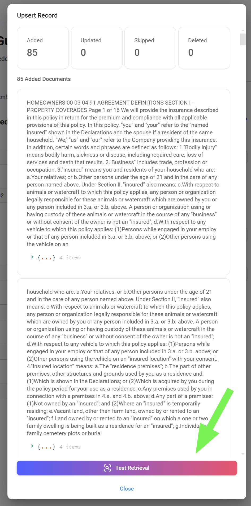<figcaption></figcaption></figure>

## 8. 测试您的数据集

要快速测试数据集的功能而无需离开文档存储，只需使用“检索查询”按钮即可。这将启动测试查询，使您能够验证数据检索过程的准确性和有效性。

<figure>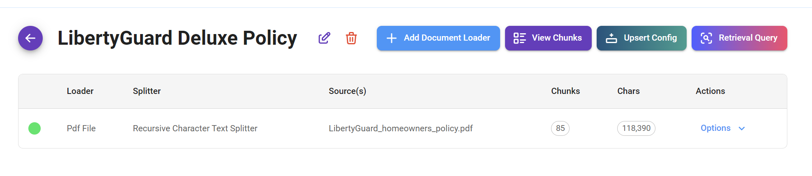<figcaption></figcaption></figure>

在我们的案例中，我们看到在查询保单中有关厨房地板承保范围的信息时，我们从 Upstash（我们指定的 向量存储）检索了 4 个相关块。根据定义的“top k”参数，此检索仅限于 4 个块，确保我们收到最相关的信息，而没有不必要的冗余。

<figure>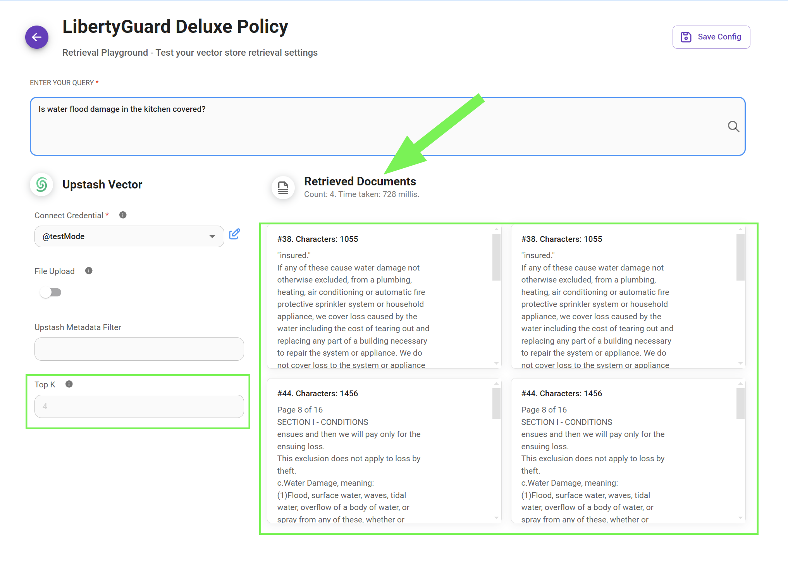<figcaption></figcaption></figure>

## 9. 测试您的 RAG

最后，我们的检索增强生成 (RAG) 系统投入运行。值得注意的是 LLM 如何有效地解释查询并成功地利用分块数据中的相关信息来构建全面的响应。

#### 智能体流程

使用代理节点，您可以添加文档存储：

<figure><figcaption></figcaption></figure>

<figure><figcaption></figcaption></figure>

或者直接连接向量数据库和嵌入模式：

<figure><figcaption></figcaption></figure>

#### 聊天流

您可以使用之前配置的矢量存储：

<figure><figcaption></figcaption></figure>

或者，使用文档存储（矢量）：

<figure><figcaption></figcaption></figure>

## 10.API

还有用于创建、更新和删除文档存储的 API 支持。在本节中，我们将重点介绍 2 个最常用的 API：

* 写入更新
* 刷新

有关详细信息，请参阅[文档存储API参考](../api-reference/document-store.md)。

### 写入更新 API

写入更新过程有几种不同的场景，每种场景都有不同的结果。

#### 场景 1：在同一文档存储中，使用现有文档加载器配置，写入更新为新文档加载器。

<figure>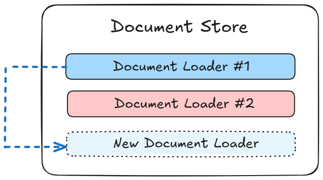<figcaption></figcaption></figure>


**`docId`** 表示现有文档加载器 ID。此场景的请求正文中需要它。




```python
import requests
import json

DOC_STORE_ID = "your_doc_store_id"
DOC_LOADER_ID = "your_doc_loader_id"
API_URL = f"http://localhost:3000/api/v1/document-store/upsert/{DOC_STORE_ID}"
API_KEY = "your_api_key_here"

form_data = {
    "files": ('my-another-file.pdf', open('my-another-file.pdf', 'rb'))
}

body_data = {
    "docId": DOC_LOADER_ID
}

headers = {
    "Authorization": f"Bearer {BEARER_TOKEN}"
}

def query(form_data):
    response = requests.post(API_URL, files=form_data, data=body_data, headers=headers)
    print(response)
    return response.json()

output = query(form_data)
print(output)
```



```javascript
const DOC_STORE_ID = "your_doc_store_id"
const DOC_LOADER_ID = "your_doc_loader_id"

let formData = new FormData();
formData.append("files", input.files[0]);
formData.append("docId", DOC_LOADER_ID)

async function query(formData) {
    const response = await fetch(
        `http://localhost:3000/api/v1/document-store/upsert/${DOC_STORE_ID}`,
        {
            method: "POST",
            headers: {
                "Authorization": "Bearer <your_api_key_here>"
            },
            body: formData
        }
    );
    const result = await response.json();
    return result;
}

query(formData).then((response) => {
    console.log(response);
});
```



#### 场景 2：在同一文档存储中，用新文件替换现有文档加载器。

<figure>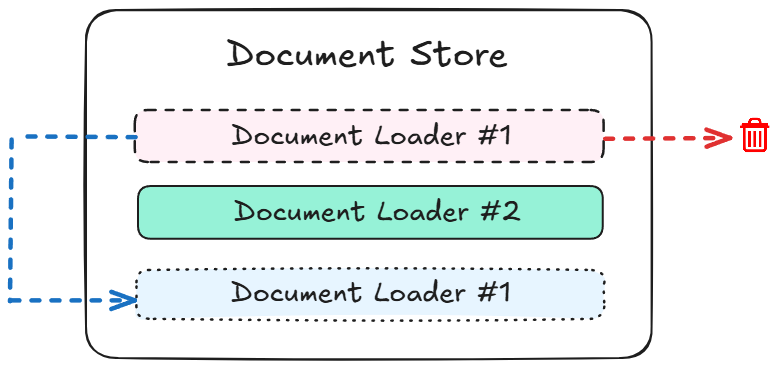<figcaption></figcaption></figure>


此场景的请求正文中都需要 **`docId`** 和 **`replaceExisting`** 。




```python
import requests
import json

DOC_STORE_ID = "your_doc_store_id"
DOC_LOADER_ID = "your_doc_loader_id"
API_URL = f"http://localhost:3000/api/v1/document-store/upsert/{DOC_STORE_ID}"
API_KEY = "your_api_key_here"

form_data = {
    "files": ('my-another-file.pdf', open('my-another-file.pdf', 'rb'))
}

body_data = {
    "docId": DOC_LOADER_ID,
    "replaceExisting": True
}

headers = {
    "Authorization": f"Bearer {BEARER_TOKEN}"
}

def query(form_data):
    response = requests.post(API_URL, files=form_data, data=body_data, headers=headers)
    print(response)
    return response.json()

output = query(form_data)
print(output)
```



```javascript
const DOC_STORE_ID = "your_doc_store_id";
const DOC_LOADER_ID = "your_doc_loader_id";

let formData = new FormData();
formData.append("files", input.files[0]);
formData.append("docId", DOC_LOADER_ID);
formData.append("replaceExisting", true);

async function query(formData) {
    const response = await fetch(
        `http://localhost:3000/api/v1/document-store/upsert/${DOC_STORE_ID}`,
        {
            method: "POST",
            headers: {
                "Authorization": "Bearer <your_api_key_here>"
            },
            body: formData
        }
    );
    const result = await response.json();
    return result;
}

query(formData).then((response) => {
    console.log(response);
});
```



#### 场景 3：在同一文档存储中，从头开始写入更新为新文档加载器。

<figure>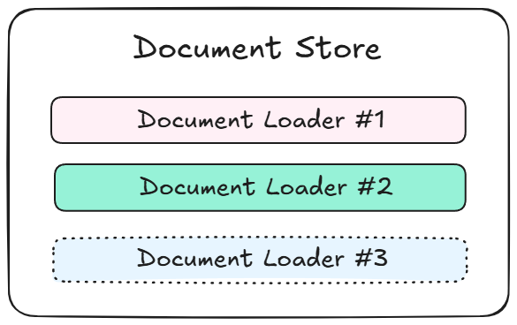<figcaption></figcaption></figure>


此场景的请求正文中都需要 **`loader`、`splitter`、`embedding`、`vectorStore`**。 **`recordManager`** 是可选的。




```python
import requests
import json

DOC_STORE_ID = "your_doc_store_id"
API_URL = f"http://localhost:3000/api/v1/document-store/upsert/{DOC_STORE_ID}"
API_KEY = "your_api_key_here"

form_data = {
    "files": ('my-another-file.pdf', open('my-another-file.pdf', 'rb'))
}

loader = {
    "name": "pdfFile",
    "config": {} # you can leave empty to use default config
}

splitter = {
    "name": "recursiveCharacterTextSplitter",
    "config": {
        "chunkSize": 1400,
        "chunkOverlap": 100
    }
}

embedding = {
    "name": "openAIEmbeddings",
    "config": {
        "modelName": "text-embedding-ada-002",
        "credential": <your_credential_id>
    }
}

vectorStore = {
    "name": "pinecone",
    "config": {
        "pineconeIndex": "exampleindex",
        "pineconeNamespace": "examplenamespace",
        "credential":  <your_credential_i
    }
}

body_data = {
    "docId": DOC_LOADER_ID,
    "loader": json.dumps(loader),
    "splitter": json.dumps(splitter),
    "embedding": json.dumps(embedding),
    "vectorStore": json.dumps(vectorStore)
}

headers = {
    "Authorization": f"Bearer {BEARER_TOKEN}"
}

def query(form_data):
    response = requests.post(API_URL, files=form_data, data=body_data, headers=headers)
    print(response)
    return response.json()

output = query(form_data)
print(output)
```



```javascript
const DOC_STORE_ID = "your_doc_store_id";
const API_URL = `http://localhost:3000/api/v1/document-store/upsert/${DOC_STORE_ID}`;
const API_KEY = "your_api_key_here";

const formData = new FormData();
formData.append("files", new Blob([await (await fetch('my-another-file.pdf')).blob()]), "my-another-file.pdf");

const loader = {
    name: "pdfFile",
    config: {} // You can leave empty to use the default config
};

const splitter = {
    name: "recursiveCharacterTextSplitter",
    config: {
        chunkSize: 1400,
        chunkOverlap: 100
    }
};

const embedding = {
    name: "openAIEmbeddings",
    config: {
        modelName: "text-embedding-ada-002",
        credential: "your_credential_id"
    }
};

const vectorStore = {
    name: "pinecone",
    config: {
        pineconeIndex: "exampleindex",
        pineconeNamespace: "examplenamespace",
        credential: "your_credential_id"
    }
};

const bodyData = {
    docId: "DOC_LOADER_ID",
    loader: JSON.stringify(loader),
    splitter: JSON.stringify(splitter),
    embedding: JSON.stringify(embedding),
    vectorStore: JSON.stringify(vectorStore)
};

const headers = {
    "Authorization": `Bearer BEARER_TOKEN`
};

async function query() {
    try {
        const response = await fetch(API_URL, {
            method: "POST",
            headers: headers,
            body: formData
        });

        const result = await response.json();
        console.log(result);
        return result;
    } catch (error) {
        console.error("Error:", error);
    }
}

query();

```




不建议从头开始创建，因为它会暴露您的凭据 ID。推荐的方法是创建占位符文档存储并在 UI 上配置参数。然后使用占位符作为添加新文档加载器或创建新文档存储的基础。


#### 场景 4：为每个写入更新创建新的文档存储

<figure><figcaption></figcaption></figure>


此场景的请求正文中都需要 **`createNewDocStore`** 和 **`docStore`** 。




```python
import requests
import json

DOC_STORE_ID = "your_doc_store_id"
DOC_LOADER_ID = "your_doc_loader_id"
API_URL = f"http://localhost:3000/api/v1/document-store/upsert/{DOC_STORE_ID}"
API_KEY = "your_api_key_here"

form_data = {
    "files": ('my-another-file.pdf', open('my-another-file.pdf', 'rb'))
}

body_data = {
    "docId": DOC_LOADER_ID,
    "createNewDocStore": True,
    "docStore": json.dumps({"name":"My NEW Doc Store"})
}

headers = {
    "Authorization": f"Bearer {BEARER_TOKEN}"
}

def query(form_data):
    response = requests.post(API_URL, files=form_data, data=body_data, headers=headers)
    print(response)
    return response.json()

output = query(form_data)
print(output)
```



```javascript
const DOC_STORE_ID = "your_doc_store_id";
const DOC_LOADER_ID = "your_doc_loader_id";

let formData = new FormData();
formData.append("files", input.files[0]);
formData.append("docId", DOC_LOADER_ID);
formData.append("createNewDocStore", true);
formData.append("docStore", JSON.stringify({ "name": "My NEW Doc Store" }));

async function query(formData) {
    const response = await fetch(
        `http://localhost:3000/api/v1/document-store/upsert/${DOC_STORE_ID}`,
        {
            method: "POST",
            headers: {
                "Authorization": "Bearer <your_api_key_here>"
            },
            body: formData
        }
    );
    const result = await response.json();
    return result;
}

query(formData).then((response) => {
    console.log(response);
});
```



#### 问：在哪里可以找到文档存储 ID 和文档加载器 ID？

答：您可以从 URL 中找到相应的 ID。

<figure><figcaption></figcaption></figure>

#### 问：在哪里可以找到要覆盖的可用配置？

答：您可以通过每个文档加载器上的 **View API** 按钮找到可用的配置：

<figure><figcaption></figcaption></figure>

<figure><figcaption></figcaption></figure>

对于每个 upsert，涉及 5 个元素：

* **`loader`**
* **`splitter`**
* **`embedding`**
* **`vectorStore`**
* **`recordManager`**

您可以使用元素的 **`config`** 主体覆盖现有配置。例如，使用上面的屏幕截图，您可以使用新的 **`url`** 创建一个新的文档加载器：



```python
import requests

API_URL = "http://localhost:3000/api/v1/document-store/upsert/<storeId>"

def query(payload):
    response = requests.post(API_URL, json=payload)
    return response.json()

output = query({
    "docId": <docLoaderId>,
    # override existing configuration
    "loader": {
        "config": {
            "url": "https://new-url.com"
        }
    }
})
print(output)
```



```javascript
async function query(data) {
    const response = await fetch(
        "http://localhost:3000/api/v1/document-store/upsert/<storeId>",
        {
            method: "POST",
            headers: {
                "Content-Type": "application/json"
            },
            body: JSON.stringify(data)
        }
    );
    const result = await response.json();
    return result;
}

query({
    "docId": <docLoaderId>,
    // override existing configuration
    "loader": {
        "config": {
            "url": "https://new-url.com"
        }
    }
}).then((response) => {
    console.log(response);
});
```



如果loader有文件上传怎么办？是的，你猜对了，我们必须使用表单数据作为正文！

使用下图作为示例，我们可以覆盖 PDF 文件加载器的 **`usage`** 参数，如下所示：

<figure><figcaption></figcaption></figure>



```python
import requests
import json

API_URL = "http://localhost:3000/api/v1/document-store/upsert/<storeId>"
API_KEY = "your_api_key_here"

form_data = {
    "files": ('my-another-file.pdf', open('my-another-file.pdf', 'rb'))
}

override_loader_config = {
    "config": {
        "usage": "perPage"
    }
}

body_data = {
    "docId": <docLoaderId>,
    "loader": json.dumps(override_loader_config) # Override existing configuration
}

headers = {
    "Authorization": f"Bearer {BEARER_TOKEN}"
}

def query(form_data):
    response = requests.post(API_URL, files=form_data, data=body_data, headers=headers)
    print(response)
    return response.json()

output = query(form_data)
print(output)
```



```javascript
const DOC_STORE_ID = "your_doc_store_id";
const DOC_LOADER_ID = "your_doc_loader_id";

const overrideLoaderConfig = {
    "config": {
        "usage": "perPage"
    }
}

let formData = new FormData();
formData.append("files", input.files[0]);
formData.append("docId", DOC_LOADER_ID);
formData.append("loader", JSON.stringify(overrideLoaderConfig));

async function query(formData) {
    const response = await fetch(
        `http://localhost:3000/api/v1/document-store/upsert/${DOC_STORE_ID}`,
        {
            method: "POST",
            headers: {
                "Authorization": "Bearer <your_api_key_here>"
            },
            body: formData
        }
    )
    const result = await response.json();
    return result;
}

query(formData).then((response) => {
    console.log(response);
});e
```



#### 问：何时使用表单数据与 JSON 作为 API 请求的正文？

答：对于具有文件上传功能的[文档加载器](../integrations/langchain/document-loaders/)，例如PDF、DOCX、TXT等，正文必须作为表单数据发送。


确保发送的文件类型与文档加载器期望的文件类型兼容。

例如，如果正在使用 [PDF 文件加载器](../integrations/langchain/document-loaders/pdf-file.md)，则您应该仅发送 **.pdf** 文件。

为了避免针对不同的文件类型使用单独的加载器，我们建议使用 [文件加载器](../integrations/langchain/document-loaders/file-loader.md)




```python
import requests
import json

API_URL = "http://localhost:3000/api/v1/document-store/upsert/<storeId>"

# use form data to upload files
form_data = {
    "files": ('my-another-file.pdf', open('my-another-file.pdf', 'rb'))
}

body_data = {
    "docId": <docId>
}

def query(form_data):
    response = requests.post(API_URL, files=form_data, data=body_data)
    print(response)
    return response.json()

output = query(form_data)
print(output)
```



```javascript
// use FormData to upload files
let formData = new FormData();
formData.append("files", input.files[0]);
formData.append("docId", <docId>);

async function query(formData) {
    const response = await fetch(
        "http://localhost:3000/api/v1/document-store/upsert/<storeId>",
        {
            method: "POST",
            body: formData
        }
    );
    const result = await response.json();
    return result;
}

query(formData).then((response) => {
    console.log(response);
});
```



对于不具有上传文件功能的其他 [文档加载器](https://docs.flowiseai.com/integrations/langchain/document-loaders) 节点，API 正文采用 **JSON** 格式：



```python
import requests

API_URL = "http://localhost:3000/api/v1/document-store/upsert/<storeId>"

def query(payload):
    response = requests.post(API_URL, json=payload)
    return response.json()

output = query({
    "docId": <docId>
})
print(output)
```



```javascript
async function query(data) {
    const response = await fetch(
        "http://localhost:3000/api/v1/document-store/upsert/<storeId>",
        {
            method: "POST",
            headers: {
                "Content-Type": "application/json"
            },
            body: JSON.stringify(data)
        }
    );
    const result = await response.json();
    return result;
}

query({
    "docId": <docId>
}).then((response) => {
    console.log(response);
});
```



#### 问：我可以添加新的元数据吗？

答：您可以通过在正文请求中传递 **`metadata`** 来提供新的元数据：

```json
{
    "docId": <doc-id>,
    "metadata": {
        "source: "abc"
    }
}
```

### 刷新 API

通常，您可能希望重新处理文档存储中的每个文档加载器以获取最新数据，并写入更新到矢量存储，以保持所有内容同步。这可以通过刷新 API 来完成：



```python
import requests

API_URL = "http://localhost:3000/api/v1/document-store/refresh/<storeId>"

def query():
    response = requests.post(API_URL)
    return response.json()

output = query()
print(output)
```



```javascript
async function query(data) {
    const response = await fetch(
        "http://localhost:3000/api/v1/document-store/refresh/<storeId>",
        {
            method: "POST",
            headers: {
                "Content-Type": "application/json"
            }
        }
    );
    const result = await response.json();
    return result;
}

query().then((response) => {
    console.log(response);
});
```



您还可以覆盖特定文档加载器的现有配置：



```python
import requests

API_URL = "http://localhost:3000/api/v1/document-store/refresh/<storeId>"

def query(payload):
    response = requests.post(API_URL, json=payload)
    return response.json()

output = query(
{
    "items": [
        {
            "docId": <docId>,
            "splitter": {
                "name": "recursiveCharacterTextSplitter",
                "config": {
                    "chunkSize": 2000,
                    "chunkOverlap": 100
                }
            }
        }
    ]
}
)
print(output)
```



```javascript
async function query(data) {
    const response = await fetch(
        "http://localhost:3000/api/v1/document-store/refresh/<storeId>",
        {
            method: "POST",
            headers: {
                "Content-Type": "application/json"
            },
            body: JSON.stringify(data)
        }
    );
    const result = await response.json();
    return result;
}

query({
    "items": [
        {
            "docId": <docId>,
            "splitter": {
                "name": "recursiveCharacterTextSplitter",
                "config": {
                    "chunkSize": 2000,
                    "chunkOverlap": 100
                }
            }
        }
    ]
}).then((response) => {
    console.log(response);
});
```



## 11. 总结

我们首先创建一个文档存储来组织 LibertyGuard Deluxe 房主策略数据。然后通过上传、分块、处理和写入更新来准备这些数据，使其为我们的 RAG 系统做好准备。

**文档存储的优点：**

文档存储为检索增强生成 (RAG) 系统的数据管理和准备提供了多种优势：

* **组织和管理：** 它们提供用于存储、管理和准备数据的中央位置。
* **数据质量：** 分块过程有助于构建数据以进行准确的检索和分析。
* **灵活性：** 文档存储允许根据需要细化和调整数据，从而提高 RAG 系统的准确性和相关性。

## 12. 视频教程

### RAG 像老板一样 - Flowise 文档存储教程

在此视频中，[Leon](https://youtube.com/@leonvanzyl) 提供了有关使用文档存储轻松管理 FlowiseAI 中的 RAG 知识库的分步教程。


