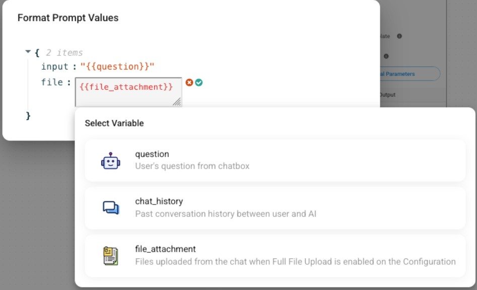

# 上传

Flowise 允许您从聊天中上传图像、音频和其他文件。在本节中，您将了解如何启用和使用这些功能。

## 图片

某些聊天模型允许您输入图像。请务必参考 LLM 的官方文档来确认模型是否支持图像输入。

* [ChatOpenAI](../integrations/llamaindex/chat-models/chatopenai.md)
* [AzureChatOpenAI](../integrations/llamaindex/chat-models/azurechatopenai.md)
* [ChatAnthropic](../integrations/langchain/chat-models/chatanthropic.md)
* [AWSChatBedrock](../integrations/langchain/chat-models/aws-chatbedrock.md)
* [ChatGoogleGenerativeAI](../integrations/langchain/chat-models/google-ai.md)
* [ChatOllama](../integrations/llamaindex/chat-models/chatollama.md)
* [Google Vertex AI](../integrations/langchain/llms/googlevertex-ai.md)


图像处理仅适用于 聊天流 中的某些链/代理。

[LLMChain](../integrations/langchain/chains/llm-chain.md)、[对话链](../integrations/langchain/chains/conversation-chain.md)、[ReAct 代理](../integrations/langchain/agents/react-agent-chat.md)、[对话代理](../integrations/langchain/agents/conversational-agent.md)、 [工具代理](../integrations/langchain/agents/tool-agent.md)


如果您启用**允许图像上传**，您可以从聊天界面上传图像。

<div align="center"><figure><figcaption></figcaption></figure> <figure><figcaption></figcaption></figure></div>

要使用 API 上传图像：



```python
import requests
API_URL = "http://localhost:3000/api/v1/prediction/<chatflowid>"

def query(payload):
    response = requests.post(API_URL, json=payload)
    return response.json()
    
output = query({
    "question": "Can you describe the image?",
    "uploads": [
        {
            "data": "data:image/png;base64,iVBORw0KGgdM2uN0", # base64 string or url
            "type": "file", # file | url
            "name": "Flowise.png",
            "mime": "image/png"
        }
    ]
})
```



```javascript
async function query(data) {
    const response = await fetch(
        "http://localhost:3000/api/v1/prediction/<chatflowid>",
        {
            method: "POST",
            headers: {
                "Content-Type": "application/json"
            },
            body: JSON.stringify(data)
        }
    );
    const result = await response.json();
    return result;
}

query({
    "question": "Can you describe the image?",
    "uploads": [
        {
            "data": "data:image/png;base64,iVBORw0KGgdM2uN0", //base64 string or url
            "type": "file", // file | url
            "name": "Flowise.png",
            "mime": "image/png"
        }
    ]
}).then((response) => {
    console.log(response);
});
```



## 音频

在 聊天流 配置中，您可以选择语音转文本模块。支持的集成包括：

* 开放人工智能
* 装配人工智能
* [LocalAI](../integrations/langchain/chat-models/chatlocalai.md)

启用此功能后，用户可以直接对着麦克风讲话。他们的讲话被转录成文本。

<div align="left"><figure><figcaption></figcaption></figure> <figure><figcaption></figcaption></figure></div>

要使用 API 上传音频：



```python
import requests
API_URL = "http://localhost:3000/api/v1/prediction/<chatflowid>"

def query(payload):
    response = requests.post(API_URL, json=payload)
    return response.json()
    
output = query({
    "uploads": [
        {
            "data": "data:audio/webm;codecs=opus;base64,GkXf", # base64 string
            "type": "audio",
            "name": "audio.wav",
            "mime": "audio/webm"
        }
    ]
})
```



```javascript
async function query(data) {
    const response = await fetch(
        "http://localhost:3000/api/v1/prediction/<chatflowid>",
        {
            method: "POST",
            headers: {
                "Content-Type": "application/json"
            },
            body: JSON.stringify(data)
        }
    );
    const result = await response.json();
    return result;
}

query({
    "uploads": [
        {
            "data": "data:audio/webm;codecs=opus;base64,GkXf", // base64 string
            "type": "audio",
            "name": "audio.wav",
            "mime": "audio/webm"
        }
    ]
}).then((response) => {
    console.log(response);
});
```



## 文件

您可以通过两种方式上传文件：

* 检索增强生成（RAG）文件上传
* 完整文件上传

当两个选项都打开时，完整文件上传优先。

### RAG 文件上传

您可以将上传的文件即时写入更新到矢量存储中。要启用文件上传，请确保满足以下先决条件：

* 您必须在聊天流中包含支持文件上传的矢量存储。
  * [松果](../integrations/langchain/vector-stores/pinecone.md)
  * [Milvus](../integrations/langchain/vector-stores/milvus.md)
  * [Postgres](../integrations/langchain/vector-stores/postgres.md)
  * [Qdrant](../integrations/langchain/vector-stores/qdrant.md)
  * [Upstash](../integrations/langchain/vector-stores/upstash-vector.md)
* 如果您在聊天流中有多个矢量存储，则一次只能为一个矢量存储打开文件上传。
* 您必须将至少一个文档加载器节点连接到矢量存储的文档输入。
* 支持的文档加载器：
  * [CSV 文件](../integrations/langchain/document-loaders/csv-file.md)
  * [Docx 文件](../integrations/langchain/document-loaders/docx-file.md)
  * [Json 文件](../integrations/langchain/document-loaders/json-file.md)
  * [Json 行文件](/broken/pages/5Yx4z3cCteIRfL5w2Ihp)
  * [PDF 文件](../integrations/langchain/document-loaders/pdf-file.md)
  * [文本文件](../integrations/langchain/document-loaders/text-file.md)
  * [非结构化文件](../integrations/langchain/document-loaders/unstructured-file-loader.md)

<figure><figcaption></figcaption></figure>

您可以在聊天中上传一个或多个文件：

<div align="left"><figure><figcaption></figcaption></figure> <figure><figcaption></figcaption></figure></div>

它的工作原理如下：

1. 使用chatId更新上传文件的元数据。
2. 这会将文件与 chatId 关联起来。
3. 查询时，应用 **OR** 过滤器：

* 元数据包含`flowise_chatId`，值为当前聊天会话ID
* 元数据不包含 `flowise_chatId`

在 Pinecone 上插入向量嵌入的示例：

<figure><figcaption></figcaption></figure>

要使用 API 执行此操作，请执行以下两个步骤：

1. 将 [Vector 写入更新 API](/broken/pages/F2AfRpI7qYixNiBWpmIe#vector-upsert-api) 与 `formData` 和 `chatId` 结合使用：



```python
import requests

API_URL = "http://localhost:3000/api/v1/vector/upsert/<chatflowid>"

# Use form data to upload files
form_data = {
    "files": ("state_of_the_union.txt", open("state_of_the_union.txt", "rb"))
}

body_data = {
    "chatId": "some-session-id"
}

def query(form_data):
    response = requests.post(API_URL, files=form_data, data=body_data)
    print(response)
    return response.json()

output = query(form_data)
print(output)
```



```javascript
// Use FormData to upload files
let formData = new FormData();
formData.append("files", input.files[0]);
formData.append("chatId", "some-session-id");

async function query(formData) {
    const response = await fetch(
        "http://localhost:3000/api/v1/vector/upsert/<chatflowid>",
        {
            method: "POST",
            body: formData
        }
    );
    const result = await response.json();
    return result;
}

query(formData).then((response) => {
    console.log(response);
});
```



2. 将 [预测 API](/broken/pages/F2AfRpI7qYixNiBWpmIe#prediction) 与步骤 1 中的 `uploads` 和 `chatId` 结合使用：



```python
import requests
API_URL = "http://localhost:3000/api/v1/prediction/<chatflowid>"

def query(payload):
    response = requests.post(API_URL, json=payload)
    return response.json()
    
output = query({
    "question": "What is the speech about?",
    "chatId": "same-session-id-from-step-1",
    "uploads": [
        {
            "data": "data:text/plain;base64,TWFkYWwcy4=",
            "type": "file:rag",
            "name": "state_of_the_union.txt",
            "mime": "text/plain"
        }
    ]
})
```



```javascript
async function query(data) {
    const response = await fetch(
        "http://localhost:3000/api/v1/prediction/<chatflowid>",
        {
            method: "POST",
            headers: {
                "Content-Type": "application/json"
            },
            body: JSON.stringify(data)
        }
    );
    const result = await response.json();
    return result;
}

query({
    "question": "What is the speech about?",
    "chatId": "same-session-id-from-step-1",
    "uploads": [
        {
            "data": "data:text/plain;base64,TWFkYWwcy4=",
            "type": "file:rag",
            "name": "state_of_the_union.txt",
            "mime": "text/plain"
        }
    ]
}).then((response) => {
    console.log(response);
});
```



### 完整文件上传

通过 RAG 文件上传，您无法使用电子表格或表格等结构化数据，并且由于缺乏完整上下文而无法执行完整摘要。在某些情况下，您可能希望将所有文件内容直接包含在 LLM 的提示词中，尤其是对于具有较长上下文窗口的 Gemini 和 Claude 等模型。 [这篇研究论文](https://arxiv.org/html/2407.16833v1)是将RAG与更长的上下文窗口进行比较的众多研究论文之一。

要启用完整文件上传，请转到 **聊天流 Configuration**，打开 **File Upload** 选项卡，然后单击开关：

<figure><figcaption></figcaption></figure>

您可以在聊天中看到**文件附件**按钮，您可以在其中上传一个或多个文件。在底层，[文件加载器](../integrations/langchain/document-loaders/file-loader.md) 处理每个文件并将其转换为文本。

<figure><figcaption></figcaption></figure>

请注意，如果您的聊天流使用聊天提示词模板节点，则必须从 **格式化提示词值** 创建输入以传递文件数据。指定的输入名称（例如 {file}）应包含在 **人工消息** 字段中。

<figure><figcaption></figcaption></figure>

要使用 API 上传文件：



```python
import requests
API_URL = "http://localhost:3000/api/v1/prediction/<chatflowid>"

def query(payload):
    response = requests.post(API_URL, json=payload)
    return response.json()
    
output = query({
    "question": "What is the data about?",
    "chatId": "some-session-id",
    "uploads": [
        {
            "data": "data:text/plain;base64,TWFkYWwcy4=",
            "type": "file:full",
            "name": "state_of_the_union.txt",
            "mime": "text/plain"
        }
    ]
})
```



```javascript
async function query(data) {
    const response = await fetch(
        "http://localhost:3000/api/v1/prediction/<chatflowid>",
        {
            method: "POST",
            headers: {
                "Content-Type": "application/json"
            },
            body: JSON.stringify(data)
        }
    );
    const result = await response.json();
    return result;
}

query({
    "question": "What is the data about?",
    "chatId": "some-session-id",
    "uploads": [
        {
            "data": "data:text/plain;base64,TWFkYWwcy4=",
            "type": "file:full",
            "name": "state_of_the_union.txt",
            "mime": "text/plain"
        }
    ]
}).then((response) => {
    console.log(response);
});
```



正如您在示例中所看到的，上传需要 Base64 字符串。要获取文件的 Base64 字符串，请使用 [创建附件 API](../api-reference/attachments.md)。

### 完整上传和 RAG 上传之间的区别

完整文件上传和 RAG（检索增强生成）文件上传都有不同的用途。

* **完整文件上传**：此方法将整个文件解析为字符串并将其发送到 LLM （大语言模型）。它有利于总结文档或提取关键信息。但是，对于非常大的文件，由于令牌限制，模型可能会产生不准确的结果或“幻觉”。
* **RAG 文件上传**：如果您的目标是通过不将整个文本发送到 LLM 来降低令牌成本，则推荐使用。这种方法适用于文档的问答任务，但不适合摘要，因为它缺乏完整的文档上下文。由于写入更新过程，此方法可能需要更长的时间。
