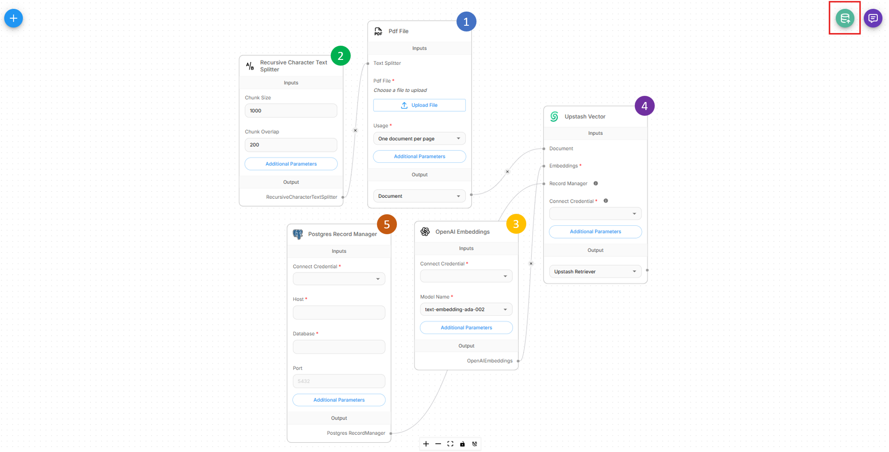

# 写入更新

Upsert 是指将文档上传并处理到矢量存储的过程，形成检索增强生成 (RAG) 系统的基础。

将数据写入更新向量存储有两种基本方法：

* [文档存储（推荐）](document-stores.md)
* 聊天流写入更新

我们强烈建议使用文档存储，因为它提供了一个统一的界面来帮助 RAG 管道 - 从不同来源检索数据、分块策略、写入更新到矢量数据库、与更新的数据同步。

在本指南中，我们将介绍另一种方法 - 聊天流 Upsert。这是文档存储之前的较旧方法。

有关详细信息，请参阅[矢量写入更新端点API 参考](../api-reference/vector-upsert.md)。

## 了解写入更新过程

聊天流 允许您创建一个既可以执行写入更新又可以执行 RAG 查询过程的流程，两者都可以独立运行。

<figure><figcaption><p>写入更新与 RAG</p></figcaption></figure>

## 设置

为了使写入更新流程正常工作，我们需要创建一个具有 5 个不同节点的 **写入更新流程**：

1. 文档加载器
2. 文本分割器
3. 嵌入模型
4.向量存储
5. 记录管理器（可选）

[文档存储](document-stores.md) 中涵盖了所有元素，请参阅此处了解更多详细信息。

正确设置流程后，右上角将有一个绿色按钮，允许用户启动写入更新过程。

<figure><figcaption></figcaption></figure>

<figure><figcaption></figcaption></figure>

还可以通过 API 执行写入更新过程：

<figure><figcaption></figcaption></figure>

## 基础 URL 和身份验证

**基础 URL**：`http://localhost:3000`（或您的 Flowise 实例 URL）

**端点**：`POST /api/v1/vector/upsert/:id`

**身份验证**：请参阅[流身份验证](../configuration/authorization/chatflow-level.md)

## 请求方法

API 支持两种不同的请求方法，具体取决于您的聊天流配置：

#### 1.表单数据（文件上传）

当您的聊天流包含具有文件上传功能的文档加载器时使用。

#### 2. JSON 正文（无文件上传）

当您的聊天流使用不需要文件上传的文档加载器（例如网络抓取工具、数据库连接器）时使用。


要覆盖任何节点配置（例如文件、元数据等），您必须显式启用该选项。


<figure><figcaption></figcaption></figure>

### 带文件上传功能的文档加载器

#### 支持的文档类型

|文档加载器|文件类型 |
| ----------------- | ---------- |
| CSV 文件 | `.csv` |
| Docx/Word 文件 | `.docx` |
| JSON 文件 | `.json` |
| JSON 行文件 | `.jsonl` |
| PDF 文件 | `.pdf` |
|文本文件 | `.txt` |
| Excel 文件 | `.xlsx` |
|幻灯片文件 | `.pptx` |
|文件加载器 |多个|
|非结构化文件|多个|


**重要**：确保文件类型与您的文档加载器配置匹配。为了获得最大的灵活性，请考虑使用支持多种文件类型的文件加载器。


#### 请求格式（表单数据）

上传文件时，使用 `multipart/form-data` 而不是 JSON：

#### 示例



```python
import requests
import os

def upsert_document(chatflow_id, file_path, config=None):
    """
    Upsert a single document to a vector store.
    
    Args:
        chatflow_id (str): The chatflow ID configured for vector upserting
        file_path (str): Path to the file to upload
        return_source_docs (bool): Whether to return source documents in response
        config (dict): Optional configuration overrides
    
    Returns:
        dict: API response containing upsert results
    """
    url = f"http://localhost:3000/api/v1/vector/upsert/{chatflow_id}"
    
    # Prepare file data
    files = {
        'files': (os.path.basename(file_path), open(file_path, 'rb'))
    }
    
    # Prepare form data
    data = {}
    
    # Add configuration overrides if provided
    if config:
        data['overrideConfig'] = str(config).replace("'", '"')  # Convert to JSON string
    
    try:
        response = requests.post(url, files=files, data=data)
        response.raise_for_status()
        
        return response.json()
        
    except requests.exceptions.RequestException as e:
        print(f"Upload failed: {e}")
        return None
    finally:
        # Always close the file
        files['files'][1].close()

# Example usage
result = upsert_document(
    chatflow_id="your-chatflow-id",
    file_path="documents/knowledge_base.pdf",
    config={
        "chunkSize": 1000,
        "chunkOverlap": 200
    }
)

if result:
    print(f"Successfully upserted {result.get('numAdded', 0)} chunks")
    if result.get('sourceDocuments'):
        print(f"Source documents: {len(result['sourceDocuments'])}")
else:
    print("Upload failed")
```



```javascript
class VectorUploader {
    constructor(baseUrl = 'http://localhost:3000') {
        this.baseUrl = baseUrl;
    }
    
    async upsertDocument(chatflowId, file, config = {}) {
        /**
         * Upload a file to vector store from browser
         * @param {string} chatflowId - The chatflow ID
         * @param {File} file - File object from input element
         * @param {Object} config - Optional configuration
         */
        
        const formData = new FormData();
        formData.append('files', file);
        
        if (config.overrideConfig) {
            formData.append('overrideConfig', JSON.stringify(config.overrideConfig));
        }
        
        try {
            const response = await fetch(`${this.baseUrl}/api/v1/vector/upsert/${chatflowId}`, {
                method: 'POST',
                body: formData
            });
            
            if (!response.ok) {
                throw new Error(`HTTP error! status: ${response.status}`);
            }
            
            const result = await response.json();
            return result;
            
        } catch (error) {
            console.error('Upload failed:', error);
            throw error;
        }
    }
    
  
}

// Example usage in browser
const uploader = new VectorUploader();

// Single file upload
document.getElementById('fileInput').addEventListener('change', async function(e) {
    const file = e.target.files[0];
    if (file) {
        try {
            const result = await uploader.upsertDocument(
                'your-chatflow-id',
                file,
                {
                    overrideConfig: {
                        chunkSize: 1000,
                        chunkOverlap: 200
                    }
                }
            );
            
            console.log('Upload successful:', result);
            alert(`Successfully processed ${result.numAdded || 0} chunks`);
            
        } catch (error) {
            console.error('Upload failed:', error);
            alert('Upload failed: ' + error.message);
        }
    }
});
```



```javascript
const fs = require('fs');
const path = require('path');
const FormData = require('form-data');
const fetch = require('node-fetch');

class NodeVectorUploader {
    constructor(baseUrl = 'http://localhost:3000') {
        this.baseUrl = baseUrl;
    }
    
    async upsertDocument(chatflowId, filePath, config = {}) {
        /**
         * Upload a file to vector store from Node.js
         * @param {string} chatflowId - The chatflow ID
         * @param {string} filePath - Path to the file
         * @param {Object} config - Optional configuration
         */
        
        if (!fs.existsSync(filePath)) {
            throw new Error(`File not found: ${filePath}`);
        }
        
        const formData = new FormData();
        const fileStream = fs.createReadStream(filePath);
        
        formData.append('files', fileStream, {
            filename: path.basename(filePath),
            contentType: this.getMimeType(filePath)
        });
        
        if (config.overrideConfig) {
            formData.append('overrideConfig', JSON.stringify(config.overrideConfig));
        }
        
        try {
            const response = await fetch(`${this.baseUrl}/api/v1/vector/upsert/${chatflowId}`, {
                method: 'POST',
                body: formData,
                headers: formData.getHeaders()
            });
            
            if (!response.ok) {
                const errorText = await response.text();
                throw new Error(`HTTP ${response.status}: ${errorText}`);
            }
            
            return await response.json();
            
        } catch (error) {
            console.error('Upload failed:', error);
            throw error;
        }
    }

    getMimeType(filePath) {
        const ext = path.extname(filePath).toLowerCase();
        const mimeTypes = {
            '.pdf': 'application/pdf',
            '.txt': 'text/plain',
            '.docx': 'application/vnd.openxmlformats-officedocument.wordprocessingml.document',
            '.csv': 'text/csv',
            '.json': 'application/json'
        };
        return mimeTypes[ext] || 'application/octet-stream';
    }
}

// Example usage
async function main() {
    const uploader = new NodeVectorUploader();
    
    try {
        // Single file upload
        const result = await uploader.upsertDocument(
            'your-chatflow-id',
            './documents/manual.pdf',
            {
                overrideConfig: {
                    chunkSize: 1200,
                    chunkOverlap: 100
                }
            }
        );
        
        console.log('Single file upload result:', result); 
    } catch (error) {
        console.error('Process failed:', error);
    }
}

// Run if this file is executed directly
if (require.main === module) {
    main();
}

module.exports = { NodeVectorUploader };
```



```bash
# Basic file upload with cURL
curl -X POST "http://localhost:3000/api/v1/vector/upsert/your-chatflow-id" \
  -F "files=@documents/knowledge_base.pdf"

# File upload with configuration override
curl -X POST "http://localhost:3000/api/v1/vector/upsert/your-chatflow-id" \
  -F "files=@documents/manual.pdf" \
  -F 'overrideConfig={"chunkSize": 1000, "chunkOverlap": 200}'

# Upload with custom headers for authentication (if configured)
curl -X POST "http://localhost:3000/api/v1/vector/upsert/your-chatflow-id" \
  -H "Authorization: Bearer your-api-token" \
  -F "files=@documents/faq.txt" \
  -F 'overrideConfig={"chunkSize": 800, "chunkOverlap": 150}'
```



### 不带文件上传的文档加载器

对于不需要文件上传的文档加载器（例如网络抓取工具、数据库连接器、API 集成），请使用类似于预测 API 的 JSON 格式。

#### 示例



```python
import requests
from typing import Dict, Any, Optional

def upsert(chatflow_id: str, config: Optional[Dict[str, Any]] = None) -> Optional[Dict[str, Any]]:
    """
    Trigger vector upserting for chatflows that don't require file uploads.
    
    Args:
        chatflow_id: The chatflow ID configured for vector upserting
        config: Optional configuration overrides
    
    Returns:
        API response containing upsert results
    """
    url = f"http://localhost:3000/api/v1/vector/upsert/{chatflow_id}"
    
    payload = {
        "overrideConfig": config
    }
    
    headers = {
        "Content-Type": "application/json"
    }
    
    try:
        response = requests.post(url, json=payload, headers=headers, timeout=300)
        response.raise_for_status()
        
        return response.json()
        
    except requests.exceptions.RequestException as e:
        print(f"Upsert failed: {e}")
        return None

result = upsert(
    chatflow_id="chatflow-id",
    config={
        "chunkSize": 800,
        "chunkOverlap": 100,
    }
)

if result:
    print(f"Upsert completed: {result.get('numAdded', 0)} chunks added")
```



```javascript
class NoFileUploader {
    constructor(baseUrl = 'http://localhost:3000') {
        this.baseUrl = baseUrl;
    }
    
    async upsertWithoutFiles(chatflowId, config = {}) {
        /**
         * Trigger vector upserting for flows that don't need file uploads
         * @param {string} chatflowId - The chatflow ID
         * @param {Object} config - Configuration overrides
         */
        
        const payload = {
            overrideConfig: config
        };
        
        try {
            const response = await fetch(`${this.baseUrl}/api/v1/vector/upsert/${chatflowId}`, {
                method: 'POST',
                headers: {
                    'Content-Type': 'application/json',
                },
                body: JSON.stringify(payload)
            });
            
            if (!response.ok) {
                throw new Error(`HTTP error! status: ${response.status}`);
            }
            
            return await response.json();
            
        } catch (error) {
            console.error('Upsert failed:', error);
            throw error;
        }
    }
    
    async scheduledUpsert(chatflowId, interval = 3600000) {
        /**
         * Set up scheduled upserting for dynamic content sources
         * @param {string} chatflowId - The chatflow ID
         * @param {number} interval - Interval in milliseconds (default: 1 hour)
         */
        
        console.log(`Starting scheduled upsert every ${interval/1000} seconds`);
        
        const performUpsert = async () => {
            try {
                console.log('Performing scheduled upsert...');
                
                const result = await this.upsertWithoutFiles(chatflowId, {
                    addMetadata: {
                        scheduledUpdate: true,
                        timestamp: new Date().toISOString()
                    }
                });
                
                console.log(`Scheduled upsert completed: ${result.numAdded || 0} chunks processed`);
                
            } catch (error) {
                console.error('Scheduled upsert failed:', error);
            }
        };
        
        // Perform initial upsert
        await performUpsert();
        
        // Set up recurring upserts
        return setInterval(performUpsert, interval);
    }
}

// Example usage
const uploader = new NoFileUploader();

async function performUpsert() {
    try {
        const result = await uploader.upsertWithoutFiles(
            'chatflow-id',
            {
                chunkSize: 800,
                chunkOverlap: 100
            }
        );
        
        console.log('Upsert result:', result);
        
    } catch (error) {
        console.error('Upsert failed:', error);
    }
}

// One time upsert
await performUpsert();

// Set up scheduled updates (every 30 minutes)
const schedulerHandle = await uploader.scheduledUpsert(
    'dynamic-content-chatflow-id',
    30 * 60 * 1000
);

// To stop scheduled updates later:
// clearInterval(schedulerHandle);
```



```bash
# Basic upsert with cURL
curl -X POST "http://localhost:3000/api/v1/vector/upsert/your-chatflow-id" \
  -H "Content-Type: application/json"

# Upsert with configuration override
curl -X POST "http://localhost:3000/api/v1/vector/upsert/your-chatflow-id" \
  -H "Content-Type: application/json" \
  -d '{
    "overrideConfig": {
      "returnSourceDocuments": true
    }
  }'
  
# Upsert with custom headers for authentication (if configured)
curl -X POST "http://localhost:3000/api/v1/vector/upsert/your-chatflow-id" \
  -H "Authorization: Bearer your-api-token" \
  -H "Content-Type: application/json"
```



## 响应字段

|领域|类型 |描述 |
| ------------ | ------ | ----------------------------------------------------------- |
| `numAdded` |数量 |添加到矢量存储的新块的数量 |
| `numDeleted` |数量 |删除的块数（如果使用记录管理器）|
| `numSkipped` |数量 |跳过的块数（如果使用记录管理器）|
| `numUpdated` |数量 |已更新的现有块数（如果使用记录管理器）|

## 优化策略

### 1. 批处理策略

```python
def intelligent_batch_processing(files: List[str], chatflow_id: str) -> Dict[str, Any]:
    """Process files in optimized batches based on size and type."""
    
    # Group files by size and type
    small_files = []
    large_files = []
    
    for file_path in files:
        file_size = os.path.getsize(file_path)
        if file_size > 5_000_000:  # 5MB
            large_files.append(file_path)
        else:
            small_files.append(file_path)
    
    results = {'successful': [], 'failed': [], 'totalChunks': 0}
    
    # Process large files individually
    for file_path in large_files:
        print(f"Processing large file: {file_path}")
        # Individual processing with custom config
        # ... implementation
    
    # Process small files in batches
    batch_size = 5
    for i in range(0, len(small_files), batch_size):
        batch = small_files[i:i + batch_size]
        print(f"Processing batch of {len(batch)} small files")
        # Batch processing
        # ... implementation
    
    return results
```

### 2.元数据优化

```python
import requests
import os
from datetime import datetime
from typing import Dict, Any

def upsert_with_optimized_metadata(chatflow_id: str, file_path: str, 
                                 department: str = None, category: str = None) -> Dict[str, Any]:
    """
    Upsert document with automatically optimized metadata.
    """
    url = f"http://localhost:3000/api/v1/vector/upsert/{chatflow_id}"
    
    # Generate optimized metadata
    custom_metadata = {
        'department': department or 'general',
        'category': category or 'documentation',
        'indexed_date': datetime.now().strftime('%Y-%m-%d'),
        'version': '1.0'
    }
    
    optimized_metadata = optimize_metadata(file_path, custom_metadata)
    
    # Prepare request
    files = {'files': (os.path.basename(file_path), open(file_path, 'rb'))}
    data = {
        'overrideConfig': str({
            'metadata': optimized_metadata
        }).replace("'", '"')
    }
    
    try:
        response = requests.post(url, files=files, data=data)
        response.raise_for_status()
        return response.json()
    finally:
        files['files'][1].close()

# Example usage with different document types
results = []

# Technical documentation
tech_result = upsert_with_optimized_metadata(
    chatflow_id="tech-docs-chatflow",
    file_path="docs/api_reference.pdf",
    department="engineering",
    category="technical_docs"
)
results.append(tech_result)

# HR policies
hr_result = upsert_with_optimized_metadata(
    chatflow_id="hr-docs-chatflow", 
    file_path="policies/employee_handbook.pdf",
    department="human_resources",
    category="policies"
)
results.append(hr_result)

# Marketing materials
marketing_result = upsert_with_optimized_metadata(
    chatflow_id="marketing-chatflow",
    file_path="marketing/product_brochure.pdf", 
    department="marketing",
    category="promotional"
)
results.append(marketing_result)

for i, result in enumerate(results):
    print(f"Upload {i+1}: {result.get('numAdded', 0)} chunks added")
```

## 故障排除

1. **文件上传失败**
   * 检查文件格式兼容性
   * 验证文件大小限制
2. **处理超时**
   * 增加请求超时时间
   * 将大文件分成更小的部分
   * 优化块大小
3. **矢量存储错误**
   * 检查矢量存储连接性
   * 验证嵌入模型尺寸兼容性
