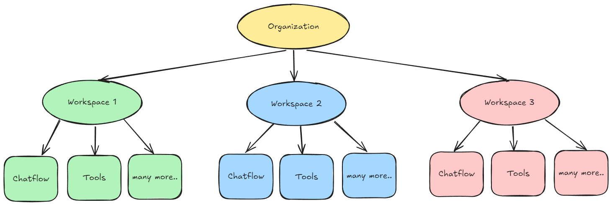

# 工作区


工作区仅适用于云计划和企业计划


首次登录后，系统会自动为您生成默认工作区。工作区用于在不同团队或业务部门之间划分资源。在每个工作区中，基于角色的访问控制 (RBAC) 用于管理权限和访问，确保用户只能访问其角色所需的资源和设置。

<figure><figcaption></figcaption></figure>

## 设置管理员帐户

<details>

<summary>对于自托管企业，必须设置以下环境变量</summary>

```
JWT_AUTH_TOKEN_SECRET
JWT_REFRESH_TOKEN_SECRET
JWT_ISSUER
JWT_AUDIENCE
JWT_TOKEN_EXPIRY_IN_MINUTES
JWT_REFRESH_TOKEN_EXPIRY_IN_MINUTES
PASSWORD_RESET_TOKEN_EXPIRY_IN_MINS
PASSWORD_SALT_HASH_ROUNDS
TOKEN_HASH_SECRET
```

</details>

默认情况下，新安装的 Flowise 将需要管理员设置，类似于您最初为数据库设置根用户的方式。

<figure><figcaption></figcaption></figure>

设置后，用户将被带到 Flowise 仪表板。从左侧栏中，您将看到“用户和工作区管理”部分。默认工作区已自动创建。

<figure><figcaption></figcaption></figure>

## 创建工作区

要创建新的工作区，请单击“添加新的”：

<figure><figcaption></figcaption></figure>

您将看到自己在您创建的工作区中添加为组织管理员。

<figure><figcaption></figcaption></figure>

要邀请新用户加入工作区，您需要先创建角色。

## 创建角色

导航到左侧栏中的“角色”，然后单击“添加角色”：

<figure><figcaption></figcaption></figure>

用户可以指定对每个资源的权限的精细控制。唯一的例外是**用户和工作区管理**中的资源（角色、用户、工作区、登录活动）。这些目前仅适用于帐户管理员。

在这里，我们创建一个可以访问所有内容的编辑者角色。另一个角色具有仅查看权限。

<figure><figcaption></figcaption></figure>

## 邀请用户

<details>

<summary>对于自托管企业，必须设置以下环境变量</summary>

```
INVITE_TOKEN_EXPIRY_IN_HOURS
SMTP_HOST
SMTP_PORT
SMTP_USER
SMTP_PASSWORD
```

</details>

导航到左侧栏中的“用户”，您将看到自己是帐户管理员。这由带星号的人物图标表示：

<figure><figcaption></figcaption></figure>

单击“邀请用户”，输入要邀请的电子邮件、要分配的工作区和角色。

<figure><figcaption></figcaption></figure>

单击发送邀请。受邀邮箱将收到邀请：

<figure><figcaption></figcaption></figure>

单击邀请链接后，受邀用户将进入注册页面。

<figure><figcaption></figcaption></figure>

注册并以受邀用户身份登录后，您将进入分配的工作区，并且不会有“用户和工作区管理”部分：

<figure><figcaption></figcaption></figure>

如果您被邀请进入多个工作区，您可以通过右上角的下拉按钮切换到不同的工作区。在这里，我们被分配给工作区 2，并具有 **仅查看** 权限。您可以注意到 聊天流 的“添加新项”按钮不再可见。这确保用户只能查看，不能创建、更新或删除。相同的 RBAC 规则也适用于 API。

<figure><figcaption></figcaption></figure>

现在，返回帐户管理，您将能够看到受邀请的用户、他们的状态、角色和活动工作区：

<figure><figcaption></figcaption></figure>

帐户管理员还可以修改其他用户的设置：

<figure><figcaption></figcaption></figure>

## 登录活动

管理员将能够看到所有用户的每次登录和注销：

<figure><figcaption></figcaption></figure>

## 在工作区中创建项目

在工作区中创建的每个项目都与另一个工作区隔离。工作区是一种对组织内的用户和资源进行逻辑分组的方法，确保资源管理和访问控制的信任边界分开。建议为每个团队创建不同的工作区。

在这里，我们在 **Workspace1** 中创建一个名为 **Chatflow1** 的 聊天流：

<figure><figcaption></figcaption></figure>

当我们切换到**Workspace2**时，**Chatflow1**将不可见。这适用于所有资源，例如智能体流程、工具、助手等。

<figure><figcaption></figcaption></figure>

下图说明了组织、工作区以及与工作区关联并包含在工作区中的各种资源之间的关系。

<figure><figcaption></figcaption></figure>

## 共享凭据

您可以将凭据共享给其他工作区。这允许用户在不同的工作区中重复使用同一组凭据。

创建凭据后，帐户管理员或具有 RBAC 共享凭据权限的用户将能够单击共享：

<figure><figcaption></figcaption></figure>

用户可以选择与其共享凭据的工作区：

<figure><figcaption></figcaption></figure>

现在，切换到共享凭据的工作区，您将看到共享凭据。用户无法编辑共享凭据。

<figure><figcaption></figcaption></figure>

## 删除工作区

目前只有帐户管理员可以删除工作区。默认情况下，如果工作区中仍有用户，您将无法删除该工作区。

<figure><figcaption></figcaption></figure>

您需要首先取消所有受邀用户的链接。如果您只想从工作区中删除某些用户，这可以提供灵活性。请注意，创建工作区的组织所有者无法取消与工作区的链接。

<figure><figcaption></figcaption></figure>

取消链接受邀用户后，工作区中剩下的唯一用户是组织所有者，现在可以单击删除按钮：

<figure><figcaption></figcaption></figure>

删除工作区是不可逆的操作，并且将级联删除该工作区中的所有项目。您将看到一个警告框：

<figure><figcaption></figcaption></figure>

删除工作区后，用户将回退到默认工作区。启动时自动创建的默认工作区无法删除。
