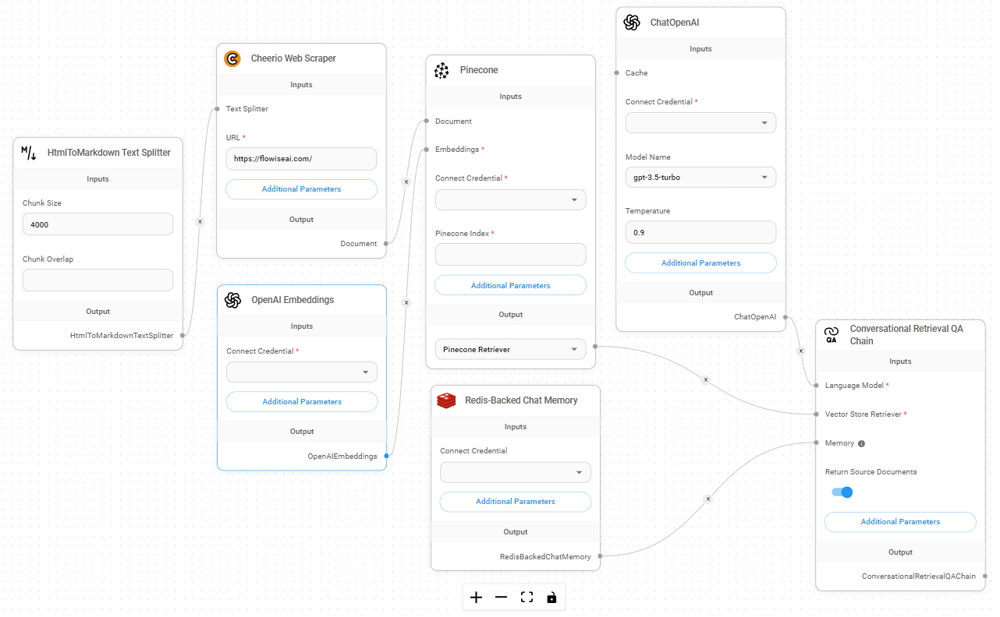

# SSO


SSO is only available for Enterprise plan


Flowise supports [OIDC](https://openid.net/) that allows users to use _single sign_-on (_SSO_) to access application. Currently only the [Organization Admin](../using-flowise/workspaces.md#setting-up-admin-account) can configure the SSO configurations.

## Microsoft Azure AD

1. In the Azure portal, search for Microsoft Entra ID:

<figure><figcaption></figcaption></figure>

2. From the left hand bar, click App Registrations, then New Registration:

<figure><figcaption></figcaption></figure>

3. Enter an app name, and select Single Tenant:

<figure><figcaption></figcaption></figure>

4. After an app is created, note down the Application (client) ID and Directory (tenant) ID:

<figure><figcaption></figcaption></figure>

5. On the left side bar, click Certificates & secrets -> New client secret -> Add:

<figure><figcaption></figcaption></figure>

6. After the secret has been created, copy the Value, <mark style="color:red;">not</mark> the Secret ID:

<figure><figcaption></figcaption></figure>

7. On the left side bar, click Authentication -> Add a platform -> Web:

<figure><figcaption></figcaption></figure>

8. Fill in the redirect URIs. This will need to be changed depending on how you are hosting it: `http[s]://[your-flowise-instance.com]/api/v1/azure/redirect`:

<figure><figcaption></figcaption></figure>

9. You should be able to see the new Redirect URI created:

<figure><figcaption></figcaption></figure>

10. Back to Flowise app, login as Organization Admin. Navigate to SSO Config from left side bar:

<figure><figcaption></figcaption></figure>

11. Fill in the Azure Tenant ID and Client ID from Step 4, and Client Secret from Step 6. Click Test Configuration to see if the connection can be established successfully:

<figure><figcaption></figcaption></figure>

12. Lastly, enable and save it:

<figure><figcaption></figcaption></figure>

13. Before users can sign in using SSO, they have to be invited first. Refer to [Inviting users for SSO sign in](sso.md#inviting-users-for-sso-sign-in) for step by step guide. Invited users must also be part of the Directory Users in Azure.

<figure><figcaption></figcaption></figure>

## Inviting users for SSO sign in

In order for new user to be able to login using SSO, we have to invite new users into Flowise application. This is essential to keep a record of the role/workspace of the invited user. Refer to [Invite Users](../using-flowise/workspaces.md#invite-user) section for env variables configuration.

Organization Admin can choose the login type for invited user:

<figure><figcaption></figcaption></figure>

* SSO: invited user can only login using SSO
* Email/Password: invited user can only login via email/password

Invited user will be receiving invitation link to login:

<figure><figcaption></figcaption></figure>

Clicking the button will bring the invited user directly to Flowise SSO login screen:

<figure><figcaption></figcaption></figure>

Or navigate to Flowise app and Sign in with SSO:

<figure><figcaption></figcaption></figure>
