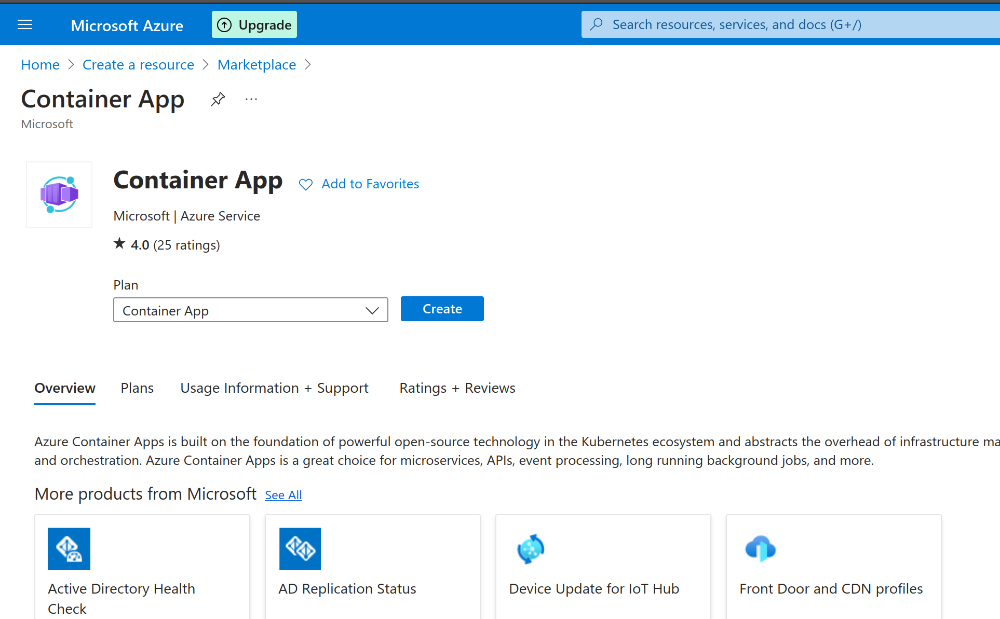
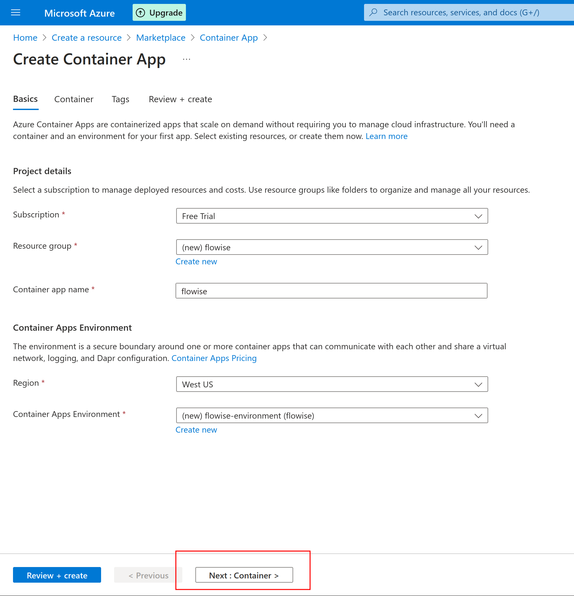
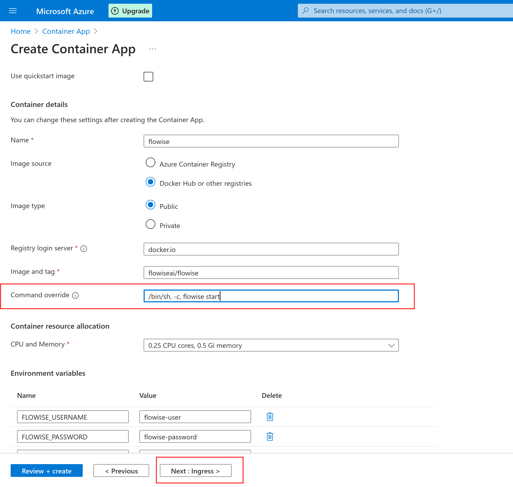
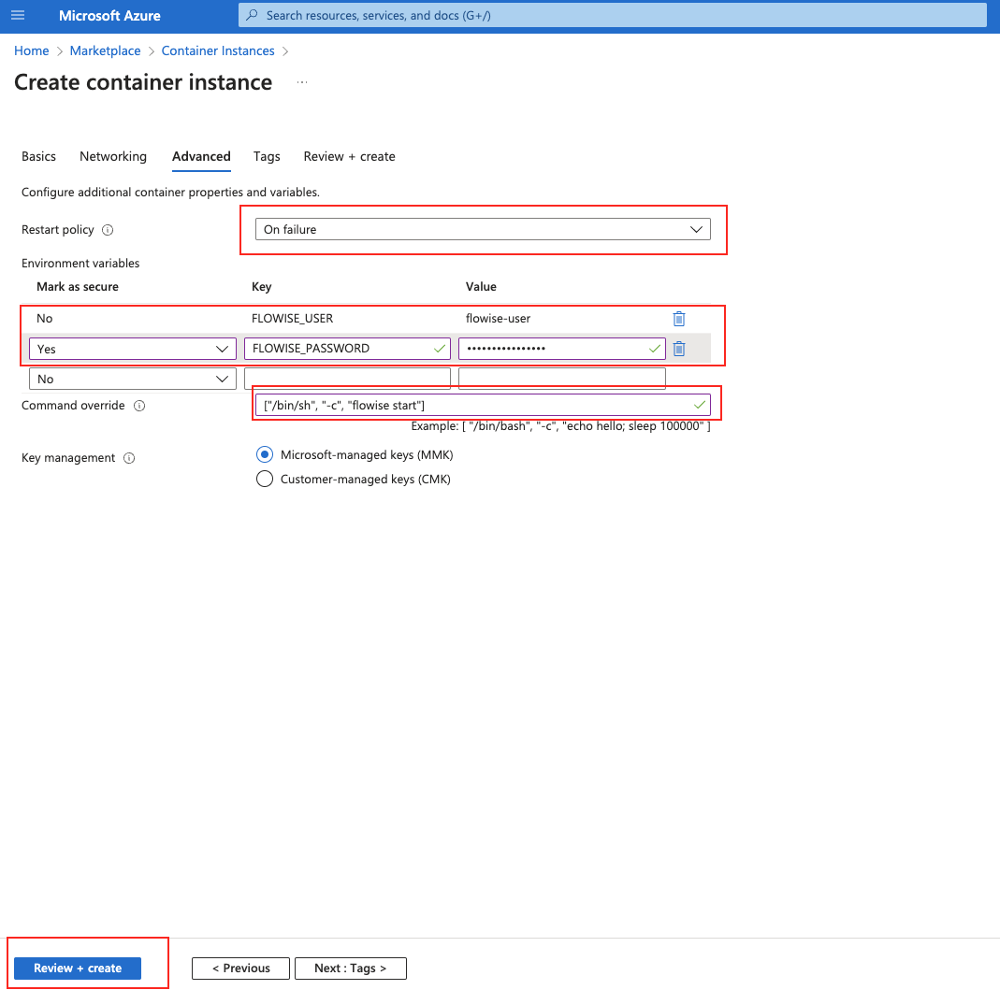
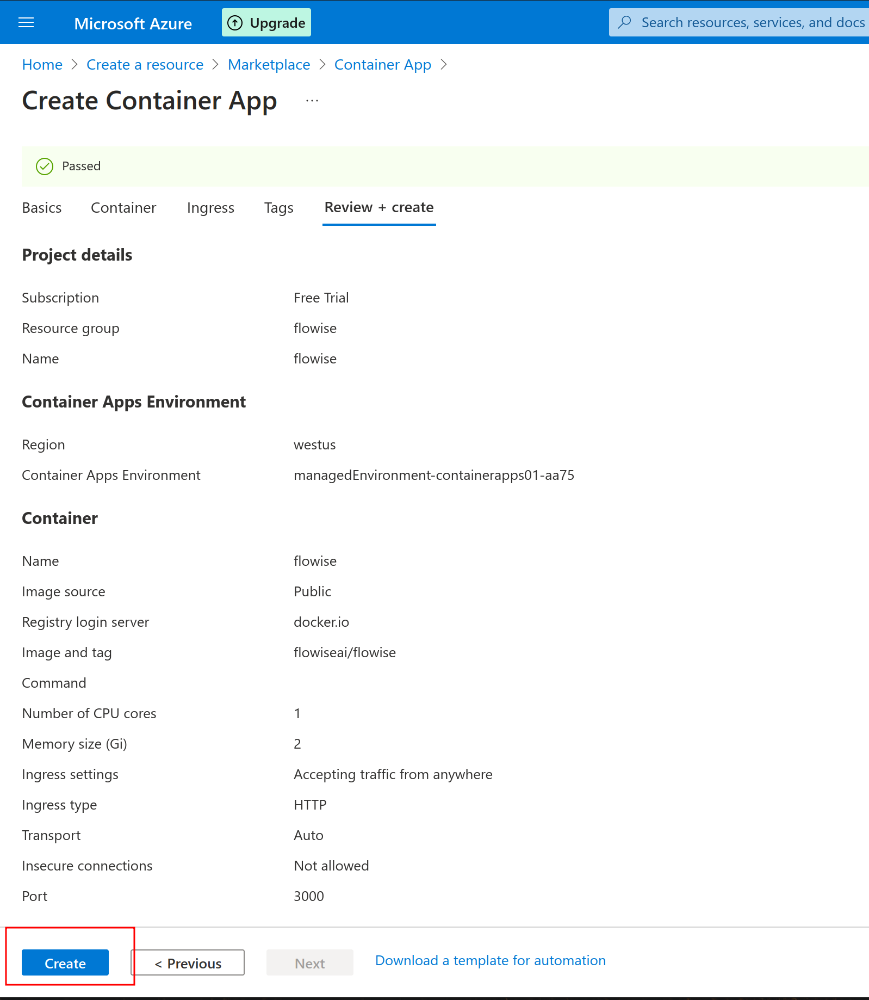
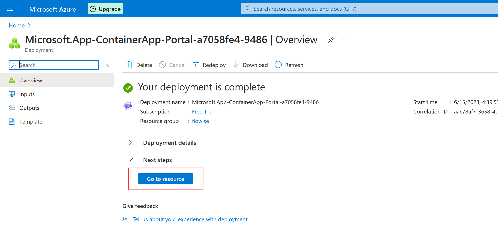
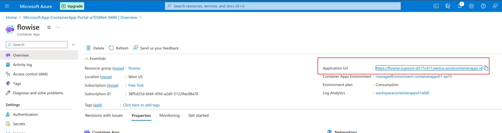
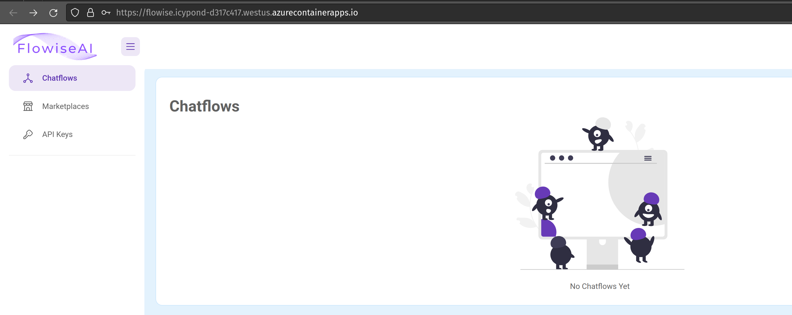

# Microsoft Azure

## Prerequisites

1. [Optional] [Install Azure CLI](https://learn.microsoft.com/en-us/cli/azure/install-azure-cli) if you'd like to follow the cli based commands

## Create a Container App

1. Search for Container App in Marketplace and click Create

<figure><figcaption>Container Apps entry in Azure's Marketplace</figcaption></figure>

2. Select or create a Resource Group, Container App Name, Region, and a Container App Environment. Then click "Next: Container" to configure Flowise container.

<figure><figcaption>First page in the Container App create wizard. It asks for app name, location and environment.</figcaption></figure>

3. Select a container name, then select "Docker hub" and "Public" image. Use `docker.io` for server, and `flowiseai/flowise` for "Image and tag". Set "Command override" to `/bin/sh, -c, flowise start`. Set a `FLOWISE_USERNAME` and `FLOWISE_PASSWORD` values here as well. Then Select "Next: Ingress"

<figure><figcaption>Second page in the Container App create wizard. It asks for container name, image name, and environment variables.</figcaption></figure>

4. Enable ingress. Select "Accepting traffic from anywhere". Then select "HTTP", and set the target port to `3000`. Finally click "Review + create"

<figure><figcaption>Third page in the Container App create wizard. It asks for ingress/HTTP settings.</figcaption></figure>

5. Review final settings and click "Create"

<figure><figcaption>Final review and create page for a container app.</figcaption></figure>

6. Once creation is completed, click on "Go to resource"

<figure><figcaption>Resource creation result page in Azure.</figcaption></figure>

7. Visit your Flowise instance by clicking on "Application Url"

<figure><figcaption>Container App overview page</figcaption></figure>

<figure><figcaption>Container App overview page</figcaption></figure>

## Create using Azure CLI

1. Create a resource group (if you don't already have one)

```bash
az group create --name flowise-rg --location "West US"
```

2. Create a Container App Environment

```bash
az containerapp env create --name flowise-env --resource-group flowise-rg --location "West US"
```

3. Create a Container App

```bash
az containerapp create \
  --name flowise \
  --resource-group flowise-rg \
  --environment flowise-env  \
  --image docker.io/flowiseai/flowise:latest \
  --ingress external \
  --target-port 3000 \
  --command "flowise" "start" \
  --secrets password="p@ssw0ord!" \
  --env-vars FLOWISE_USERNAME="flowise-user" FLOWISE_PASSWORD="secretref:password"
  --query properties.configuration.ingress.fqdn
```

4. Visit the url printed from the output of the previous command.
