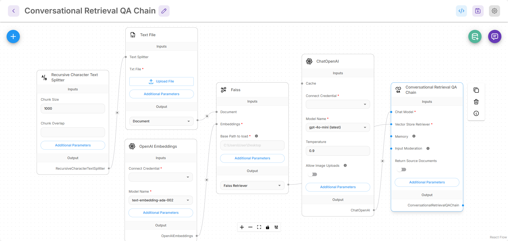

# Introduction

<figure><figcaption></figcaption></figure>

Flowise is an open source generative AI development platform for building AI Agents and LLM workflows.

It offers a complete solution that includes:

* [x] Visual Builder
* [x] Tracing & Analytics
* [x] Evaluations
* [x] Human in the Loop
* [x] API, CLI, SDK, Embedded Chatbot
* [x] Teams & Workspaces

There are 3 main visual builders namely:

* Assistant
* Chatflow
* Agentflow

## Assistant

Assistant is the most begineer-friendly way of creating an AI Agent. Users can create chat assistant that is able to follow instructions, use tools when neccessary, and retrieve knowledge base from uploaded files ([RAG](https://en.wikipedia.org/wiki/Retrieval-augmented_generation)) to respond to user queries.

<figure><picture><source srcset=".gitbook/assets/Screenshot 2025-06-10 232758.png" media="(prefers-color-scheme: dark)"></picture><figcaption></figcaption></figure>

## Chatflow

Chatflow is designed to build single-agent systems, chatbots and simple LLM flows. It is more flexible than Assistant. Users can use advance techniques like Graph RAG, Reranker, Retriever, etc.

<figure><picture><source srcset=".gitbook/assets/screely-1749594035877.png" media="(prefers-color-scheme: dark)"></picture><figcaption></figcaption></figure>

## Agentflow

Agentflow is the superset of Chatflow & Assistant. It can be used to create chat assistant, single-agent system, multi-agent systems, and complex workflow orchestration. Learn more [Agentflow V2](using-flowise/agentflowv2.md)

<figure><picture><source srcset=".gitbook/assets/screely-1749594631028.png" media="(prefers-color-scheme: dark)"></picture><figcaption></figcaption></figure>

## Flowise Capabilities

| Feature Area                 | Flowise Capabilities                                                                                                |
| ---------------------------- | ------------------------------------------------------------------------------------------------------------------- |
| Orchestration                | Visual editor, supports open-source & proprietary models, expressions, custom code, branching/looping/routing logic |
| Data Ingestion & Integration | Connects to 100+ sources, tools, vector databases, memories                                                         |
| Monitoring                   | Execution logs, visual debugging, external log streaming                                                            |
| Deployment                   | Self-hosted options, air-gapped deploy                                                                              |
| Data Processing              | Data transforms, filters, aggregates, custom code, RAG indexing pipelines                                           |
| Memory & Planning            | Various memory optimization technique and integrations                                                              |
| MCP Integration              | MCP client/server nodes, tool listing, SSE, auth support                                                            |
| Safety & Control             | Input moderation & output post-processing                                                                           |
| API, SDK, CLI                | API access, JS/Python SDK, Command Line Interface                                                                   |
| Embedded & Share Chatbot     | Customizable embedded chat widget and component                                                                     |
| Templates & Components       | Template marketplace, reusable components                                                                           |
| Security Controls            | RBAC, SSO, encrypted creds, secret managers, rate limit, restricted domains                                         |
| Scalability                  | Vertical/horizontal scale, high throughput/workflow load                                                            |
| Evaluations                  | Datasets, Evaluators and Evaluations                                                                                |
| Community Support            | Active community forum                                                                                              |
| Vendor Support               | SLA support, consultations, fixed/deterministic pricing                                                             |

## Contributing

If you want to help this project, please consider reviewing the [Contribution Guide](https://github.com/FlowiseAI/Flowise/blob/main/CONTRIBUTING.md).

## Need Help?

For support and further discussion, head over to our [Discord](https://discord.gg/jbaHfsRVBW) server.
