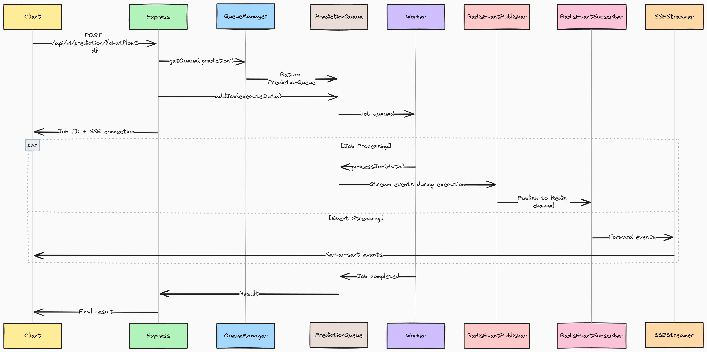

# Running Flowise using Queue

By default, Flowise runs in a NodeJS main thread. However, with large number of predictions, this does not scale well. Therefore there are 2 modes you can configure: `main` (default) and `queue`.

## Queue Mode

With the following environment variables, you can run Flowise in `queue` mode.

<table><thead><tr><th width="263">Variable</th><th>Description</th><th>Type</th><th>Default</th></tr></thead><tbody><tr><td>MODE</td><td>Mode to run Flowise</td><td>Enum String: <code>main</code>, <code>queue</code></td><td><code>main</code></td></tr><tr><td>WORKER_CONCURRENCY</td><td>How many jobs are allowed to be processed in parallel for a worker. If you have 1 worker, that means how many concurrent prediction tasks it can handle. More <a href="https://docs.bullmq.io/guide/workers/concurrency">info</a></td><td>Number</td><td>10000</td></tr><tr><td>QUEUE_NAME</td><td>The name of the message queue</td><td>String</td><td>flowise-queue</td></tr><tr><td>QUEUE_REDIS_EVENT_STREAM_MAX_LEN</td><td>Event stream is auto-trimmed so that its size does not grow too much. More <a href="https://docs.bullmq.io/guide/events">info</a></td><td>Number</td><td>10000</td></tr><tr><td>REDIS_URL</td><td>Redis URL</td><td>String</td><td></td></tr><tr><td>REDIS_HOST</td><td>Redis host</td><td>String</td><td>localhost</td></tr><tr><td>REDIS_PORT</td><td>Redis port</td><td>Number</td><td>6379</td></tr><tr><td>REDIS_USERNAME</td><td>Redis username (optional)</td><td>String</td><td></td></tr><tr><td>REDIS_PASSWORD</td><td>Redis password (optional)</td><td>String</td><td></td></tr><tr><td>REDIS_TLS</td><td>Redis TLS connection (optional) More <a href="https://redis.io/docs/latest/operate/oss_and_stack/management/security/encryption/">info</a></td><td>Boolean</td><td>false</td></tr><tr><td>REDIS_CERT</td><td>Redis self-signed certificate</td><td>String</td><td></td></tr><tr><td>REDIS_KEY</td><td>Redis self-signed certificate key file</td><td>String</td><td></td></tr><tr><td>REDIS_CA</td><td>Redis self-signed certificate CA file</td><td>String</td><td></td></tr></tbody></table>

In `queue` mode, the main server will be responsible for processing requests, sending jobs to message queue. Main server will not execute the job. One or multiple workers receive jobs from the queue, execute them and send the results back.

This allows for dynamic scaling: you can add workers to handle increased workloads or remove them during lighter periods.

Here's how it works:

1. The main server receive prediction or other requests from the web, adding them as jobs to the queue.
2. These job queues are essential lists of tasks waiting to be processed. Workers, which are essentially separate processes or threads, pick up these jobs and execute them.
3. Once the job is completed, the worker:
   * Write the results in the database.
   * Send an event to indicate the completion of the job.
4. Main server receive the event, and send the result back to UI.
5. Redis pub/sub is also used for streaming data back to UI.

<figure><figcaption></figcaption></figure>

## Flow Diagram

<figure><figcaption></figcaption></figure>

#### 1. Request Entry Point

A prediction request hits the Express server and immediately checks if `MODE=QUEUE`. If true, it switches from direct execution to asynchronous queue processing.

#### 2. Job Creation & Dual Channels

The system creates two parallel paths:

* **Job Channel**: Request data becomes a Redis job via BullMQ, HTTP thread waits for completion
* **Stream Channel**: SSE connection established for real-time updates via Redis pub/sub

#### 3. Worker Processing

Independent worker processes poll Redis for jobs. When assigned:

* Reconstruct full execution context (DB, components, abort controllers)
* Execute workflow with node-by-node processing
* Publish real-time events (tokens, tools, progress) to Redis channels

#### 4. Real-time Communication

During execution:

* [**RedisEventPublisher**](https://github.com/FlowiseAI/Flowise/blob/main/packages/server/src/queue/RedisEventPublisher.ts) broadcasts events from worker to Redis
* [**RedisEventSubscriber**](https://github.com/FlowiseAI/Flowise/blob/main/packages/server/src/queue/RedisEventSubscriber.ts) forwards events from Redis to SSE clients
* [**SSEStreamer**](https://github.com/FlowiseAI/Flowise/blob/main/packages/server/src/utils/SSEStreamer.ts) delivers events to browser in real-time

#### 5. Completion & Response

Job finishes, result stored in Redis:

* HTTP thread unblocks, receives result
* SSE connection closes gracefully
* Resources cleaned up (abort controllers, connections)

## Local Setup

### Start Redis

Before starting main server and workers, Redis need to be running first. You can run Redis on a separate machine, but make sure that it's accessible by the server and worker instances.

For example, you can get Redis running on your Docker following this [guide](https://www.docker.com/blog/how-to-use-the-redis-docker-official-image/).

### Start Main Server

This is the same as you were to run Flowise by default, with the exceptions of configuring the environment variables mentioned above.

```bash
pnpm start
```

### Start Worker

Same as main server, environment variables above must be configured. We recommend just using the same `.env` file for both main and worker instances. The only difference is how to run the workers. Open another terminal and run:

```bash
pnpm run start-worker
```


Main server and worker need to share the same secret key. Refer to [#for-credentials](environment-variables.md#for-credentials "mention"). For production, we recommend using Postgres as database for perfomance.


## Docker Setup

### Method 1: Pre-built Images (Recommended)

This method uses pre-built Docker images from Docker Hub, making it the fastest and most reliable deployment option.

**Step 1: Setup Environment**

Create a `.env` file in the `docker` directory:

```bash
# Basic Configuration
PORT=3000
WORKER_PORT=5566

# Queue Configuration (Required)
MODE=queue
QUEUE_NAME=flowise-queue
REDIS_URL=redis://redis:6379

# Optional Queue Settings
WORKER_CONCURRENCY=5
REMOVE_ON_AGE=24
REMOVE_ON_COUNT=1000
QUEUE_REDIS_EVENT_STREAM_MAX_LEN=1000
ENABLE_BULLMQ_DASHBOARD=false

# Database (Optional - defaults to SQLite)
DATABASE_PATH=/root/.flowise

# Storage
BLOB_STORAGE_PATH=/root/.flowise/storage

# Secret Keys
SECRETKEY_PATH=/root/.flowise

# Logging
LOG_PATH=/root/.flowise/logs
```

**Step 2: Deploy**

```bash
cd docker
docker compose -f docker-compose-queue-prebuilt.yml up -d
```

**Step 3: Verify Deployment**

```bash
# Check container status
docker compose -f docker-compose-queue-prebuilt.yml ps

# View logs
docker compose -f docker-compose-queue-prebuilt.yml logs -f flowise
docker compose -f docker-compose-queue-prebuilt.yml logs -f flowise-worker
```

### Method 2: Build from Source

This method builds Flowise from source code, useful for development or custom modifications.

**Step 1: Setup Environment**

Create the same `.env` file as in [Method 1](running-flowise-using-queue.md#method-1-pre-built-images-recommended).

**Step 2: Deploy**

```bash
cd docker
docker compose -f docker-compose-queue-source.yml up -d
```

**Step 3: Build Process**

The source build will:

* Build the main Flowise application from source
* Build the worker image from source
* Set up Redis and networking

**Step 4: Monitor Build**

```bash
# Watch build progress
docker compose -f docker-compose-queue-source.yml logs -f

# Check final status
docker compose -f docker-compose-queue-source.yml ps
```

### Health Checks

All compose files include health checks:

```bash
# Check main instance health
curl http://localhost:3000/api/v1/ping

# Check worker health
curl http://localhost:5566/healthz
```

## Queue Dashboard

Set `ENABLE_BULLMQ_DASHBOARD` to true will allow users to view all the jobs, status, result, data by navigating to `<your-flowise-url.com>/admin/queues`

<figure><figcaption></figcaption></figure>
