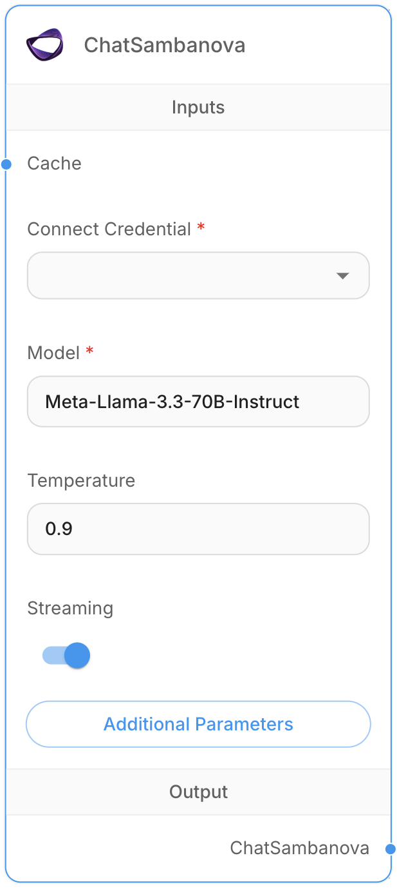

# ChatSambanova

## **Prerequisites**
Before getting started, ensure you have:

1. A [SambaNova Cloud](https://cloud.sambanova.ai/apis) account
2. Your [SambaNova API keys](https://cloud.sambanova.ai/apis) 
3. Save your API keys

## Step by Step Guide
<figure><figcaption>
ChatSambanova Node
</figcaption></figure>

1. **Chat Models** > Drag the **ChatSambanova** node.
2. Create a new credential with SambaNova API key.